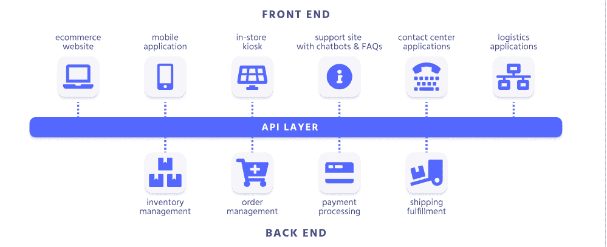
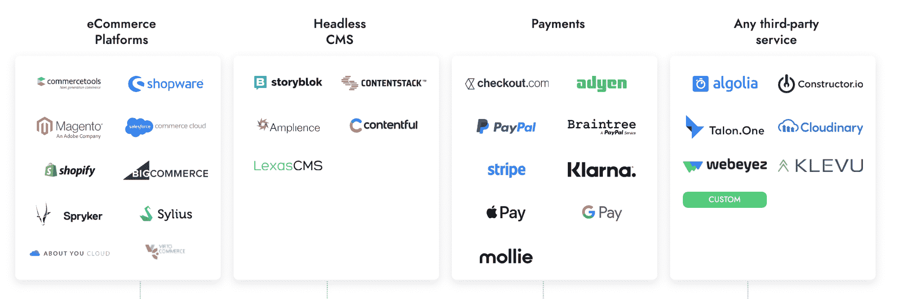
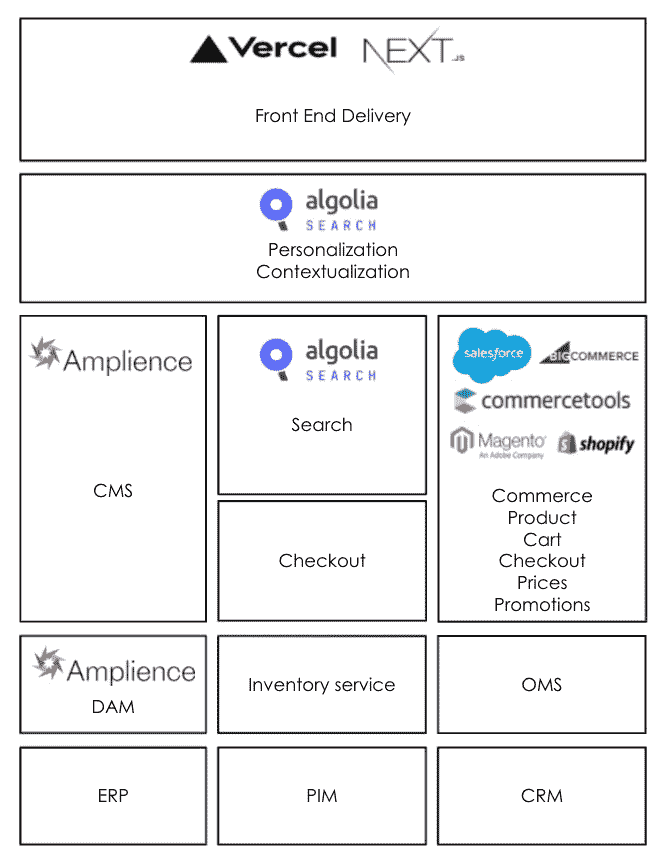
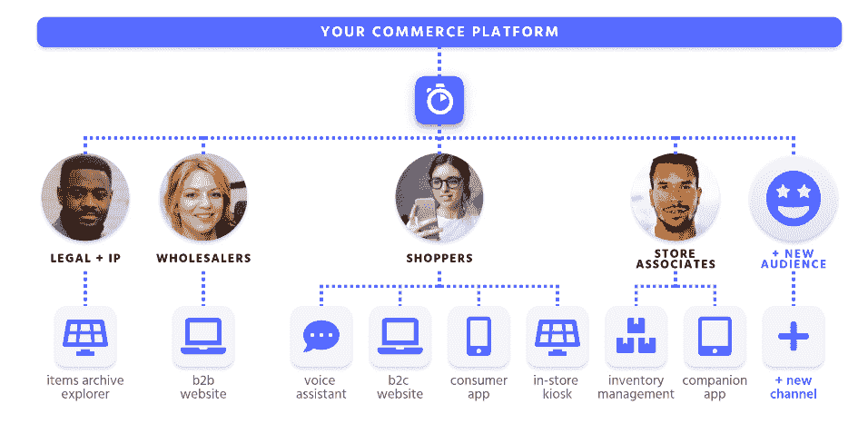

# 可组合商务:如何选择最佳组件来满足您的业务需求

> 原文：<https://www.algolia.com/blog/ecommerce/composable-commerce-how-to-select-best-of-breed-components-to-meet-your-business-needs/>

## 可组合商业案例研究

可组合商务通常被认为是零售业的下一步。Gartner 预测，“到 2023 年，采用可组合方法的组织将在新功能实现的速度上超过竞争对手 80%。”

在这个案例研究中，我们通过一个特定的主题展示了可组合商务方法的力量:如何从你最有价值的资产之一:你的产品目录，在所有客户接触点上创造更多的价值。

首先，什么是可组合商务？

可组合商务是通过将最佳组件连接或组合到解决特定业务需求的定制应用程序中来构建商务系统的方法。这些组件被定义为打包的业务功能(PBC ),它代表定义良好的业务功能，比如结帐或搜索。

这种方法为采用它的组织带来了许多好处，包括更高的灵活性以适应客户和营销趋势，更高的灵活性以提供差异化的体验，以及跨所有接触点更轻松地实施体验。

在技术层面，可组合商务要求这些 PBC 建立在允许这种灵活性和连接性的技术之上。马赫的定义总结得很好:

***马赫**—**M**microservices， **A** PI-first， **C** loud-native， **H** eadless*

*微服务——微服务执行一系列处理特定业务功能的操作，从而轻松适应不同且不断变化的业务需求。*

*API 优先——API 公开微服务，管理底层数据、功能和不同微服务之间的连接。*

*云原生 SAAS–软件即服务利用云的全部功能，包括每个微服务的存储、托管和扩展。*

*HEADLESS——确保前端接口与后端逻辑和各种微服务完全断开，从而允许工程师在不影响系统其他部分的情况下更新 UI 或微服务。*

## 电子商务架构和生态系统组件

在传统的整体电子商务平台架构中，可扩展性和复杂性是最大的限制。随着平台变得越来越大，对于工程团队来说，完全理解影响他们快速迭代能力的过程和依赖性变得越来越困难。结果是:启动时间缓慢、错误和效率降低，这是由于每次更新都需要不断地重新部署整个应用程序。

无头架构通过消除前端和后端之间的链接，提供了自由度和灵活性。站点内容和 UI 元素可以即时更改，而不会影响后端基础设施。现代的 API 优先方法让内部团队(产品、营销和销售)能够迭代在线全渠道体验，并测试具有高敏捷性和可扩展性的新策略。灵活的 headless commerce 架构允许公司创建定制的技术堆栈，并为其独特的用例选择最佳的 API 组件，而无需因平台元素依赖性或复杂性而做出妥协。

### 马赫电子商务的组成部分有:

*   前端框架
*   前端部署和托管平台
*   内容管理系统(CMS)和数字资产管理(DAM):菜单导航、页面、位置、内容类型和数字媒体资产
*   商务功能:产品目录、购物车、订单、定价和促销
*   搜索和浏览体验(外部客户和内部员工):高级搜索功能、优化、个性化结果、语音搜索、地理搜索、推荐引擎和搜索/浏览商品功能
*   库存管理系统

MACH 电子商务商店架构的一个示例如下:

一个成功的电子商务网上商店的三个基本和互补的要素:

1.  风驰电掣&移动第一
2.  个性化&相关上下文结果
3.  网上购物体验是对店内购物体验的补充，而非竞争

传统的单体平台在上述各个方面都存在不足，限制了现代电子商务业务的灵活性、收入和增长。单一的“盒子里的电子商务”是一种通用的解决方案，任何竞争企业都可以轻松使用，而行业领导者，如亚马逊，能够利用他们定制的在线购物体验来赢得客户的忠诚度并增加他们的收入。虽然较小的零售商可能负担不起电子商务巨头可用的工程资源量，但 MACH 方法允许他们以很少的成本实现类似水平的在线购物体验。为每项功能精心挑选最佳组件的灵活性，使零售企业能够将自己定位在与大公司相同的水平上。

## MACH 架构相对于整体电子商务平台的优势

*   快速创新:快速部署新功能，更好地控制每个功能
*   降低维护成本:可以灵活选择组件和功能，立即获得自动软件更新
*   轻松适应和改变业务需求的任何变化

借助无头电子商务方法，可以构建不同的应用程序，为不同的消费者类型(如购物者和商店员工)提供多种用途。

## 现在，让我们就事论事吧！

在接下来的博客中，你会发现这种方法如何帮助你根据你的产品目录创建创新的应用程序。