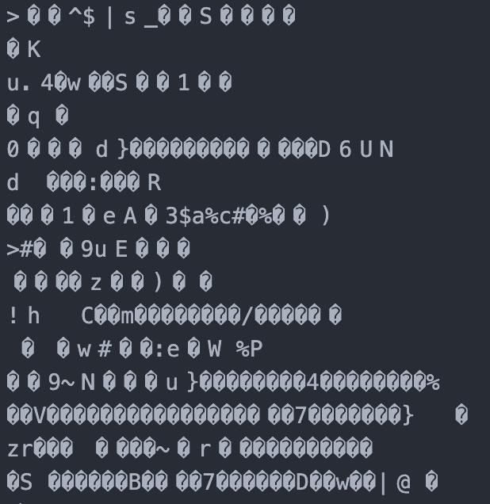

# 随处可用的内容—富文本格式的历史和未来

> 原文：<https://www.algolia.com/blog/engineering/content-that-works-everywhere-a-history-and-a-future-of-cross-use-rich-text-formats/>

还记得什么时候“内容”是这样的吗？


Generously offered under the Creative Commons Attribution 2.0 Generic license by Pete Birkinshaw on Wikimedia.

啊，美好的旧时光。

如今，“内容”往往是这样的:



科技发展到了什么程度。

不要误解我的意思，这两种格式(分别是穿孔卡和 WAV)各有千秋，实际上都相当擅长各自的任务。但事实是，几十年来，我们一直在寻找一种包含所有类型“内容”的单一格式。我们还没有完全失败——已经做了许多尝试，都取得了不同程度的成功——但我们也没有完全实现全垒打。

这方面的大多数尝试(适当地)将范围缩小到富文本。毕竟，如果我们能创造出只适用于富文本的更好的东西，那么放弃对视频等明显不同类型的内容的支持是合理的。

因此，在本文中，我将深入研究过去跨平台、全功能富文本格式的三种最著名的尝试——**XML、Markdown 和 JSON**——以及解决这个问题的三种现代方法——**concept、ExtraMark 和 Sanity 的结构化内容**。

## [](#xml)XML

当 XML 被创建时，它被迫回答这个问题:“我们存储的是什么？”。类似于 HTML 的格式对这个问题有一个明确的答案(在它的例子中，就是网站布局)。XML 的回答几乎是“你想要的任何东西”，因此缩写为 eXtensible。

有时候，这可能是一件好事。例如，新闻行业使用一个名为 [NITF](https://en.wikipedia.org/wiki/News_Industry_Text_Format) 的规范来格式化提要，其他工具可以将提要合并到跨期刊的文章集合中，如谷歌新闻。这是唯一可能的，因为 XML 允许 NITF 的创建者选择他们想包含的任何标签。

这种可扩展性有时也是一件坏事。这种格式缺乏特异性，意味着学习 XML 实际上并没有教会你如何使用它。您仍然需要担心规范的细节，因为这将告诉您如何实际访问存储在 XML 中的数据。

这种可扩展性也使 XML 文件变得不必要的长！假设我想为我的内容创建一个标题。在 XML 中，我需要任意定义<heading>元素，或者我喜欢称它为什么，并确保该元素的存在对于稍后阅读该数据的任何人都是清楚的。这通常是通过文档类型定义来完成的。然后，我们必须以某种方式传达这些信息的含义，因为除了不言自明的元素标题之外，元素并没有告诉我们太多。标题到底是什么？两个不同的人阅读这些数据可能会对<heading>有不同的解读。所有这些占用了大量空间——太冗长了，以至于后来的努力最终走向了相反的极端。</heading></heading>

## [](#markdown)降价销售

Markdown 的创建者看到了在 XML 中定义像标题这样简单的东西的混乱，认为这很荒谬，于是想出了这个:

```
# 
```

我认为这是相反的极端。

包裹在那个小小的标签中(英镑符号？只是哈希？夏普？奥克托索普？)是最高阶标题的整个概念。它假定标题所针对的内容的主题是不相关的，因此不需要为<articletitle>、<productname>或<companyname>设置不同的标记。最高级标题的单个标记就可以了。</companyname></productname></articletitle>

这导致了与 XML 相反的问题！XML 的灵活性大放异彩，而 Markdown 却没有。事实上，当你想存储一个可以通过你的网站销售的产品时，在你的数据库中有一个名为`heading`的字段似乎是不必要的。不，你可能希望它更具描述性，特别是因为你的产品名称有时会显示为标题，有时会显示为列表项，有时会显示为纯文本。所以最后，虽然 Markdown 通过迎合实际的网站布局设计使 Web 上的展示变得更容易，但它实际上并没有有效地标记它存储的信息，而这正是富文本格式的首要目的。这在某些用例中很方便，但在几乎所有其他用例中却毫无意义。

但是，即使在预期的地方使用降价也有一两个问题。例如，你会期望如果它要在网页设计中表现元素，它会全力以赴。然而，Markdown 在 HTML 中表示富文本的很大一部分可能方式上并没有类似的方法。除此之外，技术上没有一个单一的降价标准，这一难题也是*和*实现的功能有点悬而未决。积极的一面是，这很容易解决！在回到最近的修复尝试之前，让我们先确定一下这个问题。

## [](#json)JSON

2001 年，一名开发人员决定序列化一个 JavaScript 对象，这样它就可以作为一个只能发送字符串的协议(如 HTTP)中的有效载荷发送。因为它为人所熟悉(最初是 JavaScript 的子集)，而且是跨环境的(几乎每种语言都有驱动程序)，JSON 很快成为领先的数据传输格式之一。因为它可以存储和传输几乎任何东西，不久人们就开始尝试用它来处理富文本。

但到目前为止，这篇文章的主题似乎是反复出现的:有一个致命的缺陷。我们又回到了 XML 的无限可扩展性，所以我们又回到了学习这种格式并没有教会我们如何使用它的地方。JSON 中的属性比 XML 中的更清楚一点(这是我非常主观的观点，但是考虑到它们的相对普及性，我可以说很多人都同意我的观点)，所以甚至一些对象描述的块的“内容”也是属性。这听起来可能有点令人困惑，但这里有一个例子:

**XML**

```
 <product-description
	sold-out="true"
>
	This is the product description.
</product-description> 
```

**JSON**

```
 {
	"product-description": {
		"sold-out": true,
		"content": "This is the product description."
	}
} 
```

为了进行比较，XML 示例使用了两种不同类型的存储数据(为了演示而分开，而不是因为这是最佳实践)。您可以将简单数据存储为父元素本身的属性，或者存储为该父元素的子节点。何时使用这些方法可能会有点混乱，尤其是如果您不知道使用这些 XML 的程序的最终开发方向。另一方面，JSON 示例平等地对待所有属性。它们可以是字符串、布尔值、数字、`null`、数组或子对象，所有这些都是大多数开发人员熟悉的数据类型。为了格式的原因，我们不需要把它们都像字符串一样对待(参见 XML 示例中的`sold-out`)。

我个人是 JSON 的粉丝，不是因为某种客观的标准，而是因为我是一名 JavaScript 开发人员，使用起来感觉很好。有趣的是，JSON 似乎是存储富文本最常见的方式之一。虽然脱机文档仍然需要格式(想想 DOCX，一种用于 Microsoft Word 的 XML 规范)，但今天创建的绝大多数文档都是为了在万维网上公开共享，我们通常使用支持 JavaScript 的浏览器访问万维网。所以 XML 确实有一席之地，但是有一个越来越大的争论，因为富文本主要是为浏览器准备的，所以 JSON 是一种跨环境(不是 HTML)的原生格式来存储它，正如我们将要发现的那样。

## [](#notion)观念

我们已经谈了很多关于过去的尝试——让我们谈一谈现在和未来。我最初的想法是(看我在那里做了什么？)在检查了我自己的工作流程以及它是如何从技术作者多年前使用的工作流程发展而来之后，写了这样一篇文章。我发现最大的改进是[概念](https://www.notion.so/)，我用来写这些文章的笔记应用。我深入研究了 organization 的 API，想弄清楚他们是如何存储我现在正在写的富文本内容的。看看当我查询这个部分的标题时，我得到了什么:

```
{
	"object": "list",
	"results": [
		{
			"object": "block",
			"id": "00000000-this-long-uuid-000000000000",
			"created_time": "2022-05-24T02:55:00.000Z",
			"last_edited_time": "2022-05-24T02:55:00.000Z",
			"created_by": {
				"object": "user",
				"id": "0another-very-long-uuid-000000000000"
			},
			"last_edited_by": {
				"object": "user",
				"id": "0another-very-long-uuid-000000000000"
			},
			"has_children": false,
			"archived": false,
			"type": "heading_2",
			"heading_2": {
				"rich_text": [
					{
						"type": "text",
						"text": {
							"content": "Notion",
							"link": null
						},
						"annotations": {
							"bold": false,
							"italic": false,
							"strikethrough": false,
							"underline": false,
							"code": false,
							"color": "default"
						},
						"plain_text": "Notion",
						"href": null
					}
				],
				"color": "default"
			}
		}
	],
	"next_cursor": null,
	"has_more": false
} 
```

好吧，所以肯定是 JSON。

问题是，他们如何使用底层技术来匹配用例？嗯，我注意到几件事:

1.  每个数据对象都用一个 UUID 来标识。诸如块的实际内容之类的东西并不重要——我说的是离散的对象，如块本身、用户、页面等。仅这一点就消除了在 JSON 中构建复杂数据结构的最大缺点之一，即允许您引用其他对象而不重复它们的内容。它仅次于 GraphQL 这样的查询语言。那么 [NotionQL](https://notionql.com) 的存在是多么的方便。
2.  也许这是一件小事，但我喜欢的是，它们不只是在`annotations`属性中有一个列出一些注释选项的字符串，比如`bold-underline-italic`。JSON 继承了 JavaScript 简单、易于理解的布尔值，因此，创建一个`annotations`对象的选项，每个注释选项都是它自己的布尔值。这意味着他们不必担心注释给出的顺序，也不必担心未来的更改(例如，添加上标注释选项)会破坏一切。
3.  XML 的一个好处是它需要标记名！很容易掩盖这一点，但是这些标签名称有助于定义每个元素实际上*是什么*。这里的概念已经确保了他们的 JSON 对象不是未标记的。它们实际上在每个离散对象上有一个一致的属性(见这个列表的#1)，叫做`object`，它告诉你你实际上正在读取的对象*是什么*。第 5 行告诉你“你正在阅读关于一个内容块的信息”，第 10 行告诉你“你现在正在看一个代表用户的对象”。在 XML 中，这些将是<块>和<用户>标签，所以非常清楚——但是这种简单模式的一致应用给了 JSON 同样的优势。

凭借这些优势，concept 创建了一个系统，其他工具可以很好地采用它，甚至可以对其进行扩展，直到它成为一个完整的规范！我正在努力寻找任何“不合逻辑”的部分，即使我个人可以看到采取不同方法的好处。例如，concept 在 JSON 上进行了扩展——考虑到程序基于块的特性，这是一个恰当的决定——但他们仍然将 Markdown 作为输入和输出，因此他们仍然受到 Markdown 所能支持的内容的限制。我个人使用了很多切换列表和并排元素，它们在 Markdown 中都不受支持，但在 concept 中却受支持。无论如何，观念已经建立了一个优秀的系统，我真的很兴奋看到它的发展。

## 额外标记

让我们取出之前放在 Markdown 中的大头针——概括一下，我只是抱怨 Markdown 专门用于表示 web 上的富文本，但没有足够的标记来表示 web 上所有类型的富文本，这限制了它的预期用途。但是，当我们添加一些缺失的元素时，情况会大大改善。web 上的 Markdown 的有用性没有改变，但是一些新的 Markdown 风格可以使它完美地直接映射到 HTML 富文本。

就拿 [ExtraMark](https://github.com/vimtaai/extramark) 来说吧。这是 CommonMark 的超集，common mark 是最受欢迎和公认的减价风格之一。但 ExtraMark 更进一步，开始添加其他非常有用的功能。以下是他们的 GitHub 自述文件列表:

*   自动排版替换
*   桌子
*   标题锚(直到标题级别 3)
*   定义列表
*   上标
*   下标
*   缩写
*   脚注
*   评论家标记

太神奇了。我记不清有多少次——尽管我个人很讨厌和桌子打交道——我在谷歌上搜索如何用 Markdown 做一个，却发现自己被卡住了。现在，有可能了！定义列表是另一个应该经常使用的特性(它在语义上很有价值，只是有点晦涩)，现在它也可以用在 Markdown 中了！

不过，我应该给最后一句话加个脚注。从技术上讲，我们可以在 Markdown 中使用脚注和下标，但是无论是解析还是显示 Markdown 都需要支持 ExtraMark，实际上我从来没有听说过这样的实现。这个回购有 4 颗 GitHub 星——它不是一个常用的工具。这是一种耻辱！ExtraMark 是我所见过的最符合逻辑，但仍然是最强大的降价建议规范！因为它完全兼容 CommonMark，如果你的下一个项目需要 Markdown 解析器，我推荐选择这个！到目前为止，您编写的所有内容仍然可以工作，但是现在您已经可以轻松使用所有这些功能了。

## [](#structured-content)结构化内容

现在让我们跳回 JSON 我个人认为只有一种格式超越了 concept。我想向您介绍一下 [Sanity 的结构化内容](https://www.sanity.io/structured-content)。

虽然 it *不是*使用结构化内容所必需的，但它与他们的数据存储平台有足够紧密的联系，是一种可选的好处，而不是强制性的负担。如果您需要某个地方来存储您在结构化内容中传输的数据，您可以明智地将它放在那里，因为您知道他们会为您处理格式和一切。

结构化内容不仅仅包括丰富的文本！它内置了结构化内容的工具(顾名思义)——您的内容所遵循的模型与其他所有内容一起存在！您可以存储逻辑和自定义算法，以便在需要时修改数据(注意，虽然这听起来很疯狂，但这一部分实际上在富文本中很常见——想想动态修改 HTML 的 JavaScript，或者 PowerPoint 中那些愚蠢的可编程动画)，您可以轻松地在外部服务中循环(也不是没有听说过——在 Markdown 中甚至有这方面的变通办法),图像在显示时会自动自定义(这总是可能的，但以前需要外部服务——Sanity 将它融入到您的富文本中)。

最好的部分(在我看来)是您可以严格地使用富文本规范，而不需要所有的健全性特定的特性(大部分逻辑实际上在那里运行)。该规范本身被称为[可移植文本](https://github.com/portabletext/portabletext)，它得到了由 Sanity 团队开发的驱动程序和解析器的良好支持。他们花了很大力气才没有把你锁定在他们的平台上。截至 2022 年 5 月，他们已经有了以可移植文本为输入，吐出[纯 HTML](https://github.com/portabletext/to-html/) 、 [Markdown](https://www.npmjs.com/package/%40sanity/block-content-to-markdown) 、 [Vue 组件](https://www.npmjs.com/package/sanity-blocks-vue-component)、 [React 组件](https://github.com/portabletext/react-portabletext)、 [Svelte 组件](https://github.com/portabletext/svelte-portabletext/)、 [Hyperscript](https://www.npmjs.com/package/%40sanity/block-content-to-hyperscript) 的公开库(我到现在还没看到这个，但看起来很神奇)。如果你正在使用其他编程语言，他们也已经把你包括在内了——不是说我想再使用 PHP，但是如果我想，至少我会很欣慰知道我可以使用可移植文本。

## [](#looking-back)回首往事

这是一篇相当深入的文章。我已经写了将近三千字，但我认为我们花得很值；深入研究富文本格式的历史是一个有用的练习，因为它有助于我们理解任何未解决的问题或缺点，以便我们能够改进它。

实际上，我们中的许多人可能不会参与创建未来的富文本规范之一，但是很有可能，我们必须选择一个来使用，我们在这里回顾的粗略理解将有助于做出这些决定。也许普通的 XML、Markdown 和 JSON 正在逐渐消失，但是在下一个项目中，您将使用什么格式来传递富文本呢？如果你想听我的建议——你已经读到这里了，为什么不呢——如果你打算走降价路线，就去找 ExtraMark，或者找便携文本。

感谢你的阅读，我期待看到你创造的东西。