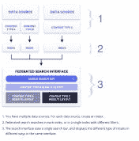
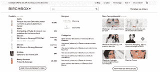
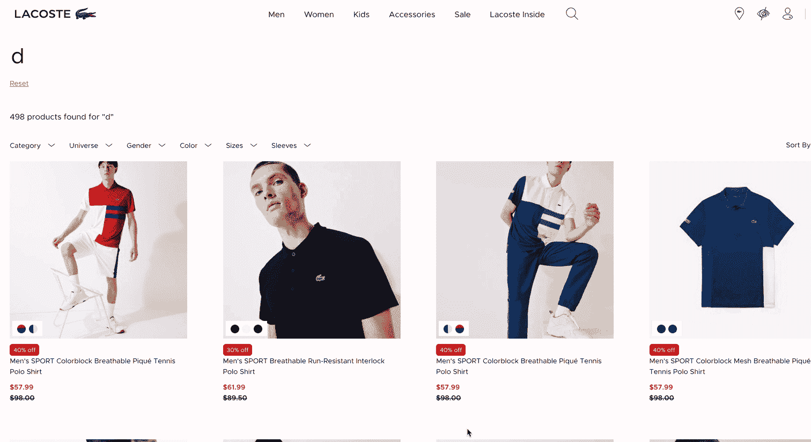

# 使用自动完成创建端到端搜索体验

> 原文：<https://www.algolia.com/blog/product/creating-an-end-to-end-search-experience-with-autocomplete-and-instant-search-results/>

自动完成彻底改变了用户的搜索体验。你不用找很远就能找到证据；你只需要去你选择的搜索引擎或在线零售商那里寻找提醒。

两个最大的在线公司——亚马逊和谷歌——在各自的领域都是庞然大物，他们的成功很大程度上都归功于他们的搜索体验，而这在很大程度上依赖于自动完成功能。

当你考虑到他们内容的浩瀚时，在用户点击“输入”之前 提供精确和相关的建议是很有意义的。在任一平台的搜索栏中键入一个查询就像在海滩上搜寻一粒特定的沙子。他们的自动完成体验帮助用户在看似无限的内容中筛选，以尽可能少的步骤找到并发现他们需要的东西。

有了 Algolia，在线企业可以将自动完成体验更进一步，增加更直观的功能，如即时搜索结果和“联合搜索”(定义如下)。这些基于自动完成的功能附带了一些方法，这些方法可以创建即时反馈循环，从而提高相关性和速度，并最终推动发现。

## 向现有搜索添加自动完成功能

*“我们如何将自动完成功能添加到我们已经存在的系统中？我们需要重做一切吗？这需要几个月的时间和大量的资源吗？”*

正如你将看到的，添加自动完成功能几乎没有什么成本。但是有一个警告:你使用的 自动完成组件必须与你网站的其他部分分开构建，并且设计成独立于网站的其他代码运行。

构建独立的自动完成组件依赖于:

1.  你是如何建立自己的网站的(整体式还是无头式)
2.  您如何构建您的用户界面(整体式与可组合式)

## 第一步——用无头架构替换单片 UI

在第 3 步回到正题之前，让我们快速浏览一下系统设计(第 1 步和第 2 步)。

### 整块石头

搜索用户界面(表示层)有两个主要任务:管理 *可视显示* (搜索栏、方面、结果等)。)和 *用户交互* (查询文本输入、刻面点击、点击结果)。一个 *单片* 前端添加了另一个元素，即业务和数据逻辑，从而通过设计将应用的功能逻辑紧密地编织到其可视化和用户交互代码*中。*

在[单片 UI](https://martinfowler.com/articles/dont-start-monolith.html) 、*中，各部分会变得极其紧密地相互耦合。这就是独石的定义。这些部件将依赖于它们都使用的平台的特性。它们将基于共享的抽象进行通信，因为它们都使用相同的库。”*

以用户输入订单后计算和显示销售税为例。一个单一的前端将计算销售税本身，而不要求从后台财务系统计算税收的金额。虽然采用这种方法可能有很好的理由，但这并不可取:当计算发生变化时，您需要重新编码前端代码(税收经常会发生变化)。将此与 10 或 100 个这样的业务逻辑结合到前端代码中，您最终会得到一个即使是最高级的工程师也无法解开的密不透风的结构。

更糟糕的是，当一个 UI 组件与其他组件共享它的业务逻辑时，这种纠缠变成了一个结，在所有 UI 组件之间产生了不必要的相互依赖。

开发人员抵制修改整体系统，因为他们声称(合理且现实地)改变需要时间，并且尝试起来风险太大、太复杂。快速的解决方法是修补它，但这只会增加未来变化的风险。除了重写或重构系统之外，没有干净的解决方案——那些耗费时间和金钱的可怕字眼。

然而，变化还是发生了:市场和做生意的方式在不断变化。

### 没事的时候就是铁板一块

这可能令人惊讶，但有时[单片系统](https://en.wikipedia.org/wiki/Monolithic_application)是一个合理的设计选择——如果它不会变得太大或太复杂(或太复杂)。不需要太多的技术，一个单一的代码体就可以完成所有的事情，简化了不同系统组件之间的交互。要实现非单片化，需要抽象和额外的机制，以允许组件独立运行(模块化)，但仍然能够共享它们的数据和逻辑。单体设计通过在整个系统中共享代码和数据来简化事情，从而使所有数据和业务逻辑在全球范围内可用。

### 当真是**不**没事做铁板一块

在本文中，我们将向您展示为什么现代的客户机/服务器 web 设计不能支持单一的设计。我们将专门关注一个非单片的、*可组合的*前端(将在下面定义)，其中每个 UI 组件都是自给自足的，并且不共享其内部功能、数据或代码。

### 无头建筑

进入[无头架构](https://www.algolia.com/blog/product/what-is-fake-headless-how-to-spot-fake-headless-and-select-world-class-microservices/)，它从前端移除业务逻辑，将其适当地放回专门的后台系统手中。

通过去 headless——即通过将前端与后端系统分离——前端代码显著减少，使前端开发人员能够专注于视觉和交互功能。

具有单一焦点的精简代码库实现了更大的解耦和灵活性，这为可组合性和自动完成等新功能的轻松获取铺平了道路。

### 可组合组件

除了无头解耦，你还希望表示层(即纯粹的视觉和交互组件)被解开。这要求各个 UI 组件尽可能地相互独立，从而实现真正的即插即用。让我们看看第 2 步是如何工作的。

## 第 2 步–添加 *可组合* 组件以分离任务并启用即插即用

在一个[可组合](https://www.algolia.com/blog/ecommerce/composable-commerce-how-to-select-best-of-breed-components-to-meet-your-business-needs/)前端中，每个 UI 元素(搜索栏、菜单、按钮等。)彼此独立工作，执行不同的功能，当这些功能组合在一起时，可以创建完整的用户体验。真正的可组合组件可以很容易地被替换，而不会对系统的其余部分造成任何影响。

每个 UI 元素的目标是解决特定的问题，易于实现，并通过 API 层连接到系统中的其他部分。这种设置允许电子商务公司将他们最喜欢的内部和第三方组件合并到一个灵活的系统中。

能够集成第三方组件尤为重要，因为构建这些组件的专家会随着市场和技术的进步不断改进他们的软件。这方面的一个例子是基于文本的搜索栏，它可以在一行代码中添加麦克风，然后转换为基于语音的搜索。

## 第三步——为自动完成和联合搜索选择最佳组件

可组合前端允许第三方开发者构建可互换的组件。这些组件提供者包括专门研究该领域的开发人员和业务专家——在自动完成示例中，开发人员、设计人员和业务专家专门研究搜索和 UI 设计。

我们的自动完成和即时搜索组件提供了一种无头/可组合的方法。在接下来的部分中，我们将看到我们的自动完成库如何执行组件间和前端/后端解耦，方法是自己完成大部分工作，主要要求将它放在代码的正确区域，并正确配置和参数化。

### 自动完成:获得可能的最佳查询

在其核心， [autocomplete](https://www.algolia.com/blog/ux/autocomplete-predictive-search-a-key-to-online-conversion/) 是一个搜索栏和一个用户输入时的下拉列表位置。一个很棒的自动完成功能将向用户显示查询，在他们输入完整的搜索词之前，将获得他们需要的信息。

[联合搜索](https://www.algolia.com/blog/ux/what-is-federated-search/)提供了增强的自动完成体验，为方面和多种结果提供了占位符。

这种易于查看的多样性使得联邦搜索成为一种强大的自动完成模式。一个自动完成的联邦搜索界面可以 在不同的栏中显示不同的结果，或者更一般地，在屏幕的不同部分显示不同的结果。例如，在上面的图像中，产品出现在中心，吸引了最多的注意力；但是建议、分类和文章会出现在产品的侧面和下面，让用户走得更远，发现更多。

此外，自动完成功能可以作为一个交互式弹出窗口出现，独立于底层网站的其他功能。一旦他们在单独的窗口上点击一个选项，用户就返回到网站。

在幕后，autocomplete 需要 API 访问服务器端的数据。如果有多列结果，每个结果可以来自单独的数据集。

将 headless 方面(一个获取信息的 API 调用)和 composable 部分(一个在其自己的代码库中做所有事情的弹出窗口)放在一起，任何在线业务几乎都可以立即启动并运行。根据 autocomplete 组件的可配置性，从简单的设计到雄心勃勃的设计应该不需要太多额外的编码。

### 自动完成的好处

自动完成已经变得无处不在，以至于现在它已经出现在大多数将搜索作为体验核心部分的网站上。甚至像 Slack 这样的消息应用程序也使用自动完成功能，让用户更容易找到他们需要的东西。事实上，Slack 是自动完成的一个非常完美的用例。根据经验，可能的搜索结果的广度越大(你每天发送多少条空闲消息？)，自动完成对用户越有帮助。

许多以搜索为中心的网站甚至进一步利用了自动完成功能——例如，[【Blissim](https://blissim.fr/)(之前为 BirchBox)，这是一家在线美容零售商和订阅服务公司，提供法国排名第一的美容盒子。

在 Blissim 网站上，用户可能想要搜索几样东西:一个品牌名称、一种特定的产品，甚至是一篇关于如何尝试特定美容趋势的博客文章。为了适应用户可能尝试访问的可能类别的数量，Blissim 的自动完成建议分为清晰描述的类别:品牌、类别、提示、产品、建议和常见问题。

Blissim 能够提供如此强大的自动完成体验，因为他们对自己的数据和建议的相关性非常有信心。事实上，他们的信心如此之强，以至于当搜索栏为空时，网站甚至会向他们最常访问的页面显示建议。

随着时间的推移收集数据是建立这种关联的最佳方式。Blissim 有十年的时间来分析他们的搜索数据，并将其转化为一种工具，帮助客户在每次访问网站时获得最佳的搜索查询。

### 即时搜索结果:驾驶发现

如果 autocomplete 可以帮助用户生成最佳的搜索查询，那么即时搜索结果可以让这种体验更进一步，有助于推动发现。instant search 不是实时更新查询建议，而是在用户在搜索栏中键入查询时刷新实际的搜索结果页面。

InstantSearch 是一套完整的可组合组件，可以单独工作，也可以互换。因此，它具有与自动完成相同的优点，可以相对简单地集成到现有应用程序中。

要了解即时搜索的运行情况，让我们以 [Lacoste](https://www.lacoste.com/ca/fr/) 为例。这家受欢迎的服装公司的法国网站通过在用户完成查询时刷新搜索结果页面来提供真正的交互式搜索体验。例如，如果用户在搜索栏中键入字母“d”，搜索结果页面会立即更新包含字母“d”的产品名称。然而，如果用户继续键入并输入“连衣裙”，结果页面现在会将项目缩小到连衣裙，甚至显示连衣裙的促销活动。

添加这一层为用户创造了全新的体验。即时搜索不是试图预测用户的查询，而是试图预测最有效的最终结果——通常在用户点击“enter”之前不会预测。与筛选类别不同，用户看到的是与他们的查询最相关的项目，这比网站仅仅依靠自动完成更快地将他们从 A 点带到 B 点。

## 将所有这些放在一起:一个伟大的端到端体验

一个网站迎合用户的方式有无数种，没有一种方法是放之四海而皆准的。让我们看两个不同的例子来说明这一点。

首先，考虑一个既有患者门户又有医生网站的药房。虽然每个组的结果库将是相同的，这两个受众如何与他们各自的网站交互将是非常不同的。将由药房来考虑哪些搜索功能将为每个受众提供出色的端到端体验，这可能涉及为每个网站定制自动完成建议或提供针对每个受众的即时搜索结果。

虽然提供优雅是有帮助的，但它也会把人引入歧途。假设一个用户登录到 Open Table 进行晚餐预订。他们可能在搜索一家特定的餐馆、一种菜肴或一个地点。试图过早缩小结果范围实际上可能会限制用户体验。使用带有联邦搜索的 autocomplete 将所有三个可能的路径统一到一个显示区域，确保用户不会被引入错误的路径。

当涉及到构建一个出色的搜索体验时，应该始终考虑构建一个支持搜索和发现的界面。例如，在美国和欧洲，手机现在代表了超过 50%的网络流量，在发展中国家甚至更多；因此，为了适应有限的空间，必须拥有带有查询建议的自动完成组件。但即使在大显示器上，autocomplete 也提供了一个易于使用的界面，提供了各种选择，拓宽了购物者的可能性。

### 让您的数据一路领先

最终，最好的在线体验是那些为用户量身定制的体验。搜索结果越个性化、越相关、越有帮助，用户就越容易找到他们想去的地方。

海量数据是实现这一目标的关键。当你随着时间的推移收集大量高质量的数据时，就更容易了解用户的习惯，并能够预测他们——然后提供最佳的搜索体验来迎合这些习惯。

个性化搜索体验不是一朝一夕的事；这需要耐心、分析和尝试的意愿。但是如果你想开始建立这种体验，现在就开始吧。查看我们的[演示](https://www.algolia.com/doc/guides/building-search-ui/resources/demos/js/)或[请求演示](https://www.algolia.com/demorequest/)。越早开始收集高质量的数据，就能越早找到自动完成和即时搜索元素的理想组合。