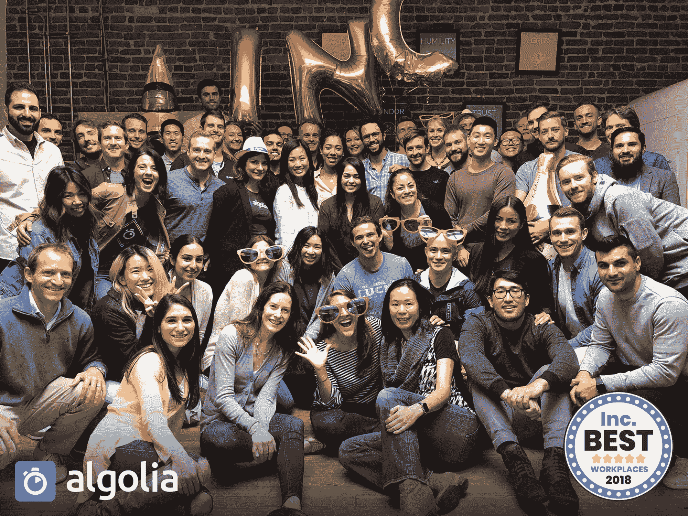

# 作为增长动力的文化- Algolia 博客

> 原文：<https://www.algolia.com/blog/algolia/culture-growth-driver/>

今天对阿尔戈利亚来说是一个特殊的日子。在被[glass door and Battery Ventures](https://globenewswire.com/news-release/2018/05/02/1495014/0/en/Glassdoor-Partners-With-Cloud-Investor-Battery-Ventures-for-Second-Year-to-Reveal-the-25-Highest-Rated-Public-and-50-Highest-Rated-Private-Cloud-Computing-Companies-to-Work-For.html)选为最值得工作的私有云公司不到一个月之后，我们被[杂志评为最佳工作场所之一](https://www.inc.com/best-workplaces)。

当我们获得 Glassdoor 奖时，我发现自己对朋友们说(只是半开玩笑地)这是真正让我感动的罕见奖项之一。这是对我们辛勤工作的认可，也是对我们不断投资建设我们热爱的公司的认可。

今天 Inc .杂志的奖项更是锦上添花！这一切都要归功于我们团队中的优秀员工，以及他们为让公司和我们所有人变得更好而做出的不懈努力。

### **早餐文化吃攻略**

每天都有公司倒闭。即使是大公司，拥有由最有能力的个人精心设计的最先进的战略，也会经常被打乱——尤其是科技公司(想想美国在线、黑莓、诺基亚、雅虎..).避免这种命运的最佳方式是建立一个能够驾驭颠覆浪潮的团队，一个能够挑战自我的团队，一个能够不断走出舒适区的团队，最重要的是，一个永不自满的团队。你的下一个创新很可能已经在你团队中某个人的脑海里，而不是你的 CEO。这个人需要感受到前进的力量。

这正是我们建立[文化第一公司](https://stories.algolia.com/how-algolia-built-a-culture-first-company-around-ownership-eee6623b1b6)的原因。

预测每一个挑战是不可能的，但有意识地设计你的文化并建立正确的肌肉来应对它们是可能的。

### **文化作为增长战略**

对于文化与增长，人们通常认为你必须做出选择。你会冒险牺牲文化来发展你的业务吗？或者你会冒险牺牲你的生意来保存你的文化吗？

就增长而言，过去的一年对我们来说意义重大。2017 年，我们跨越了 2000 万美元的 ARR 里程碑，在纽约、亚特兰大和伦敦开设了新的办事处，我们的全球团队增加了 100 多人，并为我们的高管团队引入了新的领导层。随着这种增长，在文化上走一些捷径的诱惑很大:比如在我们文化优先的招聘流程中偷工减料，减少我们许多团队和办公室之间的见面时间，或者没有为员工满意度和增长投入足够的管理时间。

我的观点是，牺牲文化可能确实在短期内有所帮助，但它正在创造文化和人民的债务，我们最终将不得不偿还。要么为了短期利润而创造一种违背我们价值观的文化，最终让我们失望并失去让我们来到这里的优秀团队，要么因为后来的脱离和流动而导致增长放缓。

我只是认为，如果我们没有对我们想要建立的公司类型有明确的目标，我们就不会有今天的成就。这有助于我们吸引和培养人才，正是这些人才让我们成为今天的我们。这是一个以创新和使我们所做的一切都成为一流而自豪的团队，因为我们日复一日地参与、表达并对我们的价值观负责。

让文化成为你成长的力量，而不是让你慢下来的东西。

I have a philosophy… if you hire the right people and empower them, then magic will happen.

###  **让我们不要自满**

我们为从 Glassdoor and Inc .获得的认可感到骄傲和谦卑，但我们还有很多工作要做。

我们还没有做到，我们知道这一点。和车队一起庆祝感觉很好，但是我们继续向前看，而不是向后看。更多的挑战等待着我们。我们成长得越快，这些挑战就越快落在我们肩上。

文化永远不会“终结”。我们希望继续建立一种赋权、多元化和包容的文化。无论我们未来的规模如何，我们都希望团队成员在工作生活中有意义。

今天，我们有一套强有力的核心价值观，为公司所有人所共享和珍视。这是一个很好的基础，但我们需要更多。我们正在创建运营原则以简化我们的日常决策，并推出新的多元化和包容性计划。

随着我们不断发展，我们的目标很简单——我们希望确保我们正在建设的公司是我们明天和未来几年想要为之工作的公司。

*原载于 2018 年 5 月 23 日* [阿哥利亚故事](https://stories.algolia.com/culture-as-a-growth-driver-f7df0222c67d) *。*