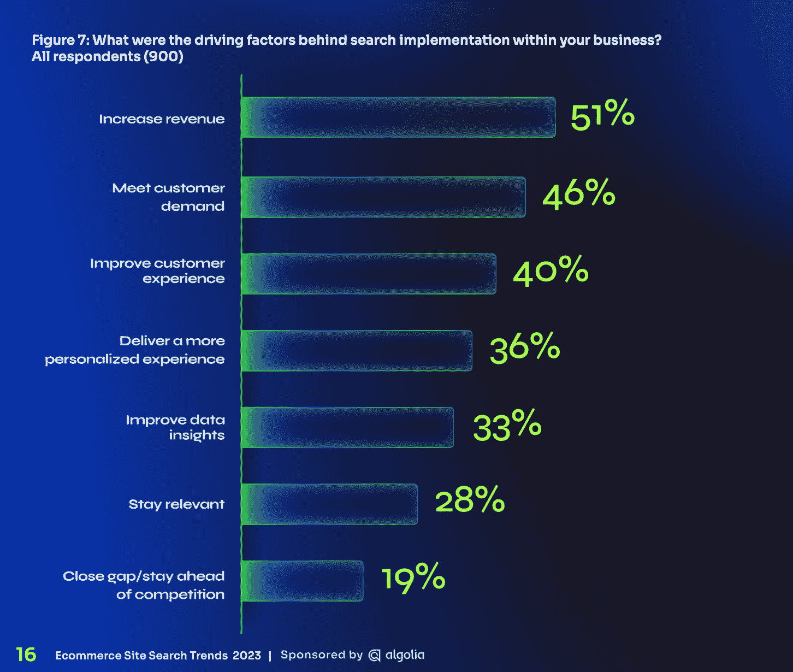
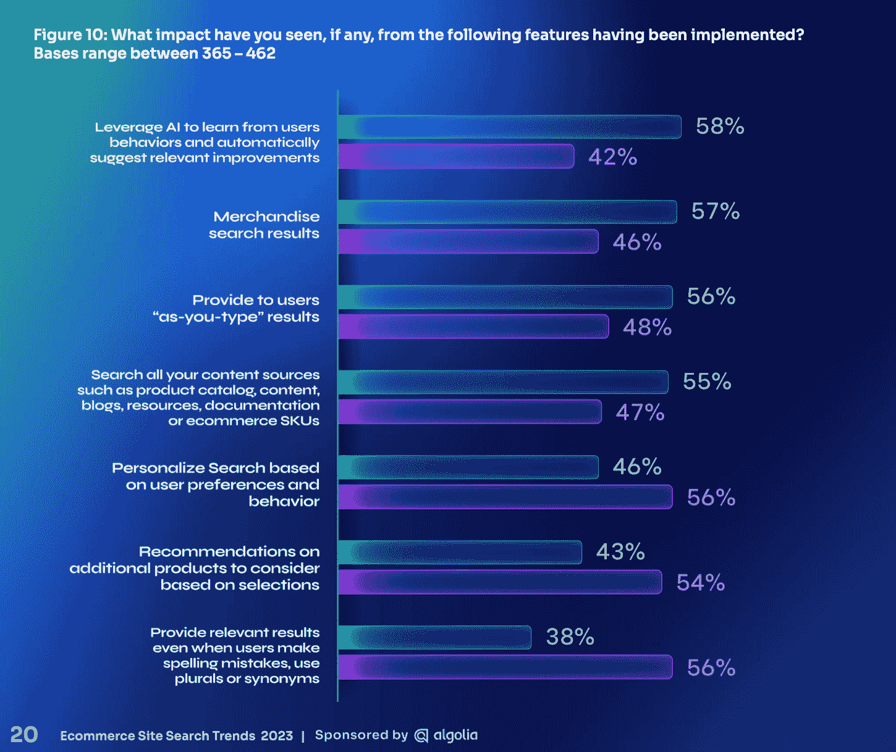

# 以客户为中心的网站搜索趋势

> 原文：<https://www.algolia.com/blog/ecommerce/customer-centric-site-search-trends/>

市场上每天都有新的信息，关于购买什么技术，如何在竞争中定位你的公司，以及发展业务的新途径。让人应接不暇。然而，尽管大肆宣传，商业基本面并没有改变:伟大的公司痴迷于为他们的客户建设。就是这样。

谈到投资以客户为中心的搜索，在《2023 年电子商务搜索趋势报告中有一些明确的趋势。科尔曼·巴夏礼研究公司对 900 名 IT 和商业决策者进行了调查，旨在了解企业如何优先考虑项目和支出 2023。

搜索领域的投资持续同比增长，超过五分之二(42%)的企业投资超过过去 12 个月。在投资搜索的企业中，71%的企业表示，他们对搜索提供的回报相当满意。收入只是搜索改善的领域之一。他们还确定了以客户为中心的价值:

*   46%表示满足了 **客户需求**
*   40%表示改善了 **客户体验**
*   36%的受访者表示，这让他们能够提供更加 **个性化的体验**

我们将在博客中分享我们如何解读这些结果，以及其他零售商如何改善顾客体验和顾客满意度。

Figure 7 showing the benefits of site search investment and strategy via the 2023 Ecommerce Search Trends report by Coleman Parkes Research and Algolia.

## 满足客户需求

在线零售商花费了大量的金钱来增加网站的流量，但是如果他们的网站加载时间很短，就会严重影响业绩。更高的网络延迟会降低网站性能，影响客户体验和转化率。根据一些研究，慢速加载网站 [每年让零售商损失 26 亿美元](https://www.forbes.com/advisor/business/software/website-statistics/#:~:text=16.,billion%20in%20lost%20sales%20annually.) 。当涉及到满足全年每天的需求时，构建一个强大的搜索和发现体验可能比看起来有更多的好处。

站点搜索实际上可以帮助降低网站的网络延迟——它可以减轻网站服务器的巨大负担！这是因为搜索不仅支持网站上的搜索栏，还支持动态生成的产品列表页面(PLP)。毕竟，动态 PLP 是查询驱动的。

Algolia 的速度非常快。我们的云架构由全球 100 多个数据中心提供服务，以更贴近您的客户并最大限度地减少页面加载时间。事实上，Algolia CDN 非常好，我们的一些客户将它用作他们网站上所有列表的交付层。

## 客户体验

从客户的角度来看，搜索结果需要具有相关性。虽然这似乎是显而易见的，但并不容易。关键词搜索引擎很大程度上依赖于手写规则、同义词、网页标签和关键词填充。几乎不可能跟上所有的 [长尾查询的可能性](https://www.algolia.com/blog/ai/how-ai-search-unlocks-long-tail-results/) 。这是人工智能搜索在 2023 年及以后将产生巨大影响的地方。

人工智能搜索通过为每个查询提供更好的结果来改善客户体验。AI 搜索理解自然语言；它为不同种类的查询提供了更好的答案，如症状搜索、兼容性查询或概念式搜索。就其本身而言，人工智能搜索是改善长尾查询的理想选择。然而，它也为“大脑袋”查询提供了好处，尤其是在与关键字搜索结合使用时。

关键字和向量搜索合在一起是真正的 1+1 = 3。它们共同提高了搜索精度和召回率，通过提供更具代表性或更完整的目录产品集来提供更准确的结果。

配合 [人工智能排名](https://www.algolia.com/blog/ai/what-is-ai-search-ranking/) 强化学习等功能，自动持续地对结果进行重新排名，将最佳项目推至顶部，人工智能搜索已准备好为客户提供更好的在线体验。

## 个性化

至少自 2003 年亚马逊发表了一篇关于推荐的论文以来，个性化一直是一个常青的话题。尽管可供选择的个性化模式比以往任何时候都多，但由于数据隐私法规、技术挑战和电子商务堆栈中的许多移动部件，实施起来仍然很困难。然而，在我们的调查中，IT 和业务决策者表示，他们正在寻找各种方式来增强个性化，从购物配置文件到保存物品以备后用。

个性化不仅是业务增长的重要因素，也是当今消费者所期待和想要的。根据埃森哲的调查， [91%接受调查的消费者](https://newsroom.accenture.com/news/widening-gap-between-consumer-expectations-and-reality-in-personalization-signals-warning-for-brands-accenture-interactive-research-finds.htm) 表示，他们“更有可能选择那些认可、记得并向他们提供相关优惠和推荐的品牌”个性化是以客户为中心的！

这种在任何地方提供个性化的挑战是 Algolia 与[MACH Alliance](https://machalliance.org)合作的一个原因——倡导 API 优先的无头服务互操作性，这些服务利用相同的客户和网站数据湖来近乎实时地生成个性化消息和结果。

在《2023 年 [电子商务搜索趋势报告](https://www.algolia.com/dg/ecommerce-site-search-trends-2023/p/1) 中，受访者认为 AI 为个性化提供了最大的好处。人工智能有多种形式。例如，Algolia 等解决方案中内置的新机器学习算法将能够对搜索结果和 PLP 应用个性化规则。当用户键入一个查询时，搜索引擎首先寻找相关性，然后它将重新排列结果，将更好的项目推到顶部，其中更好是指个性化规则、商品销售、排名规则或您定义的其他因素的组合。这发生在一位数毫秒，所以买家不会经历任何滞后。

## 下一步

大约 [88%的买家](https://www.forbes.com/advisor/business/software/website-statistics) 在一次糟糕的体验后不会再回到一个网站。每次访问都很重要！注册免费下载今年的 [电子商务搜索趋势报告](https://www.algolia.com/dg/ecommerce-site-search-trends-2023/p/1) 以获得更多改进现场搜索&发现过程的想法。