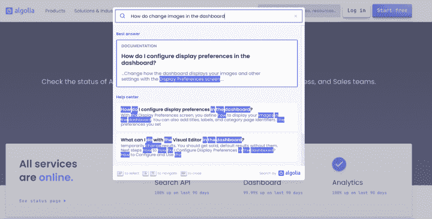
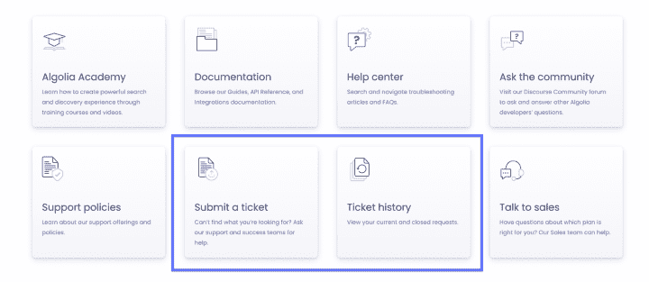
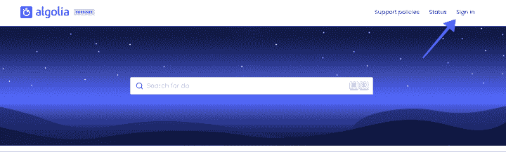
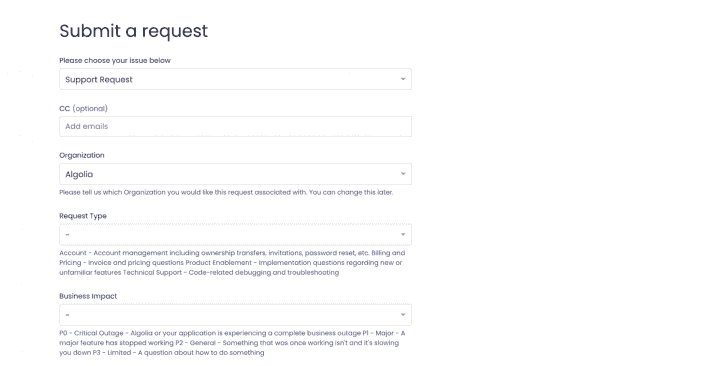

# 客户支持更新，2021 年 11 月- Algolia 博客

> 原文：<https://www.algolia.com/blog/product/customer-support-update-november-2021/>

在 Algolia，我们一直希望为我们的客户提供最好的体验和我们团队的支持。这就是为什么我们一直在努力升级我们的售票系统，以改善您的体验，并更快地获得您需要的帮助。

我们很高兴地宣布，我们将推出一些支持服务改进。

继续阅读，了解更多关于我们的最新更新。

## 1。联合搜索

我们的 [全新支持中心](https://support.algolia.com/hc/en-us) 让您通过 [帮助中心搜索文章](https://support.algolia.com/hc/en-us)[文档](https://www.algolia.com/doc/)[社区帖子](https://discourse.algolia.com/) ，以及 [学院内容](https://academy.algolia.com/) 从语义搜索的角度来看，该搜索还突出显示了“最佳答案”。

***奖励*** :帮助中心新增 FAQ 文章。我们将根据您的支持请求不断扩大它！

T52

## 2。查看当前和过去的请求

帮助中心还为您提供了一个查看过去的支持票证并提交新票证的地方。通过帮助中心提交票证是确保您提供了所有必要信息以便我们尽快响应您的请求的最佳方式。

*请注意，您需要登录您的 Algolia 帐户才能查看您的机票历史并提交新机票。* 您可以从支持中心的右上角登录。

您的帐户被锁定，需要提交申请才能重新登录？使用此 [账号访问表单](https://support.algolia.com/hc/en-us/requests/new?ticket_form_id=360003251238) 。

## 3。更新表格和政策

说到提出请求，我们已经更新了机票申请表，以确保一开始就收集尽可能多的相关信息。

最后，我们更新了我们的 [支持策略](https://www.algolia.com/policies/support/) ，使它们更清晰、更容易比较产品。