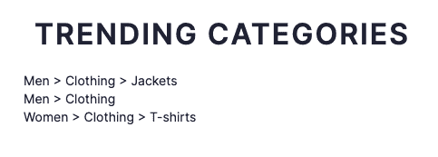
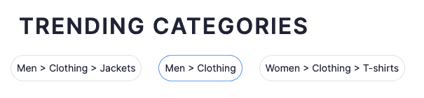

# 使用顺风类定制 Algolia React 组件

> 原文：<https://www.algolia.com/blog/engineering/customizing-algolia-react-components-with-tailwind-classes/>

当我上周在 Algolia 的巴黎办公室时，来自我们前端体验团队的 Dhaya Benmessaoud 向我展示了一个在你的 UI 中设计 Algolia 的 React 小部件的很酷的技巧。Algolia 提供了一些现成的搜索体验主题(Algolia 和 Satellite)以及创建自定义主题的能力。最近，前端体验团队增加了第三种方式来设计你的 UI，通过[将自定义 CSS 类](https://www.algolia.com/doc/guides/building-search-ui/widgets/customize-an-existing-widget/react-hooks/#style-your-widgets)注入到你的 Algolia React 组件中。

对于使用基于类的 CSS 框架如 [Bootstrap](https://getbootstrap.com/) 和 [Tailwind](https://tailwindcss.com/) 的人来说，这是个好消息！在我的例子中，我使用的是 Algolia [电子商务 UI 模板](https://www.algolia.com/developers/code-exchange/frontend-tools/ecommerce-pwa-ui-template/)，它依赖于 Tailwind 的样式。我想从 Algolia 推荐 UI 库中添加一个`<TrendingFacets>`小部件到我的主页，但是我想使用 Tailwind 类来设计它的样式，以匹配我前端的其余部分。

这是造型前的样子:



我肯定能做得更好！为此，我需要为我的组件使用`classNames`属性。它适用于 Algolia 的所有 React 小部件(包括推荐),并允许您覆盖特定于组件的元素的样式。我们的其他一些前端 API，如 Vanilla JavaScript ( `cssClasses`)和 Vue ( `class-names`)已经有这个功能很多年了，现在它可以在 React 中使用，这要感谢最近添加了 React 挂钩的更新。

文档列出了我可以为每个 Algolia 小部件覆盖的元素。例如，下面是一个`<SearchBox>`小部件的元素:

*   **root** :小工具的根元素。
*   **表单**:表单元素。
*   **输入**:输入元素。
*   提交:提交按钮。
*   **复位**:复位按钮。
*   **装载指示器**:装载指示器元件。
*   **提交图标**:提交图标。
*   **复位图标**:复位图标。
*   **加载图标**:加载图标。

对于我的`<TrendingFacets>`小部件，我希望列表在一条水平线中以节省空间，所以我向它的`list`元素添加了一个`flex`类。我还将添加一个新的`facetItem`类，给每个`item`一个漂亮的胶囊形状，并带有一些简单的悬停样式。这是我的组件在样式化后的样子。



这是代码:

```
<TrendingFacets
  classNames={{ list: 'flex', item: 'facetItem' }}
  recommendClient={recommendClient}
  indexName={indexName}
  maxRecommendations={3}
  itemComponent={({ item }) => (
    <a href={item.facetValue}>{item.facetValue}</a>
  )}
  facetName={facetName}
/>

```

添加`classNames`来定制 Algolia 窗口小部件的风格是很有意义的，尤其是对于像我这样沉迷于用 CSS 来设计前端的人来说。你可以在 [Algolia 文档](https://www.algolia.com/doc/guides/building-search-ui/widgets/customize-an-existing-widget/react-hooks/#style-your-widget)中阅读更多关于添加自定义 CSS 类到小部件的信息。如果你是 Algolia 的新手，你可以通过注册一个[免费等级账户](https://www.algolia.com/users/sign_up?utm_source=blog&utm_medium=main-blog&utm_campaign=devrel&utm_id=customize-with-tailwind)来尝试一下。