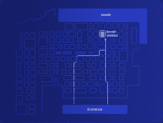

# 解码围绕物理(混合)购物体验的讨论

> 原文：<https://www.algolia.com/blog/ecommerce/decoding-the-buzz-around-phygital-hybrid-shopping-experiences/>

我们的专家将出席 Shoptalk，阐述如何在网上和现实世界的接触点创造成功的零售体验。 [**顺道拜访阿尔戈利亚的展台(#10018)** 。](https://go.algolia.com/shoptalk_annual2022.html)

随着 3 月 27 日至 30 日在拉斯维加斯举行的[shop talk](https://shoptalk.com/us)美国会议的召开，这将是零售业的一次开创性事件，您可以期待它将塑造该行业的 关键对话。我们将在 [Algolia 展位(#10018)](https://go.algolia.com/shoptalk_annual2022.html) 上探讨和澄清的最热门话题之一是，如何通过混合购物体验提升你的网站，让用户如梦如幻。

## **跨越物理和数字领域的个性化购物体验**

对于零售行业来说，2022 年将是充满巨大增长潜力的一年。然而，在我们最近的 [在线商务趋势调查](https://www.algolia.com/dg/ecommerce-site-search-trends/index.html)中，接受调查的 900 名决策者中，只有 20%的人表示他们准备提供符合当今 UX 期望的个性化数字购物体验。能够弥补这一差距使得这一小部分零售商相对于竞争对手而言具有关键优势。

除此之外，过去两年在多个层面上对在线零售业来说都是极具挑战性的。随着新冠肺炎疫情的开始，在线零售商看到客户向在线购物迁移的显著上升。随后，供应链问题和短缺给零售利润以及企业快速服务客户并盈利的能力带来了巨大压力。

准备好真实的、不断发展的 [物理](https://www.forbes.com/sites/gregpetro/2021/08/06/the-phygital-world-reinventing-the-in-store-experience-digitally/?sh=e8ca4dd3863d) (或混合)体验，为顾客提供相同的对话机会，无论是在店内、网上还是回来，都可以帮助零售商减轻这些挑战的影响。真正的物理化，可以帮助零售商有效地与亚马逊和阿里巴巴这样的在线巨头竞争，也可以帮助较小的利基零售商保持和扩大他们的市场份额。

## **在 Algolia 展台了解如何快速体验混合动力**

在 Algolia 的 Shoptalk 展台，我们的搜索专家将深入研究我们从零售客户那里收集到的趋势、案例研究和知识，其中包括 [沃尔格林](https://www.businesswire.com/news/home/20220113005025/en/Algolia-Search-and-Discovery-Platform-Optimizes-Walgreens%E2%80%99-Omnichannel-Shopping) 、 [吉姆沙克、](https://resources.algolia.com/customer-stories/casestudy-gymshark-retail-2)[Nuts.com、](https://resources.algolia.com/home/casestudy-nutscom) [拉科斯特](https://resources.algolia.com/customer-stories/lacoste-en)

 Algolia 是创造个性化、强大的电子商务 [ 搜索和发现 ](https://www.algolia.com/products/search-and-discovery/hosted-search-api/) 体验的全球领导者，受到全球 11，000 多家客户的信赖。在 Algolia 的 headless、API 优先的方法和技术的推动下，领先的零售商如  Lacoste  和  Gymshark  已经经历了显著的增长，例如自从与 Algolia 合作以来，移动转化率增长了 62%,黑色星期五新用户的订单率增长了 150%。

在 Shoptalk 上，我们的专家将带您了解我们如何让您的业务团队能够利用人工智能能力来控制他们的销售策略，从而推动零售接触点的增长，包括:

*   [基于对消费者行为的高级分析，对您的产品进行动态重新排名](https://www.algolia.com/products/ai-search/dynamic-reranking/)
*   [视觉编辑](https://www.algolia.com/products/search-and-discovery/visual-merchandising-curation/) 定制您的界面，满足购物者的期望和业务需求
*   [个性化](https://www.algolia.com/products/search-and-discovery/personalization/) 用户体验

Algolia 从一开始就提供强大的搜索和发现体验，其强大的功能包括速度、键入即搜索和文本相关性。我们的解决方案可以与任何技术堆栈一起工作，旨在最大限度地减少开发时间和精力。所有这些强大的功能使 [Algolia 成为仅次于谷歌的第二大搜索引擎，](https://www.inc.com/peter-cohan/algolias-ceo-has-a-vision-for-google-challenger.html) 每周产生超过 300 亿次请求。

> “对于像我们这样目录中有超过 25，000 种产品的零售商来说，能够改善每位用户搜索体验的解决方案会带来巨大的价值。结合对个性化算法的完全控制，以及通过实时模拟器和搜索 A/B 测试对其影响的完全透明，Algolia 的内置个性化代表了迪卡侬新加坡 “电子商务项目负责人[迪卡侬新加坡](https://resources.algolia.com/customer-stories/decathlon-singapore)Richard mige tte 在数字时代的真正进步

**[今天就在 shop talk(](https://go.algolia.com/shoptalk_annual2022.html)[10018 号展位)](https://go.algolia.com/shoptalk_annual2022.html)** 与我们一起预定您的会议

### **不来拉斯维加斯谈我们的生意？**

您仍然可以获得一个 [个性化演示](https://www.algolia.com/demorequest/) 的 阿尔戈利亚的 解决方案和/或让我们的搜索专家 [免费审核您网站的搜索](https://www.algolia.com/search-audit/) 并向您提供他们的建议。