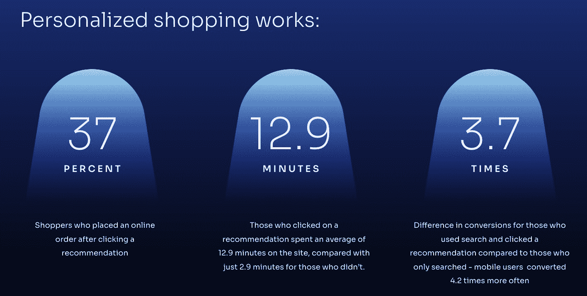
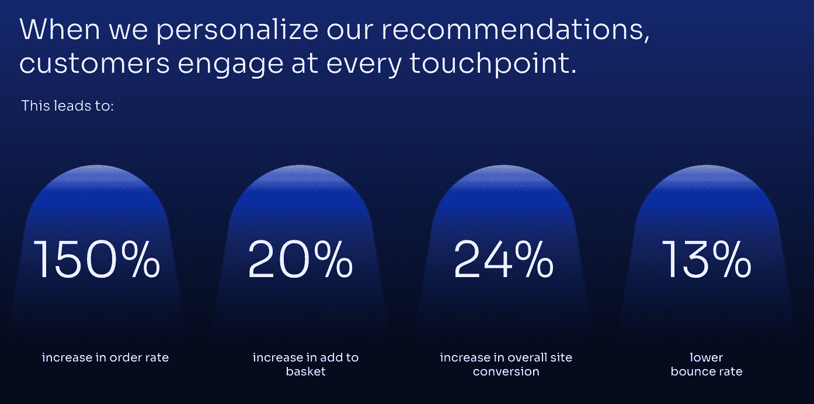
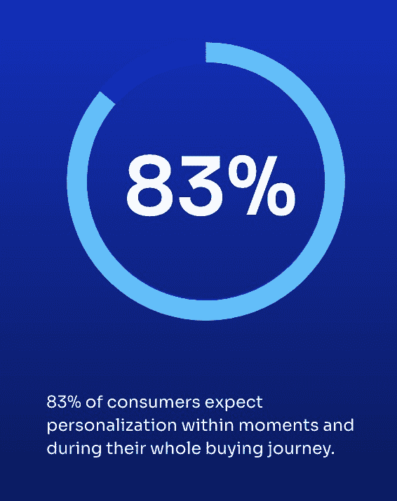
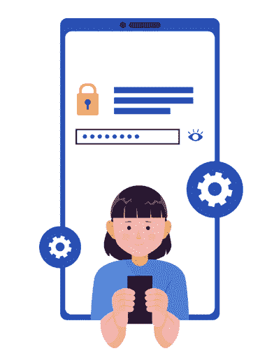

# 在尊重客户隐私的同时创造个性化体验

> 原文：<https://www.algolia.com/blog/ai/deliver-a-valuable-personalized-shopping-experience-while-respecting-customer-privacy/>

如今，一切都是关于个性化购物—你可以通过提供直接针对消费者偏好和需求的产品和用户体验来获得更高的收入和客户忠诚度。

科技可以推动这种成功。

最好的技术创造了快速简单的用户界面、吸引人的产品页面、流畅的结账流程等等。

**better tech 使用人工智能来个性化在线购物体验。** 个性化购物涉及到对顾客需求非常个性化和非侵入性的理解。

人工智能驱动的个性化购物需要收集 ***个人*(非私人)数据** ，这些数据用于机器学习(ML)以开发人工智能(AI)模型。

最成功的网上商家都知道:

*   哪些功能可以提供个性化的购物体验
*   如何在不侵犯客户信任和隐私的情况下创造这些功能

**隐私和利润并不矛盾** 。相反，提供机器驱动的推荐和尊重隐私的个性化导航是一个双赢的提议。

*来源[销售力量](https://www.salesforce.com/form/commerce/power-of-personalized-shopping/?d=cta-body-promo-94)*

## 我们所说的个性化购物是指什么？

以下是个性化购物体验的特点:

在登录页面、产品和类别页面以及购买屏幕上显示搜索结果和产品建议——源自用户活动分析，有助于辨别相似性、偏好和未来兴趣。

根据用户和群组档案显示基于产品或类别的建议，这些建议来自用户活动分析以及目录中的产品关系。

*   ### 动态关联与趋势

根据过去 24 小时或上周出现的最畅销、最受关注和其他此类客户活动信号，根据当前用户和行业趋势调整体验。

通过个性化的电子邮件、短信和时事通讯联系您的客户，根据客户最近的购买情况和总体偏好提供个性化信息。

*来源[安座](https://www.algolia.com/blog/product/6-ways-to-leverage-recommendations-for-ecommerce-retailers/)*

让我们举一个来自在线体育零售商的真实例子。

以下是这些个性化购物功能的作用:

*   鼓励你的用户浏览相关的运动项目；例如，引导他们探索相关的类别页面(马拉松运动员或运动鞋)。
*   鼓励他们超越运动鞋，去发现其他运动项目(秒表、水瓶、运动裤)，甚至超越运动，开始考虑正装鞋、炊具，甚至家居装修。
*   将跑步者分组到同一个档案中，从而结合许多跑步者的行动来微调推荐。

## 收集什么样的个人资料才是正确的资料？

有很多种信号和数据点可以用来发现购买模式。这一切都始于以分析数据的形式捕捉用户行为。

关键是:

*   只捕捉到了 *右* 的分析
*   将分析结果输入不同的模型和算法，产生对未来合理和可能的预测

以下是需要收集的正确分析的非详尽列表:

*   查看产品特征
*   产品页面内的多次点击
*   点击搜索结果和横幅
*   购买或添加至愿望清单
*   使用常用关键字执行某些搜索
*   对产品进行评论或评级
*   捕捉数据，如:
    *   消费者与网站互动的时间(不只是坐在静止的屏幕上，而是实际滚动和点击内容)
    *   他们花多长时间观看类似产品
    *   发现趋势，允许您根据过去 10 或 24 小时内的购买模式动态改变相关性和建议
*   自动化 A/B 测试

## 尊重隐私听起来不可能吗？虚假的承诺？

捕捉分析事件本身并没有什么侵犯性。例如，在上面的跑步者的例子中，可以在不知道跑步者的姓名、地址或任何其他识别细节的情况下发现模式。像你结婚了吗，你的性别是什么，你在休息日做什么，等等这样的私人问题是不需要问的。

但是系统很容易越界——例如，当系统使用已登录客户的私人信息时。但这正是匿名化数据的用武之地，用一个匿名号码取代真实身份(姓名或电子邮件)。通过这种方式，没有人可以使用或滥用数据来找出用户的真实身份。

**人们想要** 不带任何附加条件的个性化体验。积极的隐私模式会增加你的客户群。

**人们不希望** 觉得自己被人监视或跟踪。他们想私下浏览和购物。

**征求同意。** 人们不希望感觉自己被人监视或跟踪。他们想私下浏览和购物。他们想成为设定界限并随时说“停止”的人。

永远不要突破客户信任的界限。低估隐私重要性的企业将会失去他们的顾客。

## 尊重客户隐私为您的企业增值

隐私不是一种约束。虽然这可能看起来违背直觉，但通过收集少量但明智的个人数据来尊重隐私对企业更有利。顾客想要个性化的体验。

*来源[原因](https://www.forbes.com/sites/jimvinoski/2020/01/20/new-research-shows-consumers-already-expect-mass-personalization-time-to-get-ready)原因*

*   ### 有限的个人信息保证了数据质量。

你不需要多余的数据。这是一个基本的机器学习规则——只给你的系统提供最丰富、最可靠的数据。垃圾进，垃圾出。高质量的输入会带来最相关的结果。大数据不是个性化的基础。你只需要少量的智能数据。

*   ### 透明激发信任和忠诚。

与秘密获取私人信息相比，告诉用户你在收集什么数据以及为什么收集，你会获得更多的信任。

*   ### 在不知道一个人的身份的情况下仍能实现皈依。

要个性化体验，你只需要知道一个用户的行为。了解行为也不需要知道用户的姓名和地址或者他们的衣柜里有什么。您只对获取购买和查看习惯感兴趣，即他们点击、查看和购买了什么。

*   ### 删除用户身份可以基于行为而不是人进行更清晰的分析。

不知道身份导致富有成效的归纳。将具有相似购买模式的人分组有助于他们更全面地了解购物时可以做些什么。同样，你不需要在个人资料中知道每个人的名字来帮助他们进行智能和个性化的购买。分组应基于尊重隐私的数据收集，结合习惯和偏好，而不是身份。

## 遗言——不要不自量力。给人们选择权。

留给个人选择的空间。

不必要的过度侵犯隐私，开始让你的客户感到不舒服。这时顾客就退出了。

今天的客户在掌控之中。只做必要的事情来创造合理但不压倒性的个性化体验。

不要忘记——你总是要给用户留出空间，让他们探索自己偏好之外的东西。

无论您的客户选择加入还是退出，人工智能都可以推动他们的搜索和发现体验。一个成功的在线零售策略在使用和不使用收集个人数据的情况下都为机会和发现留有余地。

有兴趣了解更多关于个性化购物的信息吗？查看我们的完整电子书[。或者直接参加](https://resources.algolia.com/ebooks/ebook-delivering-personalized-experiences-in-the-era-of-heightened-privacy)[现场演示](https://www.algolia.com/demorequest/)或[免费启动](https://www.algolia.com/users/sign_up)！