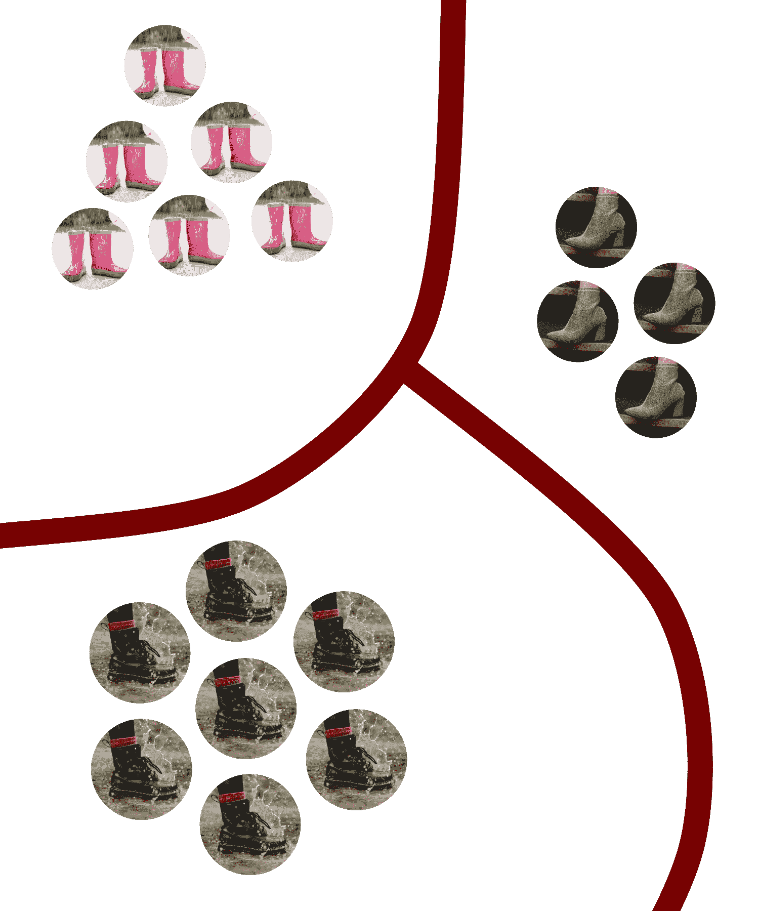
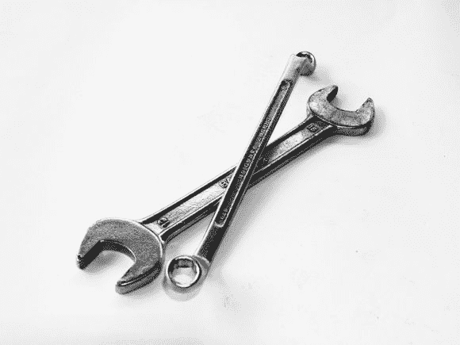
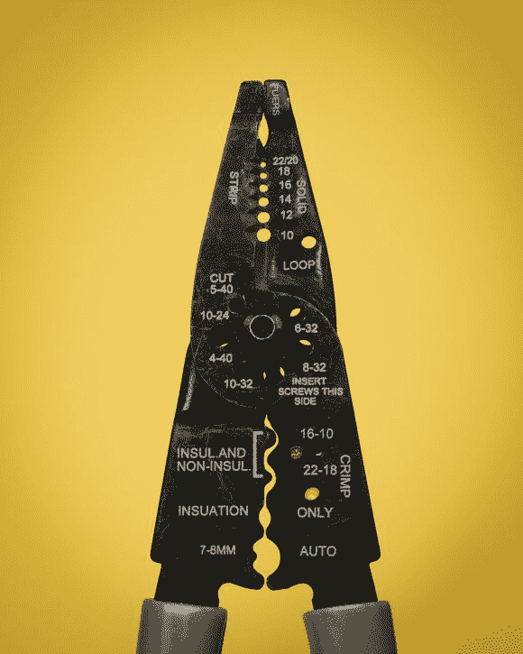

# 设计搜索体验——第 2 部分:Clip-On 及其工具

> 原文：<https://www.algolia.com/blog/engineering/designing-a-search-experience-part-2-clip-on-an-automotive-tools-company-with-an-extensive-catalog/>

在这个系列的第一部分[中，我们分析了一个名为 Orange 的完全虚构的智能手机制造商如何将他们的 jPhones 组织成一个有凝聚力的搜索索引。让我们看看如何将同样的逻辑应用于不同的行业——这里我们写的是一个虚构的汽车工具经销商，我们称之为 Clip-On。您将看到这种方法如何考虑业务需求，并在这个过程中创建最佳的搜索体验。](https://www.algolia.com/blog/engineering/designing-a-search-experience-part-1-orange-a-tech-company-famous-for-their-jphones/)

概括一下，什么是产品？上次我们在这个问题上花了不少时间。这有点难以准确回答，但我们得出的结论是，产品是一个项目、服务或一类项目或服务，区别于其他产品(其他项目、服务或类别……)。还记得第一部分的这张图片吗？



Photos by JACK REDGATE, Jill Wellington, and EVG Kowalievska

我们在它们所在的地方画了边界，因为感觉它们应该在那里自然分开。这家公司销售的商品(在这种情况下，不同类型的靴子)自然会被归入某些可定义的类别。

然而，这些定义并不通用！我们在智能手机上测试了这一点，结果表明，手机的颜色对最终搜索索引的影响与它是哪一年的版本一样。这可能感觉有点违反直觉，所以绝对[查看那篇文章](https://www.algolia.com/blog/engineering/designing-a-search-experience-part-1-orange-a-tech-company-famous-for-their-jphones/)以获得完整的推理。简而言之，在搜索索引的背景下，每个产品都是可搜索的。这应该是不言自明的，但它有一个奇怪的副作用，如果一些客户可能会专门搜索蓝色 jPhone，蓝色 jPhone 需要成为自己的可搜索产品，以便这些客户找到他们正在寻找的东西。换句话说，色差将 jPhone 分割成单独的产品，就像 jPhone 11 和 jPhone 13 Pro 是不同的产品一样。与此同时，可以说手机尺寸或存储空间等更重要的差异只是作为结账流程中的选项，而不是拥有自己的可搜索产品——毕竟，不太可能有人会专门搜索`256GB jPhone`。

这对我们的新案例研究参与者 Clip-On 来说会是什么样的呢？马上，我可以看到两个主要的新因素:

1.  当搜索工具时，查询变得更加具体。用户不只是搜索`wrench`。他们搜寻`1/4in 12 point steel usa wrench`。突然间，我们的搜索索引中必须包含更多的东西，这样潜在客户才能准确找到他们想要的东西。
2.  此外，产品目录也更加多样化。我们不只是销售一堆可以用大致相同的方式描述的智能手机。现在我们销售扳手和锤子、钻头和螺丝刀、凿子和钳子、钢丝钳和研磨机、棘轮和抛光机等等。我们必须对搜索索引中实际包含的内容进行更多的思考，因为整个“索引”部分(Algolia 缓存您的产品数据库以进行近乎即时的实时查找)要求每个产品的属性一致。

因此，让我们挑选两种产品——比方说一把扳手和一对剥线钳——并在考虑这些新因素的情况下思考搜索索引的创建过程。

## [](#designing-for-tools-%e2%80%94-wrenches-and-wire-strippers)工具设计——扳手和剥线钳

我们如何制作这样一个扳手的模型？



Photo by Pixabay

第一个也可能是最有价值的测量是头部尺寸(这决定了扳手可以转动多大的螺母)。我们还应该存储手柄的长度，或者整个扳手的长度。制造扳手的材料也很重要，因为有时扳手是由普通钢制成的，有时是由更坚固的合金制成的。客户可能还想知道工具是哪家公司制造的(因为我们只是转售它)以及它是在哪个国家制造的。由于我们将得到的搜索查询的特殊性，我们可以假设所有这些属性*都是可搜索的。*

接下来，我们如何为这些剥线钳建模？



Photo by Mika Baumeister

这个工具不仅仅是剥去电线，但是为了演示的目的，我们只是保持模型简单。我们可以存储工具的物理尺寸，但是这些数字的效用相当有限，尤其是在搜索的环境中。谁会专门去寻找正好 9.72 英寸长的剥线钳呢？相反，就像我们对扳手所做的那样，让我们来分析哪些测量实际上是有用的。在这种情况下，工具中心下方最初几个圆孔的尺寸决定了工具可以有效剥离的焊线直径范围。从开发者的角度来看，这似乎是一件奇怪的重要事情，但这就是为什么我们不孤立地研究搜索。

但至于其他属性——它们不是和扳手上的一样吗？实际上，每个工具都将共享一些属性，如`material`、`manufacturer`和`countryOfOrigin`。这些属性可以出现在搜索索引中的每个产品上。所以我们已经知道如何处理这些:只需将它们放在产品 JSON 中，就像我们对 jPhones 上的`color`所做的那样。

但是我们将如何处理不同产品之间变化的属性呢？这一部分相当棘手，但重要的是要记住我们在这里的范围相当狭窄。我们假设您有一个产品数据库，它实际上用数据丰富了您的产品页面，因此当我们从搜索索引中取出一些内容时，我们实际上并没有丢弃这些数据—它总是可以从数据库中查询到的。我们在这里的范围仅限于搜索，所以我们可以做出一些决定，如果我们谈论的是长期数据存储，这些决定可能是不好的做法。说了这么多，再来说说序列化。

如果我们制作一个单一的、可搜索的字符串，其中包含我们特定于产品的属性，但以人类可读的方式匹配我们的用户可能合理搜索的内容，会怎么样？例如，以上面我们的扳手和剥线钳模型的 JSON 版本为例:

```
[
	{
		"name": "10 mm 12-Point Metric Combo Wrench",
		"manufacturer": "PeopleWhoMakeWrenches, Inc.",
		"countryOfOrigin": "USA",
		"material": "chrome"
	},
	{
		"name": "Wire Stripper and Cutter",
		"manufacturer": "BPlusTools Corp.",
		"countryOfOrigin": "USA",
		"material": "steel"
	}
] 
```

显然，一些信息，尤其是扳手上的信息，已经融入到名称或标题中，但是我们如何处理其他特定于产品的数据呢？

同样，如果您将这些产品存储在您的数据库中，这是一种不好的做法，但是我们只是创建一个搜索索引，所以规则会有一些变化。让我们创建一个名为`specs`的新属性，并给它一个产品定制规格的序列化版本。

```
[
	{
		"name": "10 mm 12-Point Metric Combo Wrench",
		"manufacturer": "PeopleWhoMakeWrenches, Inc.",
		"countryOfOrigin": "USA",
		"material": "chrome",
		"specs": "10mm head size, 9in handle length"
	},
	{
		"name": "Wire Stripper and Cutter",
		"manufacturer": "BPlusTools Corp.",
		"countryOfOrigin": "USA",
		"material": "steel",
		"specs": "Can cut 10 gauge, 12 gauge, 14 gauge, 16 gauge, 18 gauge, 20 gauge, and 22 gauge wire"
	}
] 
```

有必要更具体地强调可能的搜索关键词以及它们可能自然组合在一起的方式。比如很多人会搜索`10mm`不带空格，有的人可能会搜索`10 mm`带空格。在扳手的名称中以某种方式使用它，在`specs`属性中以另一种方式使用它，将确保我们匹配两种情况，尽管 Algolia 足够聪明，即使我们不采取这一步骤，也能让我们接近预期的行为。对于剥线器重复多次的`gauge`也是如此。如果有人搜索工具的特定规格或规格范围，我们最有可能以这种方式匹配他们的搜索。

注意:这可能看起来很奇怪，但是我们从来没有向用户展示过这个字符串！有时我们会先入为主地认为我们搜索的所有东西都是可显示的信息，但这不一定是真的！我们的搜索索引可以(也应该)在很大程度上为将对我们的搜索结果进行排名的人工智能量身定制。我们在这里追求功能性——如果有必要，我们实际向用户展示的内容可以从我们的产品数据库中提取。

## [](#conclusion)结论

那么我们在这个系列中学到了什么呢(*如果你还没有*看完第一部分，一定要[看完？最重要的是，你的搜索索引和它包含的产品不应该像数据库中的产品一样被对待。我们在这里列出的方法是分析可能的搜索查询，并将这些知识分解为如何将可搜索的产品彼此分开，为用户创造最流畅的搜索体验，并使开发人员的生活变得更加轻松。我敢肯定，即使你不在 Orange 或 Clip-On 工作，你也能明白这一点如何以及为什么适用于你:从你的公司买东西的欲望和结账按钮之间的摩擦越少，你的公司赚的钱就越多。听起来现在是开始使用 Algolia](https://www.algolia.com/blog/engineering/designing-a-search-experience-part-1-orange-a-tech-company-famous-for-their-jphones/) 的时候了，对吗？

嘿，既然仔细考虑你的搜索索引的构建意味着收入的增加，也许你有理由要求你的上级在发薪日奖励你一点……如果没有，也许你会[考虑加入我在 Algolia 的工作](https://www.algolia.com/careers/)？保重，感谢阅读！