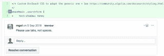

# DX Matters -为文档创建伟大的搜索

> 原文：<https://www.algolia.com/blog/engineering/dx-matters-creating-great-search-documentation/>

**D** 开发者 e **X** 经验，被称为 **DX** ，是构建优秀软件的关键，因为它帮助你的开发者用户充分利用你的软件。

好的 DX 的一部分是 *通过文档搜索，* 不仅作为查找信息的手段，而且作为构建技术内容的工具。在本文中，我们向您展示了一个简单的项目——Algolia 的免费文档搜索平台——如何解决开源社区中的一个常见难题:搜索和结构化文档。我们展示了文档搜索的积极影响以及开发它的成本。

我们还重点对比了广泛使用的***【Ctrl+F】***的值 ***。***

最后，我们提出一些关于如何让 DocSearch 更有帮助的想法。

# 让开发人员轻松编写文档

开发者社区发展迅速。它们的影响更广更强。我们想用我们的搜索技术来帮助开发者施展他们的魔法，让这个世界变得更美好。是时候关注一个合适的 DX 了。

> 这就是 Algolia 和它的 DocSearch 工具的用武之地:通过边学边做的体验让搜索变得生动起来。

搜索解决了一个常见的问题:每个开发人员在需要学习或使用新技术时都需要使用文档。搜索给一个项目带来了爱。但是大多数项目资源有限，或者他们缺乏为文档创建良好搜索体验的知识。他们专注于构建一个令人惊叹的工具。DocSearch 让他们的文档变得活灵活现——免费且开箱即用。

[DocSearch](https://community.algolia.com/docsearch/) 在社区中受到了热烈欢迎。**它每月自豪地帮助 230 万独立用户。**它是自助式和可定制的，是一种完整的开箱即用体验。它适用于任何软件，如 Stripe、React 和 jQuery。你的用户将浏览即时搜索结果，而不是猜测或翻阅页面。它还捕获对了解用户的行为和需求至关重要的分析。你现在是数据驱动，以产生伟大的文件。

但是 DocSearch 也提高了现代文档的标准，它标准化了一种结构良好的文档方法。这是通过它的爬行机制来实现的，它用爬行机制来给你的网站添加搜索。抓取文档要求内容遵循一定的结构。

随着时间的推移，我们还改进了 DocSearch。在搜索和构建内容的过程中，我们遇到了一些基本的和永恒的开发者问题。最大的问题是选择空格还是制表符来缩进页面。当我们将 DocSearch 集成到 jQuery 时，这是唯一的负面反馈。但是我们解决了这个问题， [多亏了一个简单的公关](https://github.com/jquery/jquery-wp-content/pull/416) :

# 为什么 Ctrl-F 不够用？

当人们可以很容易地使用 Ctrl-F 时，为什么要用 DocSearch 走那么远？原因有很多:

*   你将搜索整个文档网站，而不仅仅是一个下载页面。
*   边学边做的体验。即时搜索结果和分类下拉框使用户不仅可以搜索，还可以浏览、发现和学习。我们已经注意到，由于在搜索中所学到的东西，人们会重新措辞、纠正和删除他们最初的搜索。
*   速度。从一页跳到另一页，快速找到你需要的东西。毫秒很重要。
*   错别字宽容。我们的搜索纠正了错误的查询和打字错误。当你搜索未知概念或技术时，这是关键
*   平局决胜算法。Algolia 的这一独特概念帮助维护者更好地重定向他们的用户，以互动的方式帮助他们的用户。更不需要支持！
*   分析学。我们的搜索帮助您了解您的用户在做什么。

# 让我们看看它是如何工作的

我们每年 24H 都会对 1600 多个文档搜索网站进行爬网，以保持搜索与其内容同步。这一过程需要强大而安全的基础设施。我们使用可扩展的基础架构，因为我们才刚刚起步。这就是库伯内特介入的地方。Kubernetes (K8s)是一个用于自动化部署、扩展和管理容器化应用程序的开源系统。它现在是 DocSearch 每天抓取 1600 多个文档网站的基础。如果您想了解更多关于所选架构的详细信息，请联系我们🙂

所有这些都是有代价的。当然，这个项目需要一个强大而可靠的代码库。这一切都是从葡萄牙波尔图的一个度假/异地开始的。这是一个经典的故事，我们将在另一篇博客中解释。像每个项目一样，时间是关键。我们的团队有一个主要的座右铭:自动化！我们甚至建立了一个完整的工具来收集关于项目的公共数据，以便提供最佳的定制帮助。这也是一个很好的博客，正在发展中。为了正确地自动化，我们需要重构我们工具的每一部分。这一点非常关键，帮助我们更快、更强、更远地提供搜索体验。

DX 甚至关系到我们的交付方式。我们帮助每一个向我们伸出援手的合规项目。然而，我们注意到，帮助大项目的最佳方式是主动伸出援手。我们正在雇人来帮助我们。DocSearch 的未来用户只需点击“合并”按钮，就能看到生动的“即学即用”体验。

# 下一步为 DX

我们项目的稳定状态鼓励我们走得更远。我们总是想展示我们对社区的巨大爱。路会很长，很神奇。我们期待着它，并且我们已经为 DocSearch 定义了一些未来的补充。

*   更好的分析。
*   用户界面的新版本(v3)。
*   实时:仅在触发时(即内容发生变化时)抓取网站。
*   仪表板:借助 UI 仪表板，让我们的用户创建自己的配置。
*   改进并公开我们的文档搜索中心。

快乐编码和编写伟大的文档！