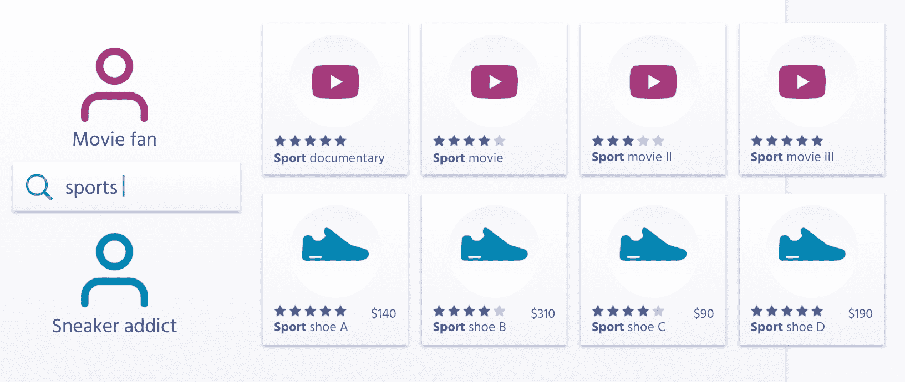
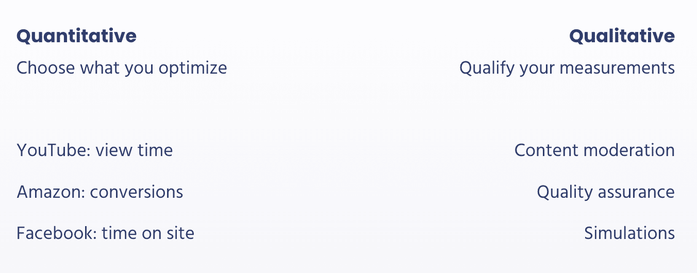

# 电子商务个性化:陷阱、权衡和解决方案

> 原文：<https://www.algolia.com/blog/ecommerce/e-commerce-personalization-pitfalls-tradeoffs-solutions/>

我们都知道[一般的站点体验不再适用](https://www.forbes.com/sites/blakemorgan/2020/02/18/50-stats-showing-the-power-of-personalization/#29ecc8492a94)。为不同的个人兴趣和需求量身打造出色的用户体验需要付出很多——但很容易出错。执行不当的个性化尝试会导致收入损失、信任损失和客户流失。

在这篇博客文章中，我们将向您展示如何思考和实现电子商务个性化，从而更长久地吸引人们的注意力，提高参与度，并建立客户忠诚度。

## 个性化中的隐性与显性意图

一种非常常见的个性化方法是跟踪行为数据点，并建立个人资料和细分。大多数个性化解决方案通过关注隐式个性化来做到这一点:响应用户在导航时的特定行为。他们通常会应用以下技术之一:

1.  根据用户配置文件定制页面布局和设计(更改页面的某些元素)
2.  有针对性的覆盖和通知(例如，当您打算离开网站而不购买时，在应用程序或通过触发消息或看到折扣)
3.  推荐(例如，当你点击你感兴趣的视频或产品时，你会看到类似或补充项目的侧边栏)

隐式个性化的风险在于它是高度规定性的，很容易误判访问者的目标。在没有直接询问并得到明确答案的情况下，你只是简单地推断出用户的需求，并给出你希望相关的内容。

比方说，我上周买了一套园艺工具作为生日礼物送给我阿姨。如果本周亚马逊推荐一系列园艺工具，那它就不再与我相关了。最终，背景很重要，这使得个性化更多的是**实时了解个人**，而不是仅仅依赖于细分和描述。

84%的客户表示，被当作一个人而不是一个数字来对待，对于[赢得业务](https://www.salesforce.com/research/customer-expectations/)非常重要，处理隐含和明确的意图，并在两者之间取得恰当的平衡，比以往任何时候都更重要。

## 搜索:明确意图的途径

用户希望他们的问题能从他们在网站上使用的界面中得到回答，这个界面就是搜索栏。用户可以在搜索栏中自由输入他们想要的内容，并表达出明确的意图。

当我们在搜索中考虑用户意图时，一切都是为了理解相关性。

我们来看一个个性化的网购体验。如果用户输入:“鸡尾酒会的晚礼服”，我们需要计算包含上下文的相关性，然后将它与我们从看到的行为模式中得出的隐含意图结合起来:例如，点击，他们将东西添加到愿望列表的方式，等等。在[排名策略](https://www.algolia.com/doc/guides/managing-results/must-do/custom-ranking/)中混合这些个性化信号，并将它们与销售排名或受欢迎程度等业务指标相结合，是成功个性化的关键。

如果你正在实施电子商务个性化，在其中，搜索营销( [searchandising](https://blog.algolia.com/what-is-searchandising/) )策略——比方说，如果你正在按关键词推广商品——我们需要确保在你融入个性化结果时，这一策略仍然有效。换句话说，**你需要平衡用户想要看到的结果和你作为企业想要展示的结果**。所有这些都需要建立在自然语言处理能力的基础上，比如允许输入错误和同义词。

例如，如果用户键入“sports”(复数)，搜索引擎应该理解复数并返回“sport”(单数)的结果。一旦我们处理了文本相关性部分，就可以根据流行度指标进行排名了。五星审查项目将被提升到显示第一。如果用户是电影迷，排名高的纪录片将首先显示。如果你是一个运动鞋迷，那么我们想向你展示一些排名很高的鞋子，比如鞋子 a。然后也许在展示你可能感兴趣的其他运动鞋之前，把鞋子 B 放在第二位。

旁注:Algolia 让你在实施之前在我们的[个性化模拟器](https://blog.algolia.com/build-better-search-personalization-with-control-and-visibility/)中测试这些策略。

## 电子商务个性化:从理解到实施

你如何从理解它和把问题作为一个概念来欣赏，到准备好一个个性化的解决方案来正确地实现它而不造成损害，知道做错了比根本不做更糟。

准备就是要了解你的用户，了解你的业务，并承认我们正处于算法和个性化发展的一个阶段，在这个阶段，我们的工作还不完整。

在你追随个性化潮流之前，这里有一些需要考虑的事情。

### 适合你的(子)行业吗？

虽然个性化有很多潜在的好处，但并不适合每个人。网站个性化背后的技术，正如今天存在的那样，并不适合每一种使用情况。

例如，个性化是视频流媒体网站的必然需求。当然，个性化购物体验已经成为电子商务网站的常态。在其他行业，用例并不简单。

### 时机到了吗？

当试图确定个性化对你的网站的影响时，问问你自己:

1.  你对你的用户了解多少？你能推断出他们的一些背景吗？随着时间的推移，他们是否有强烈的、一致的偏好？
2.  个性化会改变对你来说重要的指标吗？如果你想增加购物车的大小或在网站上的时间，那么个性化会非常有帮助。如果你的目标是将用户推向一个特定的转换点，那么它可能不是满足你需求的正确策略。

### 你能描绘出你的用户的正确形象吗？

个性化的核心是获取行为信号并推断意图，然后使用创建的图片进行预测。但是你的推荐只能和你描绘的那个用户的图片一样好。问题是，现有的颜料只能描绘出这个人的一小部分真实身份。

购买偏好源于用户的外部环境(情境因素)和内部环境(个人偏好、信仰和亲缘关系)。一个人的内部环境总是会随着收入等级的变化、年龄的变化等等而变化。随着时间的推移，你仍然可以跟踪其中的一些信号。

**更难的是从外部环境中获取信号。**例如，如果一位顾客正在寻找结婚鞋，在他们购买后继续向他们展示结婚鞋是没有用的。

为了解决这个问题，你最好的办法是尝试识别用户对你的不同种类的产品或服务的亲和力，这些产品或服务不会受到外部环境的太大影响。审视一下你的业务，寻找你的产品中用户可以随着时间的推移获得一致偏好的部分。在我们的婚礼购物者的例子中，虽然继续向他们展示婚礼鞋没有用，但向他们展示他们表示偏好的品牌的鞋是有用的。

### 能否满足信任和透明的需求？

消费者正变得越来越适应公司如何在线收集和使用他们的数据。你需要一个个性化的解决方案来建立用户的信任，而不是破坏它。你可以通过透明度做到这一点——向用户展示你在收集什么，以及收集的原因。当用户看到你收集的数据和你推荐某些选项的原因时，他们不仅会感到更安全，还可以通过他们的反馈帮助你完善搜索。让他们有机会在他们的用户资料中选择不个性化，确保那些留下来的人真正接受这个概念。

## 你是你衡量的人

给你的网站添加个性化会对销售、客户满意度和其他重要指标产生影响。如果做错了，它会扰乱你的生意，所以在一个可控的环境中建立个性化。你想从简单开始，慢慢迭代，提炼，变得更好。

为了更好地指导和跟踪这一过程，选择一个接近你底线的北极星指标，看看指针如何随时间变化。对于媒体企业来说，主要成功标准可能是观看时间或跳出率。随着电子商务的个性化，它可以是结帐，活动购物车，或[转换率](https://www.hotjar.com/conversion-rate-optimization/)。

你应该 A/B 测试你的个性化策略，并创建反馈循环来学习和不断迭代。你永远不能简单地相信算法:你需要某种形式的人工干预，以及在必要时进行干预的能力。创建一个结构化的测试程序是至关重要的，这样如果事情变糟了，你可以随时恢复。

## 总之…

个性化很难。无论你已经选择了你的电子商务个性化工具，还是正在考虑，重要的是你有正确的基础和思考方式。

与此同时，对于一些电子商务个性化的正确例子，请查看 Shopify 的 [4 个超级个性化的例子](https://www.shopify.com/retail/hyper-personalization-4-retail-examples)，Sailthru 的[零售个性化指数](https://www.sailthru.com/personalization-index/)，以及一个独特的使用案例和一系列有趣的指标来跟踪，迪卡侬新加坡[如何通过个性化将转化率提高 50%](https://resources.algolia.com/customer-stories-repo/decathlon-singapore) 。