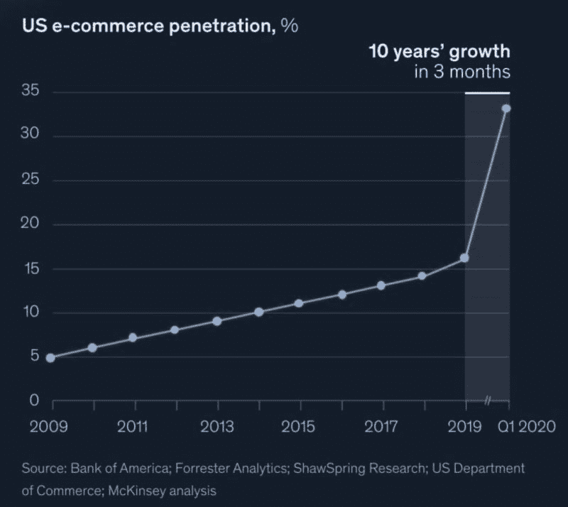
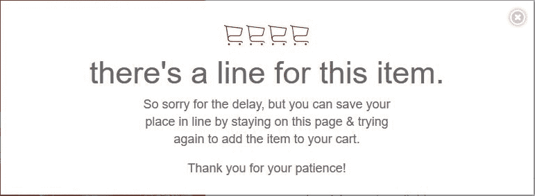
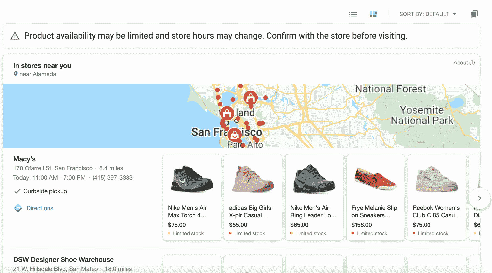
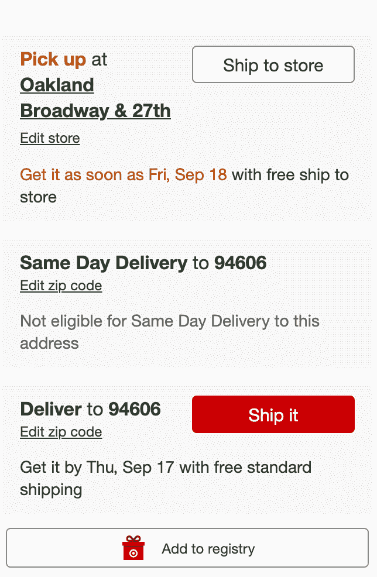
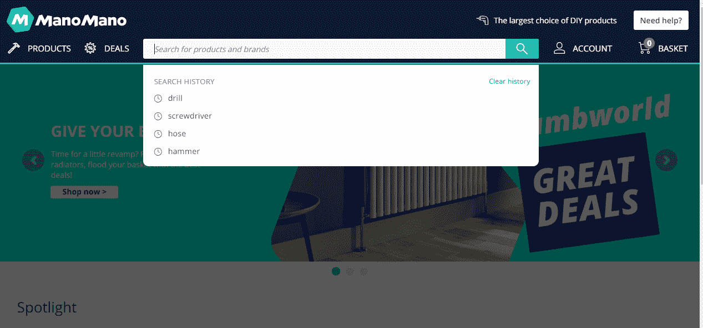
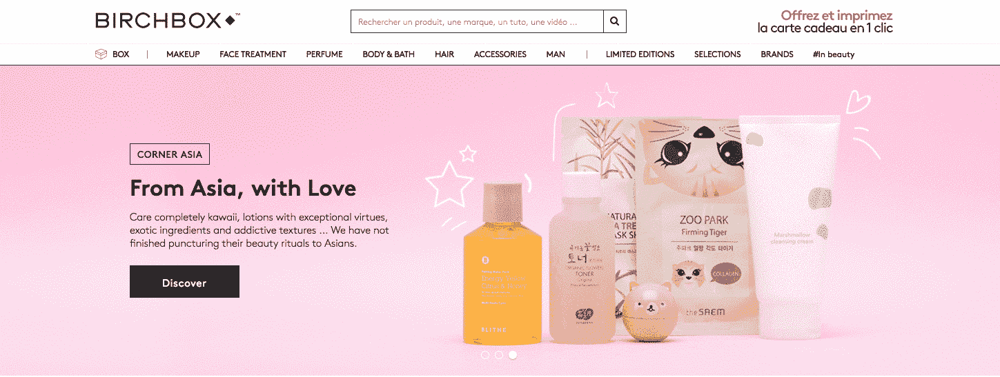
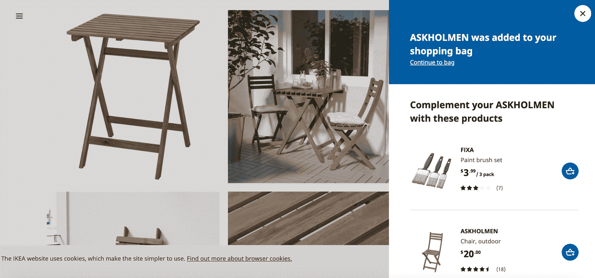
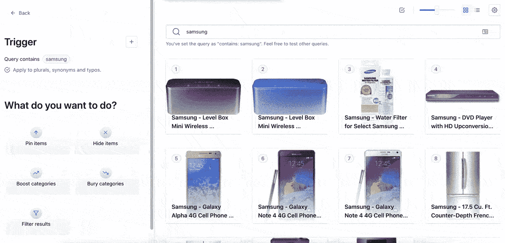
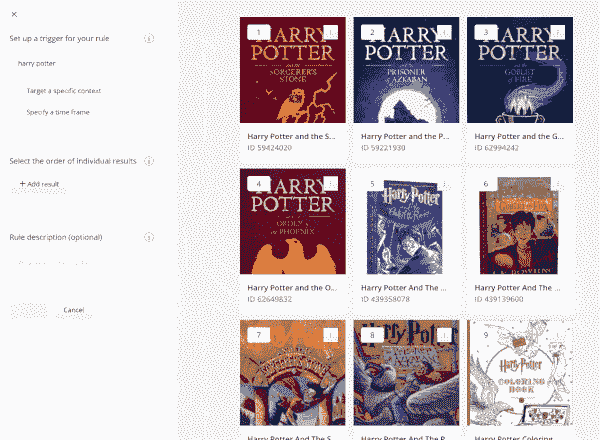

# 电子商务假期计划:让你的搜索进入记录季

> 原文：<https://www.algolia.com/blog/ecommerce/ecommerce-holiday-planning/>

对于零售团队来说，这个假期没有什么是正常的——甚至不是“新常态”。今年前 3 个月，美国电子商务经历了 10 年的增长，我们的一些客户的搜索查询量增长了 600%以上。

【T2

这篇博文的目的是给你一个可行的清单，这样你就可以:

1)避免因[无搜索结果](https://blog.algolia.com/avoid-no-results-pages/)或其他搜索事故而导致的网站废弃，以及
2)对那些准备好的人来说，从这个有望成为非凡假期的季节中获利。

## 别让搜索成为停机的原因

你已经准备好了所有的电子商务系统:数字支付、CRM、订单处理、CMS……只是为了在你的客户最需要你的时候进行故障切换:寻找或发现完美的节日礼物。

无论您是处理自己的搜索基础设施，还是信任搜索提供商，您都应该确保您的系统准备好处理可能会出现的巨大负载增长。我们自己的一些最佳实践:

*   将搜索流量置于索引之上，以最快的速度向客户提供结果
*   当出现持续的使用高峰时，在流量增加的区域部署额外的硬件
*   自动缩短查询处理时间，以便在有限的使用高峰期间处理更大的负载

## 让您的搜索全渠道就绪

全渠道购物者[花费更多，购物次数增加一倍](https://www.information-age.com/omnichannel-shoppers-123481891/)。甚至在 COVID 袭击欧洲和美洲之前，66%的互联网用户使用[手机或平板电脑购买](https://datareportal.com/reports/digital-2020-april-global-statshot)，使用智能扬声器和语音助手进行购物的人数同比增长了 165%。

构建移动体验不仅仅意味着拥有一个响应迅速的网站。例如，移动平台上的许多困难来自显示空间的极端限制。

一个常见的错误是想要像在桌面上一样显示手边的所有数据。从了解购物者如何浏览你的目录开始。例如，对于视觉上选择的项目，如鞋子或衣服，您可以将搜索结果显示为放大的图片。

要了解更多关于移动 UX 的提示，请查看本深度指南。

**对话式搜索**——与技术互动并以自然对话的形式获得回应的过程——充当上下文相关和个性化互动的渠道。虽然这为人们如何购物开辟了一个新的可能性，但与传统的文本搜索相比，成功的语音搜索从根本上来说更具挑战性。它需要显著更高的相关性，并且结果必须以消费者看来的思维速度交付，模仿自然语言对话发生的速度和风格。

> 更多关于构建全渠道搜索和发现的信息，请查看[这份指南](https://resources.algolia.com/ebooks/ebook-greatomnichannelexperience-dg)。

简而言之:**跨渠道的无缝搜索和发现至关重要。**

## 保持库存最新

尽管零售商适应了新冠肺炎和就地安置的初始库存冲击，但库存将继续波动，因为消费模式和额外个人购买的转变速度超过了制造业和供应链的调整速度。一些库存商品不可避免地会卖光，其他商品的需求会比预期的高。这可能会导致可怕的“商品售完”屏幕，不仅会导致您的客户反弹，还会浪费屏幕空间来购买不会产生任何销售的产品。

节日期间的交易量和频率可能意味着每天都有数百万次产品数据库更新。将您的搜索整合到销售点或库存管理系统，以实时或接近实时地更新每种商品的可用性。

如果你还没有，摆脱过时的“选择一个地点”和“物品将如何被接收”的模式。相反:

1.  ******Develop a great UX to locate items:******
    *   *   显示库存商品最近位置的位置数据
        *   一个网飞风格的界面，可以一次查看多个位置的结果

    

2.  **一个动态用户界面，在一个界面中显示所有可用的购买方式:店内、提货或发货**

## 提前购买购物者的愿望清单上的商品

你提供的产品是你最大的资产之一，所以要确保它能满足客户的需求。使用您的[搜索分析](https://www.algolia.com/doc/guides/getting-analytics/search-analytics/out-of-the-box-analytics/)来发现您的购物者在假期前搜索的商品，最重要的是，他们正在搜索但没有找到的商品。使用这些见解来调整您的目录和计划交易，或改善您的广告和搜索引擎优化策略。

知道自己想要什么产品的购物者可能会进行精确的搜索，以了解你是否出售这些产品或类似的商品。你可以通过推荐已保存的搜索和搜索提醒，引导他们在你的网站上找到合适的报价。他们会有再次光顾你的商店的动机(或者你会有一个强有力的理由去 ping 他们)。

## 在搜索结果中利用您的内容

你和你的购物者产生关于你所卖产品的有价值的内容，包括博客帖子、指南、产品评论和社交媒体帖子。这些内容可以影响顾客的购买决定，并使你成为所在领域的权威。在与视觉内容互动的消费者中，市场转化率增长了 111%。

https://www . algolia . com/doc/guides/solutions/gallery/federated-search/

1.不要犹豫，在你的网上商店或搜索结果中，把内容放在产品页面旁边。

**2。链接相关商品**以增加购物车容量和客户总价值:

https://www . algolia . com/doc/guides/solutions/gallery/related-items/

## 更加积极主动地推销商品

与实体店不同，你可以一键甚至自动地重新组织你的店面。用它！

购物者会寻找最好的交易，所以在你的搜索结果排名中使用折扣率。通过首先排列销售时间有限的产品来制造稀缺性。有一个大优惠，但仍想保持你的利润？首先对相关查询进行排名，然后在你的排名逻辑中加入你的折扣后利润。可以玩的参数是无穷无尽的。重要的是能够根据对你的顾客和你来说什么是重要的来配置你的搜索排名逻辑。

不管你喜不喜欢，你都会错过一些趋势，发现你希望有更多促销的高销售报价。现在还不晚！调整您的搜索结果排名逻辑，以促进您最畅销的产品，并捕捉更多的销售。

# 

# 

# 抢购结束后…

## 将第一次购物者转变为忠诚顾客

通过你的网站搜索，你的顾客真的会和你说话。利用这些宝贵的见解！他们在寻找什么是你没有提供的？哪些搜索结果的转化率最高？人们是如何浏览你的商店的？他们在寻找电视时是否按特定品牌进行了筛选？所有这些数据都可以帮助你改进明年的产品和向顾客展示的方式。

在整个假日季节，你将获得新的购物者，这要归功于你在特定产品上无与伦比的优惠，以及广告力度的加大。如果他们喜欢整体体验，他们可能会再次光顾你的商店。因此，当事情平静下来时，反思一下哪些进展顺利，哪些进展不顺利，并开始为您的用户体验规划长期投资。研究报告称，在 UX 投资的每 1 美元会产生 2 到 100 美元的回报。

我们有更多的网站搜索技巧和最佳实践，以及如何让您的在线商店更具竞争力的观点。

[保持联系！](https://www.algolia.com/demorequest/)