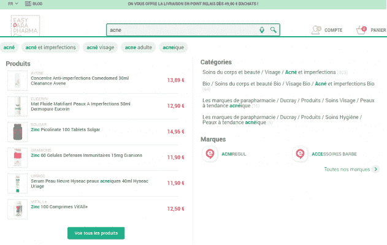
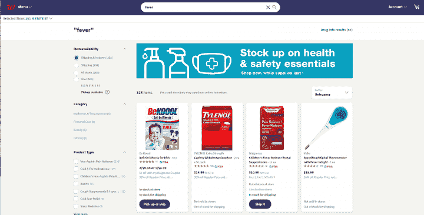
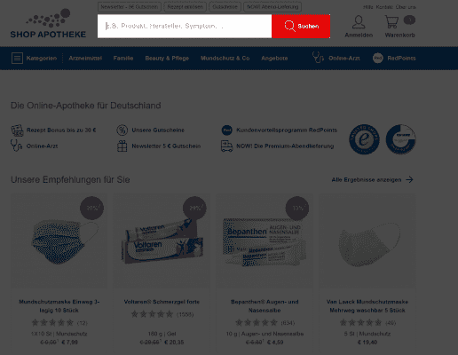
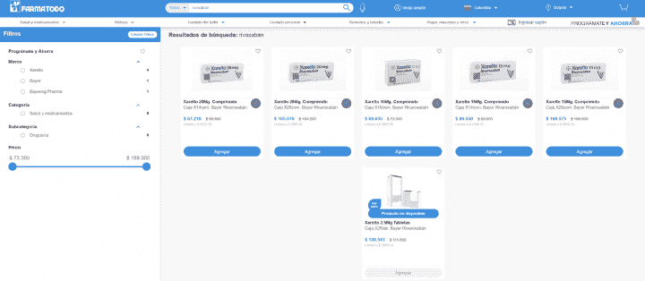
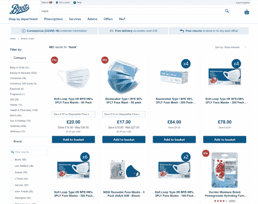
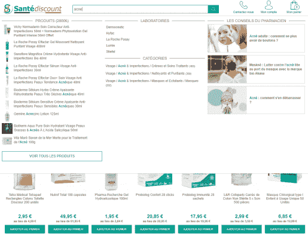
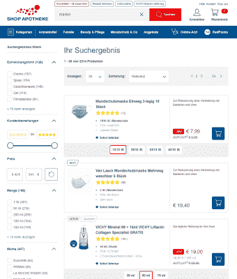

# 使用搜索增加网上药店销售的八种创新方法

> 原文：<https://www.algolia.com/blog/ecommerce/eight-innovative-ways-to-increase-online-pharmacy-sales-using-search/>

发达国家和发展中国家的药店销售都在增长，新冠肺炎疫情带来了消费者对非处方药和健康产品的新一轮在线需求。

在大多数国家，电子商务药店网站的数字广告仍然受到严格监管，这使得药店数字资产的出色用户体验对于转化和留住用户至关重要。

零售商知道 [高级网站搜索可以使转换率翻倍](https://resources.algolia.com/home/report-dc360sitesearch) ，有效的搜索在电子商务药房平台上尤为关键，因为购物者可能知道他们想要什么。当搜索在一个药店网站上被很好地设计和优化时，它可以成为游戏规则的改变者。

## 提高网上药店销售额的成熟思路

为了向您的药店网站客户提供吸引人的体验，您可以微调许多搜索组件和 UX 行为。您的搜索栏的设计和功能、搜索结果页面的布局和功能、您的搜索过滤器和方面—您可以为您的药房网站优化所有这些。

让我们来看看 6 个在线药房网站，它们共同实施了 8 种创新工具来定制搜索功能，并有效地让用户获得他们需要的信息。

### 1。法国的 Easyparapharmacie:自动完成或查询建议

[自动完成](https://blog.algolia.com/autocomplete-how-search-suggestions-increase-conversions/) 或 [查询建议](https://blog.algolia.com/introducing-query-suggestions-better-autocomplete/) (也称为预测搜索或自动建议)在用户键入查询时实时为其提供搜索建议。这些建议与他们的查询或网站上流行的其他查询相关，旨在加快搜索过程并提高点击率。

当用户在[easyparpharmacie](https://www.easyparapharmacie.com)搜索栏中输入查询时，他们会得到特定的产品建议以及更广泛的类别建议和查询建议。为了帮助用户快速识别最佳选项，搜索查询在搜索结果中被加粗。

### 

https://www . algolia . com/doc/guides/solutions/gallery/predictive-search-suggestions/

### 2。美国的沃尔格林:通过症状和有效成分促进搜索

网上药店购物者可能知道他们正在寻找的产品的品牌或商业名称。当他们去实体药店时，他们可能会向药剂师描述他们的症状或列举他们需要的药物中的活性成分，并寻求最佳产品的指导。同样，药店电子商务平台应该允许客户根据他们的症状或他们需要的活性成分进行搜索。沃尔格林在这方面做得很好:无论用户在 [沃尔格林](https://www.walgreens.com) 搜索栏中输入“发烧”或“对乙酰氨基酚”，他们都会得到相关的结果。

### 3。在德国购买 Apotheke:用 microcopy 提高可用性

[Microcopy](https://uxdesign.cc/the-magic-of-microcopy-a56c5decbe1f) 是帮助网站用户导航和使用界面的简短文本。Microcopy 通过确保用户了解不同的搜索组件，以及如何使用它们来找到他们想要的东西，提高了电子商务药房 [网站的可用性](https://blog.algolia.com/best-practices-for-site-search-ui-design-patterns/) 。

[商店 Apotheke](https://www.shop-apotheke.com/) 在其搜索栏中包括 microcopy，以告知用户他们输入症状、制造商、产品等的搜索将会产生结果。

### 4。哥伦比亚的 Farmatodo:在允许输入错误的情况下确保搜索成功

错别字容忍允许用户在输入查询时犯错误，但仍能得到他们想要的结果。这项功能的工作原理是考虑拼写相似的单词。这个功能在网上药店搜索体验中非常重要，原因有二。首先，药物和活性成分的名称往往很长或很复杂，消费者不知道如何拼写。第二，使用移动设备搜索药店产品的人不可避免地会输入错别字。

[Farmatodo](https://www.farmatodo.com.co) 在其搜索体验中采用了错别字容忍，以帮助用户快速找到正确的结果。以商品名为 Xarelto 的利伐沙班为例，它是世界上销量最高的 10 种药物之一。搜索它的人经常输入“rivoxaban”。但是有了错别字容忍，Farmatodo 就可以正确解释这些拼错的查询，并返回相关结果。

### 5。德国的 Apotheke 商店:展示包装选项

一些药店顾客需要不同类型包装的药品。电子商务药店可能会在搜索结果中显示所有可能的包装选项，这会降低可读性，让用户不知所措。

Shop Apotheke 利用其搜索解决方案，允许用户直接在搜索结果页面上为每个结果选择任何可用的打包选项。

### 6。英国的靴子:使搜索结果适应季节性和特殊情况

根据一年中的不同时间，用户的需求可能会发生变化。例如，人们可能在春天寻找抗过敏药，在冬天寻找抗流感的药物。此外，新冠肺炎疫情带来了大量的新需求。

[Boots](https://www.boots.com) 调整其搜索结果以反映用户的情况相关需求。例如，随着新冠肺炎的出现，如果用户在靴子搜索栏中输入“面膜”，结果首先显示的是防护面膜，然后是美容和护肤面膜。

### 7。法国的 Santédiscount:使用联合搜索提供综合结果

购买药店产品的人通常对这些产品的信息感兴趣，比如是否服用某种药物的建议以及该药物如何起作用的评论。使用 [联合搜索](https://blog.algolia.com/what-is-federated-search/) ，您可以在一个易于使用的界面中为用户提供除产品本身之外的各种类型的搜索结果，例如，产品文档、产品使用指南和关于产品的已发布文章。这可以为网上药店带来多项好处。

https://www . algolia . com/doc/guides/solutions/gallery/federated-search/

在[santédiscount](https://www.santediscount.com/)网站上，输入几个按键就向客户呈现了相关产品、顶级制造商、有用类别和相关文章的综合列表。提前获得“所有事实”可以大大减少用户搜索信息所花费的时间。联合搜索还可以改善客户对网上药店的看法，因为他们开始意识到数据监管背后的思想水平。

### 8。在德国购物 Apotheke:在搜索结果中包含商品销售

与实体药店一样，网上药店可以利用数字体验，尤其是搜索结果，来推广打折产品和自有品牌商品，甚至向批发商出售赞助商品。数字用户期待这种类型的销售，并可能使用它来帮助他们发现受欢迎的促销和交易。

在[店铺的李艾科](https://www.shop-apotheke.com/) 网站上，批发商可以付费将自己的产品列在指定位置进行相关查询。此外，李艾科商店可以推广其自有品牌产品作为第一结果。由于这些产品在搜索中的地位提高，它们大大增加了公司的收入。

## 设计一种搜索用户体验，轻松引导人们找到药店产品

为你的网上药店设计搜索 UX 时，你必须考虑用户旅程和探索过程的每一步。为了提供用户期望的服务水平，可以考虑与一家 [搜索即服务](https://blog.algolia.com/what-is-search-as-a-service/) 合作伙伴合作，该合作伙伴可以以灵活和可定制的方式提供您需要的所有行业标准功能。

阅读我们的电子书[*Searchandising:提高转化率的 9 个最佳实践*](https://resources.algolia.com/ebooks/ebook-searchandising9bestpractices-retail) 了解如何优化您的在线药店搜索体验。