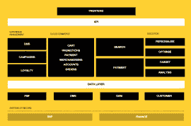

# 如何成功过渡到无头架构

> 原文：<https://www.algolia.com/blog/product/essential-building-blocks-retailers-consider-when-moving-from-monolith-to-headless-architecture/>

拥有同类最佳构建模块的无头技术堆栈有利于拥有多种战略能力的电子商务公司，而这些能力是他们依靠传统整体架构时不太可能实现的。从一个[巨石到无头建筑](https://www.algolia.com/blog/product/5-reasons-why-retailers-move-from-a-monolithic-to-headless-architecture/) 有很多原因。 这些优势包括为特定使用案例或需求构建和定制电子商务平台解决方案的灵活性，推出新产品和服务的速度，以及为客户提供最佳体验的能力，无论平台或设备如何。这一转变开启了未来的战略增长机遇。

为了释放无头架构的优势，企业需要规划其数字化转型，并考虑创建最先进的电子商务平台解决方案所需的每个基本构件。

## 移动到无头架构需要哪些构建块？

根据 [马赫联盟](https://machalliance.org/) 的说法，一个典型的电子商务网站的无头架构会有以下积木:

在该图中，每个模块代表一个基本的电子商务功能，而不一定是一个独立的工具。可能有几个工具具有重叠的功能或解决方案。在选择最佳组件时，我们希望关注的是哪些功能能够为您的特定用例提供最大价值，以及如何将它们有效地结合在一起，以确保您的电子商务业务不断实现其业务目标。

**前端**——架构的第一个元素是前端框架。这是表示层，它将把您的电子商务平台用户界面呈现在您的客户面前，以提供最佳的数字用户体验

**API 层**–API 层是您所有构建模块的接入点。

### **体验管理**

*   **CMS**–内容管理系统允许您的营销团队将内容放在网站的特定位置。例如，他们可以在销售活动的新类别登录页面的顶部放置促销英雄图像。
*   **营销活动**–营销活动管理工具允许营销团队推广产品和活动，并跟踪每个营销活动的成功率和指标。例如，他们可以通过电子邮件营销为现有客户推出推荐计划，然后测量通过推荐计划获得的新客户的百分比。另一个例子是通过博客、社交媒体或视频流创建有价值的内容，以吸引相关线索并将其转化为销售额。
*   **忠诚度**–有一些工具可以帮助您跟踪和管理您的忠诚度计划，包括购物奖励、折扣代码等等。

### **云商务**

*   **购物车/支付/账户/订单**–有工具负责管理执行电子商务交易所需的数据。
*   **促销/营销**——这些是构成你营销策略核心的工具(人工或人工智能辅助)。它们帮助您管理产品出现在每个客户群中的优先级，整合您的业务数据，并在您平台的每个领域实施营销策略。此构建模块将帮助您确保以正确的顺序将正确的产品放在正确的客户面前。

了解电子商务行业领导者如何实施营销战略:

[如何通过搜索营销增加在线销售](https://www.algolia.com/blog/customers/how-to-increase-online-sales-with-search-merchandising/)

[如何通过品类销售提升在线销售](https://www.algolia.com/blog/customers/how-to-boost-online-sales-with-category-merchandising/)

[利用人工智能优化用户转化的最佳方式](https://www.algolia.com/blog/customers/best-ways-to-leverage-ai-to-optimize-a-user-conversion/)

[电子商务个性化的最佳实践](https://www.algolia.com/blog/customers/best-practices-for-ecommerce-personalization/)

*   此类工具除了提供人工销售功能外，通常还提供自动化功能，以更好地优化转化率，提高平均订单量和频率。这些工具通常会利用人工智能能力来推动商品 KPI，包括人工智能重新排名、人工智能同义词建议和推荐算法。

*   **搜索**——这是一个成功的电子商务平台最关键的组成部分之一。大多数用户会直接去搜索栏寻找产品。你会希望确保每一次击键都能显示正确的搜索结果，并有助于转化和增加公司的收入。

[](https://www.algolia.com/search-inspiration-library/?refinementList%5BbizDevTools%5D%5B0%5D=Query%20Suggestions&refinementList%5BbizDevTools%5D%5B1%5D=Multi%20Index%20Search&refinementList%5BuseCase%5D%5B0%5D=eCommerce&page=1&configure%5BhitsPerPage%5D=9&indices%5BPROD_algolia_com-inspiration-library_query_suggestions%5D%5Bconfigure%5D%5BhitsPerPage%5D=6&indices%5BPROD_algolia_com-inspiration-library_query_suggestions%5D%5BrefinementList%5D%5Bpage%5D=1&indices%5BPROD_algolia_com-inspiration-library_query_suggestions%5D%5Bpage%5D=1)

*   **支付**——负责您的电子商务平台上的金融交易处理的工具。

### **执行**

*   **个性化**–您架构中的一个非常重要的元素，允许您在电子商务平台上个性化每个用户的体验，并确保它符合他们独特的行为和偏好。

*   **优化**

*   **定位—**工具，可根据具体内容或体验对客户群进行细分。如果一个内部研究团队发现某个地理区域的女性更喜欢某个特定的产品或内容，就可以创建一个专门的细分市场来瞄准这个特定的群体。例如，澳大利亚和新西兰的鞋类零售商客户将在 12 月看到夏季凉鞋促销，而加拿大的客户群将看到冬季靴子。
*   **分析**分析对于持续评估您的营销工作、识别业务机会和趋势以及收集数据见解并与相关内部团队交流非常有用。

### **数据层**

*   **PIM**–产品信息管理模块允许电子商务公司收集、管理和丰富产品信息，创建产品目录，并将其分发给多个销售和电子商务渠道。PIM 工具能够跨多个渠道导入和管理大量 SKU。
*   **OMS** OMS 是订单处理和履行数据的唯一真实来源。
*   **DAM**–数字资产管理工具用于管理、收集、存储、编目和共享内容或数字媒体:图像、视频、品牌材料和文档。
*   **客户**–此构件包含您的客户服务信息。您可以利用它和搜索构建块在您的平台上创建卓越的客户体验。

了解电子商务行业领导者如何实施客户服务解决方案来提高品牌忠诚度:

[领先的电子商务公司如何通过提供快速、信息丰富的客户服务来提高品牌忠诚度](https://www.algolia.com/blog/product/how-leading-ecommerce-companies-increase-brand-loyalty-by-offering-a-fast-informative-customer-service/)

### **系统的记录**

*   **ERP**
*   **财务**–该构件包含公司用于财务报告、会计、预测和分析的财务工具。

## 结论

从整体架构到无头或可组合架构的数字化转型是一个必不可少且非常必要的步骤，可以让您的电子商务平台为未来的行业变化和技术进步做好准备。

要了解有关选择和实现最佳可组合构建模块的方法的更多信息，并了解快速、可扩展和灵活架构的优势， [请联系我们的团队](https://www.algolia.com/contactus/) ，或访问以下链接:

[可组合商务:如何选择最佳组件来满足您的业务需求](https://www.algolia.com/blog/ecommerce/composable-commerce-how-to-select-best-of-breed-components-to-meet-your-business-needs/)

[可组合商务:如何提升全渠道产品发现体验](https://www.algolia.com/blog/ecommerce/composable-commerce-how-to-improve-omnichannel-product-discovery-experience/)

[可组合商务:如何构建店内产品搜索亭和商店定位器](https://www.algolia.com/blog/ecommerce/composable-commerce-how-to-build-an-in-store-product-search-kiosk-and-store-locator/)

[可组合商务:如何通过优化库存管理帮助店内销售人员轻松找到产品](https://www.algolia.com/blog/ecommerce/composable-commerce-how-to-help-in-store-sales-associates-to-find-products-easily-by-optimizing-inventories-management/)

[可组合商务:如何将你的产品目录整合到微信、Google Home、Alexa](https://www.algolia.com/blog/ecommerce/composable-commerce-how-to-integrate-your-product-catalog-into-wechat-google-home-and-alexa/)

[可组合商务如何在黑色星期五和网络周期间刺激消费者消费](https://www.algolia.com/blog/ecommerce/how-composable-commerce-can-boost-customer-spending-during-black-friday-and-cyber-week/)