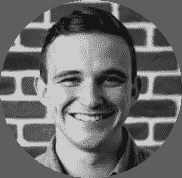
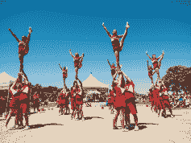

# 阿尔戈利亚的面孔:认识史蒂文·梅里诺-阿尔戈利亚博客|阿尔戈利亚博客

> 原文：<https://www.algolia.com/blog/algolia/faces-algolia-meet-steven-merlino/>

*如今的阿戈利亚岗位特征* [*史蒂文·梅里诺*](https://www.linkedin.com/in/steven-merlino-ba3374b1/) *，我们销售团队的业务拓展代表。在搬到旧金山并作为我们的第一批 SF 团队成员之一加入 Algolia 后，他投身于当地社区，并一直在为 LGBTQ 社区中受威胁生命的疾病(如艾滋病毒/艾滋病)影响的人筹集资金。T17***

*听听他的故事！*

Steven Merlino, Business Development

你在 Algolia 的角色是什么？

作为我们旧金山办事处的早期团队成员，我有机会身兼数职，但我现在的主要职责是业务拓展。当我于 2016 年 11 月加入该团队时，我被请来通过创建管理我们的集客销售线索计划的流程来启动我们的集客销售战略。一旦这个角色稳定下来，我就培训新人接管我们的入境业务。

随着我开始在公司内部寻找新的机会，我想挑战一下自己，尝试一些新的东西，所以我加入了我们新成立的对外团队。Algolia 的对外销售要求我们深入研究我们可以为企业解决的问题。这包括评估他们网站的性能，并在他们的搜索体验中可以改进的地方教育他们——通常是在速度、相关性、用户界面和 UX 方面。这个过程需要花很多时间来寻找合适的目标公司、合适的联系人，并自己进行评估。虽然这个角色很有挑战性，但我仍然想让自己更进一步，于是我开始参与工作之外的其他活动。

你为什么决定参与当地的社区活动？

与旧金山办公室的大多数团队成员不同，我是旧金山湾区的新人——我是从亚特兰大搬到这里的。虽然搬家令人兴奋，在一个新的城市感觉很棒，但我想感觉与我居住的城市有联系，就像我在家乡的感觉一样。就在那时，我决定从家乡重拾我的一项老活动——啦啦队。

我在谷歌上输入的第一个词是“欢呼旧金山”和“嘣”——有一个团队叫“欢呼旧金山”！我给球队发邮件说我想加入，所以他们邀请我参加他们的一次邀请赛，这时我才发现这不是一个普通的啦啦队。这些啦啦队员都是成年人，他们都志愿为海湾地区的慈善机构筹集资金，帮助 LGBTQ 社区。我真的被震撼了，从那一刻起，我知道我必须加入这个团队。

为什么这个组织对你有意义？

简单——我有机会遇到的人和我能影响的生活。在筹款活动中，无数有朋友、爱人甚至自己感染了艾滋病毒/艾滋病的人感谢我们让人们意识到影响 LGBTQ 群体的疾病。有了慈善捐款，人们很容易忘记，有些人直接从你的努力中受益——对我来说，我们影响的与社区的互动让我不断回来。

Cheer San Francisco 始于 1980 年，当时艾滋病流行严重影响了 LGBTQ 群体，作为一种振奋精神的方式。我们于 1993 年成立，是一个 501(c)(3)非营利组织，2004 年，我们成立了“为生命欢呼”基金会，帮助全国其他城市效仿我们在湾区的做法。自 2004 年以来，我们已经筹集了超过 35 万美元！

**我们怎样才能参与进来？**

这实际上是一个很好的问题。作为一个完全的志愿者组织，我们一直在寻求帮助😉如何参与的信息可以在 [Cheer SF 脸书](https://www.facebook.com/CHEERSanFrancisco/) 页面和他们的 [网站](https://www.cheersf.org/) 找到。在这些页面上，您会找到我们支持的当地组织，如 [善体项目](https://www.shanti.org/) 、我们的表演视频、下一步去哪里找我们，以及一个[捐赠选项](https://www.cheersf.org/support)，如果您愿意支持我们的事业。

如果你有兴趣加入这个团队，我们将在 6 月 26 日、6 月 30 日和 7 月 1 日举办试听会，试听会将在 7 月 3 日举行。不管你是老是少，有没有拉拉队经验，或者根本没有经验，我们都希望见到你！你可以在我们的脸书页面上找到更多关于选拔赛的信息，如果你想申请，你可以在这里申请！

我希望你喜欢更多地了解我，并为旧金山加油🙂随着本周末(6 月 23 日和 24 日)旧金山骄傲日的到来，你可以来打声招呼，并与团队的其他成员见面！我们将参加周日的游行，并在周六下午 2:10 和周日下午 1:45 在市政厅前的主舞台上表演。希望在那里见到你！

——要骄傲。大声点。

Catch Cheer SF at Pride Weekend!