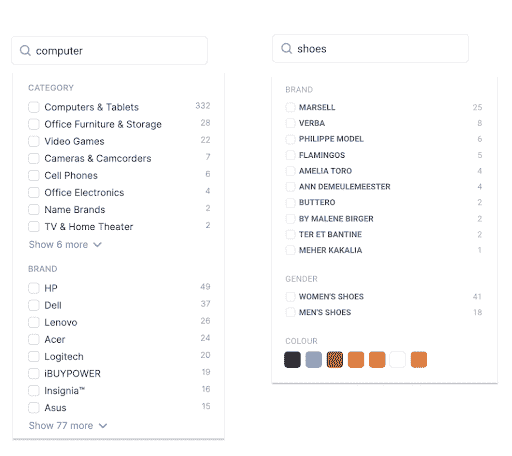
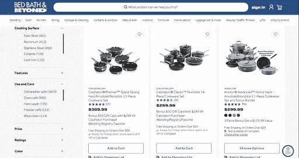
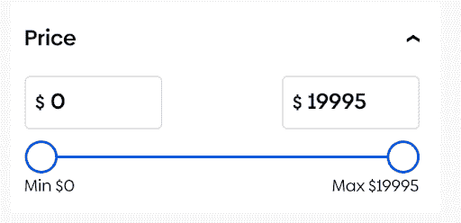
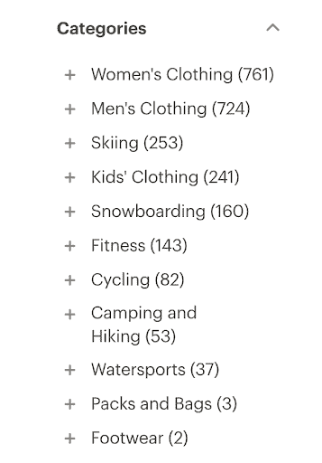
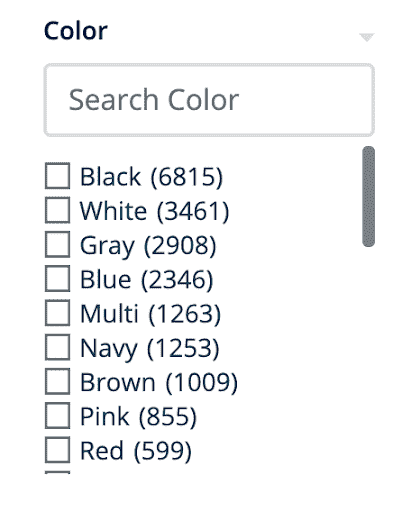
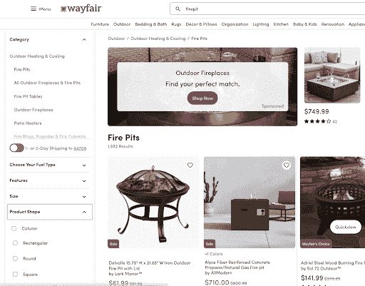
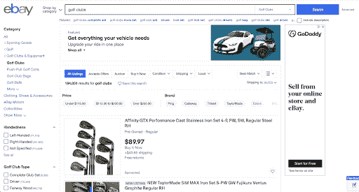
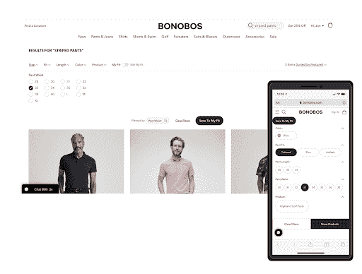
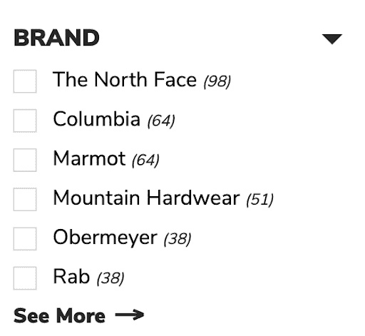
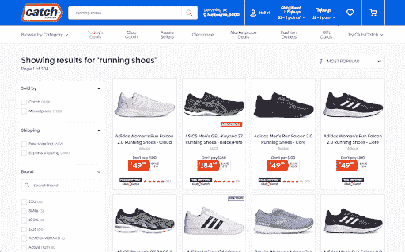

# 多方面影响您的网站转化率和客户满意度

> 原文：<https://www.algolia.com/blog/ux/faceted-search-an-overview/>

## 什么是刻面搜索？

Facets 也称为智能过滤器，是一种类型的 [搜索过滤器](https://www.algolia.com/blog/ux/filters-vs-facets-in-site-search/) ，客户使用它来快速缩小搜索结果的范围。方面可以是静态的(为每个查询设置)或动态的(它们可以根据搜索查询的上下文而改变)。

例如，“品牌”可能会出现在所有搜索中，但是搜索“计算机”和“鞋子”会返回非常不同的方面:鞋子可能包含性别结果集(男式或女式)，而计算机可能包含“内存”或“手机”的方面类别

Facets can change depending on the context of the search query.

这些方面能够影响您的整体站点转化率，并对客户认知和最终用户体验产生重大影响。

在这篇文章中，我们将带您了解什么时候使用过滤器或刻面进行 [站点搜索](https://www.algolia.com/blog/product/the-ultimate-guide-to-site-search/) ，您可以创建的刻面的类型，以及一些刻面导航的最佳实践。

## 什么时候使用刻面、滤镜、排序？

*过滤器**搜索* *刻面* 缩小到相关结果。 *排序* 帮助访问者按升序或降序重新组织结果。

An example of static and dynamic filters.

过滤器通常用于根据广泛定义的类别缩小结果范围。与方面不同，过滤器在搜索之间不会改变。例如，在服装店，主导航通常包括针对性别或诸如“服装、配饰、鞋子”等宽泛类别的过滤器。选择后，这些过滤器将应用于后续搜索的后台，以确保只显示所选性别的结果。

## 【‍what】搜索刻面的类型有哪些？

您可以从站点上的几乎任何属性创建一个方面。一些更受欢迎的方面包括:

*   类别
*   颜色
*   价格范围
*   尺寸
*   评级
*   年龄

让我们来看几个例子，看看它们是如何被格式化的。

### 类别

类别可以是任何东西。方面值通常可以使用站点的 URL 结构来生成。例如，您的站点可能有一个 URL 结构和类别层次结构，如:

*   索引>服装>礼服
*   指数>服装>鞋子
*   索引>珠宝>项链>吊坠
*   指数>珠宝>手镯>护身符

### 颜色

这个面列表不仅允许您按颜色过滤，还可以预览结果的数量。按颜色过滤在零售网站上非常有用，可以帮助客户根据颜色偏好缩小结果范围。如果在搜索索引中存储颜色元数据(属性),就可以创建面。

如果您没有现成的颜色数据，可以为您创建！我们已经使用 Google Vision API 在图像被索引时自动从图像中提取颜色和其他元数据，然后可以用来设计搜索过滤器和方面。现在，每当有新产品添加到网站时，API 都会自动提取颜色数据用于过滤器。

### 其他刻面类型

Product shape?!? There’s really no limit to the kinds of facets you can add to your site.

年龄、等级、大小、形状……你可以添加到一个网站的不同方面的类型真的没有限制。请记住，方面也可以采取多种形式——如复选框、选项卡、滑块、标签云等等。

## 分面搜索的最佳实践是什么？

Here’s an example of category filters (along the top) and using tags (along the right side) to filter results.

搜索方面可以大大提高网站的可用性和客户体验。有几个值得注意的设计技巧可以改善或损害刻面设计。

### 为客户设计

最好的经验是永远为你的顾客设计。它也适用于小平面。不仅仅是视觉效果，而是整个体验。

*   **刻面命名** :您可以创建刻面，按品牌、类别、性别等进行过滤。，但是你可以随便给它们取什么名字。你的受众和你的品牌更前卫还是更成熟？“品牌”可以被命名为“品牌”，或者“类别”可以被称为“流派”——这取决于你想如何为客户定位它。
*   **刻面数量** :太多的刻面可能会让买家不知所措；太少可能会令人沮丧。在你的系列中找到与观众需求完美匹配的平衡点。

Despite the trend to put different facets above results, two of the world’s largest online marketplaces, Amazon and eBay, have (mostly) kept facets along the left side of the page.

*   顶部或侧面:沿着搜索结果的左侧放置小平面是标准做法。将它们放在搜索结果之上是一种时尚。当然，这取决于你，但是花时间看看你喜欢访问或购物的网站，看看你喜欢或不喜欢这种体验是值得的。
*   另一件要记住的事情是，在列表顶部的方面将会得到最多的关注。根据尼尔森诺曼集团的研究，“作为一个很好的经验法则，考虑将最通用的高级过滤器类别放在列表的顶部，而将更具体的类别放在底部。”
*   测量结果 :你的滤镜和小平面被使用了吗？搜索和转化指标、热图和点击流数据可以帮助您衡量和优化搜索方面。

### 手机 vs 桌面设计

桌面和移动方面的设计和行为应该不同。在桌面上，当用户选择不同的过滤器时，结果可以立即刷新。然而，较小的屏幕尺寸和移动用户可用的较低带宽使得即时搜索不切实际，更不用说令人沮丧了。

一个网站在移动和桌面上的外观和行为应该是不同的。当用户在桌面上选择不同的过滤器时，结果可能会立即更新。由于较小的屏幕尺寸和较低的带宽，在移动设备上进行即时搜索是很困难的，更不用说令人恼火了。

对于移动用户来说，允许他们在提交和刷新搜索结果之前批量选择 facet 是更好的用户体验。

### 面包屑

用方面筛选结果后，搜索者可能想重新开始或尝试不同的选择。拥有某种面包屑跟踪和/或重置功能是一个智能用户界面元素。

### 在刻面内截断和搜索

有时，一个方面中的过滤选项太多，无法全部显示。您可能需要截断列表，如下所示。显然有更多的品牌可供选择，但在点击“查看更多”之前，它们是隐藏的。

Note that the subset selections are not in alphabetical order. This interface orders brands based on popularity — a smart user-centric and revenue-centric decision.

获得类似结果的另一种流行方法是在过滤器或方面中提供搜索。方面中的搜索框将被配置为在结果子集“跑鞋”中搜索品牌，如下例所示

It’s a search within a search! Catch.com.au includes a Brand search feature in the filter area to help visitors narrow results.

## 你的网站应该使用过滤器和分面搜索吗？

对于拥有大量内容的网站来说，过滤器和切面是特别有用的工具，否则很难一次浏览一部分内容。例如，许多新闻网站有成千上万的文章、博客、图片和评论，需要花费大量的时间来浏览。同样，许多电子商务和媒体网站有大量的内容，过滤器和分面搜索可以帮助用户导航。方面对于具有多种规格的产品或内容的目录也很有用，例如 B2B 产品目录。

由于刻面允许更复杂和更精细的搜索，当更广泛的过滤不足以快速帮助用户找到他们想要的内容时，应该使用刻面。而且，在搜索后体验中，[动态分面](https://www.algolia.com/blog/engineering/implementing-faceted-search-with-dynamic-faceting-with-code/)是强制性的，可以快速帮助用户提炼结果。

例如，如果你的网站只提供几十页内容，几个宽泛的过滤器就足够了。但是，如果您的目录跨越了许多过滤器，并且拥有成百上千的页面，那么 facets 将对您的用户有很大的帮助。用户需要同时搜索多个维度的方法，以确保他们可以轻松找到产品、内容和服务，并且不会对搜索过程感到失望。

## 补充阅读

方面和过滤器是任何搜索和发现平台最重要的功能之一，可以极大地影响你的转化率。它们可以决定好的和坏的搜索体验。

为了让搜索和发现体验发挥作用，搜索需要无缝且直观。这就是刻面的作用。了解使用 Algolia 设置分面搜索有多简单。注册一个[14 天免费试用](https://www.algolia.com/users/sign_up) 或 [安排一个时间](https://www.algolia.com/demorequest/) 与我们的搜索引擎专家交谈。