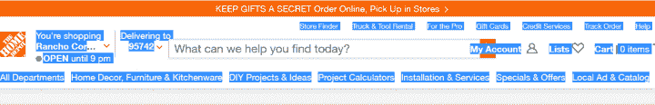
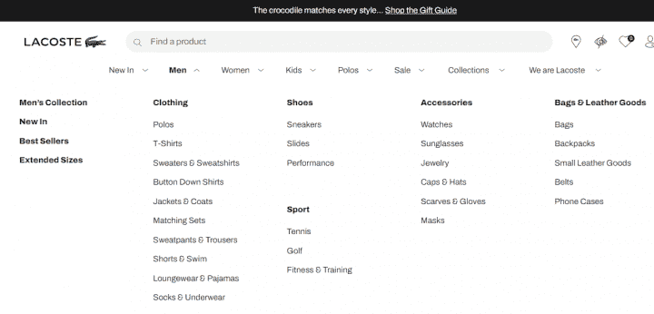
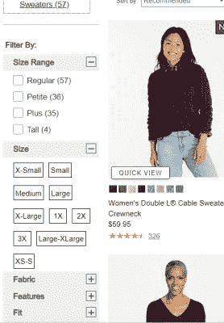
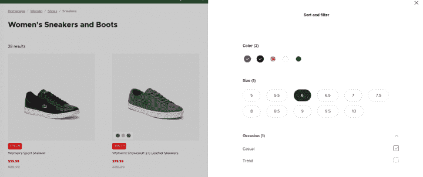
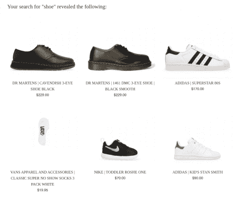
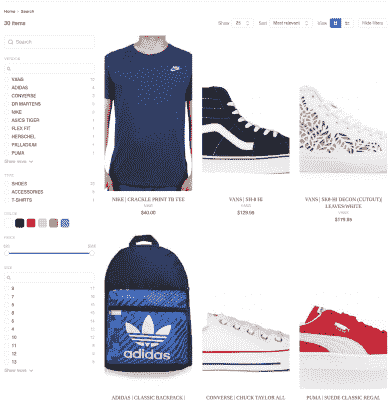
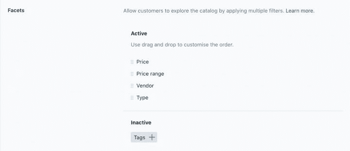
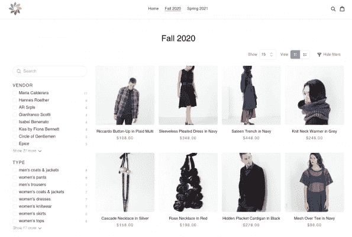

# 为什么 Shopify 过滤器和 Shopify 分面搜索还不够

> 原文：<https://www.algolia.com/blog/ux/filters-vs-facets-in-site-search/>

一个优秀的网站搜索工具不仅能帮助网站访问者使用搜索词找到他们想要的东西，还能帮助他们发现产品，交叉销售或追加销售他们以前从未考虑过的想法。但为了让这种搜索和发现体验发挥作用，产品搜索过程必须无缝、直观，无论购物者是使用移动设备还是坐在台式电脑前。

使用 Shopify 的在线零售商可以改善客户搜索体验和产品发现的一个重要方法是在其用户界面中利用过滤器和分面搜索。

应用过滤器和方面可以让购物者细化他们的查询，发现你网站上更多的商品。通过使人们能够快速缩小选择范围并找到他们正在寻找的产品描述，您可以改善用户体验并潜在地增加您的转化率。

## 过滤器和刻面:缩小搜索选择的两种方式

对于拥有大量内容的电子商务网站来说，过滤器和方面都是有用的工具，否则很难导航。购物者选择过滤器和方面来减少搜索(并进一步细化他们生成的结果)到一个子集。

通常认为过滤器和方面是可互换的概念。但是，虽然它们都可以帮助用户改进他们的查询并快速获得他们想要的结果，但它们在功能上并不完全相同。事实上，它们在站点搜索中的显示方式和使用方式有很大的不同。

让我们来看看每一种搜索优化方法，以及正确使用这些方法如何提高用户参与度，从而促进销售。

## 滤镜和刻面的区别

### 滤镜

在搜索中，收集过滤器会排除不符合用户所选标准的结果。主题过滤器是广泛的，通常是固定的类别，如产品类型(它们在用户的搜索中不会改变)，人们可以选择它来立即消除不相关的内容，并深入到可管理的数量的项目进行探索。

在电子商务中，过滤器通常是商店选择的高级产品系列。

因为产品过滤器的基础如此广泛，所以它通常是购物者在网站主页上看到的第一件东西。例如，购物者可以使用家得宝顶级过滤菜单上的过滤器，包括家居装饰、家具&厨具和 DIY 项目&创意:

一家销售服装的网上商店可以让购物者开始缩小服装类型的搜索范围，衬衫、裤子、鞋子和配饰都是可能的类别。当服装类型过滤器被应用时，比如说，只应用于衬衫，访问者会看到一个只显示衬衫的结果页面。

下面是 Lacoste 的高级店面过滤菜单的样子:

点击 Men 会显示服装、鞋子、配饰、包包&皮具和运动等过滤器，下面是较低级别的过滤器，如 t 恤过滤器。

较低级别的过滤选项也可以出现在搜索结果页面本身，因为一旦在搜索栏中输入搜索词，使用不同的方面来进一步指定它们的参数通常是快速将它们带到正确的产品详细信息页面的必要条件。

### 刻面

Facets 是在线购物者的主要工具，他们可以使用它来完善搜索结果，发现符合其特定购买需求的商品。分面搜索是一种以有针对性的方式聚焦于产品和搜索结果的方法，这在使用广泛的过滤器时是不可行或不可能的。

#### 刻面反映产品特性

搜索者可以使用刻面，也称为刻面过滤器，通过同时指定多个 特定特征(选择多个刻面)来细化搜索。这使得他们的产品选项更加精细，以确保他们能够快速准确地找到他们需要的东西——而不仅仅是大致了解产品，并对过于耗时的搜索过程感到沮丧。

与过滤器不同，刻面经常在类别内变化，以反映它们所用于的产品类型。例如，当搜索一条牛仔裤时，你可能会看到尺寸、剪裁、洗涤和价格范围等方面的类型。但是如果你在 Lacoste 网站上搜索太阳镜，你会看到不同的搜索建议，比如性别和颜色。

或者，举例来说，如果你在 L.L.Bean 网站上寻找一件女式毛衣，你会在侧边栏中看到尺寸范围(如小号)和该范围内的尺寸的复选框:  

以下是 facets 如何让顾客指定鞋子颜色(此处为蓝色和黑色)、尺码(6)和场合(休闲)。

总之，当谈到网站搜索时，过滤器和方面是引导潜在买家以最快的方式找到产品列表上最佳搜索结果的关键类型，确保了出色的购物体验和最大化收入的承诺。

以下是这两个搜索增强特性的主要区别:

| 过滤 | 面状 |
| 搜索工具自动从一个大的类别开始，排除所有其他类别 | 用户选择特定的属性进行搜索 |
| 涵盖广泛的属性(例如，服装类型) | 应用多个特定属性(例如，面料、颜色) |
| 有时在搜索过程中对用户可见 | 在搜索过程中始终对用户可见 |
| 不要随着查询和搜索结果的变化而变化 | 随着查询和搜索结果的变化而适当变化 |

## 

现在你知道了过滤器和方面是如何工作的，你认为这个功能会有助于改善你的电子商务搜索体验吗？

如果你的网站只提供几十个页面的内容，那么数量有限的、适用于所有 SKU 的宽泛过滤器可能就足够了。

如果你的目录跨越了许多过滤器和成百上千的产品页面，那么 facets 会有很大的不同。方面也非常适合用于列出多个产品规格的产品目录，例如，在 B2B 网站上。

## Shopify 默认搜索功能都是裸机

[Shopify](https://www.shopify.com/)搜索优惠什么？

简而言之，Shopify 已经将高级搜索选项推迟到其庞大的应用生态系统中。其开箱即用的搜索体验很初级，仅通过 [集合](https://help.shopify.com/en/manual/products/collections) 和 [标签](https://help.shopify.com/en/manual/shopify-admin/productivity-tools/using-tags) 提供过滤可用性的基本支持。它默认返回基于搜索查询的精确结果。

例如，这里有一个查询“鞋”的默认 Shopify 商店搜索结果页面:

如你所见，结果过于简单:不支持过滤或刻面。你也得不到一些高级功能，如打字错误容忍、基于意图的查询和内嵌建议，而这些正是许多在线购物者现在完全期待的。

归结起来就是:为了创造无缝的用户搜索体验并提高您的 Shopify 转化率，您需要一个搜索解决方案，为您的业务用例提供正确的过滤和分面。通过 Algolia，一个新成立的 [Shopify 加上认证合作伙伴](https://www.algolia.com/blog/algolia/increased-revenue-for-merchants-algolia-is-now-a-shopify-plus-certified-partner/) ，您可以大大改善您的搜索和导航。

这里有一个 Algolia 增强的“鞋子”搜索页面:

如您所见，已经根据商店的产品数据在左侧空白处生成了相关的过滤器和方面。供应商和类型是过滤器，而在它们下面，颜色、价格和大小作为面出现。

Shopify 和 Algolia 的集成意味着您可以跳过创建和维护结构来实现多面导航。

这些集成功能的一个例子是根据您商店的产品颜色属性数据生成颜色样本。

最初，您可能想要检查和配置搜索栏中的可用过滤器。需要加滤镜吗？如果适用，您可以添加一个颜色过滤器，并将其与其他属性一起按正确的顺序放置: 此外，作为商店所有者或支持团队成员，您可以访问一个搜索界面构建器，该构建器只需在 Shopify 网站上做很少或不需要编程更改。您可以基于某些查询设置 [ 自定义过滤器 ](https://www.algolia.com/doc/guides/managing-results/rules/detecting-intent/how-to/applying-a-custom-filter-for-a-specific-query/) (例如，通过计算人们可以作为搜索词输入的同义词)。

做出更改后，您可以在商店收藏页面上看到导航界面的外观，例如:

## 下一步用滤镜和刻面

准备好 [打造稳健的搜索体验](https://www.algolia.com/search-solutions/shopify/) 和 [提高你的 Shopify 转化率](https://www.algolia.com/blog/ecommerce/improve-shopify-conversions-with-search/) ？

为了打造从第一次接触搜索框到结账的无缝购物者搜索体验，你需要一款能够提供过滤和分类工具的搜索应用，这些工具非常适合你的商业案例。

Algolia 在此帮助您进行 Shopify 搜索&探索。通过使用我们强大的基于 API 的产品，超过 1，500 家 Shopify 商家已经创建了引人注目的搜索和发现体验，看到了搜索使用率的增加，并提高了他们的转化率和收入。

当您将 Algolia 连接到您的 Shopify 商店时，您也可以快速设置专业搜索过滤器和方面来优化您的电子商务网站搜索引擎功能，通过智能搜索功能增强您的客户体验。

开始研究你用滤镜和刻面的可能性。 [联系我们](https://www.algolia.com/contactus/) 进行个性化演示。

或者继续操作 [开始修改](https://www.algolia.com/doc/integration/shopify/getting-started/quick-start/?client=ruby) 你的过滤器和刻面

1.  进入 [Shopify 应用商店](https://apps.shopify.com/) 。
2.  搜索并选择 [Algolia 搜索和发现](https://apps.shopify.com/algolia-search?search_id=c7003b6a-0673-4f01-adc8-16ca746ceaae&surface_detail=algolia&surface_inter_position=1&surface_intra_position=4&surface_type=search) app。
3.  点击 **添加 app。**
4.  登录。
5.  在您的 Shopify admin 中，点击 **安装 app。** 在设置过程中，Algolia 会将您的产品和元数据编入索引，以创建相关的模式、方面、过滤器和管道。
6.  使用该应用程序创建项目集合并自定义过滤器。

### 了解更多信息

[常见问题:Algolia 与 Shopify](https://www.algolia.com/doc/integration/shopify/troubleshooting/faq/?client=ruby)