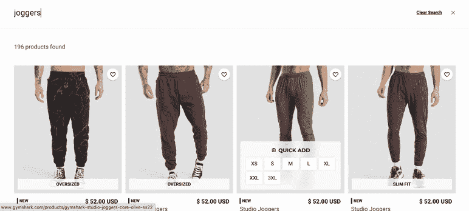
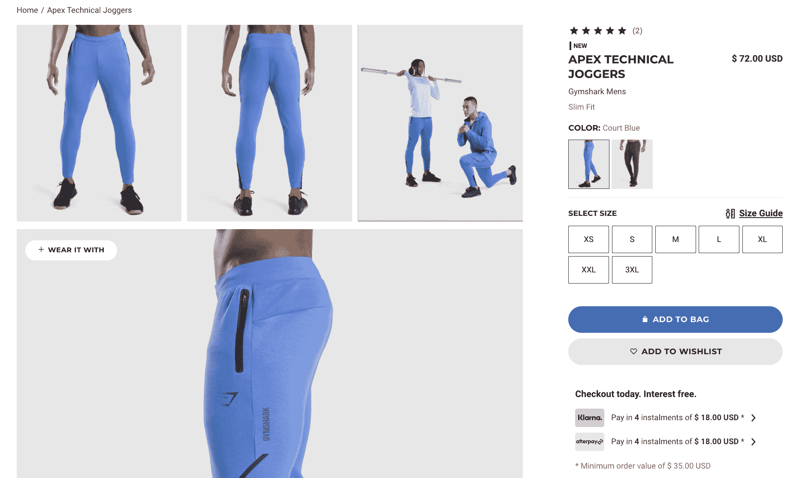
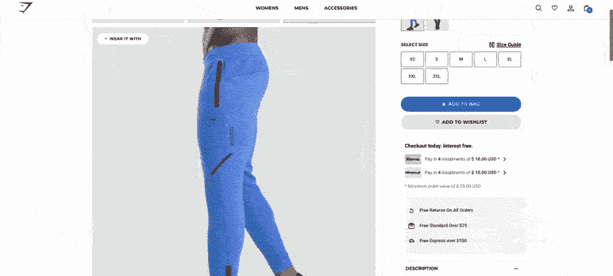
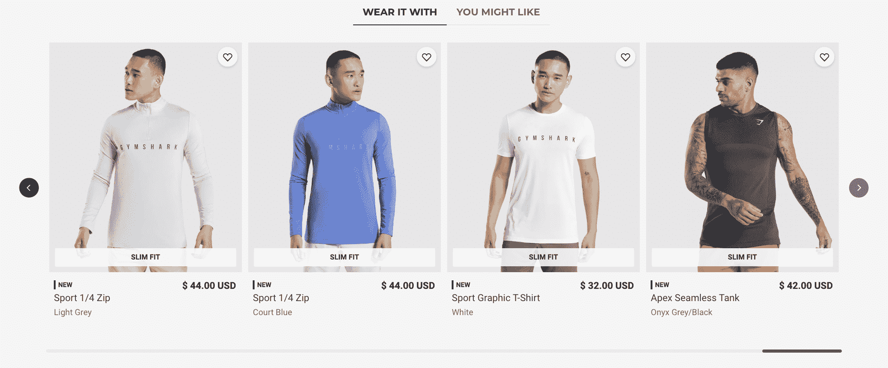
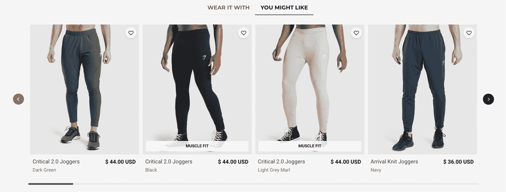

# 用推荐和搜索框定消费者的在线零售之旅

> 原文：<https://www.algolia.com/blog/product/from-search-to-recommendations-framing-your-customers-online-retail-journey/>

对于今天的零售消费者来说，搜索不仅仅是输入查询。它是关于点击产品，过滤类别，浏览多个产品视图，生动的布局，促销品和客户评论。

现在，也是关于推荐的问题。网上零售商已经了解到推荐 *相关、* 而不仅仅是 *相关* 产品的重要性。他们了解到，提供查询范围之外的相关产品仍然符合消费者的购买意图。

然而，要想推荐成功，它们必须是 *有意义的*——这只能来自基于模型的机器学习推荐系统。幸运的是，零售商不需要知道如何自己构建这些模型。模型和机器学习应该成为搜索引擎的标准。

### **入门**

除了收集和分析正确的分析数据，并知道如何以最有效的方式展示建议，零售商应该不需要做太多工作来实施建议。

开始使用建议时，需要考虑四个因素:

1.  **旅途。** 每一次网上零售之旅都应该包括推荐产品。
2.  **时机。** 建议应该出现在 *恰好* 合适的时刻。
3.  **建议的质量。** 机器学习推荐系统通过以下方式建立其模型:
    *   收集用户行为事件，如点击和转化(添加到购物车，购买)，以了解个人并汇总客户的口味
    *   使用产品类别建立基于过滤器的关系

然后呢？

4.  **实现。** 既然推荐是现成的，零售商只有两个任务:
    *   通过分析收集数据，使用捕捉消费者活动的单行代码片段。这和实现 Google Analytics 是一样的。
    *   构建显示建议的 web 和移动界面。

## 旅程——从搜索到销售再到推荐

如前所述，我们对搜索栏的期望很高。更准确地说，我们希望 [速度](https://support.algolia.com/hc/en-us/articles/4406975267089-How-fast-is-Algolia-)——搜索结果需要即时出现，最好是在我们键入时出现。并且我们希望 [相关](https://www.algolia.com/blog/product/what-is-search-relevance-in-the-era-of-browsing-discovery-and-recommendations/)——结果需要准确无误。

但是像 Spotify、Airbnb 和亚马逊这样的在线企业并没有止步于此。他们将搜索栏改造成了一个全面的浏览、内容管理和销售体验，巧妙地命名为*searchandising*。 [搜索和使用](https://www.algolia.com/blog/ux/what-is-searchandising/) 集合了大量组件，如方面、类别页面、多个产品视图、传送带、横幅等等，所有这些都为消费者增加了屏幕上的选项。

然而，在当今爆炸性的数字经济中，即使这样也是不够的。领先的在线零售商已经(机器)学会了如何融入一个强大的新维度——*推荐* 。 [推荐](https://www.algolia.com/blog/product/introducing-algolia-recommend-the-next-best-way-for-developers-to-increase-revenue/) 允许网上商家向其用户、订户和购物者展示 *补充* 和 *提炼* 他们当前选择的产品。一个 *推荐引擎* 是一个详尽、有益的搜索和发现体验的最后一笔。

没有回头路可走——任何有竞争力的在线搜索和发现平台现在都必须具备搜索和推荐的能力。我们在这里的重点是推荐。

## 推荐添加 *相关* 项到 *相关* 结果

推荐系统不仅仅是搜索的附加功能。这是对 *搜索相关性* 的自然扩展，变成了更为健壮意义上的。当人们在网上搜索和互动时，很自然地会向他们提供所有相关的信息，包括免费赠送的内容，尽管这些内容并不总是与他们的查询相匹配，但却与他们的购买意图有着深刻而有意义的联系。

有意义的推荐，当无缝呈现给消费者时，不仅以意想不到的方式增加收入，还能极大地影响购物者的购买选择。消费者希望有更多的选择，因此在他们搜索的时候，很乐意以一种深思熟虑的方式被引导到那些选项。

## 建议行动！

[Gymshark](https://www.gymshark.com/)[无缝转换](https://resources.algolia.com/customer-stories/casestudy-gymshark-retail-2) 一个 *引人入胜的搜索体验* 变成一个 *完整的发现体验* 带推荐。它以一个查询开始。在下面的 GIF 中，搜索结果随着用户输入查询而变化。那永远是第一准则， *速度* 。第二个标准是 *相关性* ，用户可以通过查看易于阅读的结果、图片、标题和价格以及流线型的屏幕布局来轻松确认。

下一步是让消费者选择一个或多个项目进行查看。在这种情况下，消费者点击蓝色推杆:

产品视图页面的设计鼓励消费者滚动，在那里他们可以看到更多的照片、视频和顾客评论。底部是建议。

请注意，Gymshark 已经考虑周到地将建议添加到这些页面的底部，以避免分散用户查看产品的注意力。毕竟，产品页面的目标是让消费者转化，而不仅仅是继续购物。然而，也许这不是消费者想要的产品。此时，他们可以使用搜索栏或后退按钮，或者选择推荐的项目。

消费者在页面底部看到两组推荐:

*   “搭配使用”，显示用户可以搭配慢跑者购买的产品。在这种情况下，不同种类的衬衫-t 恤，背心，运动衫:

*   “您可能喜欢”，显示用户可能喜欢的项目，因为他们正在查看该项目。在这种情况下，其他类型的慢跑者。

回忆:

*   时机很重要:当用户还没有决定的时候，推荐慢跑者是有意义的。
*   不一定非得是慢跑者。它可以是任何项目。每个企业选择自己的推荐模型。例如，如果用户决定购买慢跑者，下一组推荐可以基于“人们(像你一样)也购买了什么样的物品”。

在深入了解这一切的工作原理之前，让我们总结一下这段旅程:

*   查询的速度和相关性将消费者导向一个满是慢跑裤的屏幕
*   产品视图页面为消费者提供了关于慢跑裤的全面而生动的信息，不受商品或推荐的干扰
*   推荐会适时出现，仅在用户查看慢跑者后显示补充但仍然相关的产品

## 工作原理

为什么推荐效果这么好？有几种方法可以用来生成推荐:

### **利用基于事件的分析收集用户行为(一种"** **基于用户的协同过滤"** **模型)**

最强大的推荐来自用户喜好。了解用户偏好有助于推荐系统将客户划分为不同的类别，从而为每个用户提供个性化的推荐。

消费者以几种方式表明他们的偏好，例如，通过点击搜索结果中的特定商品，将商品添加到购物车，当然，还包括购买商品。当系统收集这些偏好时，它开始辨别相关模式，例如，某些用户一起查看和购买哪些产品。简档来自于这些不同偏好信号的组合(点击、查看、转换)。

捕捉大量的点击、观看和转化活动可以帮助推荐器机器创建清晰定义的群组。例如，极限运动爱好者执行显著不同的活动(点击、转化等。)来自骑自行车的人。

之所以称之为 [基于用户的协同过滤](https://www.algolia.com/blog/ai/the-anatomy-of-high-performance-recommender-systems-part-iv/#user-based-collaborative-filtering) ，是因为将之前的用户行为进行聚合，“协同”形成面向未来用户的简档。我们的期望是，下一个客户将会看到基于与他们采取的行动一致的简档的建议。

### **对产品进行分类(一种“基于内容的过滤”模式** ***)***

标准的基于搜索的功能是过滤，用户点击类别和方面来过滤他们的搜索结果。例如，如果 Gymshark 客户只想查看蓝色慢跑者，他们可以通过“颜色=蓝色”和“类型=慢跑者”来过滤结果。或者他们可以根据价格或品牌进行过滤。

过滤器也可用于生成建议。推荐以类似的方式利用过滤器，通过创建一个相关产品和类别的网络。例如，“type=joggers”可以设置为与“type=sport t 恤”相关。

这叫做 [基于内容的过滤](https://www.algolia.com/blog/ai/the-anatomy-of-high-performance-recommender-systems-part-iv/#content-based-recommendations-models) ，因为模型使用*内容*，而不是用户行为，来确定推荐。

### **杂交**

值得一提的是，大多数系统结合了基于行为和基于内容的模型，以提供更有针对性、更可靠的推荐。

### **使用手动覆盖(“规则”)将商品推销插入他们的推荐中**

随着机器学习，通过收集越来越多的数据，企业可能也希望对推荐有所控制。他们通常用在特定条件下推送特定产品的 [规则](https://www.algolia.com/doc/guides/algolia-recommend/how-to/rules/) 来做到这一点。下面是一些用例，手动覆盖自动推荐可能是有意义的:

*   确保相关产品包括与查看产品属于同一类别的产品
*   排除特定产品或缺货产品
*   通过将特定产品(如新推出的产品)固定在第一个位置来推荐该产品

## 现在就开始吧

有了 Algolia 的托管搜索和推荐 API，像 Gymshark 这样的公司就可以为他们的用户提供完整的搜索&发现之旅，这完全是他们的业务所独有的。Gymshark 选择添加“你可能会喜欢”和“搭配穿着”的建议，但其他公司可以提出适合他们的公式。你会想出什么？