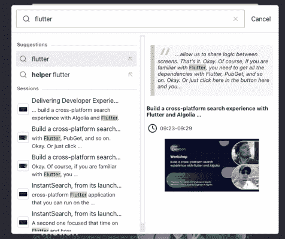

# 使用 Whisper-Algolia Blog | Algolia Blog 为您的 YouTube 内容生成转录索引

> 原文：<https://www.algolia.com/blog/engineering/generate-a-transcription-index-for-youtube-using-whisper/>

我们 2022 年 Algolia 开发者大会的主题是“索引世界，让您的数据动起来”，所以很自然地，当最后一个视频上传到 YouTube 时，话题就转向了我们如何为我们的客户让所有这些伟大的新内容动起来。

我知道我希望这些视频可以通过标题和描述进行搜索，并且可以通过类别进行搜索，但是我还想做得更多。我希望能够帮助开发者在视频中找到与他们的搜索相匹配的确切位置。这意味着将视频的抄本编入索引。我们过去曾尝试过使用 YouTube 的字幕功能来实现这一点，结果是混合的。对我们来说幸运的是，几乎在同一时间，OpenAI 的团队发布了一种新的神经网络，称为[耳语](https://openai.com/blog/whisper/)，用于自动语音识别。

在这篇文章的其余部分，我将描述我用来构建 A/VSearch CLI 的工具链，这是一个集成的命令行，用于从 YouTube 频道或播放列表生成和索引脚本。

您可以在我们的演示网站[查看结果，点击这里](https://avsearch.vercel.app/)！

## [](#machine-learning-whisper)机器学习——耳语

如上所述， [OpenAI](https://openai.com) 最近发布了 [Whisper](https://github.com/openai/whisper) 这是一款通用的语音识别模型。它可以识别许多不同的语言，甚至有能力在它们之间进行翻译。由于它是在 Python 中自然公开的，所以它是与 Algolia 的 Python API 客户端合作的最佳人选。总的来说，我对转录质量印象深刻。即使使用`medium`模型，减去一些具体的技术名称，它转录视频没有一个错误。

我个人希望 Whisper 拥有的一个大功能是[扬声器二进制化](https://en.wikipedia.org/wiki/Speaker_diarisation)，该模型在整个录音中识别不同的扬声器，并确定那个人何时说话。现在，您必须手动清理并分配段给一个扬声器。可以将 Whisper 与另一个工具结合使用，比如 [PyAnnote](https://github.com/pyannote/pyannote-audio) 来实现这一点，我希望在未来将它作为一个特性添加进来。我还认为，在同一音频文件中使用多种语言时，Whisper 有一定的局限性，但随着时间的推移，这种局限性会得到改善。

由于 Whisper 提供的片段有时非常短，因此很难确定片段的真实上下文。因此，我们添加了一个包含前一段和后一段的`context`字段。通过这种方式，可以清楚地了解特定片段中正在讨论的内容，从而提高找到特定剪辑的成功率。

## [](#how-i-built-it)我是怎么造出来的

因为 Whisper 需要一个音频文件来运行转录，所以我需要一个方法来获取 YouTube 视频并将其转换为音频文件。 [YouTube-DL](https://github.com/ytdl-org/youtube-dl) 是我的选择，因为它在 Python 中得到很好的支持，我可以让它只下载视频的音频，这样我就不必在转录之前转换任何下载。由于一些用户想从命令行使用该程序，我添加了 [Click](https://click.palletsprojects.com/en/8.1.x) 库来支持 CLI 界面。

有时有些单词(或公司名称)是 Whisper 无法检测到的，所以我创建了它，以便您可以提供模式来执行搜索/替换逻辑。我的同事 Chuck 想出了一个好主意，也添加了一个分类功能，您可以在转录过程中为 A/VSearch 提供关键字，并自动应用预定义的类别。要使用这些特性，您只需传递一个 JSON 文件，其中包含定义的模式，A/VSearch 将在这个过程中解析并使用它们。

## [](#how-to-use-it)怎么用

使用 A/VSearch 非常简单，你可以从 GitHub 下载一个版本并安装，或者只需使用`pip`通过 GitHub URL 安装，它将加载最新版本。由于它有一个功能齐全的 CLI，您可以只导出您的 Algolia 凭据作为环境变量，并开始行动！CLI 接受播放列表、频道和单个视频的 URL，并将文字记录写入您提供的 Algolia 索引名称。

Whisper 的转录速度可以通过访问 GPU 来加快。使用 NVIDIA Tesla T4 GPU 转录一个三分钟的视频需要 25 秒，而在 32-vCPU 虚拟机上相同的视频需要 45 秒。这种增加对于较长的视频特别有帮助，因为它可能需要一小部分时间来处理。

```
# Create and activate a virtualenv
python3 -m venv av-search-test && cd av-search-test
source bin/activate

# Install via Pip or grab a release from GitHub
python3 -m pip install git+https://github.com/algolia-samples/avsearch

export ALGOLIA_APP_ID=AAAAA12345
export ALGOLIA_INDEX_NAME=transcriptions
export ALGOLIA_API_KEY=6c4dba625a960b4cc54b7b5312f9117d

# Transcribe a video, playlist, channel, etc.
av-search --targets "https://www.youtube.com/watch?v=epSVL87_sqA" 
```

关于高级用法的更多信息可以在 GitHub [资源库](https://github.com/algolia-samples/avsearch)中找到。

## [](#how-to-automate-it)如何实现自动化

自动化 A/VSearch 的最佳方式是将其集成到 Python 应用程序中。这样，您可以优雅地处理任何错误，并轻松地集成任何其他可能需要的解决方案(例如事件通知)。)

```
from avsearch import AVSearch
import os

avs = AVSearch(app_id='AAAAA12345', api_key=os.environ.get('ALGOLIA_API_KEY'), ...)
result = avs.transcribe([
    "https://www.youtube.com/watch?v=qSBm7d3McRI"
])

print(result)
# [
#    {
#      "objectID": "zOz-Sk4K-64-0",
#      "videoID": "zOz-Sk4K-64",
#      "videoTitle": "Welcome to Algolia DevCon! Keynote and product demos",
#      "videoDescription": "...",
#      "url": "https://youtu.be/zOz-Sk4K-64?t=0",
#      "thumbnail": "https://i.ytimg.com/...",
#      "text": "Hi everyone and welcome to DevCon 2022.",
#      "start": 0,
#      "end": 12,
#      "categories": [],
#      "context": {
#        "before": {
#          "start": 0,
#          "text": ""
#        },
#        "after": {
#          "start": 12,
#          "text": "I'm thrilled to be here with you today at Algolia's first ever developer conference"
#        }
#      }
#    },
#    ...
# ] 
```

## [](#configuration)配置

一旦索引中有了一些数据，就应该调整一些设置来提供最佳的搜索体验。我们可以通过 Algolia 仪表盘或我个人最喜欢的 Algolia CLI 来实现这一点！我们准备了一个配置文件，您可以直接上传到您新创建的索引中，以获得开箱即用的最佳设置:

```
# Download the settings file from the repository or fetch it manually
wget https://github.com/algolia-samples/avsearch/blob/main/examples/settings.json.example

# Transcription index name
export MY_INDEX_NAME=''

# Overwrite index settings
algolia settings settings set $MY_INDEX_NAME -F settings.json.example 
```

如果您不熟悉我们的 CLI，您可以在这里找到更多相关信息[。如果仪表板更适合您，您还可以通过导航到您的索引，单击“管理索引”，然后选择“导入配置”来上传](https://www.algolia.com/developers/algolia-cli/)[配置](https://github.com/algolia-samples/avsearch/blob/main/examples/settings.json.example)。

## [](#building-a-frontend)建筑前端

我构建了一个自动完成搜索体验(包括 cmd-K 绑定)来简化与现有的 [Algolia 开发者大会主页](https://algolia.com/devcon)的整合。让搜索界面成为模态界面让我可以提供一个丰富的带有预览和缩略图空间的 UX，而不需要重新设计整个主页。Algolia 的 AutcompleteJS 库非常适合构建这种类型的自动完成体验。我使用我们自己的[文档搜索](https://www.algolia.com/blog/ux/replicating-the-algolia-documentation-search-with-autocomplete/)作为灵感的模型。大预览窗格为用户提供了视频脚本的更多背景信息，帮助他们找到合适的剪辑。



我研究了 AutocompleteJS 的插件架构，包括用于查询建议和点击事件的官方插件。我还创建了一个自定义插件，将选定的视频加载到同一网页上的嵌入式 iFrame 中(`createLoadVideoPlugin`)。

你可以在代码回购的`examples`目录中看到这个例子前端或者尝试一下[现场演示](https://avsearch.vercel.app)。

## [](#wrap-up)总结起来

如果您对 A/VSearch 有任何问题，如它如何工作、实施问题或功能要求，请随时在我们的[论坛](https://discourse.algolia.com/)上留言！我们的团队很乐意听取您对/VSearch 的意见，或者您可能有任何其他与 Algolia 相关的问题。

想开始抄写自己的内容吗？前往 [GitHub 库](https://github.com/algolia-samples/avsearch)获取最新版本！

[](https://www.algolia.com/developers/code-exchange/showcase/generate-a-transcript-index-for-your-youtube-content-using-whisper/ "Algolia Code Exchange")

* * *

*我们希望您喜欢对 A/VSearch 的深入了解，以及我们如何使用它来增强 DevCon 会话搜索功能。如果你是 Algolia 的新手，你可以注册一个[免费等级账户](https://www.algolia.com/users/sign_up?utm_source=blog&utm_medium=main-blog&utm_campaign=devrel&utm_id=blog-avsearch)来试试我们。*