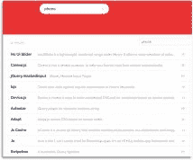
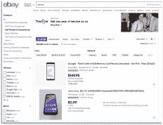
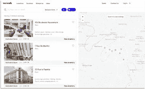

# 谷歌核心网站和搜索引擎优化搜索栏优化

> 原文：<https://www.algolia.com/blog/ux/google-core-web-vitals-seo-rankings-search-bar-optimization/>

谷歌的搜索引擎优化和核心网络活力并不依赖秘密。正如我们多年来所了解的那样，好的 SEO 是关于 *影响* 谷歌，把它的有机流量送到你的网站。

但是引起谷歌的注意只是第一步。 下一步是问问题:

> *你希望自己网站上的哪些页面出现在谷歌的搜索结果中？*

我们提出以下答案:

> 通过谷歌找到你的网站的客户应该登陆一个包含他们在谷歌搜索的确切项目的页面。因此，对许多在线公司来说，最好的登陆页面会显示一个搜索栏，其中包含谷歌的查询，以及一个只提供你的产品的相关结果列表。

这篇文章给出了 **5 条 SEO 建议**关于如何创造最有利于 SEO 的搜索体验——从你的搜索结果页面的内容到你的底层搜索技术。在我们将全部注意力转向搜索引擎优化最具技术性的部分**谷歌核心网站生命指标**之前，我们一路揭开了一些秘密。

## 什么是 Google 核心 Web 生命体征？

谷歌核心网站要害 关心你的内部搜索引擎的[质量。最重要的是，他们检查你的网站运行的速度以及使用和导航的容易程度。随着对谷歌核心网站重要指标审查的增加，你的搜索引擎优化策略必须包括建立一个高质量的搜索解决方案。](https://web.dev/vitals/)

本文中的 5 条建议旨在解决这些问题并改善您的搜索 UX，从而确保从单个 Google 查询到您自己的搜索栏中的多个查询的成功切换。

## 1。让谷歌的搜索引擎优化找到你公司的网站搜索功能

当客户使用您的内部搜索栏进行查询时，他们的结果会出现在您的 **站点搜索的结果页面上。** 我们将这个搜索页面称为 [**站点 SERP**](https://en.wikipedia.org/wiki/Search_engine_results_page) **。**

为了理解一个站点 SERP 的重要性(在谷歌搜索引擎优化的背景下)，让我们来分解两种最常见的网络搜索方式:

区别归结起来就是:你的搜索栏让用户直接搜索 *你的* 目录，而谷歌搜索 *大家的* 公开可用目录。

诚然，这种区别在维基百科等热门网站上可能会变得模糊(大多数人使用谷歌的搜索栏而不是维基百科的搜索栏来搜索维基百科的文章)。IMDb 和 WebMD 也是如此。

但是在电子商务中，互联网搜索和网站搜索的区别是很明显的。在线公司需要利用 T42 互联网和网站搜索引擎的优势。人们经常从谷歌开始货比三家，比较不同网站的产品。电子商务面临的挑战是吸引这些客户，鼓励他们留下来使用自己的搜索栏，也就是说，只浏览他们的目录。

因此，在线零售商需要知道如何抓住谷歌的搜索引擎优化注意力，这样他们的产品就能始终如一地出现在谷歌的第一个结果页面上。他们还需要知道如何鼓励来访客户使用他们自己的搜索栏，而不是回到谷歌的搜索栏。

你怎么能这样做？通过建立一个网站搜索体验，满足您的用户需求，以及搜索引擎优化和谷歌核心网站的生命标准。在下一节中，我们将讨论如何做到这一点。

## 2。使用 SEO 关键字和良好的内容结构来吸引谷歌的注意

用户在使用你网站的搜索栏时，不应该被强迫阅读太多的文本。他们需要相关的单词和短语来吸引他们。当吸引谷歌的注意力时，情况是相似的:成功地使用 SEO 依赖于你在网页上包含的单词和短语。

### **SEO 关键词**

谷歌的搜索引擎优化技术基于这样一种可能性，即当人们查询相同的产品时，他们会输入相同的术语。这些常用术语称为 *关键词。* 好的 SEO 要求你在网页上添加“SEO 关键词”。例如，如果您有一个提供 iphone 的网页，您会想要包括相关的关键字和短语，如“苹果”、“智能手机”和“iphone 应用程序”。

关键词帮助谷歌将你的网页与常用于搜索你的产品的词汇相匹配。他们也帮助谷歌理解你的内容的意义和质量。

然而，创建有效的 SEO 并不仅仅是添加关键词那么简单。需要仔细分析 *要包含哪些* 关键词，以及放置的位置和频率。 [谷歌偏爱在关键词用法](https://moz.com/learn/seo/what-are-keywords) 和扎实、翔实的内容之间取得良好的平衡。谷歌的技术可以很容易地检测出 [关键词填充](https://www.singlegrain.com/seo/quality-over-quantity-the-balance-of-keyword-usage/) ，并对试图欺骗其 SEO 算法的你进行处罚。

### **在你的搜索结果中使用关键词和好的结构**

通常，产品目录包含描述公司产品的最准确的词语。但是，您的搜索结果不需要显示您在目录中包含的每个词，只需要显示最重要的词:帮助用户立即理解每个产品的关键词和短语。如果人们需要更多的细节，他们总是可以点击一个项目；但搜索结果页面的目标是让浏览变得容易，并迅速激发转化。

结构也起作用:

*   你想让你的关键词和短语从页面上的其他元素中脱颖而出
*   对于谷歌来说，这更具有技术性:你希望你的底层代码使用最新的语义 HTML 标签

### **决定哪些词是关键词**

在决定使用哪些词时，根据你所在的行业和用户的语言，找出最能描述你的产品的词是很重要的。确认那些词与 [关键词工具](https://moz.com/beginners-guide-to-seo/keyword-research) 中推荐的关键词相同也很重要比如[clear scope](https://www.clearscope.io/guides/keyword-research)和[Ahrefs](https://ahrefs.com/blog/keyword-research/)。

## 3。让谷歌抓取你公司的网站搜索结果页面

吸引谷歌流量始于让它的谷歌机器人程序 [【抓取】(抓取)并索引](https://moz.com/beginners-guide-to-seo/how-search-engines-operate) 你的网站:本质上，找到你的网页以及它们链接到的网页，并对这些信息进行分类。

虽然这个过程通常是自动的——一旦你创建或更新了你的网站，谷歌就会抓取它——优化你的网站 SERP SEO 需要一些额外的工作。

### **抓取你的静态站点 SERPs**

站点 SERPs 是动态的；它们随着每个查询而改变。不幸的是，谷歌很大程度上忽略了动态内容。它的抓取过程不会在一家公司的网站上执行搜索；它只抓取固定内容(“静态”)的网页。因此，如果你的公司不做一些特别的事情，谷歌永远不会找到你的网站。

解决方案是使用一个名为 [页面渲染](https://developers.google.com/search/docs/guides/dynamic-rendering) 的自动化过程，它创建了 Google 可以抓取并最终搜索的静态站点 SERPs。您的公司运行一个后台进程，该进程执行一组搜索并将每个搜索结果保存在一个单独的网页上，并带有唯一的 URL。这使得谷歌能够抓取和搜索这些人工生成的页面。例如，一家公司的服务器可以自动执行查询“iphone ”,并生成一个包含搜索结果的静态页面。该网址可能是类似 www.yourbusiness.com/smartphones/iphone.的东西

### **策划你的网站 SERPs**

鉴于人们可以在搜索栏中输入大量可能的查询，公司需要选择他们希望谷歌抓取的内容。 他们应该只选择[重要查询](https://www.oncrawl.com/technical-seo/seo-internal-search-results/) 的子集。

这里有两个最重要的站点 serp:

*   网站的 [登陆页面](https://neilpatel.com/blog/landing-pages-are-overrated/) (通常是他们的主页)，访问者在这里可以立即看到公司正在提供什么，比如亚马逊上的消费品或者网飞上的电影。登录页面是所有用户查询的启动平台。

*   专为一个受欢迎的项目或特定类别的项目设计的网页。例如，像亚马逊这样的在线市场有 [类别页面](https://www.algolia.com/doc/guides/solutions/ecommerce/browse/tutorials/category-pages/) 包含了所有类别的 iPhones。它们还可能有每个 iPhone 版本的子页面，有内存和颜色选择以及相关的配件。

登陆和分类页面都使用你的内部网站搜索引擎来展示你公司的产品。有时搜索是通过用户在搜索栏中的查询来执行的。其他时候它发生在幕后，由站点执行一个 [空搜索](https://css-tricks.com/users-leave-search-box-empty/) ，以便向搜索者显示一组[一般的项目或项目类别](https://www.algolia.com/doc/guides/building-search-ui/resources/ui-kit/js/)。

还有一组你想让谷歌抓取的页面:热门关键词、方面和产品的顶级搜索结果。您应该只对一小部分最重要的搜索进行这样的操作。你不想用成千上万的搜索页面淹没谷歌，因为它的算法会为此惩罚你。

在所有情况下，你都会生成一个 [的谷歌友好网址](https://www.algolia.com/doc/guides/building-search-ui/going-further/routing-urls/angular/#seo-friendly-urls) 。例如，特定 iPhone 版本的 URL 可能类似于“www . your business . com/smart phones/iPhone-x”；对于分类页面，“www . your business . com your business/brands/apple”。

最后一点:关于流程，您需要以与目录一致的频率运行后端页面渲染流程。如果您的数据经常变化，您应该一天运行几次这个过程。然而，对大多数企业来说，每晚一次就可以了。

## 4。谷歌核心网络命脉:建立一流的网站搜索 UX

正如我们已经讨论过的，好的 SEO 排名包括产生结构良好、有意义的内容，并使用元数据，如 SEO 友好的关键字、标题和页面描述。它还包括避免“黑暗”的搜索引擎优化技巧，谷歌将检测和惩罚。

在核心网络要素中，谷歌加入了一个额外的因素:网站技术的质量。 核心 Web Vitals 要求站点 serp[快速易用](https://backlinko.com/hub/seo/core-web-vitals) ，这都是关于使用一流的技术和创造良好的用户体验(**【UX】**)。

[Google 将核心网页重要指标分解为三个标准](https://developers.google.com/search/blog/2020/11/timing-for-page-experience) :最大内容绘制(**【LCP】**)、首次输入延迟(**【FID】**)、累积布局移位(**【CLS**)。以下是这些术语对于站点 SERPs 的含义:

*   **LCP:** 顶级成绩必须在 3 秒内加载。谷歌核心网站 Vitals 只关注用户首先看到的信息——最上面的一组结果。
*   **FID:** 搜索栏必须在 100 毫秒内可用。
*   **CLS:** 许多 SERPs 包含促销内容、图像和其他视觉或交互功能，如果实施不当，可能会造成破坏。谷歌惩罚那些难以使用和导航的网站。

让我们来看看这些标准在一些示例 SERPs 中的应用。

### **最裸露最小**

这是一个简单的搜索页面。它检查所有谷歌核心网站的关键点:快速、干净、没有破坏性因素。完美…但是无聊。大多数电子商务网站设计者喜欢更丰富的搜索界面。

### **丰富的搜索经验**

这个网站有更丰富的视觉搜索体验。用户有不同的搜索和浏览选项，商家可以推广和推荐产品。然而，如果这个更加雄心勃勃的用户界面实现得不好，它的复杂性会降低页面加载速度(LCP)并破坏用户的交互性(FID，CLS)。

### **互动搜索**

这个网站提供了强大的互动 体验。用户不需要离开这个页面就可以做出选择。他们可以移动地图，无需换页就可以浏览许多图像，比较办公室的详细信息，并输入新的搜索标准和过滤器。然而，该网站的交互式地图和内嵌图像的加载量非常大(LCP)，这会延迟搜索栏(FID)的可用性，并通过以不同的速度加载地图和图像来破坏用户体验的流动性(CLS)。

仔细观察示例 2 和示例 3，我们可以发现两个基本特征，这两个特征说明了如果做得好，技术和用户界面可以对谷歌核心网站的活力产生积极影响:

*   [**即搜即输，即时结果**](https://www.algolia.com/doc/guides/getting-started/how-algolia-works/) 可以说是 [现代搜索](https://www.algolia.com/blog/product/the-ultimate-guide-to-site-search/)——用户每击一次键就能在屏幕上即时看到结果。你在任何地方都能看到 [即时结果](https://www.algolia.com/blog/ecommerce/best-marketplace-ux-practices-for-search/) ，例如，在亚马逊复杂的 faceting、网飞众多的图像行和 Spotify 的音频多样性中——当你输入术语时会发生变化。Google Core Web Vitals 要求所有这些信息立即显示并可用，否则对用户和 Google 的 SEO 引擎来说都只是噪音。
*   [**商品销售**](https://www.algolia.com/doc/guides/managing-results/rules/merchandising-and-promoting/) **和** [**推荐**](https://www.algolia.com/doc/guides/algolia-recommend/overview/) 是成功搜索 UX 的关键部分。然而，如果不仔细计划，他们很容易通过 CLS 测试。促销横幅、广告、产品放置、相关商品和粘性广告等功能需要与页面上的其他元素无缝融合，并且不能阻碍用户搜索和浏览的主要意图。

好消息是，即使是最复杂的搜索 UI 也能达到谷歌核心网站 Vitals 所要求的速度和可用性。

## 5。谷歌核心网络要害:构建超快的网站搜索

现代网络开发者拥有最先进的技术和编码技术来应对谷歌核心网站的挑战。有很棒的 API、框架、库和语言来帮助他们。还有很棒的开发人员故障排除工具，以及大量提供帮助的博客、社区和论坛。以下是如何应用于网站或应用程序搜索。

### **网速(对 LCP 有利)**

当用户搜索时，他们看到显示的信息来自服务器。为了提高搜索速度，引擎需要在几毫秒内处理数据，并且它发送的信息必须已经过格式化、压缩和组织，以便立即显示。前端代码做得越少，搜索 UX 就越快。

以下是我们在 Algolia 解决这些问题的方式:

*   我们构建了 [托管搜索](https://www.algolia.com/doc/guides/getting-started/how-algolia-works/)——我们的 API 执行一次搜索只需要几毫秒。因此，浏览器有 3-5 秒的时间来加载和显示 Algolia 服务器发送的内容。
*   Algolia 发回的信息[完全格式化为 HTML 和 CSS](https://www.algolia.com/doc/guides/building-search-ui/going-further/backend-search/in-depth/understanding-the-api-response/#leveraging-the-api-response) 。 因此，前端代码，尤其是包裹在 Algolia 的 InstantSearch 中的时候，在显示搜索结果之前做的事情非常少。大多数实现中的首页显示时间不到 100 毫秒。

### **仅客户端(适用于 LCP)**

我们最强烈的建议是在一次往返中执行所有的用户查询。所有的查询都应该从你客户的浏览器到搜索引擎的托管服务，然后再返回。通过使用托管服务器，您可以省去额外的服务器之旅。

这里有两个建议:

*   将[CDN](https://css-tricks.com/adding-a-cdn-to-your-website/)用于所有沉重的图像、资产和其他 web 元素。这比你自己的服务器更快更可靠。
*   创建可搜索数据时，确保所有预处理都已完成。如上所述，在数据创建过程中处理所有格式和数据更新，从而避免在托管服务器执行搜索时进行任何服务器处理。

### **预压(适用于 LCP，FID)**

为了让用户开始查看或搜索重要信息，不应该完全加载网页。当显示重元素时，前端代码应该使用几种技术来区分屏幕的哪些部分先加载、哪些部分后加载和哪些部分最后加载。换句话说，前端代码可以先加载搜索栏(FID)，在加载其余内容之前完成页面顶部的加载(LCP)。

其他一些建议:

*   使用 CDN 映像确保速度和可靠性
*   实现无限结果或分页，以避免显示大型结果集
*   实现渐进图像处理

注:

*   如果你使用的是低分辨率图像、渐进式图像加载和 CDN，你应该不必担心这种延迟加载
*   对交互式地图和其他此类重要元素使用惰性加载

### **固定网格(适用于 CLS)**

为了管理加载过程，开发人员可以使用固定网格在不同的时间加载不同的元素。前端代码可以对每个元素使用一个网格。这样，加载每个元素时不会改变屏幕大小或推开其他元素(CLS)。

### **优化的图像(适用于 LCP、CLS)**

使用小而压缩的图像。web 上的图像处理是一个大的、被广泛讨论的主题，并且在我们说话的时候还在发展。要获得全面和最新的信息，请查看 [图像优化的完整指南](https://www.20i.com/blog/image-optimisation-web-guide/) 。这里的要点是遵循最佳实践。

**注:** 谷歌核心网站的要害可能会很棘手。例如，当在不同时间加载不同的元素时，CLS 可能与 LCP 和 FID 冲突(以改善 LCP 和 FID)会使界面对用户来说显得奇怪(降低 CLS)。解决方案是建立固定的网格，并优先考虑最合理的装载顺序。

## 下一步:利用 SEO 和谷歌核心网站要害来一个一流的网站搜索 UX

现在你知道了好的站点搜索引擎优化策略，以及为什么它如此重要。我们已经介绍了基本的 SEO，并讨论了满足 Google 核心 Web 重要指标的搜索体验是如何快速且易于导航的。

我们还展示了谷歌用户应该登陆的页面类型——包括你的搜索栏和显示与他们的谷歌查询相匹配的目录结果的页面。

下一步是 [建立搜索体验](https://www.algolia.com/search-inspiration-library/) ，鼓励你的客户使用 *你的* 搜索栏购物和浏览，而不是抛弃你去竞争激烈的谷歌搜索世界。