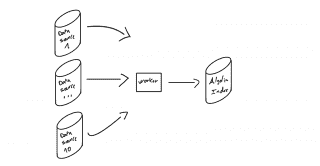

# GraphQL 搜索和索引与 Algolia - Algolia 博客

> 原文：<https://www.algolia.com/blog/engineering/graphql-search-and-indexing-with-algolia/>

GraphQL 在 web 上的广泛使用，给开发者带来了很多优势。在前端，它减少了往返，并实现了更好的客户端缓存。在后端，它通过生成自描述的基于模式的 API 简化了微服务的多样性。在本文中，我们将看到如何增强 GraphQL 搜索功能。

Algolia 与 GraphQL 有一些相同的核心价值，例如提供一种高效和简化的数据访问方式，以及重视优秀的开发人员体验。出于这个原因，当开发人员将 Algolia 与 GraphQL 相结合时，他们会得到一套丰富的工具来构建一流的搜索体验。

为了了解这两种技术如何协同工作，我们创建了一个虚拟公司，提供在线航班价格比较(flight-tickets.io)。Flight-tickets.io 的系统首先利用 GraphQL 来改进 Algolia 的后端索引过程，然后它集成了 Algolia InstantSearch 来提供统一的前端编程环境。

## [](#index-rich-data-into-algolia-with-graphql)用 GraphQL 将丰富的数据索引成 Algolia

该公司的 Algolia index 公布了来自数十家外部供应商的票价。如果没有 GraphQL， [ETL](https://en.wikipedia.org/wiki/Extract,_transform,_load) 实现将所有提供者的数据编入 Algolia 索引是复杂的——它需要一个工人处理每个数据源。

流程是这样的:



如您所见，有三个步骤:从多个提供者获取数据，对其进行转换，然后将其推送到 Algolia。随着数据源和 API 类型(REST、gRPC 等)数量的增长，这一过程的复杂性迅速增加，导致工程团队对新提供商的集成和支持速度变慢。

还有稳定性问题:

*   每个工作人员必须对每个数据提供者的多个 API 进行多次调用
*   每个提供者都用自己的协议公开数据:REST、gRPC 或专有协议
*   每个提供者的自定义错误管理都是独特的

### [](#adding-graphql-based-indexing)添加基于 GraphQL 的索引

解决方案是通过利用 GraphQL 重写 ETL，如下所示:


现在，拉取和转换阶段由一个 GraphQL 过程管理(或统一)。通过构建一个新的 GraphQL 内部 API，依靠 [GraphQL Mesh](https://www.graphql-mesh.com/) ，团队在数据提供者和 ETL 之间添加了一个单一的数据层。

本质上，ETL 从内部 GraphQL API 提取或订阅数据变更，这公开了以统一方式查询的多个数据源，如下所示:

```
query getTicketsForProvider($provider: Provider!, $from: Date!, $to: Date!, $cursor: Cursor) {
  tickets(provider: $provider, from: $from, to: $to, cursor: $cursor) {
    edges {
      node {
        provider {
          id
          name
        }
        prices {
          ...PriceByLocationAndTime
        }
        # ...
      }
      pageInfo {
        cursor {
          before
          after
        }
      }
    }
  }
}

```

数据是统一的，并且包括错误处理。下面是一个典型的 GraphQL 错误响应体，包含`data`和`errors`字段:

```
{
  "data": {
     “tickets”: []
  },
  "errors": [
    {
      "message": "[SuperFlight API]: unavailable",
      "locations": [
        {
          "line": 2,
          "column": 3
        }
      ],
      "extensions": {
        "code": "TICKETS_GRAPHQL_API_SUPERFLIGHT_ERROR",
        "exception": {
          "stacktrace": [
            "......",
          ]
        }
      }
    }
  ]
}

```

最后，除了网络延迟优化，GraphQL 还在提供者的数据获取端带来了真正的性能优化。 [GraphQL API 实现在设计上是高度异步的](https://graphql.org/learn/execution/#asynchronous-resolvers):每个数据字段都是并行解析的，因此性能更好。

> **旁注:**
> 对于 Algolia 的 Shopify 扩展，我们利用 Shopify 的 GraphQL API 将 Shopify 数据索引到 Algolia 索引中。Shopify 的 GraphQL API 不仅带来了前面已经讨论过的优势，而且更进一步:
> 
> *   与 Shopify REST API 相比，速率限制更加宽松和灵活
> *   高级分页模式
> 
> 从 Shopify REST API 迁移到 Shopify GraphQL API 后，我们看到 Shopify 数据的平均索引速度提高了 28%,索引峰值容量提高了 150%。

## [](#graphql-search-with-instant-search)GraphQL 搜索与即时搜索

现在他们已经与 GraphQL 统一了，这家航空公司希望改进他们的搜索 UI，使用 GraphQL 后端搜索来进行 SEO 和数据丰富，由 Algolia 提供支持。虽然我们总是建议前端搜索(即直接进入 Algolia 的服务器以获得最大的瞬时速度)，但在预订机票等预订系统的情况下，明智的做法是额外返回后端服务器以获取实时数据。至于 SEO，你可以经常结合前后端来提升你公司的 [Google SEO](https://www.algolia.com/blog/ux/google-core-web-vitals-seo-rankings-search-bar-optimization/) 。

### [](#algolia-graphql-search)Algolia graph QL 搜索

第一步是在现有的公共 GraphQL API 上公开一个 GraphQL 搜索查询。为了实现这一点，后端团队使用了一个名为 [`algolia-graphql-schema`](https://github.com/charlypoly/algolia-graphql-schema) 的工具，它从给定的 Algolia 索引生成 GraphQL 类型。

`flightsSearch` Algolia 索引包含如下对象:

```
{
  "provider_id": 12312312,
  "flight_company_name": "Bryan'air",
  "inbound": "2021-09-13T16:39:22.396Z",
  "outbound": "2021-19-13T16:39:22.396Z",
  "price": 1140.00
  // ...
}

```

他们给`package.json`添加了以下脚本:

```
// ...
"scripts": {
  "generate:graphql": "algolia-graphql-schema"
},
// …

```

运行脚本:

```
$ npm link
$ npm run generate:graphql

> algolia-graphql-demo-server@1.0.0 generate:graphql
> algolia-graphql-schema

Analyzing flightsSearch index (that might take a few seconds...)
flightsSearch.graphql created!

```

生成以下`flightsSearch.graphql`:

```
type AlgoliaResultObject {
  provider_id: String!
  flight_company_name: String!
  inbound: Date!
  outbound: Date!
  price: Int!
  # ...
}

type SearchResultsEdge {
  cursor: Int!
  node: AlgoliaResultObject
}

type SearchResults {
  edges: [SearchResultsEdge!]!
  totalCount: Int!
}

input SearchInput {
  query: String
  similarQuery: String
  sumOrFiltersScores: Boolean
  filters: String
  page: Int
  hitsPerPage: Int
  offset: Int
  length: Int
  attributesToHighlight: [String]
  attributesToSnippet: [String]
  attributesToRetrieve: [String]
  # ...
}

type Query {
  # ...
  search_flights($input: SearchInput!, $after: String): [SearchResults!]!
}

```

一旦他们将生成的搜索类型定义集成到现有的 GraphQL API 类型中，并且[实现了调用 Algolia 搜索 API 的相应解析器](https://graphql.org/learn/execution/#root-fields-resolvers)，后端团队就为前端团队使用 Algolia InstantSearch 构建新的搜索 UI 开了绿灯。

### [](#algolia-instantsearch-graphql-integration)Algolia instant search graph QL 集成

前端团队现在能够使用`search_flights($input: SearchInput!, $after: String)` GraphQL 查询来搜索机票。幸运的是，Algolia 已经记录了[如何在后端](https://www.algolia.com/doc/guides/building-search-ui/going-further/backend-search/in-depth/backend-instantsearch/js/#searching-for-results)使用 InstantSearch，所以设置很快。

前端团队为他们的 InstantSearch 实现了一个定制的 GraphQL 搜索客户端。

```
import { SearchClient } from 'instantsearch.js'

const query = `
  Search($input: SearchInput!, $after: String) {
    search_flights(input: $input, before: $after) {
      edges {
        cursor
        node {
          provider_id
          flight_company_name
          inbound
          outbound
          price
          # ...

        }
      }
      totalCount
    }
  }
`;

const HITS_PER_PAGE = 20

const transformResponse = ({ query, page }) => (response) =>
  response.data?.search_flights.edges.reduce(
    (acc, edge) => {
      acc.results[0].hits.push(edge.nodes);
      acc.results[0].nbHits += 1
    },
    {
      results: [
        {
            hits: [],
            page,
            nbHits: response.data?.search_flights.edges.length || 0,
            nbPages: response.data?.search_flights.totalCount / HITS_PER_PAGE,
            query: query || "",
            exhaustiveNbHits: false,
            hitsPerPage: HITS_PER_PAGE,
            processingTimeMS: 0,
            params: ""
          }
      ],
    }
  );

const searchClient: SearchClient = {
  searchForFacetValues: (() => {}) as any,
  search(requests) {
    const request = requests[0]
    return fetch("https://api.flightickets.io/graphql", {
      method: "post",
      headers: {
        "Content-Type": "application/json",
      },
      body: JSON.stringify({
        query,
        variables: { input: { ...request } },
      }),
    }).then(transformResponse({ query: request.query, page: request.page }));
  },
};

```

注意:搜索 UI 代码通过 GraphQL API 以单个 Algolia 索引为目标。

定制的`hits`小部件受益于 GraphQL 搜索 API 生成的 TypeScript 搜索结果类型，如下所示:

```
// TypeScript types generated from the GraphQL API using GraphQL code generator
import { AlgoliaResultObject } from './graphql/generated'

const structuredResults = connectHits(({ hits, widgetParams }) => {
  const results = hits as AlgoliaResultObject[];
  // results.flight_company_name is autocompleted by TypeScript generated types

  const { container } = widgetParams;

  if (
    results
  ) {
    // Render the result
    // ...
    return;
  }

  // Render no results
  // ...
});

```

他们准备好出发了。他们只需要将 Algolia 集成到 GraphQL API 以及前端的即时搜索配置中:

*   在 API 端，他们需要用 JavaScript 客户端调用 Algolia
*   在即时搜索端，他们需要向即时搜索提供`searchClient`和一个定制的`hits`小部件

## [](#conclusion)结论

通过结合 Algolia 和 GraphQL，flight-tickets.io 改善了他们的整体用户和开发者体验。

首先，通过构建一个更快、更稳定、更丰富的索引管道，利用 GraphQL 来消费和统一来自数十个提供商的数据:

*   独特的数据语言和错误管理
*   GraphQL 并行架构带来了一些性能提升
*   降低复杂性，改善开发人员体验

最后，通过利用 GraphQL 和构建后端搜索，前端团队使用 Algolia InstantSearch 将搜索完美地集成到前端堆栈中。

对这篇文章有任何反馈吗？我很想收到你的来信:[@ where is chary](https://twitter.com/whereischarly)