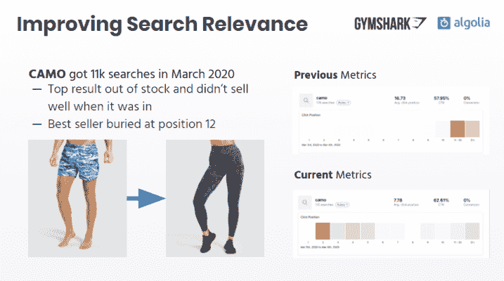
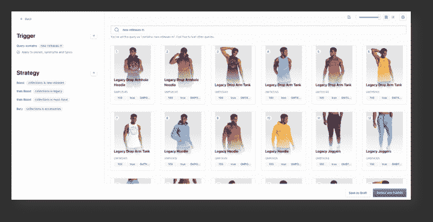
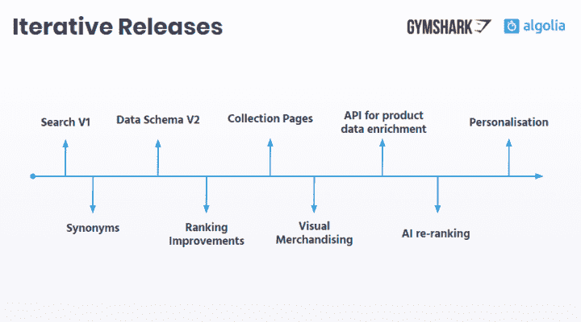

# Gymshark 的马赫之旅:搜索和导航的实际案例

> 原文：<https://www.algolia.com/blog/customers/gymsharks-journey-to-mach-the-practical-case-for-search-and-navigation/>

Gymshark 成立于 2012 年，是英国发展最快的健身时尚品牌，通过 15 家在线商店在国际上销售服装和配饰。Gymshark 在 2020 年突破了 5 亿美元的收入大关，有 6400 万在线购物者，他们访问了超过 10 亿个页面。

负责整个商业堆栈的 Gymshark 产品经理 Ben Pusey 与我们分享了该公司的 [数字化转型之旅](https://resources.algolia.com/webinars/webinar-gymshark-field-retail) 到 [MACH 架构](https://machalliance.org/) 以及它如何推动了令人难以置信的增长。

## 反思技术

这一切都始于 2015 年的黑色星期五。Gymshark 在一个自托管的 Magento 商店上运行，该商店在负载下出现故障。在这一事件中，Gymshark 损失了金钱，损害了它的声誉。管理层被迫带着批判性的理念彻底重新思考技术:“我们意识到我们的技术是我们业务成功的核心驱动力，”Ben 说。“我们需要重新关注技术，以便与业务一起成长。”

考虑到这一点，他们选择采用四个核心原则来创建他们未来的技术堆栈:

 ***   **微服务、** 使工程团队开发、部署和维护平台应用的各个部分变得简单

*   **API 优先** 这样他们就可以轻松地将新技术与堆栈集成，无论是当时还是将来

*   **基于云的** 因此他们可以利用动态扩展的工作负载并支持 200 倍平均流量的峰值

*   **无头** 这样他们就可以在体验的特定部分使用任何他们想要的技术，并在任何频道上提供体验

由[MACH Alliance](https://machalliance.org/)推广，这四个原则是围绕创建模块化、可扩展和灵活的产品而设计的，这些产品可以适应不断变化的业务优先级。

Gymshark 选择了一个由可组合元素组成的 MACH 堆栈

 ***   **Shopify** 为基础；由于其 API 优先的方法，它具有极强的模块化和可扩展性

*   **Algolia** 用于搜索和收藏页面

*   **内容丰富的** 用于内容管理

*   **反应** 为前端应用

*   **AWS Lambda** 和其他 AWS 服务 作为粘合剂将技术结合在一起

搜索是 Gymshark 用最佳技术取代的 Shopify 基金会的第一个组成部分。

## 用搜索和导航开始无头之旅

在 Algolia 之前， Gymshark 在搜索和导航体验方面遇到了各种限制:

 ***   **糟糕的搜索结果:** 最畅销的商品出现在搜索结果页面的底部

*   **相关性低，** 导致搜索转化率差

*   **缺货商品** 出现在搜索结果的顶部

*   **没有个性化** 的购物体验

*   **手工销售** 是 导致销售团队的工作流程密集且不可扩展

*   **没有本地化，** 对于英国以外的购物者来说，这意味着下载速度很慢

搜索和导航显然是购物体验的组成部分，可以迅速带来可观的额外收入，因此 Gymshark 决定寻找一个能够反映其四个核心原则的解决方案。我们很荣幸 Gymshark 选择了 Algolia，也很自豪能在短短几个月内帮助 Ben 和他的团队建立新的搜索和导航体验。

## 着眼于增加收入推动迭代

Ben 和他的团队喜欢他们的无头搜索和导航解决方案的一个因素是，它从第一天起就提供了结果，同时允许他们通过根据他们的特定需求、受众和目录定制用户体验来释放增量收入。

### **网站搜索**

Gymshark 第一个需要优化的领域是搜索体验。首要任务是 **提高相关性。** 该团队将产品可用性和其他业务数据添加到排名逻辑中，并提高了他们最常用的搜索关键词之一“camo”的平均点击位置和点击率

Gymshark 还利用 Algolia 的 **人工智能生成的同义词** 向客户展示与其搜索词相关的产品。例如，美国顾客搜索“运动裤”(相对于英国版本的“慢跑者”)，没有得到任何结果。Algolia AI 检测到了这个小故障，并建议使用同义词。

最后，他们使用内置的 **机器学习自动化商品销售** 来调整每个搜索查询的结果顺序，并提升最高性能的产品。通过这样做，他们一年创造了 **2M 的额外销售额。**

### **收藏页面**

收藏页面也是 Gymshark 从 Shopify 模板转移到 React 应用的首批网站元素之一。由 Algolia 交付和管理的内容推动了这种转移。 理由是本和他的团队喜欢搜索功能，并希望将它们应用到导航体验中。他们希望销售团队能够在系列页面上利用 Algolia 的 [视觉销售工具](https://www.algolia.com/products/search-and-discovery/visual-merchandising-curation/) 来定义精确的销售规则，同时依靠 Algolia AI 和更广泛的业务规则(使用 Gymshark 的业务数据)来自动销售整个商店的商品。

例如，通过对库存中最大尺寸的商品进行优先排序，隐藏脱销商品，并使用优先级评分对收藏页面上的商品进行排名，Gymshark 每年产生了**450 万英镑的额外销售额。**

这一策略也为销售团队带来了巨大的收益。使用前一种解决方案，他们需要手动对产品重新排序，并即时隐藏脱销商品，这很麻烦(在黑色星期五等大型活动期间也不可能)。今天，一切都是自动化的。

### **个性化**

Gymshark 还使用 Algolia 来个性化整个网站的购物体验，从搜索和收藏页面开始，扩展到主页，然后包括出站电子邮件和产品推荐，以及计划中的移动应用程序。

### **迭代成功**

在一年的时间里，Ben 和他的团队能够将所有这些优化带到 Gymshark 的在线体验中。他们遵循一个包含多次迭代的精益流程，目标是在每个阶段交付业务价值，并测量改进，以便重新确定路线图的优先级。

## 当无头商业加速增长的时候

通过使用无头搜索和导航解决方案，Gymshark 在多次迭代过程中增加了可观的收入，每次迭代都优化了购物体验，并将其与竞争对手的购物体验区分开来。一个重要的方面是，即使在大流量和交易高峰期间，如黑色星期五，也能够保持搜索和导航，而不会给他们的工程团队带来任何负担。

Gymshark 强大的搜索和导航方法带来了:

 ***   **2000 万美元的年增量收入**

 ***   搜索转化率从 6.2%增加到 10%(并且还在攀升)

*   搜索用户收入同比增长 4 倍

但是 Gymshark 并没有止步于这些数字。对于搜索和导航，它的下一步是测试 KPI 驱动的商品销售算法，将机器学习重新排序应用于收藏页面，测试新的个性化策略，并实现产品推荐，同时推出一款受益于所有这些功能的移动应用。对于堆栈的其余部分，Gymshark 正在准备实施一个新的产品信息管理系统。

了解更多关于阿哥利亚是 [马赫联盟](https://machalliance.org/) 的骄傲成员。要了解更多关于阿洛利亚的无头方法， [迎面翻到本页](https://www.algolia.com/industries-and-solutions/headless-commerce/) 。**********