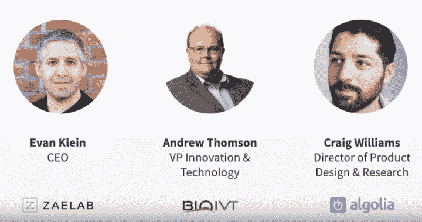
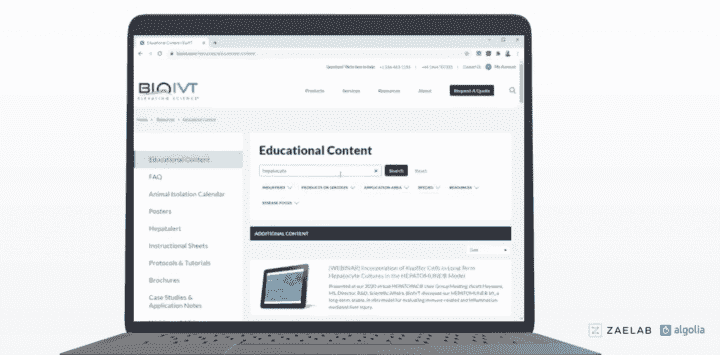
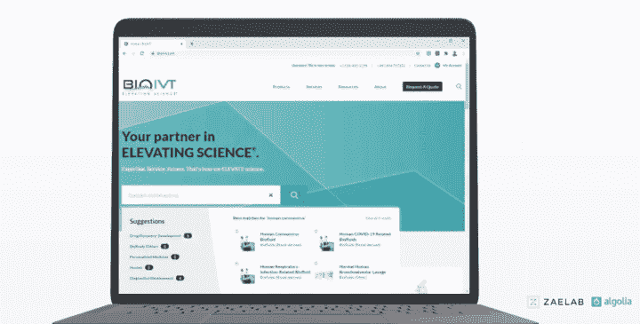

# BioIVT 的数字化转型:Algolia 和 Zaelab 如何合作创建简化的 B2B 客户体验

> 原文：<https://www.algolia.com/blog/product/headless-digital-transformation-b2b-commerce/>

如果你是一家 B2B 公司，网站需要专业地、即时地为不同类型的客户获取大量不同类型的复杂信息，你会怎么做？

[BioIVT](https://bioivt.com/) 发现，当它转向[Zaelab](https://www.zaelab.com/)时，它是一家与一流平台合作的数字商务咨询和解决方案提供商。在 Zaelab 的指导下，该组织成功地为其客户创造了卓越的 B2B 数字体验。

BioIVT 是生物样本的领先供应商:控制和疾病状态样本，包括组织、细胞、血液和其他生物流体。它主要销售给临床研究组织、大型制药公司和学术研究机构。

Algolia 的产品设计和研究总监 Craig Williams 主持了一场关于 BioVT 项目的 [网络研讨会](https://resources.algolia.com/webinars/webinar-bioivtheadless-field) 。Zaelab 的首席执行官 Evan Klein 和 BioIVT 的创新技术副总裁 Andrew Thomson 一起加入了 Craig 的讨论。

# 数字转换目标

BioIVT 此次转型的业务目标是:

*   发展业务。 该组织正在收购公司并迅速发展；它需要合适的技术来专业地整合并提供它在单一整合平台中收集的所有信息
*   **区分开来。** 该公司致力于提升其“高度接触”和“人性化”的声誉，并将其转化为数字体验
*   **自动化。** 他们需要 消除阻碍他们扩展能力的手动业务流程
*   使现代化。 他们优先考虑满足客户需求，并在未来的竞争中保持领先

# 关键技术组件

Zaelab 帮助 BioIVT 确定了转化所需的组件。首先，该公司有一个在后台运行的 ERP(企业资源规划)系统，需要一个能够提供灵活性和敏捷性的架构。

在创建 BioIVT 的数字商务堆栈时，Zaelab 实施了 SAP 商务云和真正的 [无头](https://resources.algolia.com/technology/what-is-headless-commerce) 方法。

对于内容管理，团队选择了 [Contentful、](https://www.contentful.com/) 另一个基于云和 API 的平台。

为了提供卓越的客户体验，Zaelab 使用了自己的无头 ZCommerce 框架。他们将它原生集成到 BioIVT 平台中，以创建一种现代、进步的网络体验。

当 Zaelab 评估 BioIVT 的搜索需求时，他们意识到该公司需要一个非常强大、快速的搜索引擎，能够出色地搜索库存和产品。BioIVT 有一个复杂的产品，团队需要能够让客户以无缝的方式找到他们想要的东西。搜索将是数字化转型的关键部分。

# 挑战同实施搜索

转型团队在设计搜索解决方案时面临的挑战包括:

*   **拥有多源系统:** BioIVT 收购了很多公司，拥有很多数据源。
*   **拥有复杂的数据集。“我们不只是在谈论出售 t 恤，”埃文说，“我们在谈论出售动物和人体组织。”**
*   **缺乏典型的产品目录。** BioIVT 有一套实时的、不断变化的库存。
*   **拥有大量的营销和科学资源信息** 需要被编入索引并方便客户搜索

BioIVT 也有机会改进其现有的搜索技术。他们希望改善搜索性能，提高搜索结果的相关性(不同类型的用户需要针对其角色定制的特定信息)，并让他们的客户能够访问复杂、不断变化的库存数据。

# 阿洛亚的边缘

Zaelab 评估了许多搜索引擎，并根据几个因素确定 Algolia 是最佳选择:

*   **多样的内容类型:** “我们不只是在谈论搜索产品，”埃文说，“我们在谈论搜索产品、科学内容、库存、账户。”他们需要一个能够让客户找到各种类型内容的搜索引擎。
*   **结果和相关性:** 基于搜索查询，Algolia 在正确的时间提供了正确的内容。
*   **速度和性能:** Algolia 在提供结果时“几乎是即时的”——这正是客户所期望的。
*   让企业管理搜索的能力。 他们不想在任何需要优化搜索功能的时候启动技术任务。Algolia 基于云的工具使企业能够个性化、调整和优化搜索结果。
*   **实时库存更新:** 他们需要一个基于 API 的平台，能够扩展和处理大量更新。
*   **SAP 商务云的现有 Algolia 插件:** 在与 Algolia 的早期合作中， Zaelab 构建了一个插件，使他们能够快速将 Algolia 推向市场。

考虑到这些因素，团队很清楚 Algolia 将比任何其他解决方案更好地满足 BioIVT 的搜索需求。

# 两年后……

BioIVT 创建了一个为期两年的数字化转型路线图，从咨询阶段开始，在此期间他们向客户征求意见。这个过程以新解决方案的三个连续发布而结束，然后是一段时间的优化和创新。

这是 BioIVT 专门针对教育内容的新搜索栏:

Andrew 指出，这种搜索功能在新冠肺炎时代尤其及时。

BioIVT 现在还有一个单独的搜索栏，用于搜索超过 140，000 份生物样品的复杂库存集。每个样品有 50 多个属性，在 Algolia 平台上有 30 多个搜索面:

# 成功指标与心得

在量化转型成功的过程中，一个指标是客户对平台的采用(例如，报价和订单的数量)。该团队还测量了收入、成本节约和客户忠诚度的增长。

Andrew 确定了项目的六个关键要点:

*   **确保管理层的一致和沟通。所有利益相关者之间保持清晰的协同非常重要。**
*   **采用增量部署。一次做一件事来帮助管理期望。**
*   **关注数据质量。Andrew 建议道:“永远不要低估你在这种规模的项目中所要做的数据质量工作的数量。”。“我们有成千上万的材料样本、来自多个 ERP 系统的信息……这些数据需要全面保持一致……以一种随时可以在网站上显示给任何客户的格式。”以前，该公司一直专注于确保数据 *看起来* 漂亮，现在他们依靠它被 *存储* 漂亮。**
*   变革管理是一项艰巨的任务。 很难得到整个组织的认同；奉献和良好的沟通是关键。
*   **把 API 放在第一位。** 以 API 为中心的方法和无头架构支持灵活性和更快的创新。
*   **尽早识别项目治理。** 在一个较长项目的初步阶段，把强有力的领导安排到位。

# 客户是对的(总是)

Evan 指出了最后一点:从你的用户开始。BioIVT 的数字化转型始于反思和调整工作，以满足客户的需求。

“我们传统上一直是一个高接触度的组织:一支脚踏实地的销售队伍，在临床研究公司和制药公司之间走动，与科学家谈论他们的研究需求，”Andrew 说。“我们与这些资深科学家有着非常密切的个人一对一关系，随着我们推进数字化转型，我们不想失去我们客户服务的这一方面……问每一个问题都带着“客户会如何回应？”并不总是容易的。但是对我们来说保持专注是很重要的。”

# bio ivt 的下一步是什么？

安德鲁的任务清单包括:

*   扩展到包括更多的业务线，以及更多的产品和样品类型
*   利用 Algolia 改进内部计划，例如内部用户的库存搜索
*   不断优化搜索和数字体验
*   继续推动现有客户将网站作为首选购买渠道

# 为 SAP Hybris 解决缺口

Craig 有一个后续讨论问题: 团队试图解决 SAP Hybris 原生搜索解决方案中的哪些差距？

“SAP Commerce Cloud 提供了搜索功能，如果只是考虑跨产品搜索，这是有意义的，”Evan 回答道。然而，对于 BioIVT 的客户来说，搜索是完全不同的。

“不仅仅是产品，还有与这些产品相关的大量复杂属性；有跨移动非常快、变化非常频繁的目录的搜索，有跨文档和科学内容的搜索。Algolia 提出了一个能够更好地满足 BioIVT 客户体验需求的解决方案。”

“当我们看到 Algolia 能够如此快速地获取大量复杂的记录，并对其进行搜索和显示时，我们就被这个解决方案所吸引，”Andrew 补充道。“我们使用其他解决方案来搜索我们的历史库存的经历是一个漫长而艰难的过程，人们不会愿意在网站上耐心等待。”