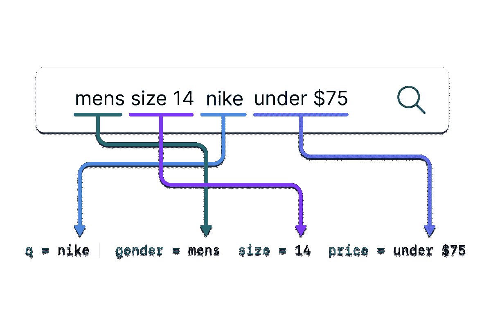

# 人工智能搜索如何让电子商务公司增加收入和削减成本

> 原文：<https://www.algolia.com/blog/ai/how-ai-search-enables-ecommerce-companies-to-boost-revenue-and-cut-costs/>

咨询巨头麦肯锡看好人工智能。他们的预测 [估计](https://www.mckinsey.com/~/media/McKinsey/Featured%2520Insights/Artificial%2520Intelligence/Notes%2520from%2520the%2520frontier%2520Modeling%2520the%2520impact%2520of%2520AI%2520on%2520the%2520world%2520economy/MGI-Notes-from-the-AI-frontier-Modeling-the-impact-of-AI-on-the-world-economy-September-2018.ashx&sa=D&source=editors&ust=1678310392420625&usg=AOvVaw062O-wTkXIdodSnSYWoquY) 到 2030 年，人工智能可以为全球 GDP 和劳动力市场增加约 16%，或约 13 万亿美元。由于对通货膨胀和经济衰退的担忧仍然很高，许多电子商务公司正在寻找提高盈利能力的方法，同时也在以更少的资源做更多的事情。人工智能搜索有潜力帮助企业做到这两点。在这篇博客中，我将解释如何做到这一点。

## 搜索命令

在线搜索对 B2C 和 B2B 公司的收入都有很大的影响。研究表明，B2C 零售商务网站上的消费者经常以搜索开始他们的旅程，与非搜索者相比，花费 [2.6 倍](https://www.salesforce.com/video/3597818/&sa=D&source=editors&ust=1678310392421404&usg=AOvVaw0G4zX0FKEZnONFWxtMxu9y) 。对于 B2B 电子商务，92%的购买都是从搜索开始的！

如今，电子商务网站经理必须花费大量时间为买家优化搜索结果。这是因为搜索栏通常由关键词搜索引擎驱动。顾名思义，关键字搜索是基于将搜索查询与搜索索引中的关键字进行匹配。关键字引擎对于搜索和索引术语匹配的“标题”查询非常有效，但是术语的任何变化都可能导致引擎失败。

“Fat head” queries represent the top 10-20% of searches, and “long tail” queries typically include the bottom 50-70% of site searches. Keyword search works well for the fat head, but long tail is better served with AI or in combination with keyword search, sometimes called hybrid search.

问题是，您无法编写足够的规则、同义词或关键字来说明目录中每种产品的每种可能的查询变化，尤其是如果您的目录包括数千甚至数百万个项目，这在 B2B 商务中是常见的情况。你可能会想，我所描述的听起来很像一个 [长尾搜索](https://www.algolia.com/blog/ai/how-ai-search-unlocks-long-tail-results/&sa=D&source=editors&ust=1678310392423171&usg=AOvVaw1XMu3CcZ1gs09VH4pwDe6X) 问题——你可能是对的！搜索者带着某种想法来到你的网站。然而，他们制定查询的方式可能与你建立搜索索引的方式大相径庭。

与关键词搜索引擎不同，人工智能搜索实际上理解查询背后的含义。关键词匹配和人工智能理解之间的差异是巨大的。它更像人类。

重要的一点是:人工智能搜索对目录很有效，不需要额外的查询匹配。人工智能搜索自动为你处理那些长尾查询。不需要建立一个同义词库，编写规则，或者用关键字填充你的页面，同时希望得到一个关键字匹配；使用机器学习进行搜索检索，它开箱即用，同时节省您的时间和金钱。

## 人工智能如何工作

人工智能是花里胡哨的名词；大多数技术专家更喜欢谈论底层的机器学习算法，这些算法可以推动广泛的技术，从库存预测模型到无人驾驶汽车。ChatGPT 因其使用大型语言模型(LLM)而闻名，但还有许多其他技术或算法用于机器学习。每个人工智能系统都是一个多步骤的过程，将信息转换为机器可读的数据以进行更快的处理，然后应用不同的模型来解释数据并进行预测。可以调整模型以提高性能和可信度。

搜索索引中的数据加上您从客户那里收集的信息—地理位置、过去的购买、过去的搜索、浏览器、会员状态、评级、退货等。—是火的燃料。一些被称为学习排序算法的机器学习技术将通过学习哪些有效哪些无效来随着时间的推移自动改善结果。其他人工智能解决方案可用于增强推荐，例如购买了 x 的客户也购买了 y ，这可以提高客户满意度，也可以产生更高的平均订单价值。

## 端到端人工智能搜索

有许多不同的人工智能技术在发挥作用，但对搜索相关性影响最大的技术被称为 [矢量嵌入](https://www.algolia.com/blog/ai/what-is-vector-search/&sa=D&source=editors&ust=1678310392424639&usg=AOvVaw2rNTlOm-ol73bNdPvbowZB) 。向量使搜索引擎能够理解术语之间的相似性。对于 Algolia 来说，向量只是第一步。我们应用另一种称为 [神经哈希](https://www.algolia.com/blog/ai/vectors-vs-hashes/&sa=D&source=editors&ust=1678310392424931&usg=AOvVaw3_s1CUc7FfVajoIgv8gN3D) 的技术来压缩向量，这使我们的客户能够扩展搜索并对他们的目录和模式进行频繁更改，而不会对结果产生负面影响。它还允许我们同时将人工智能与关键字结果结合起来，以获得更大的相关性。结果是更快，更准确，可扩展的人工智能支持的搜索检索。

How natural language processing (NLP) parses and analyzes queries to help the search engine be more successful.

从查询到结果的整个过程是一个多步骤序列:

*   **查询处理** :首先，我们应用一个机器学习功能，自然语言处理(NLP)，对查询进行预处理(见上图)。
*   **检索** :然后，由神经哈希驱动的机器学习识别最相关的结果，并从最相关到最不相关排序。
*   **排名** :最后，应用动态排名对结果进行优化排序，以提高网站的绩效——点击、转化、购买等。

所有这些几乎都是实时发生的(无论您是否配置了自动完成)。事实上，大多数查询在不到 20 毫秒的时间内返回，比眨眼的时间快 5 倍。它也必须很快；亚马逊和谷歌 [都显示了](https://www.gigaspaces.com/blog/amazon-found-every-100ms-of-latency-cost-them-1-in-sales&sa=D&source=editors&ust=1678310392426416&usg=AOvVaw0IvCVpYEOCVf-7o0ijBrDU) 速度对于客户体验和收入的重要性。

我们早期的 Algolia[neural search](https://www.algolia.com/lp/learn-algolia-neuralsearch/&sa=D&source=editors&ust=1678310392426943&usg=AOvVaw33slDaHQHbY-9yQgJtuXj3)alpha 客户之一——一个拥有约 300 万 SKU 的电子商务网站——在采用的第一个月内，转化率立即提高了 6%。他们也不需要做任何事情。人工智能自动化几乎消除了搜索结果优化曾经需要的人工工作和业务流程。这只是冰山一角；我们预计，随着产品的全面发布，这个数字还会攀升。

## 更智能的搜索革命

像谷歌和亚马逊这样的公司已经花费了数十亿美元和数万小时来构建他们基于人工智能的搜索、推荐和个性化解决方案。现在，随着人工智能算法的进步，实现智能搜索可以在一小部分时间和成本内完成。

我们对人工智能搜索将对 B2B 和 B2C 卖家产生的影响感到兴奋，因为他们正在推动数字化转型、降低成本和更快的自动化决策。公司可以重新分配他们花在优化搜索上的无限时间，同时改善搜索结果，以提高转化率和更好的用户体验。

如需了解更多信息， [注册即可获得通知](https://www.algolia.com/dg/neuralsearch-coming-soon/p/1)【Algolia neural search 何时推出！