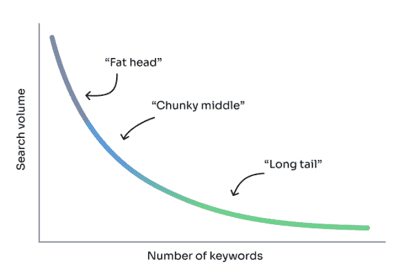
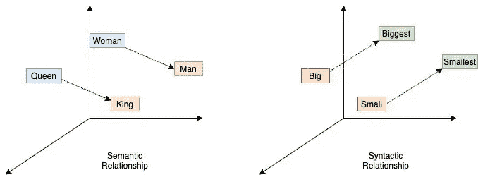

# 人工智能搜索如何解锁长尾结果

> 原文：<https://www.algolia.com/blog/ai/how-ai-search-unlocks-long-tail-results/>

你已经优化了你的努力，以推动你的网站流量，但现在困难的部分开始了:优化现场搜索和发现，以提高转化率。大多数网站搜索引擎仍然要求访问者使用简单的一词查询，如“葡萄酒”或“香槟”——你可以很容易地优化这些——但对于较长的查询或拼写错误，就会惨败。我们自己的数据表明，一半或更多的查询在长尾中。如果你的搜索引擎表现得更像一个人——实际上理解一个搜索查询，比如“我想要一瓶上好的香槟酒庆祝复活节”——并提供很好的结果，会怎么样？

如果你没有对你的目录进行 100%的搜索优化，那么你就是在浪费所有的精力去创造网站流量和把钱留在桌面上。这就是人工智能搜索的用武之地。

我先解释一些术语。胖头、矮胖子和长尾巴可能是喜剧三重奏的名字。相反，它们指的是不同类别的搜索词。有搜索的“**大头**——最常见的查询，有“**矮胖的中间**”，其中数百万的现场搜索查询可以在网站上产生有意义的量，还有“**长尾**”，其中数十亿的搜索查询产生相对较小的搜索量。

大多数零售商只有资源来优化现场搜索的大头查询。花时间优化目录的这一部分是非常有意义的；这就是你的目录的大量流行搜索查询的来源。然而，如果你只为胖子优化，你就错过了一个巨大的机会。

人工智能搜索提供了同时优化所有三个细分市场的解决方案。它可以在任何地方提高收入，而不增加任何额外的工作或开销。在这篇博客中，我们将看看人工智能搜索是如何解开长尾的。

*注:这是* ***不是*** *一篇关于 SEO，生成有机流量，或者说 SEO 策略的文章。这篇文章是关于如何提高**站内**长尾搜索优化的。*

## 查询类型和关键字搜索

有时购物者确切地知道他们想要什么，有时他们想进行一次探索之旅。有不同种类的查询，它们变得越来越长，越来越复杂，部分是由语音搜索驱动的。一些搜索查询类型包括:

*   **广泛搜索** 像“笔”
*   **精确搜索** 比如“苹果 iPhone 14 Pro”
*   **特征相关搜索** 如“男士棕色休闲鞋”
*   **兼容性搜索** 就像“无麸质晚餐的开胃菜”
*   **概念搜索** 如“夜间跑步时可见的东西”
*   **症状相关搜索** 如“替代药物治疗耳鸣”

全文关键词搜索引擎可以很好地匹配上面的前三个，但是，如果没有帮助，后三个将是一场斗争。

关键字搜索引擎寻找精确或非常匹配的短语。内置的错别字容差、同义词库、 [查询分类](https://www.algolia.com/blog/product/new-ai-capabilities-available-to-algolia-customers-query-categorization/) 和 [NLP 算法](https://www.algolia.com/blog/product/what-is-natural-language-processing-and-how-is-it-leveraged-by-search-tools-software/) 可以帮助处理这些种类的搜索查询。例如，搜索“男士 14 码篮球鞋”——即使是拼错的单词，如 *篮球*——也可以被解析和过滤，以提供很好的结果。

关键字搜索对于大标题和许多中间查询来说是非常棒的。但是对于更复杂的查询，比如症状搜索呢？

这里有一个例子:假设你在你的网站上销售阿司匹林和相关产品。您的客户有多少种方法可以搜索这些产品？下面是我想到的十个

*   婴儿阿司匹林
*   头痛药
*   背痛
*   关节痛
*   脖子酸痛
*   治疗背痛的最佳药物
*   阿司匹林替代品
*   消炎的东西
*   用于肩部和背部的 NSAID
*   医生推荐预防心脏病发作的 OTC 药物

光是这些产品，就很容易出现上百个长尾查询。不可能预先确定某人可能写的所有长尾关键词。这就是人工智能矢量搜索可以提供帮助的地方。

## 矢量搜索长尾关键词

[矢量嵌入](https://www.algolia.com/blog/ai/what-is-vector-search/)是 AI 搜索背后的主要技术之一。矢量搜索是一种搜索引擎，它理解搜索索引中对象之间的概念和相似性。矢量搜索引擎会理解头痛、阿司匹林、肌肉酸痛、Nurofen、NSAID 和其他类似的术语和概念是相关的。例如，当有人键入“头痛”或“肌肉酸痛”时，使用矢量搜索的药店可以提出“阿司匹林”，因为搜索引擎知道所有这些术语的意思都很接近。

我们发表了更长的关于 [向量搜索引擎如何工作的解释](https://www.algolia.com/blog/ai/what-is-vector-search/) ，但简单来说，向量是数学上生成的数字，代表单词。这些向量中的每一个都被绘制在一个“向量空间”中，搜索引擎使用机器学习算法来聚集成千上万个维度的数百万个数据点，以基于向量空间中单词之间的接近程度来建立对概念的理解。这也适用于不同的语言。

Image via Medium showing vector space dimensions. Similarity is often measured using Euclidean distance or cosine similarity.

矢量搜索的一个迷人之处在于，它完全不依赖于关键词或特定的搜索短语。即使搜索词在你的网站上找不到，它也能经常提供很好的结果。例如，搜索术语“君主”并得到“国王”或“女王”的结果。换句话说，向量搜索解锁长尾；顾客可以输入任何东西来获得好的结果。

在实践中，可以有几十亿个点，几千个维度。向量也可以加、减或乘来寻找意义和建立关系。一个例子是 **浓缩咖啡——咖啡因+蒸牛奶=无咖啡因卡布奇诺** 。机器可能会使用这种计算来确定答案或关系。搜索引擎可以使用这种能力来确定一个地区最大的山脉，确定性别或性别关系，或者确定健怡可乐的替代品。这些只是几个例子，但还有成千上万个！即使长尾搜索短语以前从未在你的网站上使用过，矢量搜索引擎也会决定相关性。

纯矢量搜索已经推出好几年了，但还没有被广泛采用，因为事实证明，它的扩展成本很高，而且速度很慢。速度对网上买家很重要。亚马逊和谷歌都发表了研究报告，证明较慢的页面加载速度会对电子商务转化率产生负面影响，并降低客户参与度。

> *亚马逊表明，每 100 毫秒的延迟会损失 1%的收入。类似地，谷歌显示 500 毫秒的延迟会降低 20%的参与度。(* [*来源*](https://www.niels-ole.com/amazon/performance/2018/10/27/100ms-latency-1percent-revenue.html)*)*

关键字搜索比矢量搜索更快，通常仍是单字查询或精确短语匹配的首选。然而，为每个可能的查询编写规则和同义词是不可能的。

如果你能够在不牺牲速度和准确性的情况下，同时获得关键字和矢量搜索的优势，会怎么样？

## AI 结合关键词

人工智能非常强大，但传统的关键词搜索技术更强大。这种混合组合为任何类型的查询提供了更好的结果。关键词搜索精准，矢量搜索智能。两者的结合提供了两个世界的精华。

诀窍在于使它在不同的数据集上快速高效，同时从关键字和向量搜索结果中确定相关性。在 Algolia，我们用一种叫做 [神经哈希](https://www.algolia.com/blog/ai/vectors-vs-hashes/) 的技术来实现。我们可以将向量转换成二进制哈希——一种更小、更便携的数据类型，可以在商用硬件上运行，没有任何成本开销。哈希保留了 96%或更多的原始矢量精度。结合关键词，我们能够提供一些令人兴奋的结果，从肥头到长尾。请看下面的例子，我们做了一个长尾搜索来寻找“能让我的啤酒保持凉爽的东西”。祝你在关键字搜索引擎上好运！结果也很快，即使是在拥有数百万 SKU 的最大目录上。

In this sample data set of 22,000 products, hybrid search could find products that match the unusual query in single-digit milliseconds.

有许多不同的补充技术在发挥作用，包括 NLP、错别字容忍、词干提取和查询分类。这是 Algolia 与其他一些可能的解决方案之间的一大区别。只有 Algolia 在所有这些搜索技术方面拥有深厚的专业知识，能够在查询时更快、更大规模地提供更好的结果。

对于您的客户而言，Algolia AI search 等 API 优先的解决方案意味着更快、更准确的搜索、发现和推荐。更好的搜索结果意味着更好的用户体验和更高的现场转化和品牌忠诚度。

## 没有付出，更好的结果，更多的收益

长尾短语对现场电子商务优化提出了挑战。对于您的团队来说，确定搜索意图并为每个可能的查询组合编写规则、同义词和关键字几乎是不可能的。混合搜索为零售商提供了一个聪明的解决方案，即使你在你的网站上没有准确的关键词。

此外，随着你的目录变化，新产品和新内容的增加，或者术语有了新的含义，人工智能混合搜索引擎将会调整。它不需要任何额外的人员或操作。混合引擎将根据查询或搜索短语自动匹配关键词或概念，有时是两者的混合。

头部术语和长尾关键词的搜索结果越好，转化率越高，客户满意度也越高。

看 AI 搜索如何改善长尾搜索结果。[注册以便在混合搜索可用时得到通知](https://www.algolia.com/dg/neuralsearch-coming-soon/p/1)。