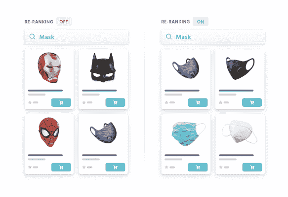

# Algolia AI 如何帮助零售商创造更好的转换体验

> 原文：<https://www.algolia.com/blog/ai/how-algolia-ai-helps-retailers-create-better-converting-experiences/>

在越来越多的购物者上网的时代，对数字财产的正确投资可以带来巨大的回报。大多数零售商认识到了这个机会，但也知道他们需要在许多领域进行投资，以创造世界级的电子商务体验。

在当今竞争异常激烈的网络世界中取胜的关键在于创造一种体验，这种体验甚至比某人走进商店与你最好的销售人员交谈时的体验还要好。对购物者来说毫不费力，并根据他们的需求个性化的东西。这就是我们建造[阿尔戈利亚 AI](https://www.algolia.com/products/ai-search) 的原因。

## 让你的购物者感到被理解，就像他们在商店里一样

我们都在杂乱地搜索产品。通过 Algolia AI，我们让人们用自己的话来描述他们正在寻找的产品，就像他们在与商店员工交谈时一样。

[Algolia Understand](https://www.algolia.com/industries-and-solutions/voice-search/) ，我们最新的自然语言理解功能，使购物者只需说出他们正在寻找的东西，并找到它。购物者只需一句话，就能毫不费力地找到他们想要的东西。

[动态同义词建议](https://www.algolia.com/products/ai-search/dynamic-synonym-suggestions/)阐述了我们语言的丰富性，以及我们对产品不断变化的称呼。它不断建议人工智能生成同义词，让你的所有购物者的体验更顺畅，增加他们的购买机会，并减少你的销售团队的手动任务。

在你的实体店，你会雇佣当地员工，他们很可能会说当地的语言。你要确保热门旅游景点的店员会说几种语言。在网上，通过 Algolia 自然语言处理，您可以依赖一个支持 70 多种语言的搜索和发现解决方案，甚至是最复杂的语言。您可以通过一个平台满足所有市场的需求。

## 表面最容易被购买的产品，总是无处不在

购物者的期望会随着时间而变化。想想 2019 年人们搜索“口罩”的时候在找什么，今天也是。

对于一些明显的情况，如“mask ”,您可以手动配置搜索以返回正确的结果。但是你不能每天都这样做，进行成千上万的搜索。

[Algolia 动态重新排名](https://www.algolia.com/products/ai-search/dynamic-reranking/)为你做到这一点。利用人工智能，它通过提升每次搜索的最高性能产品，使每次交互更有可能转化。“动态重新排名”用户测量到，仅启用这一功能后，年收入就增加了 100 万美元至 100 万美元 2M。

我们都有对特定品牌、颜色、类别和尺寸的偏好。 [Algolia 个性化](https://www.algolia.com/products/search-and-discovery/personalization/)利用人工智能为每个用户量身定制购物体验，增加每个用户转化的机会。激活 Algolia 个性化后，迪卡侬测量到转化率增加了 50%。

## 在需要的地方保持控制

总会有人工智能不是解决方案的情况，而人类是推动更多业务成果的关键。即使在使用人工智能搜索和发现解决方案时，零售商也应该能够利用他们对业务、购物者和目录的深刻了解。

这就是为什么 Algolia AI 紧密集成到一个全面的搜索和发现管理平台中，因此您可以决定何时应用 AI，何时进行手动管理。

## 受益于 AI 搜索之外的在线商店

与网络和移动商店相比，Algolia 及其新的人工智能功能可以使更多地方的零售商受益。由于其 API 优先的方法，Algolia 很容易在无头商业架构中利用，并可以在任何渠道上增强体验。一些零售商使用 Algolia 为他们的店内售货亭供电，因此购物者可以轻松浏览目录。使用 Algolia Understand 支持的语音搜索，这种体验会变得更好。购物者也间接受益于 Algolia，通过商店员工的应用程序，他们可以浏览目录，为购物者提供建议，并实时检查可用性。

## 结论

由于为顾客提供完美体验的风险从未如此之高，Algolia AI 为他们带来了一种最终成熟的人工智能搜索方法。

只需点击几下鼠标，即可部署 Algolia AI，无需专门的搜索数据科学团队和基础设施。透明可控，让零售商完全掌控。

[了解更多，今天就开始](https://www.algolia.com/products/ai-search/) ！