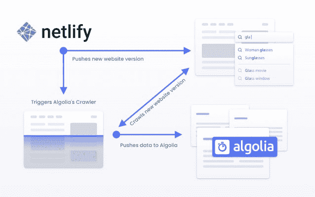
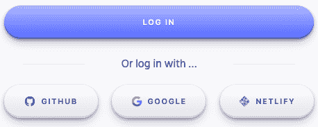
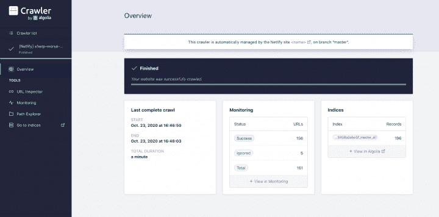
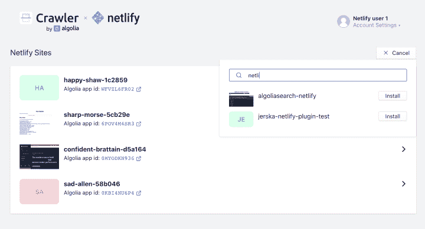
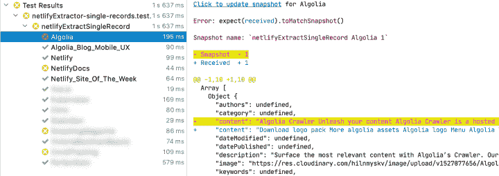
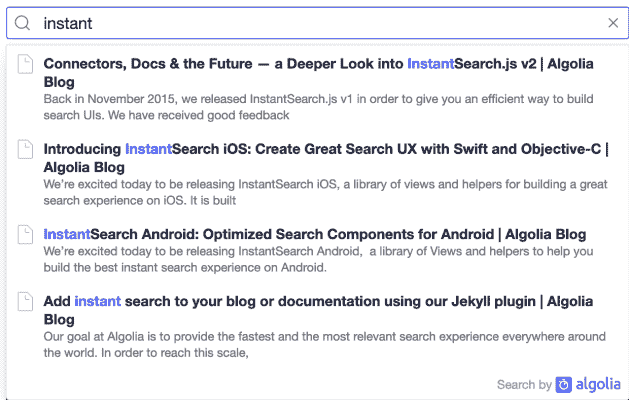
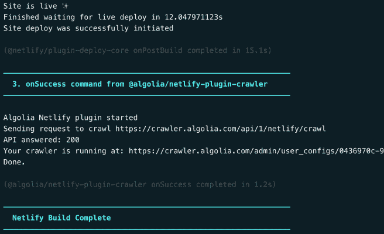
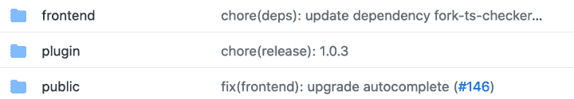

# Algolia 如何创建其 Netlify 构建插件

> 原文：<https://www.algolia.com/blog/engineering/how-algolia-created-its-netlify-build-plugin/>

我们最近发布了 [的 Algolia Netlify 插件](https://www.globenewswire.com/news-release/2020/10/06/2104357/0/en/Algolia-Streamlines-Search-for-Jamstack-Powered-Websites-With-New-Plugin-for-Netlify.html) 。你可以 [阅读更多关于](https://www.netlify.com/blog/2020/10/07/tech-partners-create-custom-build-plugins-to-reach-developers-in-their-workflow/)[的插件，观看](https://www.youtube.com/watch?v=zbdfqfn1yiM) 的介绍，或者马上获得 [的入门](https://app.netlify.com/plugins/@algolia/netlify-plugin-crawler/install) 。Algolia 是一个灵活的搜索和导航平台，能够提供尖端的网络、应用程序和电子商务体验。这篇文章深入探讨了我们是如何构建它的，并为 Netlify 构建插件的其他创建者提供了一些见解。

*了解如何使用 Netlify 构建插件* *或* [*创建自己的*](https://docs.netlify.com/configure-builds/build-plugins/create-plugins/)*Netlify 构建插件。*

## [](#what-is-the-algolia-netlify-plugin)什么是 Algolia Netlify 插件？

Algolia Netlify 插件是一种在你的 Netlify 网站上添加搜索的简单方法，让你只用几行代码就能添加 Algolia 搜索体验。一个好处是，设置完成后，插件提供的搜索结果会随着你的网站内容不断进化，每次你发布新版本的网站都会自动刷新，免去了维护搜索索引的麻烦。每当你发布一个新版本的网站时，这个插件就会触发一个爬虫来浏览和提取你网站的内容，并把它推送到 Algolia 索引中。



Diagram representation of the Algolia Netlify plugin flow.

## [](#how-we-built-it)我们如何建造它

该插件的目标是通过利用以下现有的 Algolia 产品，提供易于设置的网络搜索体验:

*   搜索 API，实际搜索引擎
*   Crawler 是一个爬行网站的附加软件，它将网页内容提取为结构化数据，并将其推入 Algolia
*   autocomplete . js UI 库

我们的主要目标是创建一个 Netlify 插件，在每次部署后，触发爬虫浏览网站并建立一个现成的 Algolia 索引。这听起来很简单，但是你会发现，为了提供出色的用户体验，有很多东西需要整合在一起。在接下来的部分中，我们将详细介绍每个现有的和新的组件所需要的工作。

### [](#)

### [](#algolia-account-and-authentication)阿果账号和认证

要使用 Algolia，首要要求是要有账号。然后，要访问 Algolia Crawler 界面，您需要专门的权限，通常手动激活。为了提供流畅的体验，并避免用户复制/粘贴令牌或请求访问，我们添加了一个新的登录选项:“使用 Netlify 登录”，它与 [Netlify 的 OAuth2 API](https://docs.netlify.com/api/get-started/#authentication) 集成在一起。当您使用您的 Netlify 帐户登录 Algolia 时，我们会自动创建一个 Algolia 帐户(如果您已经有一个帐户，则链接它)，并授予对 Algolia 爬虫界面的访问权限。我们还检索并存储一个 Netlify 令牌，我们稍后会用到它。



Screenshot of the Algolia login options, with a new Netlify login button.

### [](#)

### [](#crawler-ui-updates)爬虫 UI 更新

我们需要为用户提供一个报告界面，让他们知道爬虫在他们网站上的行为。为了让这种体验更流畅，我们给 Netlify 用户提供了对现有爬虫界面的访问，并做了一些调整。

为了管理可用的工具，我们引入了一个新的“Netlify”角色，该角色提供对一些高级配置屏幕和我们提供给普通客户的大多数高级调试工具的访问。



这个 Netlify 角色还授予对一些额外页面的访问权限，这些页面是专门为插件开发的，只对 Netlify 用户可用。这些页面允许管理网络站点上的插件安装。它们使用我们在身份验证期间检索的 OAuth 令牌与 Netlify API 对话，列出用户的站点，并在插件安装在其中一个站点上时将必要的 API 凭证推送给 Netlify。



### [](#)

### [](#api-update)API 更新

我们已经有了一个公共 API 来以编程方式管理爬虫。我们需要的是一个额外的端点，当一个网站被部署时，专门用于网络任务:

*   如果不存在爬虫，则创建一个爬虫(我们为每个分支创建一个爬虫)
*   根据“netlify . toml”中设置的选项更新设置
*   运行实际爬行

当在 Netlify 上触发构建时，调用此端点。

多亏了 OAuth 令牌，当你从我们的 Crawler 接口安装插件时，它受到自动添加到你的 Netlify 站点的环境变量中的凭证的保护。

### [](#)

### 数据提取

Algolia Crawler 最初被命名为 Algolia Custom Crawler，因为数据提取可以完全定制。事实上，我们的爬虫使付费用户能够完全控制使用“recordExtractor”函数提取的数据，这是一个您必须自己实现的 JavaScript 函数。它通过一个 [Cheerio](https://cheerio.js.org/) 实例公开每个被访问页面的 DOM，您有责任提取数据并返回结构化记录:

```
recordExtractor: ({ $, url }) => {
  const hierarchy = $('.breadcrumb > ul &gt; li > a')
    .map((i, el) => $(el).text())
    .get()
  const content = $('#main-content .section-main p')
    .map(function() { return $(this).text() })
    .get()
    .join(' ');
  return [{
    url,
    hierarchy,
    content,
  }];
}
```

这是一个产生卓越结果的高级功能，因为我们的每个客户都可以创建一个为其网站量身定制的功能，并准确提取所需的数据。

对于 Netlify 插件，我们希望提供一个通用的解决方案来处理大多数网站，并且不需要任何代码或高级配置。面临的挑战是每个网站都非常不同，即使 HTML 现在提供了许多 [标签来构建页面的内容](https://developer.mozilla.org/en-US/docs/Web/HTML/Element#Content_sectioning) ，大多数网站仍然主要依靠传统的`divs`。这使得提取实际内容和去除其余内容(菜单、页脚等)变得更加困难。

没有什么神奇的方法可以做到这一点。解决方案是从一个简单的提取功能开始，尝试从每个页面的多个位置提取内容，并在真实的网页上进行测试。从那里，我们可以识别共同的模式并进行迭代。为了确保提取过程中的每个修改都是有益的，我们花时间制作了各种网页的快照(当然是托管在 Netlify 上的！)，对它们运行提取器并创建提取快照。这样，每当我们调整提取算法时，我们就能立即看到它破坏或改进了什么:



### [](#)

### [](#front-end-bundle)前端捆绑

卓越的搜索体验中的一个重要部分是显示搜索结果的前端，它总是由网站维护者来构建和集成。在 Algolia，我们有许多可用的库来帮助我们的用户完成这个过程，但是有了 Netlify 插件，我们希望这个步骤更加容易。既然我们知道提取的记录的结构，我们决定基于[autocomplete . js](https://github.com/algolia/autocomplete.js/)构建一个预打包的 UI，这是一个非常轻量级的自动完成库，我们在内部开发，多年来一直使用它来构建[DocSearch](https://docsearch.algolia.com/)UI。

结果是，通过复制/粘贴你的网站代码中的那几行。。。

```
<script type="text/javascript" src="https://cdn.jsdelivr.net/npm/@algolia/algoliasearch-netlify-frontend@1/dist/algoliasearchNetlify.js"></script>
<script type="text/javascript">
  algoliasearchNetlify({
    appId: '<YOUR_ALGOLIA_APP_ID',
    apiKey: '',
    siteId: '',
    branch: 'master',
    selector: 'div#search',
  });
</script>
```

。。。您最终会看到下面的用户界面。

当然，为了使设计完美地适应您的网站，我们仍然建议构建您自己的网站，但我们相信这种预打包的 UI 是一种在几分钟内开始的好方法。当然，我们公开了一个主题属性，让您调整颜色。



Screenshot of the front-end bundle in action.

### [](#)

### [](#the-actual-plugin)实际插件

Algolia Netlify 插件的最后一部分是…实际的插件本身！

创建一个网络插件是一种流畅的体验。Netlify 的 API 和工具非常完整且易于使用，我们可以看到它是为 Algolia 等 API 服务而设计的。我们插件的核心可以总结为下面的 API 调用:

```
function onSuccess(params) {
  require('https').request('https://crawler.algolia.com/api/1/netlify/crawl', { method: 'POST' }).end();
}
```

但是当我们实现了初始版本后，`onSuccess` [构建事件](https://docs.netlify.com/configure-builds/build-plugins/create-plugins/#plug-in-to-build-events) 就不可用了。构建触发的最后一个事件是`onPostBuild`，它在构建之后、站点发布之前触发。由于我们的插件是为了抓取现场网站，我们需要一个后来的事件。我们联系了 Netlify 团队，他们非常积极，很快,`onSuccess`事件对我们的插件可用。正是在这个阶段，插件调用我们的爬虫 API 来触发爬行。

注意:Netlify 团队目前正在开发`onSuccess`事件，将来该事件触发的时间可能会改变。关注围绕该主题的产品更新！



由于完整的抓取需要时间(取决于每个网站的页面数量)，该插件不会阻止构建过程，并在后台继续。

### [](#development-and-release)开发发布

我们决定将插件代码和 UI 代码放在同一个库中。我们还添加了一个包含静态测试网站的目录。



Screenshot illustrating our code repository structure, showing 3 directories: “frontend”, “plugin” and “public”

这使我们能够集中开发和发布脚本。由于[Netlify CLI](https://docs.netlify.com/cli/get-started/)允许在本地模拟一个 Netlify 构建，我们能够设置一个单独的 yarn dev 命令，它:

*   在前端运行开发版本
*   服务于一个测试网站，该网站使用开发前端
*   触发运行插件本地版本的网络构建，并可以调用本地爬虫

发布类似:Netlify 插件通过 npm 的公共注册表发布。前端分布有[jsDeliver](https://www.jsdelivr.com/)，同样依托 npm 的公共注册表。至于我们的 [测试网站](https://algoliasearch-netlify.netlify.app/) ，当然是托管在 Netlify 上。这意味着每次我们在 GitHub 上发布所有最新的变化，测试网站都会更新。发布过程可以总结为 3 个步骤:

*   运行我们的 [发布脚本](https://github.com/algolia/algoliasearch-netlify/blob/master/scripts/release.sh) ，构建 Netlify 插件和前端，发布到 npm 上；
*   推送 GitHub 上的所有变更；

[提交新版本插件](https://github.com/netlify/plugins/blob/master/docs/CONTRIBUTING.md#update-a-plugin) 供 Netlify 团队验证。

### [](#)

### [](#recent-changes-and-enhancements)最近的变化和增强

如果你在 10 月份试用过该插件的第一个测试版，我们已经做了很多改进和润色！因此，我们想以 v1 中包含的所有变化的总结来结束本文。试试吧！

*   执行页面 JavaScript 的新选项；
*   📑提取模板，每页提取多条记录，与 DocSearch UI 兼容；
*   ✨我们的预建 UI 现在使用[autocomplete . js v1](https://autocomplete.algolia.com/)，完全重写了我们的自动完成库；
*   ⚙️支持跨分支机构的自定义 Algolia 指数设置:您对主指数设置所做的所有更改都将传播到新的分支机构；
*   💻建立一个自定义域的可能性。

### [](#)

### [](#conclusion)结论

对于 Algolia 来说，在 Netlify 团队的帮助下构建插件是一次值得的经历；我们会推荐给其他 SaaS 公司。这项工作很有趣，因为涉及到许多不同的组件，Netlify 工具使用起来很愉快，他们的团队反应很快，一路上都在帮助我们。

现在退一步讲，我们真的认为 Netlify 构建插件非常适合集成像 Algolia 这样的服务。

最后对大家都有好处的是:

*   Netlify 可以为其用户提供一个免费且易于设置的搜索功能
*   Algolia 可以向 [1M 网络开发者](https://www.netlify.com/blog/2020/08/03/celebrating-1-million-developers-whats-next-for-netlify-and-the-jamstack/) 展示其产品
*   Netlify 用户还有另一个插件可以用来建立他们的 Jamstack 站点

基于所有这些原因，我们鼓励其他 SaaS 公司也开发他们自己的 Netlify 插件！

如果你有一个虚拟网站，试试[](https://github.com/algolia/algoliasearch-netlify/)！