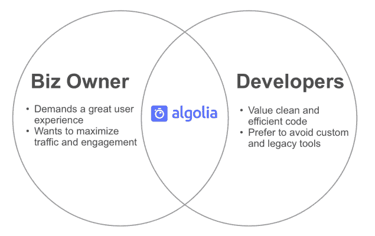

# Algolia 如何帮助电子商务网站搜索改善网站搜索 UX

> 原文：<https://www.algolia.com/blog/customers/how-algolia-helped-improve-ux/>

几年前，当我偶然发现 Algolia 时，我知道这将是我的生意难以置信的，MyCreativeShop.com。作为一个小企业主，提高效率对我来说非常重要。我知道 Algolia 可以把我的工作卸下来，而且比我们做得更好。

我可以详细谈论 Algolia 帮助我们解决的技术问题，但最令人兴奋的部分是为搜索引擎优化我们的网站。我们的业务很大程度上依赖于高转换页面的入站流量。考虑到这些代码对业务的重要性，它们背后的代码是不可靠的。Algolia 帮助我们创建了一个高效、干净的代码库，创造了一个更好的用户体验，并维持了我们一直努力赚取的搜索流量。

如果你运行一个电子商务网站，你知道一个大的产品目录创造了很多搜索引擎优化的机会，但也有很多挑战。在我们实施 Algolia 之前，我们一直在与缓慢的浏览体验、不准确的结果和不太理想的页面搜索引擎优化做斗争。

这些是电子商务网站常见的 SEO 问题(只是冰山一角)。我对这个话题有独特的看法，因为我是 MyCreativeShop.com[的企业主和首席开发人员(是的，我们是一个相当小的团队)。这意味着我必须了解 SEO 的商业含义，并在杂草中做出改变。](https://www.mycreativeshop.com/)

但是不管你的公司规模有多大，解决这些问题的困难通常都是一样的:

作为企业主，我要求用户体验非常好，绝对没有搜索引擎优化风险。交通的每一点都很重要，这也是我关注的焦点。作为开发人员，我总是看到新的闪亮的工具，我渴望利用它们，特别是当它们使我的生活变得更容易时。我重视编码的效率，但不可否认的是，我并不总是能看到代码在业务大局中的位置。

我立刻意识到，阿尔戈利亚可以让两个角色都开心——真的开心。方法如下:

*   *对于企业主* : Algolia 让您的开发团队能够灵活地创建用户体验，并以最适合您的公司和客户的方式实施页面 SEO。把它想象成一种工具，它允许你的开发团队准确地交付你或你的设计团队所设想的东西，但是只需要很少的时间。它可以无限扩展，并且始终可用。
*   *对于开发者来说*:仅仅为了满足管理层看似疯狂的需求而害怕定制产品目录的日子已经一去不复返了。作为一名开发人员，我知道在一个过时的产品目录环境中工作的痛苦，这太可怕了。将你的数据集转移到 Algolia，并开始使用他们的[有据可查的 API](https://www.algolia.com/doc/guides/getting-started/how-algolia-works/) 来处理一切与搜索和目录相关的事情。集成的容易程度令人难以置信。

当我开始集成 Algolia 时，我清楚地意识到这将给我们带来难以置信的灵活性。我花了一天时间——是的，实际上只有一天——将我们的数据与 Algolia 整合在一起。四天之内，我扔掉了旧的目录代码，并从头开始重写了目录中的所有内容。一旦我们的数据被同步，我可以使用难以置信的 API 来支持我们所有的目录搜索、浏览和过滤，这在历史上是非常难以管理的。很快，搜索结果的速度和准确性的任何问题都消失了。

## 更多浏览量，更多流量，更多生意

从技术角度来看，迁移到 Algolia 很容易，但业务方面呢？

自从整合以来，我们看到登陆我们产品目录的访问者转变为付费客户的比率比以前高出 38%。我们将此归因于浏览产品的速度。此外，由于更好的用户体验，每个会话的页面浏览量增加了 200%以上。

Algolia 允许用户利用“前端搜索”或“后端搜索”(你可以在这里阅读每一个)。我们使用两种搜索方法的组合，因为我们在网站和应用程序的多个领域提供搜索。

我们网站最关键的部分就是我们的 [设计模板](https://www.mycreativeshop.com/templates) 。这些页面驱动高意向流量，是驱动新客户的关键。至关重要的是，这一部分的所有页面——模板页面、类别页面和搜索结果页面——都经过了很好的搜索优化。我们需要能够控制页面上的搜索引擎优化下降到微小的因素，如网址结构。

对于我们的前端设计模板，我们认为 [后端搜索](https://www.algolia.com/doc/guides/building-search-ui/going-further/backend-search/in-depth/backend-search-with-an-api-client/) 对我们来说是最明智的决定，原因如下:

*   从页面搜索引擎优化的角度来看，它消除了所有风险。
*   今天的热门术语是“服务器端渲染”，或 SSR。以这种方式使用 Algolia 允许在服务器上生成我们的 HTML(真正的 SSR ),然后显示给浏览器，确保所有的网络爬虫都以同样的方式看到它。
*   这给了我们一定程度的信心，因为我们确切地知道爬虫正在分析什么。
*   它允许我们维护我们现有的 URL 结构，这是至关重要的。

我们还在有密码保护的网络应用中使用搜索功能。SEO 不是一个因素，但是用户体验非常重要。为此，通过 [Algolia 的 instantsearch.js 库](https://www.algolia.com/doc/guides/building-search-ui/what-is-instantsearch/js/) 进行前端搜索是显而易见的选择，因为:

*   快得不可思议
*   有内置的小工具可以帮助我们快速构建用户界面
*   我们没有 SEO 问题，也没有需要维护的传统 URL 结构。

短短几周内，Algolia 让我们能够创造出我们想要的用户体验。速度和准确性显著提高。我们可以精确控制显示结果的方式——通过使用真正的服务器端渲染(SSR)方法，或者通过利用 Algolia 令人敬畏的 [instantsearch.js 库](https://www.algolia.com/doc/guides/building-search-ui/what-is-instantsearch/js/) 。

对我来说，这种灵活性是 Algolia 真正的无名英雄。它让我们睡得很好，因为我们完全可以控制客户如何与我们的产品目录进行交互，以及爬虫如何查看结果。

如果你正在纠结于产品导航和搜索，给 Algolia 看看。你会惊奇地发现曾经困难的事情变得如此简单。