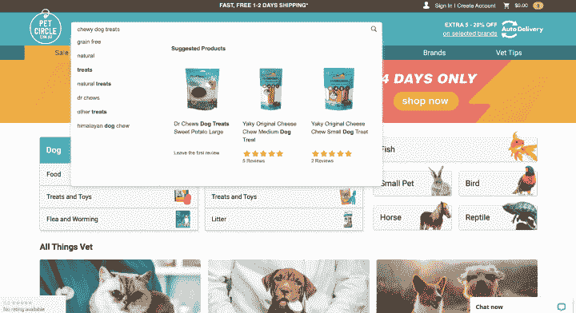
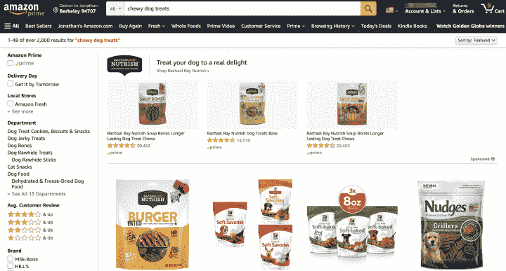
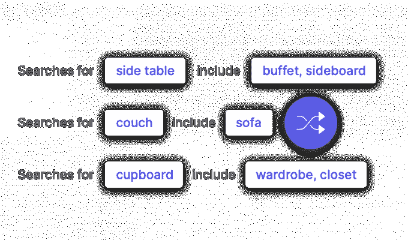
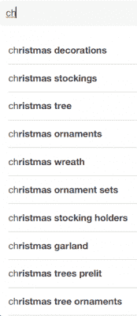
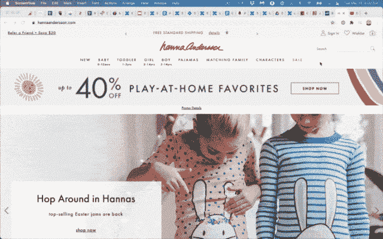

# 搜索引擎查询处理 101 | Algolia

> 原文：<https://www.algolia.com/blog/ecommerce/how-ecommerce-search-engines-handle-different-types-of-queries/>

你在谷歌(或使用另一个流行的搜索引擎，如必应)或你最喜欢的电子商务网站(如亚马逊)搜索时输入一个查询。您希望以搜索引擎结果页面(SERP)的形式获得您的信息检索，该搜索引擎会对您想象中的最佳项目进行“有根据的猜测”,从而为您提供准确的结果。

不幸的是， 许多电子商务商店不提供这种水平的搜索成熟度和搜索引擎优化。

2022 年，Baymard Institute 发布了一份关于 [类电子商务网站搜索查询](https://baymard.com/blog/ecommerce-search-query-types) 的概述，并报告称“42%的网站的电子商务搜索 UX 性能低于可接受水平……。更糟糕的是，8%的网站有一个彻头彻尾的“破碎”的电子商务搜索 UX……”。

这是一个相当严厉的评估，尽管当你考虑到搜索引擎必须做的艰巨工作时，这并不奇怪:正确解析信息、导航和交易搜索查询，并准确确定相关性。

什么样的 [搜索查询](https://www.algolia.com/blog/product/what-is-a-search-query-and-how-is-it-processed-by-a-search-engine/) ？有时购物者确切地知道他们想要什么(例如，他们在社交媒体上看到的东西)，但更多时候，他们盲目地寻找可能的解决方案。

【Baymard 确定的一些查询类型包括:

*   **精确** 搜索类似“苹果 iPhone 13 Pro”
*   **功能相关** 搜索类似“蓝牙音箱”
*   **兼容性** 搜索类似“iPhone 手机套”
*   **症状相关** 搜索类似“清洁 iPhone 屏幕的东西”

面对如此广泛的查询类型，搜索引擎很难解释它们并给出最相关的选择，这是可以理解的。

在这篇博文中，首先我们将看看网站搜索引擎必须应对的各种查询，然后电子商务企业如何通过丰富的搜索索引来满足需求。最后，我们将看看机器学习如何改变游戏，以改善许多查询类型的搜索结果。。

## 搜索引擎如何处理查询

### 按确切名称(如品牌)

大多数电子商务搜索引擎在为精确搜索查询提供 [相关结果](https://www.algolia.com/blog/product/what-is-search-relevance/) 方面做得很好。例如，如果一个宠物主人在一个宠物用品电子商务网站上搜索“Greenies”，他们几乎肯定会看到该品牌的狗和猫。

### 按类型

用户想要什么类型的产品？假设这是一个有嚼劲的狗食。当客户搜索产品类型(“耐嚼”)而不是特定品牌的商品时，搜索引擎会有一段艰难的时间。例如，搜索“耐嚼零食”可能会也可能不会出现用户预想的最佳结果。

Product-type ecommerce search functionality is a bit more hit or miss.

在 Algolia，我们的高级搜索引擎将采用一种策略来解决这个问题，以提供更准确的结果:将“耐嚼零食”的搜索拆分为“耐嚼零食”的搜索。这意味着可接受的搜索结果必须包含描述或元数据中的两个关键字。

(剧透:有了矢量搜索，这些同义词和描述性搜索都是内置的。在这篇文章的后面，我们将与 AI 进行更多的交流。)

### 通过症状

如果购物者不是在寻找一种产品，而是在寻求帮助摆脱令人讨厌的症状，那该怎么办？搜索数据显示，人们经常目光短浅地关注一个他们迫切想要解决的问题，比如 a:

*   漏水的水龙头
*   偏头痛
*   染色地毯

他们只知道他们有一个紧急的问题。当然，他们在寻找解决方案，但他们通常不知道需要什么特定的产品来缓解压力。

在这种情况下，网站访问者的搜索结果通常是广泛的，因为搜索者对一系列可能的解决方案持开放态度。例如，“偏头痛”搜索结果可以提供止痛药、自然疗法、冷敷、头套、泡沫滚轴，以及更多的[。](https://www.esquire.com/lifestyle/health/g36212914/best-migraine-relief-products/)

不同的电子商务搜索引擎处理这些类型的查询通常略有不同。

一些搜索引擎会给你索引中的每个文档分配一个相关性分数。分数范围从 0(不匹配)到 1(完全匹配)，搜索结果从分数最高的开始排序。

Algolia 使用平局决胜算法对项目进行排序。它首先对所有 *精确匹配的* 进行排序。当有多条记录完全匹配时，它会使用一系列测试来打破平局。首先，它根据地理位置进行排名(如果用户打开了该功能)，例如，首先是最近的餐馆。然后，它计算匹配的单词数(匹配越多，排名越高)，直到每个记录都找到自己的位置。

关于拼写，如果一个拼错的单词与内容中的一个拼错的单词相匹配，则被视为完全匹配。如果没有，Algolia 允许最多两个字母的拼写错误，但在平局决胜顺序中，拼写错误的术语排名较低。

最后，该算法根据业务目标应用特定于业务的标准来调整排名。例如，一家公司可能希望在人们搜索结果的开头推广其高利润或热门商品。

## 开始搜索指数很大

如果您想提高零售网站搜索返回最佳、最相关结果的几率，并帮助改善您的客户体验和搜索转化率，这一切都要从构建丰富的 [搜索索引](https://www.algolia.com/blog/product/what-is-a-search-index-and-how-does-it-work/) 开始。无论您是使用产品信息管理系统(PIM)还是直接在您的在线商店 CMS(例如[Shopify](https://www.algolia.com/search-solutions/shopify/))中编写产品描述，为了提供高质量的结果，您需要构建一个强大的内容索引，其中包括产品属性，例如:

*   产品名称或标题
*   产品数据
*   产品类别
*   产品描述和/或类型
*   图像 alt 标签
*   颜色、尺寸、数量等附加元数据
*   产品评论
*   相关产品(这也可以从类别中推断出来)

然后，当有人搜索某样东西时，他们更有可能得到正确的结果。像“耐嚼的狗零食”这样的东西，搜索引擎会把它们放在正确的产品推荐栏里，就像亚马逊在这里做的一样:

Amazon’s index allows it to provide on-target search results.

正如网络营销人员尼尔·帕特尔指出的，许多网站缺乏足够的描述性数据。添加所有正确的信息不仅能增强你的产品页面，还能为搜索引擎提供强有力的线索，让它们抓取你的索引。

### 正确归类和标记

对产品进行分类和标记的过程可以改善用户的搜索结果，并帮助人们通过分类导航而不是搜索框来浏览网站。理想情况下，分类页面和/或标签将出现在索引数据中，为搜索引擎提供额外的元数据。类别可以作为元数据添加，甚至可以通过站点的 URL 结构推断出来。比如:

*   www.example.com/product/jackets
*   【www.example.com/swimwear/bikinis 
*   www.example.com/shoes/loafers

搜索引擎可以从这些 URL 中提取有用的类别和子类别数据(如“泳装”和/或“比基尼”)，以便从一开始就返回准确的结果。

你们提供分面搜索吗？类别还用于在搜索结果页面上构建 [过滤器和](https://www.algolia.com/blog/ux/filters-vs-facets-in-site-search/) 方面。

一个好的产品分类法不仅仅有助于现场搜索，它还有助于[SEO](https://www.algolia.com/blog/ux/google-core-web-vitals-seo-rankings-search-bar-optimization/)和网络搜索引擎。当提供结构化分层数据时，爬虫工作得最好。附加标记(例如，添加颜色作为属性)可以极大地改善结果。

构建丰富的描述性数据时需要考虑的一些事情:

*   如果你销售 **零件，** 添加相关品牌或商品，它们会与很好地搭配
*   对于 **维生素和补充剂，** 分别说明各自有助的情况(如维生素 D 缺乏)
*   为 **服装、** 添加颜色、尺寸和兼容物品

**注意:** 分类和标签太多都有可能；你需要找到一个平衡点，既要添加足够有用的内容，又不能太多以至于影响浏览。

### 非产品搜索引擎查询

电子商务网站访问者只寻找产品，对吗？不总是。有时，他们只是希望搜索工具帮助他们找到运输信息、退货政策、支持、跟踪、工作或其他信息。所以，如果你的网站搜索只索引你的产品信息，那就错过了众所周知的只见树木不见森林。

您的搜索提供商可以:

*   索引整个网站，而不仅仅是产品
*   使用机器学习理解用户查询的上下文
*   设计搜索结果页面来表示不同类型的内容

### 同义词

人们可以通过输入您通常用来描述产品的词语的同义词进行搜索。或者当他们表示“英寸”时，他们可以键入缩写“in”；这会混淆搜索引擎。这就是为什么我们建议您利用您的搜索分析——无论是来自 Google Analytics 还是您的搜索平台附带的指标包——来了解访问者在搜索中使用的其他关键字。

Product-type synonyms can help provide relevant search results.

借助强大的 [同义词管理](https://www.algolia.com/doc/guides/managing-results/optimize-search-results/adding-synonyms/) 和良好的机器学习能力来开发对搜索者意图的理解，可以为他们提供更好的搜索体验。

一个警告:为查询中的每一个单词开发同义词——尤其是那些非常微妙的术语——实际上是不可行的。但随着时间的推移，如果有足够多的人在查询中使用缩写或口语术语，人工智能搜索引擎可以做出调整，以提供更好的转换结果。

## 搜索人工智能、数据、查询理解

到目前为止，我们已经讲述了改善搜索索引的重要性。让我们来看看提高查询搜索相关性的一些方法。

### 机器学习

基于人工智能的搜索通过智能反馈循环的持续和自动改进提供了巨大的力量:从搜索和销售中产生的数据越多，搜索引擎就越能有效地随着时间的推移自动改进结果。

内置搜索 AI 收集搜索历史，随着时间的推移了解访客在寻找和购买什么，无论是品牌名称还是具体功能，还是像“新娘母亲的惊艳秋装”这样的长尾关键词查询。通过了解哪些搜索导致转化，搜索引擎可以自动为类似的搜索提供更高的转化结果。

很快，最好的电子商务搜索引擎将包括向量——一种表示单词的数学方法，它有效地概括了文本的含义，并可以提供比标准关键字搜索更好的结果。[矢量搜索](https://www.algolia.com/blog/ai/what-is-vector-search/)支持更相关的长尾、非关键词聚焦的查询。

### 自然语言处理

搜索语言通常是模糊的，因为用户的意图并不总是显而易见的。“银行”是一个经典的例子:—搜索者是指金融机构还是河边？

对于一些电子商务网站搜索用例，客户可能会键入症状或形容词来寻找答案。如果没有添加上下文或提及特定产品，就很难确切知道他们需要什么。

[自然语言处理](https://www.algolia.com/blog/product/what-is-natural-language-processing-and-how-is-it-leveraged-by-search-tools-software/) (NLP)，分析非结构化文本以推断结构和含义的过程，是一种可用于改进搜索结果的技术。在这个上下文中，“结构”意味着高度定义的信息，例如，类别或数字，很像数据库中的字段。它还可以表示事物之间的关系。常见的例子包括大小、颜色、地点、名称、时间、实体和意图。

当底层数据具有可以从查询映射的重要结构时，NLP 最有价值。例如:“75 美元以下的男式 14 码耐克鞋”。在这种情况下，可以对数据进行结构化，并根据产品类型、性别、尺寸、价格和其他属性自动应用过滤器。

NLP offers user-friendly search capabilities.

### 个性化

如果有人访问您的网站并搜索“温暖的夹克”，您可以使用 [搜索个性化](https://www.algolia.com/blog/ux/search-personalization-101/) 提供针对其特定个人需求定制的不同结果。一般来说，你拥有的关于某人的数据越多(例如，访问过的页面、购买历史、性别、年龄)，你就越能个性化他们的搜索结果。

即使访问者是匿名的，使用可用的数据，如浏览器类型、IP 位置、一天或一年中的时间、移动搜索与桌面搜索以及其他属性，对“保暖夹克”的搜索也可以是个性化的。

在“保暖夹克”的例子中，你可能向佛罗里达州和明尼苏达州的人推销不同的服装。虽然您可能对用户一无所知，但您仍然可以根据他们的 IP 位置对搜索结果进行个性化设置。

### 规则

大多数 [搜索服务](https://www.algolia.com/blog/ux/what-is-search-as-a-service/) 提供了一个功能，让您添加规则(或调整搜索算法)来处理不同类型的搜索。

Configuring search relevancy

规则有助于解决困难的搜索查询，它们提供了另一种方式来提供符合零售商产品展示标准的结果，例如，畅销书、高或低库存水平、用户的位置、价格、商品、购买历史。

## 产品搜索可用性

在您的搜索栏中添加 [自动完成或即时搜索](https://www.algolia.com/blog/product/creating-an-end-to-end-search-experience-with-autocomplete-and-instant-search-results/) 功能可以进一步增强搜索体验，并可以帮助访问者输入更好的查询。额外的好处:它帮助人们消除错别字，这可以进一步加快他们的搜索速度。

### 自动完成

自动完成用户体验——也称为查询建议、提前键入或自动建议——在用户在搜索栏中键入时为他们提供查询建议，使用分析(热门搜索)和上下文来预测他们正在寻找的内容。

Autocomplete enables users to find the right information faster.

自动完成功能可以引导访问者更快地找到正确的类别或产品页面，并表明你提供了他们想要的东西。虽然 autocomplete 并没有提高搜索引擎处理不同类型查询的能力，但它对于提供有用的结果、更快地消除不相关的结果以及促进优秀的网站整体可用性是非常有益的。

### 即时搜索

或者，即时搜索不是实时接收查询建议，而是在用户键入他们的查询时实时刷新 *实际搜索结果页面* 。这被称为即时搜索或键入时搜索。在顾客输入完他们的查询之前，图片搜索结果几乎神奇地出现了

instant search results on HannaAnderson.com

## 搜索电子商务成功解决方案

在处理不同类型的搜索查询时，电子商务平台可能会受到挑战的束缚。虽然你显然不能读懂你的访问者的想法，但一个由正确的人工智能驱动的好的搜索引擎在计算出他们的搜索词并满足他们的需求方面似乎具有积极的洞察力。

无论你有几百个网页还是几百万个 SKU，Algolia [都能让你的电子商务搜索覆盖](https://www.algolia.com/industries-and-solutions/ecommerce/) 尖端的功能和速度，加上一个新的混合 API。注册一个 [免费试用版](https://www.algolia.com/users/sign_up) 或个性化产品 [演示版](https://www.algolia.com/demorequest/) ，看看我们如何帮助您熟练地处理访客的搜索查询，并通过虚拟收银台快速获得它们。