# 我如何用 Algolia  重新创建 r/place

> 原文：<https://www.algolia.com/blog/engineering/how-i-recreated-r-place-with-algolia/>

你可能听说过 r/place，一个由 Reddit 在四月的第一周创建的合作像素艺术项目。

如果你不知道 r/place 是什么，这是 Reddit 在 2017 年推出的一项实验:由数十万用户同时制作的合作创建的像素艺术画布。今年四月，他们又做了一次，这次用了更大的画布。

> 了解 Reddit 如何构建 r/place
> 
> [https://www.redditinc.com/blog/how-we-built-rplace/](https://www.redditinc.com/blog/how-we-built-rplace/)

我亲自参加了这个项目。也许你也是！我在这里和那里放置了一些像素，非常喜欢。

这也让我开始思考。我想知道我是否可以利用 Algolia 的能力及其快速索引/浏览功能来创建一个受 r/place 启发的实时实验。

## [](#from-idea-to-first-draft)**从构思，到初稿**

最初的想法是创建一个索引，包含几百条[记录](https://www.algolia.com/doc/guides/sending-and-managing-data/prepare-your-data/in-depth/what-is-in-a-record/) &，每行呈现一些点击，使用 CSS grid 来放置它们。

每条记录是一个像素，每条记录包含以下属性:

```
{ 
  "objectID": 0, 
  "id": 0,
  "bg_color": "#FFF", 
}
```

我使用了 [`algoliasearch`包](https://www.npmjs.com/package/algoliasearch)，来呈现我页面上的每一条记录。

这个想法非常简单:每个记录(或点击)是一个 div，每个 div 是一个像素。div 的背景色是点击的`bg_color`值。

当你点击那个 div 时，它发送一个`index.saveObject()`到 Algolia，并用你选择的颜色替换`bg_color`属性。

基本上，它是这样工作的:

```
<main className="canvas">
  {allHits.map((hit) => { 
     return ( 
      <div 
        data-cell-id={hit.id}
        key={hit.objectID}
        onClick={(e) => handleClick(e, hit)} 
        style={{ 
          background: hit.bg_color, 
        }} /> 
      ); 
    })} 
</main>
```

而在 JS 这边:

```
const handleClick = (e, hit) => { 
  e.target.style.background = pickedColor;
  index.saveObject({ 
    objectID: hit.objectID,
    bg_color: pickedColor,
    id: hit.id, 
  });
};
```

对于调色板，我创建了一个简单的`Palette`组件:

```
// import colors from "constant/colors" which is an array of colors 
<div>
 {colors.map((color) => ( 
   <button 
      key={color}
      onClick={(e) => { e.preventDefault(); setPickedColor(color); }} 
      data-color={color} 
      style={{ 
        background: color, 
        appearance: "none", 
      }} /> 
  ))}
</div>
```

因为 Algolia 根据它的默认排序算法([排序公式](https://www.algolia.com/doc/guides/managing-results/must-do/custom-ranking/#algolias-ranking-strategy))对结果进行排序，所以我必须进入我的索引设置，删除排序配置中的所有内容，以防止点击被“随机”呈现，并使用 ID 属性和升序排序将像素按从 1 到 x 的正确顺序排列。

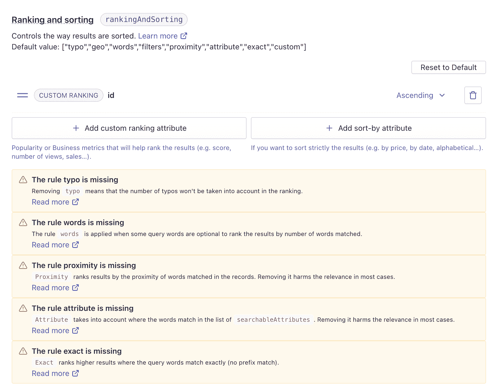

Algolia’s ranking and sorting index settings

现在基础已经就绪，是时候点击一下，看看它会如何渲染了。这是我生成的第一批截图之一。我很高兴看到这个想法仍然存在，并且正在发挥作用！

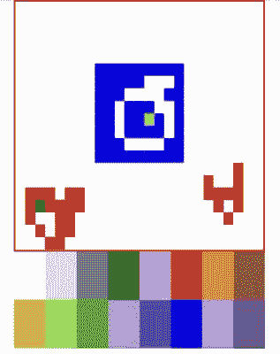

First screenshot I did of the rendered canvas

我需要提到的是，我计划让它实时工作，这意味着当其他人参与时，当你在画布上时，你将能够看到像素被着色。

为了实现这一点，也为了避免等待服务器对像素着色的响应，我需要使用所谓的"*"*

 *> ***乐观 UI*** 是一种模式，您可以使用它来模拟突变的结果，甚至在收到来自服务器的响应之前更新 UI。

来自:[apollographql.com](https://www.apollographql.com/docs/react/v2/performance/optimistic-ui/)

## [](#)

## [](#let%e2%80%99s-dive-deeper)让我们潜得更深！

既然我对自己想要什么以及如何实现有了一个基本的想法，我决定用 [Vercel](https://vercel.com/) 来托管它。我已经在使用一个 [NextJS](https://nextjs.org/) 应用，这是我选择的框架，而且我有一个 Vercel Pro 账户。Vercel 最后非常有用！稍后我会解释原因。

然后我更深入，从几百条记录到一千条；一幅 1000 像素的画布，可以开始“着色”我和几个同事聊了一下，他们就在我收拾自己乱七八糟的代码的时候开始玩了。

画布现在看起来像这样:

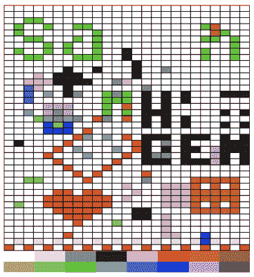

The canvas when people started trying it

我认为添加边框是个好主意，这样你可以看到你点击的地方，这也清楚地表明“*像素*”并不完全是正方形。对于无边框版本来说，这很容易猜到，但这使得它更加清晰。这是我最终解决的问题，在未来的迭代中使像素平方。

这就是事情变得有趣的地方:我的同事开始发送改进想法和修复“错误”的方法，这些错误实际上是 Algolia 的功能。例如:

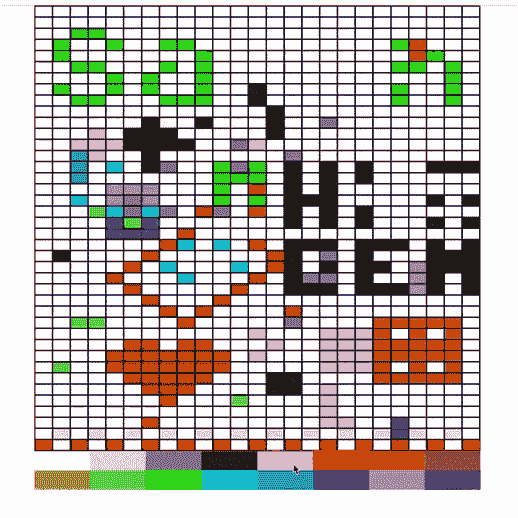

On this gif we can see that clicking on a color will fetch the cached state of the canvas

当你点击时，颜色被应用；然后，当您选择另一种颜色时，先前单击的像素会恢复为其先前的颜色。这是因为 Algolia 的响应是缓存的，单击调色板会触发组件更新，所以它会显示缓存的响应。

为了解决这个问题，我的同事[莎拉·达扬](https://twitter.com/frontstuff_io)建议使用 Algolia 提供的`NullCache`方法，如下所示:

```
import { createNullCache } from "@algolia/cache-common";
import algoliasearch from "algoliasearch";

export const searchClient = algoliasearch(
  process.env.NEXT_PUBLIC_ALGOLIA_APP_ID!,
  process.env.NEXT_PUBLIC_ALGOLIA_BROWSE_API_KEY!,
  {
    responsesCache: createNullCache(),
    requestsCache: createNullCache(),
  }
); 
```

*`NullCache`表示不会缓存请求和响应。每个方法调用都会发出一个 API 请求。[阅读更多](https://www.algolia.com/doc/api-client/getting-started/customize/javascript/?client=javascript#caching-requests-and-responses)*

## [](#)

## [](#scaling-up-the-canvas)**放大画布**

接下来，我在索引中添加了一些点击，并将画布放大到包含 **4020** 像素的网格。我把链接发给更多的朋友，他们开始玩它。

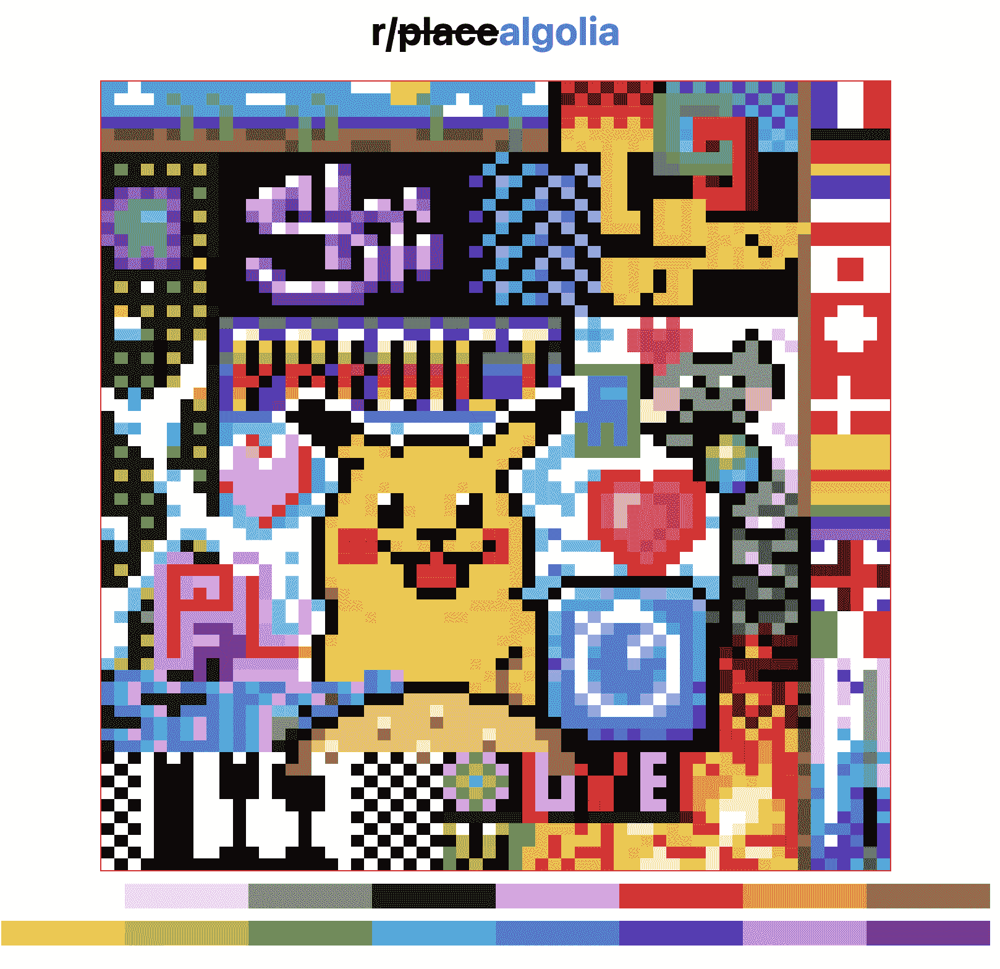

The canvas after some talented folks started drawing in it ⚡️

这给了我足够的反馈来改进应用程序的代码。

我还使用 CSS 将光标颜色替换为用户选择的颜色，这样他们就可以看到将要应用的颜色。

为了实现这一点，我将这部分 CSS 添加到我的主页面组件中，这样它就可以使用`pickedColor`状态:

```
const css = `
  html,body,button { 
     cursor: url("data:image/svg+xml,%3Csvg 
			xmlns='<https://www.w3.org/2000/svg>' 
			viewBox='0 0 48 48' width='32' height='32' 
			style='transform: translate(10px, 10px); 
			enable-background:new 0 0 19.9 30.8' 
			xml:space='preserve'%3E%3Cpath d='...' fill='${pickedColor.replace(
       "#",
       "%23"
     )}'/%3E%3Cpath d='...'/%3E%3C/svg%3E")10 10, auto} 
     `; 
```

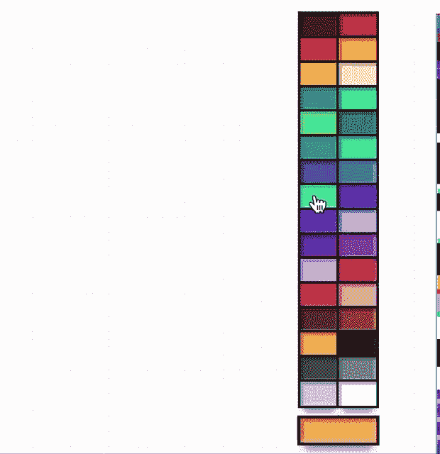

The cursor color changing on click

## [](#implementing-the-user-counter)I **实现用户计数器**

我认为实现一个用户计数器来显示有多少人同时在画布上是一个好主意。

对于用户计数器，我用 [socket.io](https://socket.io) 做了一个项目，托管在 Heroku 上，用`io.sockets.on('connection', (socket) => { ... })`的方法统计用户数。每当用户连接时，就会向客户端发送一条`socket.emit('user_connected')`消息。这将向我显示同时连接到画布的用户数量。为了保持最新的用户数量，我设置它在用户断线时发送一条`socket.emit('user_disconnected')`消息。

设计非常简单，但我不需要更多的东西:

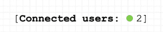

The pretty basic user counter

## [](#)

## [](#first-drawings)第一张图纸

在这一点上，画布上出现了一些图形，但是有一个重要的问题:**索引 API 键被公开**，这将允许人们破解它，并使用批处理请求更改像素的颜色。

为了解决这个问题，我决定使用 [NextJS API routes](https://nextjs.org/docs/api-routes/introduction) 来处理请求，并对我的 API 密匙保密。还记得我说过 NextJS 最终非常有用吗😊？

缺点是索引时间略有增加，但对我来说，这没什么，因为它只有几秒钟，而且那个项目是一个实验，一个概念的证明。

所以将 API 调用延迟几秒钟是完全没问题的。另外，还记得乐观的 UI 方法吗？这给用户留下了快速的印象，所以一切都很好。现在，每当用户点击一个像素时，这个函数被调用:

```
const handleClick = async (e, hit) => {
    // if the color of the clicked element is the same as the color of the current hit
    // Do nothing
    if (
      e.target.style.background !== hexToRgb(pickedColor!)
    ) {
      e.target.style.background = pickedColor || "";
      await fetch(`/api/indexData`, {
        method: "POST",
        body: JSON.stringify({
          objectID: hit.objectID,
          bg_color: pickedColor,
          id: hit.id,
        }),
      });
    }
  }; 
```

并且在 API routes 文件夹内移动这个索引代码，`api/indexData`允许我在 API 端点内执行我的函数，安全地保存我的敏感数据。

正如您所看到的，单击已经具有相同颜色的像素不会有任何作用，因为更新具有完全相同的`background_color`值的记录是没有意义的，所以这一步消除了一些索引操作。

## [](#)

## [](#making-the-canvas-interactive)**制作互动画布**

现在是有趣的部分:让画布互动。如前所述，当有人点击一个像素时，一个`index.saveObject()`呼叫就会被发送到 Algolia。

我希望协作体验能够实时发生，所以我需要稍微突破一下极限。[出于性能考虑，Algolia 的默认分页设置为**1000 次点击**](https://www.algolia.com/doc/guides/building-search-ui/ui-and-ux-patterns/pagination/react/#pagination-limitations) ，而[的点击上限为**每页 1000 次**](https://www.algolia.com/doc/api-reference/api-parameters/hitsPerPage/#usage-notes)，因此我需要找到一种方法，在不分页的情况下一次性获得所有记录。

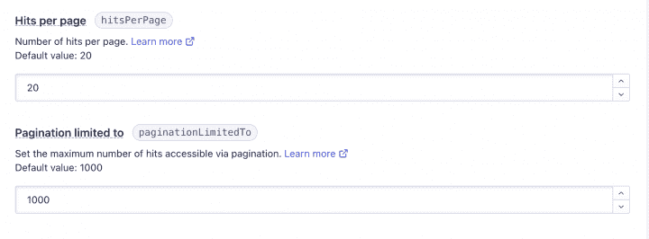

Pagination & Hits per page settings of Algolia

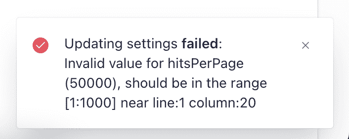

Error message stating that 50000 is too big for the hitsPerPage

这就是 Algolia 的浏览方法派上用场的地方。我每隔几毫秒运行一次查询(准确地说是 **600 毫秒**，它浏览了整个索引，并将所有命中结果放入一个数组中。
代码如下:

```
 useEffect(() => {
	  const id = setInterval(() => {
	    let hits = [];
	    index
	      .browseObjects({
	        query: "",
	        batch: (batch) => {
	          hits = hits.concat(batch);
	        },
	      })
	      .then(() => {
	        setAllHits(hits);
	      });
	  }, 600);

	  return () => {
	    clearInterval(id);
	    setIsLoading(false);
	  };
}, [allHits, shouldFetch]); 
```

那工作得很好！令人惊讶的是，Algolia 每隔 **600 毫秒**一次更新数千个项目，而不会冻结甚至变慢。

## [](#much-more-space)**多了很多空间**

是时候把它变得更大了。

我的朋友凯文·格兰杰提出了一种方法，将画布从之前的 4020 像素放大到四倍，这就是我们最终完成这幅画布的原因。我们还修改了每行的像素数量，最终得到了一个**16080**像素的画布！

这是最终的结果:

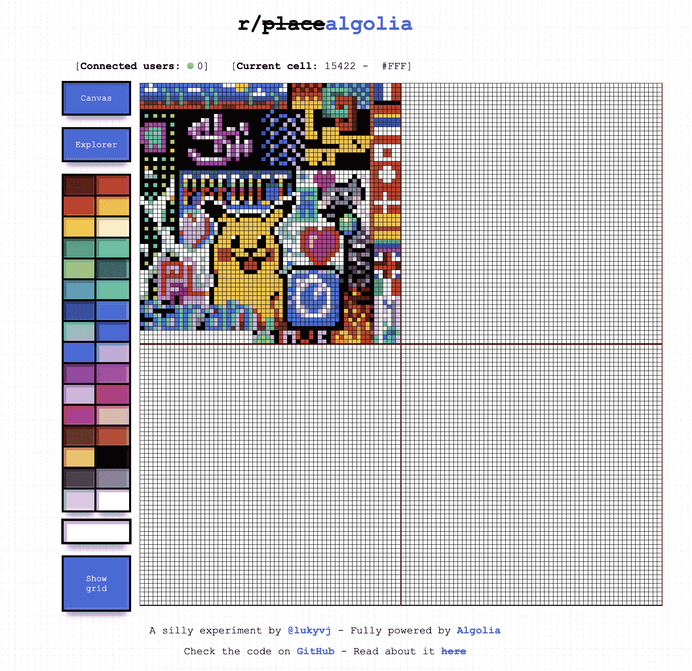

## [](#even-bigger)**甚至更大的**

当人们开始使用画布时，我认为把它做得更大会更好，这样可以画更多的东西，人们也有空间释放他们的创造力。我只对公司人员开放。最多的时候，大约有 18 个 T2 人同时使用它，这导致了一场小的像素战争。但这对我来说还不够。

因此，我将空间增加了一倍多，从**的 16080 次**点击增加到包含**的 36180 次**点击的最终大小，以允许更多的绘图并增加实验的趣味性。

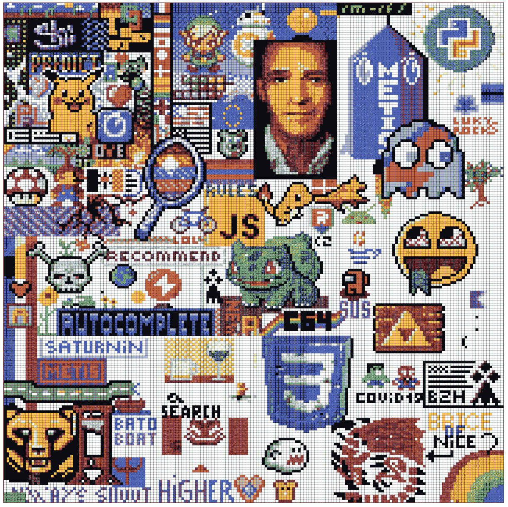

Final canvas form with the grid shown

看到人们共同创造像素艺术真的很有趣。这是我为了捕捉历史而制作的一个画布探索者的录音。这描绘了最初几天的活动:

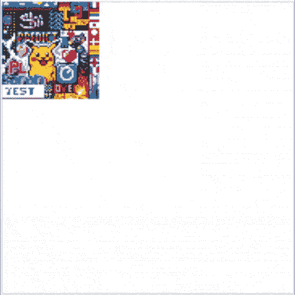

How I recreated r/place with Algolia

## [](#how-i-built-the-canvas-explorer-that-allows-me-to-replay-the-whole-canvas-history)**我是如何构建画布浏览器的，它允许我重放整个画布历史。**

每隔 10 分钟，Heroku 上托管的节点脚本将以与每 600 毫秒刷新画布时相同的方式查询索引，这意味着它使用 Algolia browse 方法并将所有命中连接在一个颜色数组中。

颜色保存在仅包含三个属性的新对象中:

```
{
    "objectID": "unix timestamp",
    timestamp: unixTimestamp,
    snapshot: [...]
} 
```

该快照是代表 **36，180** 种颜色的值的数组。然后在 Algolia 索引中对其进行索引，使用`timestamp`属性进行排序，从而使历史保持正确的方向。


All the attributes inside one of the explorer’s hit

起初，我使用的是全色值，例如:

```
snapshot: ['#FFFFFF','#FFF000','#FFF000'...] 
```

但是我受到了 Algolia 的限制，因为最终的记录大小太大了([记录大小限制](https://support.algolia.com/hc/en-us/articles/4406981897617-Is-there-a-size-limit-for-my-index-records-/))，而且由于性能原因，不能被索引。

因此，需要将颜色从十六进制的 **6 位数字**减少到十六进制的 **3 位数字**，并且我还删除了`#`符号，从而产生了一个更小的数组，从而改善了 hit 的整体大小。

所以这个:

```
snapshot: ['#FFFFFF','#FFF000','#FFF000'...] 
```

变成了这样:

```
snapshot: ['FFF','FE0','FE0'...] 
```

现在我有了一切工作，并能够从头开始播放画布的演变。我喜欢从事这个有趣、有创意的项目，在这个过程中我学到了很多东西。我也喜欢它被公司如此热烈地接受的方式。

希望你喜欢这本书；如果你想了解更多，不要犹豫，在 Twitter 上 ping 我[！](https://twitter.com/lukyvj)

**[这里](https://github.com/LukyVj/rplace-algolia)，你会找到该项目的 Github 资源库。**

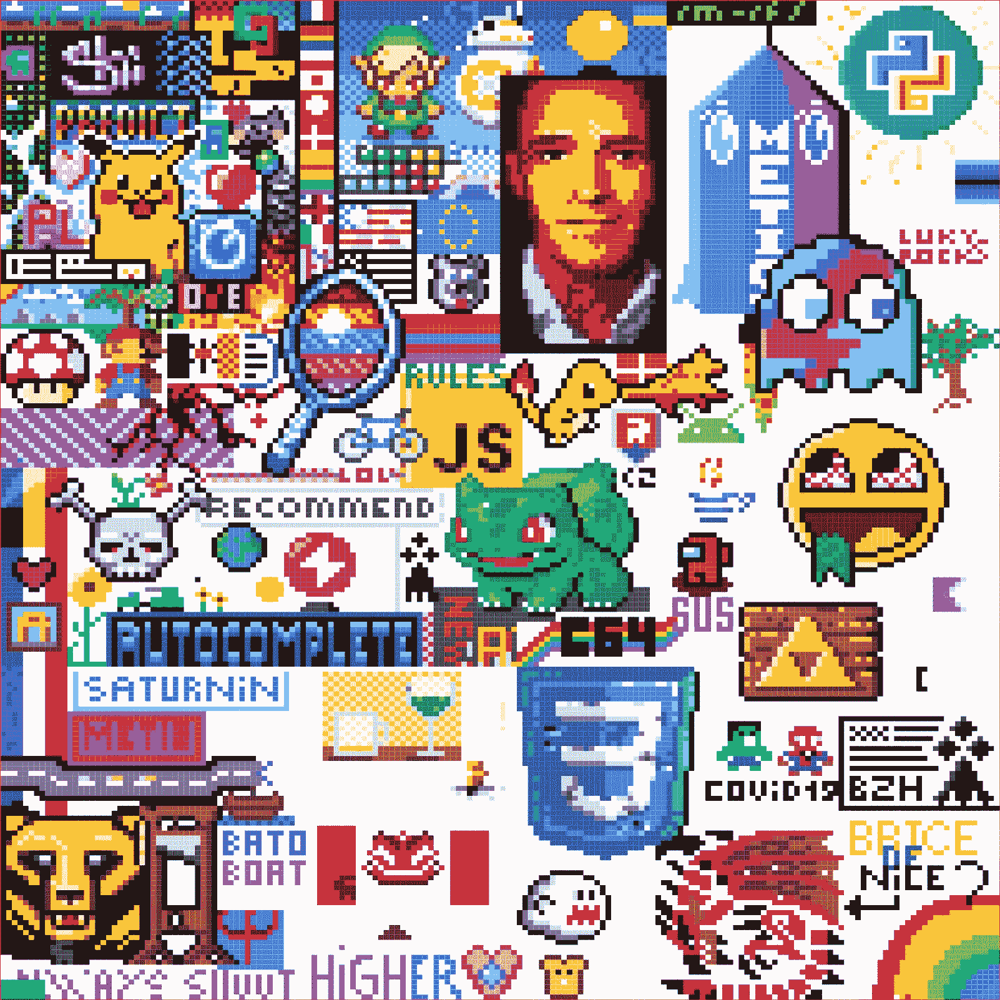

State of the canvas on April 22, 2022*