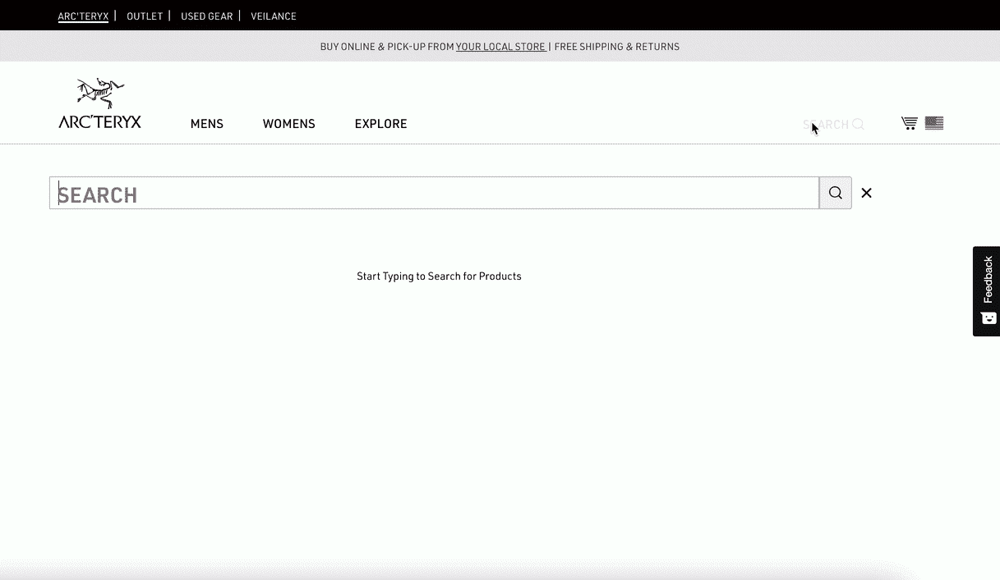
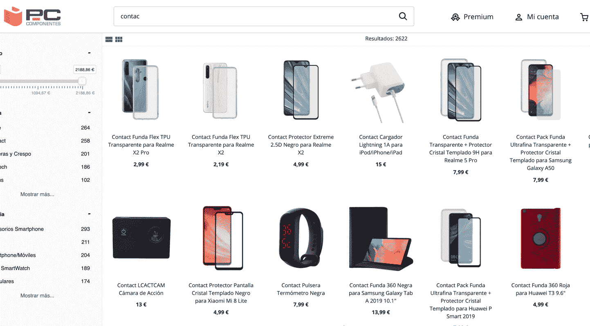
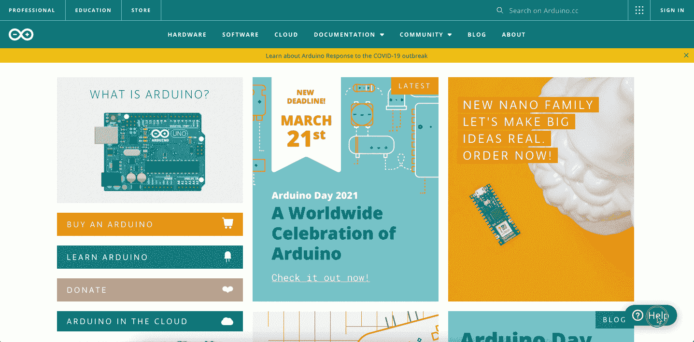
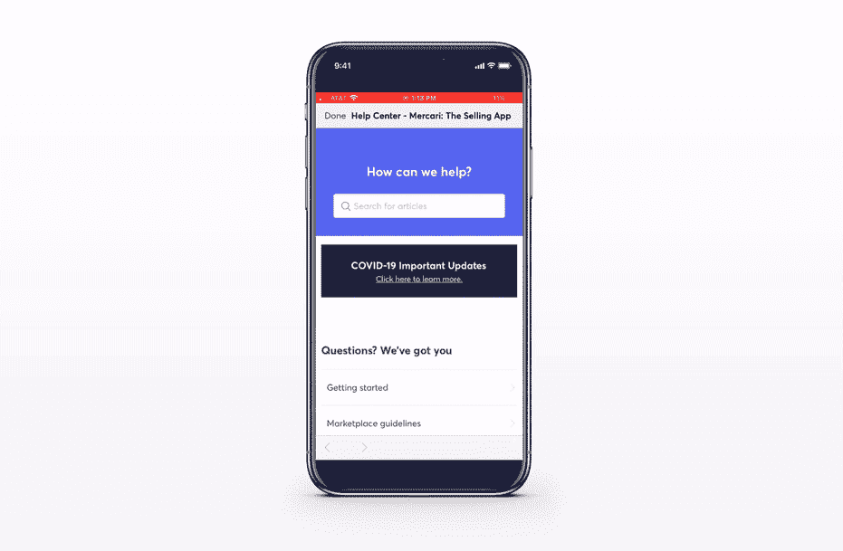

# 通过电子商务客户服务提高投资回报率

> 原文：<https://www.algolia.com/blog/product/how-leading-ecommerce-companies-increase-brand-loyalty-by-offering-a-fast-informative-customer-service/>

客户服务在任何公司的销售和增长战略中都占有很大一部分。毫无疑问，卓越的客户服务有着令人印象深刻的投资回报率。根据最近发布的[sales force Research](https://c1.sfdcstatic.com/content/dam/web/en_us/www/documents/research/salesforce-state-of-the-connected-customer-4th-ed.pdf)的研究，89%的客户更有可能再次购买，78%的客户愿意在一次失误后再次做生意，因为这是一次积极的客户服务体验。

企业在客户服务团队和支持方面的支出每年都占据企业预算的很大一部分，并分散到多个在线业务和行业，如零售、电子商务市场、媒体、SaaS 和社交媒体。尽管支持成本很高，但糟糕的客户服务对公司盈利能力的影响是巨大的。糟糕的客户服务导致 58%的客户愿意换公司，根据 [微软](https://clouddamcdnprodep.azureedge.net/gdc/gdcPiLLQw/original?ocid=mkto_eml_EM582302A1LA1) 的分析。此外，根据 Zendesk 的报告，如果这种经历重复一次以上，这一数字将增长到 80%。

随着消费者行为向在线空间的巨大转变，公司必须适应新的用户行为和客户期望，以便保持相关性并优化其交易流程和用户旅程。

## 为什么要投资自助式客户支持？

根据 [Zendesk](https://d1eipm3vz40hy0.cloudfront.net/pdf/cxtrends/cx-trends-2020-full-report.pdf) 的客户体验趋势报告，消费者对独立解决问题有明显的偏好，69%的消费者倾向于独立查找支持相关信息。不幸的是，只有三分之一的公司向客户提供自助服务选项，如知识库。根据 [ICMI 分析](https://www.icmi.com/resources/2019/the-metrics-of-contact-center-productivity) ，如果将每次呼叫的实时帮助/支持服务成本(平均约为 6 美元)计算在内，自助式客户支持代表着客户和公司的双赢局面。

## 客服中心:零售

在线零售公司通过将支持相关内容集成到联合搜索体验中，在用户输入客户服务相关查询时显示支持横幅，并在网站上提供易于发现的专用支持中心部分，为客户提供无缝的客户之旅。

### 重定向至客户支持页面上与体育相关的帮助查询&商品零售商:Arc'teryx

当体育零售商 Arc'teryx 的电子商务网站上的客户输入与客户服务和支持相关的查询时，他们会被引导至专门的支持页面，无需花费时间浏览网站。

【T2

### 支持横幅搜索电子桌面:PC 组件

当用户在搜索框中输入与支持相关的查询时，西班牙电子网站 PC Componentes 会将用户引导至全面的支持资源页面。

### 零售商客服页面高亮显示和截图:Arduino

Arduino 在其帮助中心网站上使用 Algolia 高亮和剪贴功能。高亮显示向用户显示为什么 Algolia 显示一个特定的结果，而 snippeting 提取相关的上下文。

## 客户支持中心:商场

电子商务品牌和市场通常会处理包含数十万种产品的大型目录。集成支持中心使他们能够在用户寻求帮助时将他们与最相关的帮助中心资源联系起来。用户可以轻松、灵活地获得所有必要的信息，而不必花时间打电话给客户支持热线，也不必长时间等待客服代表或浏览网站搜索信息。

### 帮助中心搜索移动市场:Mercari

当 Mercari marketplace 购物者搜索特定问题时，界面会自动将他们引导至最相关的支持资源。

**成功指标:** Mercari 能够通过 Algolia 搜索功能为用户提供卓越的搜索和发现性能。用户查询返回的搜索结果和响应时间快如闪电，相比之下，平均等待时间和与呼叫中心现场客户服务代表的交谈时间，或用户浏览网站以搜索支持相关资料的时间更长。

*   整体 500 毫秒，端到端延迟
*   平均搜索延迟小于 200 毫秒

## 结论

客户服务是任何电子商务公司销售和增长战略的重要组成部分。出色的客户服务体验，以及由此带来的客户满意度的提高，有助于销售工作，有利于投资回报和客户维系。在极端的客户至上方法的时代，有时被称为[客户痴迷](https://www.zendesk.com/blog/customer-obsession/)——这是主要行业领导者设定的趋势——客户对每个电子商务网站或应用程序都有很高的期望。为你的客户提供低于标准的客户服务的风险转化为客户对你的竞争对手的忠诚度的损失。此外，自助服务解决方案的重要性正在上升。随着越来越多的客户倾向于独立寻找支持相关问题的答案，支持服务解决方案必须不断发展，以跟上新的趋势和期望。