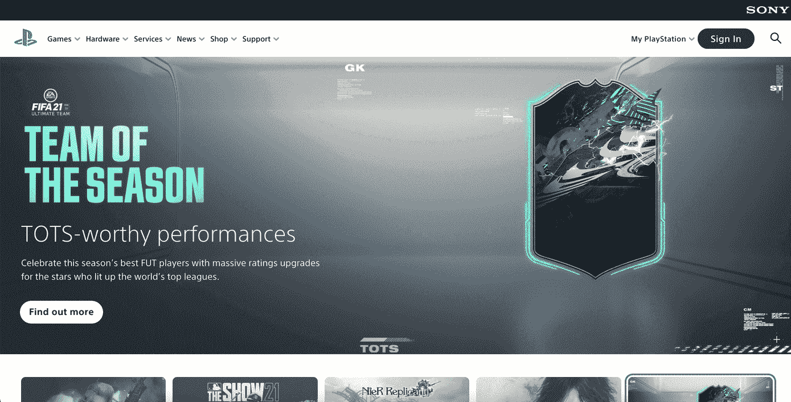
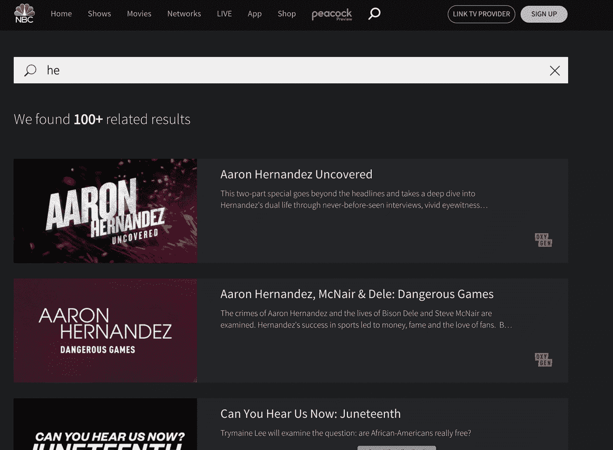
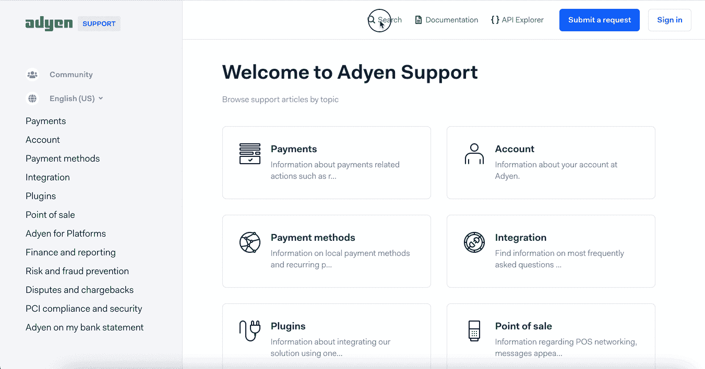

# 客户支持软件的投资回报率和品牌忠诚度

> 原文：<https://www.algolia.com/blog/product/how-leading-media-gaming-and-saas-companies-increase-brand-loyalty-by-offering-a-fast-informative-customer-service/>

今天的消费者期望的不仅仅是标准的客户服务，还包括他们访问的每个网站上的全面、响应迅速的自助服务支持。客户希望公司为他们提供与大型行业领导者相同的体验，这些领导者为他们可能遇到的任何服务相关问题提供卓越的支持解决方案。

我们倾向于将客户服务与零售和电子商务行业联系起来，但随着零售巨头向新行业扩张，他们对在线支持也抱有同样高的期望。媒体、游戏、SaaS 和其他行业现在有望通过现场代表和自助服务解决方案(如易于搜索的帮助中心、聊天机器人和人工智能生成的自动答案)提供一流的客户体验。

## 客服中心:媒体

高效的自助服务支持中心对于基于订阅的服务非常重要。一方面，客户从轻松找到所有支持相关问题的答案中获得了巨大的好处，而不必仔细浏览网站上的各个页面，这不可避免地会导致搜索疲劳和沮丧。

另一方面，组织本身受益于消除或大幅降低客户的支持成本。运营成本的节约，加上客户满意度的提高，对组织和客户来说都是双赢的局面。

在媒体网站上提供卓越的客户服务解决方案有多种互补方式。其中包括:

*   在多索引搜索中合并支持相关查询
*   将客户重定向到专门的支持页面
*   添加支持相关的横幅，当用户输入支持相关的查询时就会出现
*   以聊天机器人为特色，回答用户关于支持相关主题的问题

### 游戏支持中心:Playstation

当索尼 Playstation 网站上的用户在搜索栏中输入查询时，单个搜索结果页面会显示来自许多不同来源的结果，如内容页面、游戏和客户支持。为用户提供单一的信息访问点，可以省去大量浏览网站所需的时间和精力。

当客户在 Sony Playstation 的网站上搜索与客户服务和支持相关的主题时，他们会被定向到一个专门的支持页面，因此无需单独浏览网站。

[](https://www.algolia.com/search-inspiration-library/?configure%5BhitsPerPage%5D=9&indices%5BPROD_algolia_com-inspiration-library_query_suggestions%5D%5Bconfigure%5D%5BhitsPerPage%5D=6&indices%5BPROD_algolia_com-inspiration-library_query_suggestions%5D%5BrefinementList%5D%5Bpage%5D=1&indices%5BPROD_algolia_com-inspiration-library_query_suggestions%5D%5Bpage%5D=1&page=1&refinementList%5Bindustry%5D=&refinementList%5BbizDevTools%5D=&refinementList%5BuseCase%5D%5B0%5D=Customer%20Service&refinementList%5BimpactedPage%5D=&query=playstation)

### 支持搜索电视节目和视频的横幅:NBC

当用户专门搜索有关客户支持的主题时，在横幅中显示可用资源。

## 客服中心:SaaS

寻找支持相关信息的 SaaS 用户希望快速找到相关答案。在网站上实现支持中心的好处不仅限于降低成本和方便。这是 SaaS 公司调整和更好地适应用户偏好的一种方式，因为技术用户往往更喜欢独立搜索信息。

### 突出显示和剪切 SaaS: Adyen

SaaS 公司 Adyen 在其网站的支持中心使用联合搜索体验。他们基于单个查询提供各种信息，通过使用高亮和剪贴，Adyen 帮助用户理解为什么特定的搜索结果匹配。

## 结论

客户服务是任何组织收入和增长战略的重要组成部分。良好的客户服务体验有利于投资回报和客户保持，而低于标准的客户服务会导致客户忠诚度的损失。此外，随着越来越多的客户喜欢独立寻找支持相关问题的答案，自助服务成为客户服务流程中不可或缺的一部分。此外，今天的客户期望以闪电般的速度独立地找到相关信息，并且只需最少的搜索工作。

为了跟上客户互动、行为和期望的趋势和变化，公司必须利用新兴且性能越来越强的人工智能技术来实现客户服务产品的现代化。