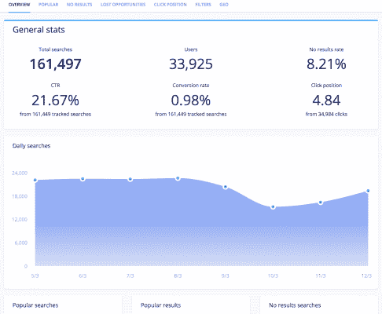

# 为什么值得查看您的用户搜索分析| Algolia

> 原文：<https://www.algolia.com/blog/ux/how-leveraging-search-analytics-can-boost-user-engagement-and-roi/>

你是否曾希望能读懂顾客的心思，了解他们想要什么或需要什么？

你当然有。

现在想象一下，你能够利用这种超能力，通过可操作的见解来提高你的搜索引擎性能，最终带来收入的巨大增长。

你不需要斗篷或者氪星血统。事实上，答案就在你面前。这一切都在你的网站搜索跟踪的用户搜索分析中。你在每月网站搜索报告中读到的关于网站访问者(或使用你的应用程序的人)的量化数据点和统计数据是提升你的内容策略和网站性能的关键。

## **什么是用户搜索分析？**

用户搜索分析是详细的数据，使您能够准确分析潜在客户如何在您的网站上搜索产品。当他们到达你的网站主页或登陆页面时，它帮助你准确地理解他们想要什么，然后输入搜索查询，最重要的是，他们是否设法找到并购买它，或者以其他方式注册转换。

例:你的公司是一家高端服装品牌，一名顾客正在你的电子商务网站上搜索冬装。搜索框是他们的第一个停靠点。他们输入一个搜索词，比如“羊毛围巾”，仔细阅读搜索引擎的选择，然后到达一个产品详情页面。

完成这个搜索(以及其他搜索)的步骤会成为你潜在有用的用户搜索数据库的一部分。有了这些有助于理解你的搜索功能是如何工作的关键信息，你就可以确保你的网站或移动应用程序购物者正在做正确的事情。

## **它们为什么重要？**

用户搜索分析不仅仅是一件好事；它们至关重要，因为它们让你的产品团队能够发现:

*   **顾客在寻找什么:** 冬装、周末度假、家居装饰
*   **他们使用了哪些搜索词:**10 号冬靴，曼哈顿的两居室公寓，蓝色卧室灯
*   **哪个搜索词的销量最高:**10 码黑色耐克鞋，中号红色连衣裙，新款特斯拉汽车
*   **他们在搜索时找不到的物品** :黑色牛仔裤 xxl，黑胶唱片 vintage

因此，你收集的网站搜索数据为你提供了全面了解你的用户体验和参与度的基础。

然后，您可以使用分析工具迅速采取行动，解决任何不一致或不规范的问题，例如没有结果的热门搜索，从而让您的购物者感到沮丧。

然而，为了迈出这关键的一步，你需要一个搜索数据分析软件 [工具](https://www.algolia.com/blog/product/supercharging-search-analytics/) 让你监控你的关键指标并模拟你的用户行为。

## **利用用户搜索分析的好处**

了解用户的想法和需求有其明显的优势。除此之外，您还可以:

### **1。发现意想不到的模式**

当你手边有大量的用户搜索分析数据时，谚语“知识就是力量”听起来是正确的。发现你的用户如何与你的站点上的元素交互，以及他们搜索你的网页的方式，给你一个他们当下需求和愿望的详细快照。

有时候，当你深入挖掘网站搜索分析的本质时，你可能会对某个特定搜索的发现感到惊讶。搜索模式实际上是艺术作品，检查你的网站曲折的用户旅程可以帮助你发现人们到底想在他们的搜索结果页面上看到什么。明确地知道这一点，你就可以提供更多。

### **2。自信地做出正确的决定**

我们都知道在我们的个人生活和职业生涯中，做出决定是多么艰难。如果你能毫不犹豫地做出正确的决定，会怎么样？

借助数据驱动的用户分析，您可以。至少在你的职业生涯中，它让你不再猜测。

能够准确定位客户需求是做出正确决策的关键。例如，如果你正在制定一个策略来提高你下一季度的转换率，确定你网站上最受欢迎和最热门的搜索对于衡量你的成功和订购剩余库存是至关重要的。类似地，发现哪些搜索没有搜索结果表明您可以在哪里扩展您的产品。

### **3。降低你的跳出率**

如果你的用户找不到他们要找的东西，他们就会离开。就这么简单。然而，有了搜索分析工具，你可以找出他们点击的具体原因，并防止这种消极的情况发生。

这都与相关性有关，提高相关性是利用用户搜索分析的主要好处之一。怎么说都不为过:一旦你知道你的用户想要什么，你就可以做出改变来满足他们的搜索并满足他们的购买欲望。这是一个很好的赌注，利用网站搜索分析，找出他们到底想要什么，将有助于您保持他们在您的网站上。

例如，如果你是一家运动鞋零售商，并且你发现你的网站上有很多访问者在搜索一个你网站上没有的独立教练品牌，你可以采取行动购买。当他们看到你带着它时，他们可能会把它添加到购物车中，然后不停留在那里——他们也可能会考虑添加产品。

### **4。提高参与度(和回头客)**

当潜在客户登陆你的网站时，由于他们在谷歌和亚马逊等网站上享受的一流搜索体验，他们期待的不仅仅是一个平稳的旅程。他们希望快速、轻松地找到他们想要的东西。

这就是你的用户参与度发挥作用的地方。你需要能够自然地吸引人们——希望留在你的网站上——这样他们就能成功搜索，然后继续浏览。

用户搜索分析照亮了你的用户旅程，因此你可以做出对搜索者有意义的修改，并提供卓越的客户体验。这是有道理的:在你的网站上有很好的 [搜索经历的人更有可能回来！](https://econsultancy.com/four-reasons-why-site-search-is-vital-for-online-retailers/)

### **5。提高您的投资回报率**

达到关键绩效指标总是很难——这是网上做生意的本质。然而，你可以超越猜测，让你的商业决策变得更容易。再次，它归结为坚实的搜索数据。没有用户数据，你怎么知道客户想要什么？搜索数据突出了差距，并向你展示了人们最想要和最想买的东西，以及他们是如何找到这些东西的。简而言之，提供 [伟大的搜索](https://www.algolia.com/products/search-and-discovery/hosted-search-api/) ，加上你的用户想要的产品和服务，是获得更好回报和将你的收入推向新高度的一个可靠途径。

## **如何利用你的用户搜索分析**

所有这些权威数据科学的好处听起来都很棒，不是吗？你可以到达那里。从功能的角度来看，需要做一些事情来充分利用你的用户搜索分析:

### **1。关注搜索相关性**

这就是你从用户搜索分析中获得最大投资回报的方式。通过提高搜索相关性，您可以为您的用户创造更好的体验，这样他们就可以快速找到他们想要的东西，而无需更多的麻烦。

相关结果不只是让人们留在你的网站上；他们鼓励他们购买，逗留更长时间，并定期回来。

### **2。对“没有结果”说是**

有了分析平台，并不总是关于你的网站提供了什么，而是关于它没有什么。深入调查，找出哪些搜索让你的用户想要更多或者放弃你的网站。这是真正有价值的商业情报，可以成就或打破你的指标。

然后考虑优化:应用你的内部网站搜索数据来增强对你的产品或服务的搜索(以及你的网站导航，如果适用的话)。增加相关性的这一步可以很容易地提高你的用户参与度，并产生更高的收入。

### **3。与拼写错误和同义词交朋友**

当搜索者很匆忙的时候，他们想要的词并不总是在搜索栏中完整地出现。为了解决这个问题，你可以优化你的搜索栏，找出明显的拼写错误(例如，Carribean dress 或西班牙语语法书)，以准确解读你的用户意图，从而使一个平稳，连续的游客旅程。

最迷人的(气人？)英语的一个特点是有很多单词可以(正确或不正确地)互换。有病又有病。嫉妒又羡慕。这样的例子不胜枚举。

人们搜索的产品和服务名称也是如此，尤其是在不同国家之间。例如，一些购物者寻找一件毛衣，而其他人寻找一件套头衫。确保将所有术语作为标签添加到产品名称中，有助于提供快速、轻松的搜索体验。

## **读懂客户的心思**

准备好释放你的内部网站搜索分析的商业价值了吗？

很容易用 [来分析](https://www.algolia.com/products/search-and-discovery/analytics/) 。我们的搜索解决方案让您能够了解活跃用户的需求，然后实施数据驱动的决策来改善搜索体验，从而改善您的搜索指标并刺激您的盈利能力。

借助 Algolia 的高级分析工具，您可以:

*   在您的分析报告中发现令人惊讶的重大搜索趋势
*   确定没有产生结果的热门搜索和搜索字符串
*   查看用户在网站搜索结果中点击的确切位置，他们点击搜索结果的频率，当然，还有你最关心的事情:有多少百分比的搜索会带来高点击率和转化率
*   配置您的搜索设置，解决阻碍您购物的问题

现在是行动号召:想要更好地了解你的用户和他们的需求——并在合适的专家分析帮助下提高你的网站可用性和客户保持率？我们打赌你知道。联系 [我们的团队](https://www.algolia.com/contactus/) ，我们将让您专业地分析您的内部搜索数据，为您的网站或应用程序进行专业级升级。