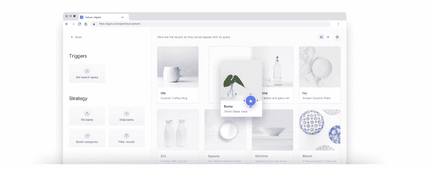
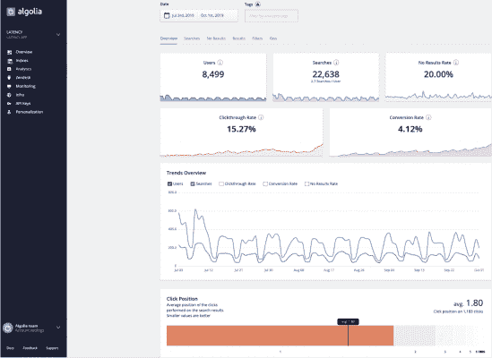

# 搜索如何帮助商业团队增加销售额| Algolia

> 原文：<https://www.algolia.com/blog/product/how-search-helps-business-teams-increase-sales/>

从获取和留住客户的测试方法到寻找强有力的数据来支持决策，可持续发展的公司知道完善您的战略并衡量结果是多么重要。但即便如此，许多企业还是忽略了一个强大的战略工具——搜索栏。如果你认为搜索框只不过是 UX 的一个要求，那你就错过了。适当优化后，搜索可以被调整以匹配业务目标，并生成关于您的用户的有洞察力和可操作的数据。

通过帮助你更好地理解和服务你的用户需求，伟大的搜索也让你的用户高兴，推动销售，转换和用户参与。

## 内部搜索、搜索即服务和站点搜索

无论是内部搜索、搜索即服务还是网站搜索，所有这些术语都指向网站的搜索功能，只是有一些细微差别:

**内部搜索，** 或现场搜索，是一个总括术语，指的是个人网站上的搜索功能，帮助用户在网站的产品或内容目录、子域或数据库中找到东西。搜索可以在本地或云中进行。

**搜索即服务** 是一种云托管的内部搜索，由第三方供应商维护网站搜索的托管、运营和维护。 [有了这款 SaaS](https://blog.algolia.com/what-is-search-as-a-service/)，网站就能即时访问到厂商提供的搜索功能、创新和更新。这使得企业能够快速无缝地实现非常强大的搜索功能，而不需要大量的搜索专业知识或开发资源。

[**站点搜索**](https://blog.algolia.com/what-is-site-search/) 是大型站点内部搜索和搜索即服务的一种具体形式。

### 为什么业务和销售团队要关心搜索？

如果你的企业在互联网上提供产品、内容或服务，你的用户就会期待在你的网站上搜索。事实上， [43%的用户会直接进入搜索栏](https://www.forrester.com/report/MustHave+eCommerce+Features/-/E-RES89561) 。搜索栏会影响 **用户对你的品牌和底线的认知** 。

相关、有效的搜索可快速将您的用户与他们的需求联系起来，推动平均购物篮价值、转化率、潜在客户生成、注册/订阅的增长，并改善用户体验。糟糕的搜索(或者根本没有搜索)会阻止他们找到他们想要的东西。一次不成功的搜索经历 [会导致 12%的用户去竞争对手的网站](https://blog.algolia.com/advanced-search-experience-for-e-commerce/) 。

任何网站都可以从为用户提供速度更快、相关性更强的搜索结果中获益。大型 [电子商务网站](https://www.forbes.com/sites/theyec/2020/03/20/e-commerce-search-and-filter-the-functionality-that-can-make-millions/#310e8faa1703) 等拥有大型产品或内容目录的网站尤其需要搜索。没有它，用户就不可能浏览网站。如果他们不能导航，他们就不能皈依。

搜索也不仅仅是将用户与他们的需求相匹配。设计良好的搜索可以感受到个性化，即使没有个性化工具， [引导用户发现他们尚未预料到的需求](https://blog.algolia.com/site-search-content-discovery/) 。相关搜索可以成为建立品牌忠诚度战略的有效**[**鼓励回头客和访客**](https://blog.algolia.com/how-to-use-site-search-marketing-tool/) 。**

 **## 在你的商业战略中利用搜索的 8 种方式

这里有 8 种搜索方式可以支持你的商业策略并推动销售:

### 1。基于业务优先级的直接排名规则

有效的内部搜索引擎为企业提供了在 [默认排名标准](https://www.algolia.com/doc/guides/managing-results/relevance-overview/in-depth/ranking-criteria/) 之上分层特定业务标准的能力，因此它们提供了卓越的搜索相关性。这允许业务用户区分业务需求和优先级的优先级，并更有效地定位他们的用户。自定义排名允许业务团队根据他们知道的重要因素(如受欢迎程度、最近添加等)调整和指导排名。)，这有助于提高重要产品、内容等的可见性和用户参与度。

### 2。使用营销工具推广产品和内容

对于精心打造一个服务于用户需求和商业目标的搜索和发现体验来说，监管是至关重要的。使用 [搜索营销](https://blog.algolia.com/searchandising-tips-for-your-e-commerce-site/) 工具，您可以确保您网站上的搜索体验符合您的营销战略，支持促销活动，并帮助您实现收入目标。您可以开展季节性活动，在搜索结果中显示促销横幅，推荐类似产品，战略性地提升和隐藏产品，将用户重定向到常见查询的专用页面，最终提供令人满意的个性化体验。

搜索结果的商业化通常是一个耗时的过程。Algolia 的用户友好型拖放界面使跟单商能够轻松创建规则。

### 3。在本地应用您的全球战略

如果你的企业有几个由本地团队管理的不同网站，你应该知道在所有网站上复制一致的 [搜索和发现策略](https://blog.algolia.com/search-and-discovery-and-e-commerce-trends/) 的难度。有了一个强大的搜索工具，你可以在你的本地站点上统一你的核心策略。然后，借助营销、定制排名工具和本地相关关键词的知识，您的本地经理可以负责他们所在地区的营销和内容推广。

### 4。轻松扩展站点

随着业务的扩展，网站通常也需要这样做。您网站的搜索应该支持而不是阻碍您的发展，允许新的内容、产品、资源等立即被搜索到，以防止失去销售和/或参与的机会。通过有效的搜索，拓展业务的挑战性要小得多。诸如站点爬虫之类的工具和诸如联合搜索之类的搜索功能确保您的内容仍然是可搜索的，并且您的产品是可快速检索的，无论您站点的内容和产品目录变得多么大或多么分散。事实上，当涉及到快速构建跨各种实体的联合体验时，爬虫可以成为一个很好的替代解决方案来替代 API 集成。通过将这些需求外包给专门的搜索供应商，企业可以缓解搜索可用性和安全性的日益增长的烦恼。

### 5。支持更好的决策

当用户与你的搜索界面交互时，他们会直接告诉你他们需要什么和渴望什么，并以搜索查询的形式整齐地打包。分析这些用户行为和趋势信息有助于您在决定如何为用户提供最佳服务时消除一些猜测。一个 [搜索分析仪表板](https://blog.algolia.com/internal-site-search-analysis/) 以一种易于理解的格式呈现相关信息，例如关键词和关键短语搜索、过滤器和方面选择、没有返回结果的搜索、搜索建议点击等。这些有价值的、可操作的数据可以帮助您发现您的策略中可能缺少的东西，并找到改善搜索体验的机会。

### 6。通过热门搜索了解你的用户

热门搜索极具洞察力和可操作性。这些搜索揭示了人们访问你的网站的原因，包括哪些产品、服务或品牌产生了最大的影响，以及他们可能有的常见问题。这样的信息对于完善推销和完善营销工作是非常理想的。随着对与用户群产生共鸣的内容的了解增加，销售人员可以突出关键功能，并立即用新线索先发制人地解决热门问题。

### 7。使用“无结果”搜索来填补空白

在网站上没有返回结果的搜索揭示了内容策略或产品路线图中的差距。该数据可以指示对广泛改变的需求，例如，开始新产品和/或内容开发，或者简单改变，即，向同义词库中添加新的同义词以捕捉人们搜索事物的各种方式。通过将“ [无结果”搜索数据](https://blog.algolia.com/avoid-no-results-pages/) 与现场收集的反馈进行匹配，销售团队可以帮助企业确定未来产品增强(与产品开发团队)或内容创建(与营销团队)的优先顺序。

### 8。创造更好的自助服务内容

如今，在客户与销售代表交谈之前，大量的购买者旅程就已经开始了。销售团队可以让客户通过网站上的高质量内容进行自我教育，从而获得成功。利用来自网站文档或帮助部分的搜索分析数据，您可以创建有用的内容，主动回答问题，并使潜在客户能够自行适应您的产品。这种类型的自我教育对于满足销售渠道至关重要，尤其是当客户可以通过搜索随时使用公司的服务和产品时。

所有这些搜索功能都通过用户友好的仪表板、报告和自定义排名选项得到了显著增强。有竞争力的搜索解决方案甚至允许商业用户自己微调他们网站搜索的不同方面，只需要很少或不需要开发团队的帮助。

## 3 家公司如何利用搜索即服务实现业务和销售目标

搜索是推动业务绩效的战略工具。以下是三家公司如何利用搜索来发展业务的:

### 安德玛:提高搜索转化率

当安德玛需要一种便捷的方式来维护和改善搜索体验时，他们转向了搜索即服务解决方案。通过搜索分析，安德玛发现了没有返回结果的查询。他们采取行动，优化搜索以产生相关结果，这反过来又导致跳出率下降。他们还根据受欢迎程度、新颖程度和可用性对产品进行定制排名。有了这些改变，安德玛能够将转化率提高 35%，并在强大的零售垂直市场中拥有最高的运动服装品牌搜索转化率。

### iflix:增加内容收视率

对于 iflix 来说，搜索一直是应用导航的关键，也是访客是否观看内容的关键驱动因素(一个关键的商业指标)。不幸的是，一个优化不佳的内部解决方案让用户很难找到他们感兴趣的电视节目、电影、新闻视频和其他内容。当 iflix 将其搜索转向 Algolia 时，他们看到了高度定制、高度相关的搜索引擎的好处。与内部解决方案相比，业务和开发团队使用这种方法能够更快地迭代和改进搜索。优化搜索结果以更好地服务于其客户群导致 iflix 的转化率增加了 20%。伟大的搜索使 iflix 能够在主流市场上与同行竞争。

### PubNub:缩短买家旅程

PubNub 是一个实时消息传递 API，它依靠超过 10，000 个内容资产的广泛目录来满足各种客户角色的需求。虽然他们已经准备好向任何潜在客户展示他们的价值，但如果没有一个系统的内容入口，这些用户永远也找不到出路。PubNub 实现了 Algolia 的网站搜索，以将大型目录转变为智能、个性化的搜索体验 。通过网站搜索，PubNub 的用户可以访问任意数量的网站，以获得符合他们需求的搜索结果，这大大缩短了客户的旅程和价值实现时间。

## 通过搜索增加商业价值

搜索栏是一个小而强大的工具，可以增加商业价值。优化的搜索可以让您的用户在需要时快速找到他们想要的东西，最大限度地提高用户体验和客户参与度。不要错误地认为只有你的开发者才能设计你的搜索。Algolia 的 [可视化编辑器](https://www.algolia.com/products/search-and-discovery/visual-merchandising-curation/) 使商业用户能够根据最重要的因素轻松引导搜索和发现体验。

通过我们的电子书 [了解更多关于改善搜索体验和底线的实用方法，从 Algolia 搜索中获得更多益处的 7 种方法](https://resources.algolia.com/ebooks/7-ways-to-get-more-out-of-algolia-search) 。”**