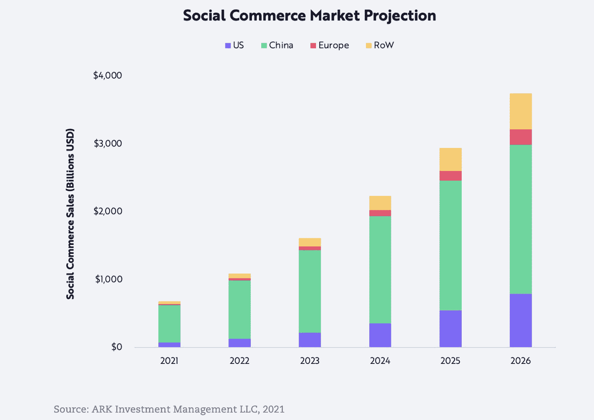
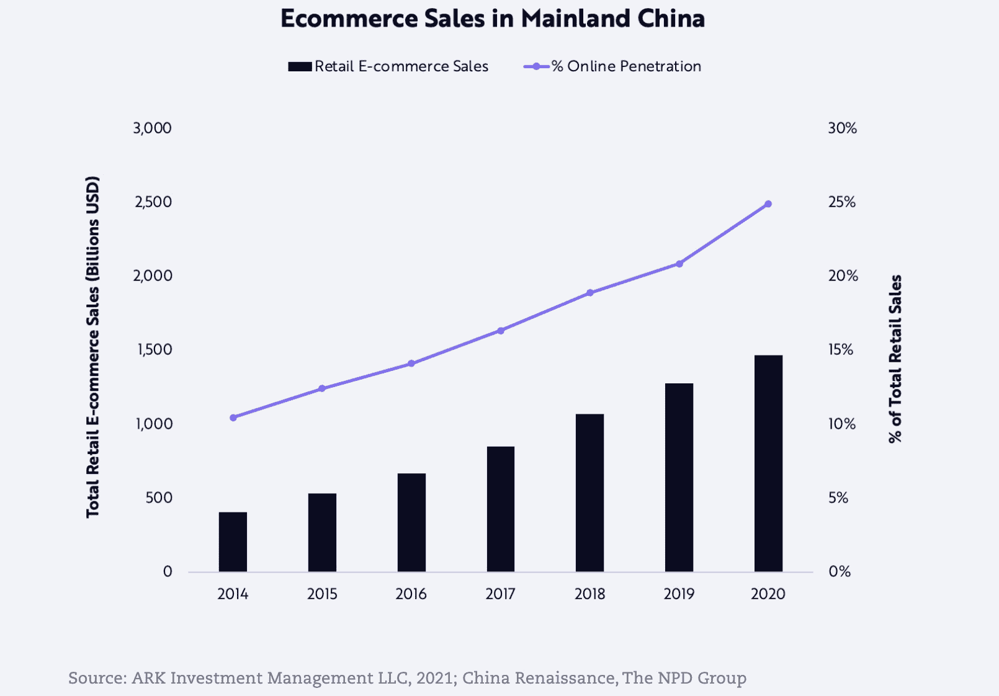

# 如何开始社交商务

> 原文：<https://www.algolia.com/blog/ecommerce/how-to-boost-ecommerce-with-social-media/>

社交商务是一个快速增长的领域，目前占据全球电子商务市场的 7%。预计到 2025 年，这一比例将达到 17%，相当于 17 万亿美元的年销售额。

*(来源:* [*方舟投资管理有限责任公司*](https://ark-invest.com/articles/analyst-research/social-commerce-the-next-wave-in-online-shopping/)*)*

虽然社交商务仅占美国电子商务总销售额的 1%,但在中国，该市场已经成熟到 3900 亿美元的规模，占该国所有电子商务销售额的 22%。

*(来源:* [*方舟投资管理 LLC*](https://ark-invest.com/articles/analyst-research/social-commerce-the-next-wave-in-online-shopping/) *)。*

## 什么是社交商务？

疫情加速了电子商务和社交媒体在全球的普及。今天，我们见证了这些平台对两者的各种混合进行实验。社交商务涵盖多种实现方式，例如具有社交功能的电子商务交易、社交媒体上的电子商务功能，以及整合到电子商务网站和移动应用程序中的社交方面。 *(来源:* [*方舟投资管理有限责任公司*](https://ark-invest.com/articles/analyst-research/social-commerce-the-next-wave-in-online-shopping/) *)。*

继微信在亚洲的 [电子商务成功](https://techcrunch.com/2021/01/19/wechat-2020/) 之后，Instagram、FB、Twitter、Snapshot 和抖音都在其平台上增加了电子商务功能。脸书正在提供 [直播购物功能](https://www.facebook.com/business/help/880609949031868) ，Instagram 开发了强大的 [电子商务功能](https://business.instagram.com/shopping/setup) ，Twitter 正在 [试点电子商务](https://techcrunch.com/2021/07/28/twitter-launches-u-s-e-commerce-pilot-that-lets-users-shop-from-profiles/) 功能，Snapchat 正在投资 [增强现实工具，以便在其平台上实现电子商务](https://thehustle.co/05242021-snap/) ，最后，抖音宣布与 shop 合作

社交媒体已被证明在活动期间，如 2020 年黑色星期五，会推动电子商务行业的更多在线销售。例如，在感恩节周末，社交媒体带动了零售网站十分之一的访问量，同比增长 17%。*(来源:**[Adobe 2020 年假日购物季报告](https://www.adobe.com/content/dam/dx/us/en/experience-cloud/digital-insights/pdfs/adobe_adi_holiday_recap_2020.pdf) )。)*

## 实现社交媒体商务

社交商务的兴起趋势为零售商和市场提供了一个机会，将他们的电子商务行业专业知识与现代实时在线购物体验的互动性相结合，以主动和有意识地影响购买决策。

从功能上讲，社交商务可以通过不同的方式实现，与品牌愿景、公司能力以及最终客户的在线购物行为和期望相匹配。

### 微信整合:

*   [将您的产品目录与您的微信商店](https://www.algolia.com/blog/ecommerce/composable-commerce-how-to-integrate-your-product-catalog-into-wechat-google-home-and-alexa/) 整合，通过将微信应用程序实时连接到股票管理工具，实现全渠道电子商务数字体验。这将使您的电子商务公司能够实施高度个性化和精确定位的直接面向消费者(D2C)销售和数字营销战略。
*   在您的网站或您的产品推荐电子邮件/外发电子邮件活动中包含微信二维码，以消除购物过程中的摩擦，并确保您的客户始终能够轻松便捷地访问他们选择的平台。

### 综合社交媒体图册或图库

*   展示您网站上社交媒体平台上精选的用户生成内容。例如，在你的电子商务网站的登陆页面上整合一个 Instagram 灵感图库。画廊将精选社交媒体帖子，展示您想要推广或展示的产品。
*   您可以通过将社交媒体网站上的特色产品与每个类别或搜索结果页面进行匹配，对内容进行重新排名和排序，以确保最受欢迎的商品显示在最前面，从而优化呈现给用户的内容。此外，对于注册用户，您可以对内容进行个性化设置，以确保他们总能看到与他们唯一的用户资料相匹配的最相关的项目。

### 商品列表页面上的用户生成内容

*   展示你的产品目录中的产品，这些产品出现在相关产品页面上用户生成的社交媒体帖子中。您可能希望使用人工智能推荐来展示社交媒体帖子，展示您目录中的其他产品，如相关产品或经常一起购买的产品。
*   在产品列表页面上显示用户生成的产品评论。Baymard Institute 的 [研究](https://baymard.com/blog/allow-reviewers-to-upload-images) 发现，“用户生成的产品图像可以丰富和补充现有的图像，使产品——以及销售产品的网站——看起来更值得信赖”。

### 直播流媒体商业

*   使用实时流媒体商务加速购买流程。在活动期间，主持人(影响者、品牌代表、名人)将展示产品并向观众推荐。观众可以实时提问，并直接从主持人那里得到答案。这种类型的影响者营销是一种非常强大的方式，可以让你的品牌在经常基于社会证明购买产品的潜在客户以及营销他们的人中间获得可信度。
*   通过设置仅在直播会话期间有效的库存和限时优惠，加快产品结账和购买流程。

了解更多关于 [如何利用直播增加和加速消费者需求](https://www.algolia.com/blog/ecommerce/how-to-increase-and-accelerate-consumer-demand-using-live-streaming/)。

## 结论

社交媒体不仅作为一种广告工具，而且作为一个功能齐全的电子商务平台，为电子商务行业提供了一个有利可图的机会。将社交媒体电子商务整合到销售工作流程中，为公司提供了从不断增长的细分市场中获益的机会，并通过跟上客户的购物需求和习惯以及提供增强的客户体验来与客户保持联系。