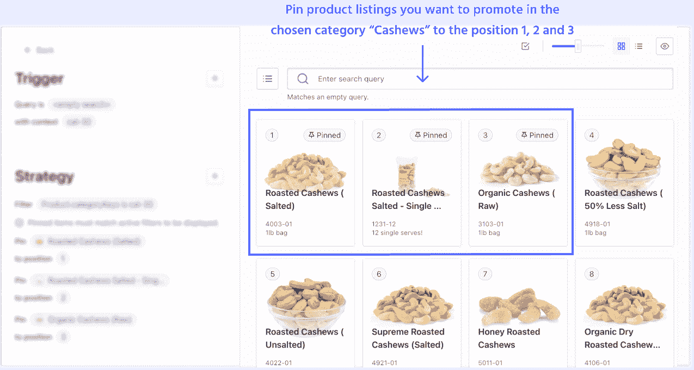
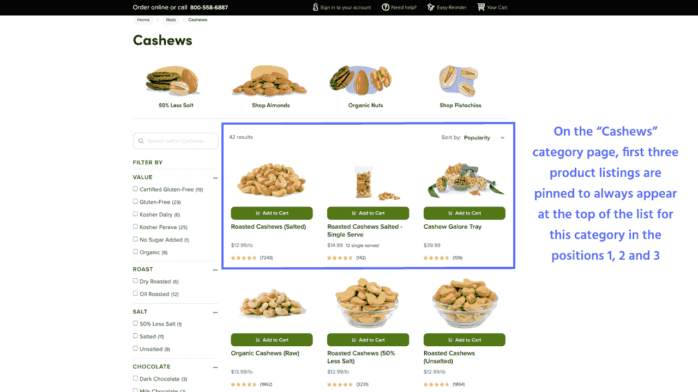
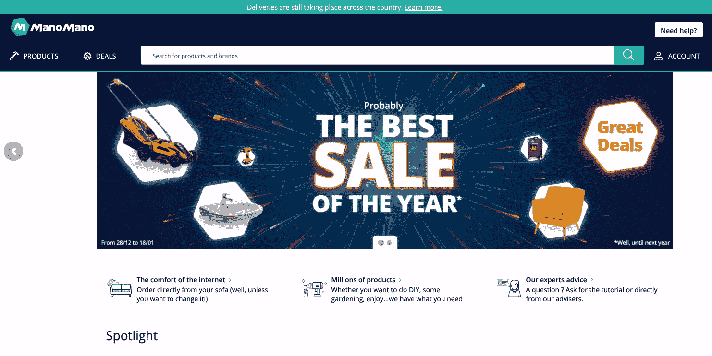
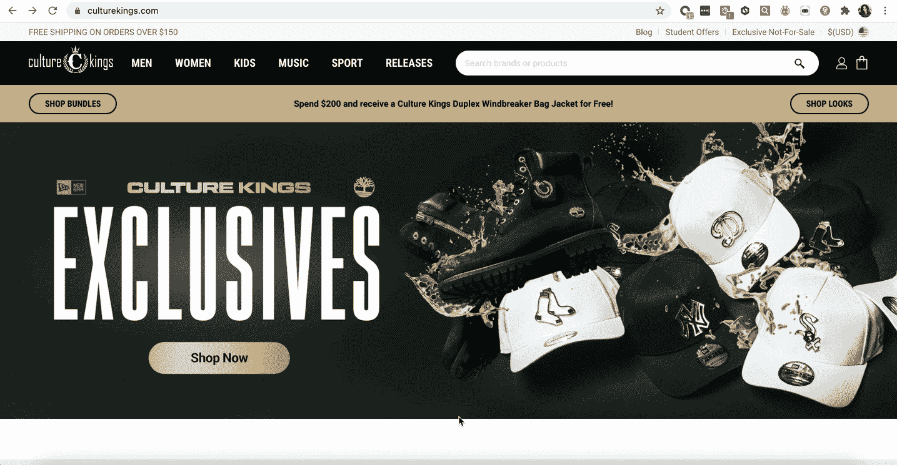
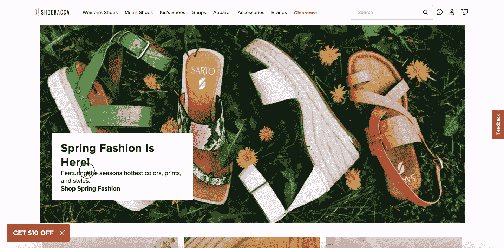

# 如何通过品类销售促进在线销售

> 原文：<https://www.algolia.com/blog/customers/how-to-boost-online-sales-with-category-merchandising/>

一份精确而准确的营销战略计划为电子商务购物者提供了一个顺畅的旅程，在文本、商业和上下文三种类型的相关性之间保持着持续的平衡。

用户通过两种方式在网站上浏览产品:

1.  搜索:直接在搜索栏中输入他们的查询(参见 [如何通过搜索营销增加在线销售](https://www.algolia.com/blog/customers/how-to-increase-online-sales-with-search-merchandising/) 了解更多关于搜索营销的详细信息)
2.  浏览:导航到各种网站页面和类别，点击横幅、主导航下拉菜单项，并通过选择不同的方面来过滤类别页面结果。

为了确保电子商务用户的统一购物体验，零售商同时应用[搜索和类别页面销售](https://www.algolia.com/industries-and-solutions/ecommerce/digital-merchandising/)。

类别销售工作流程使电子商务公司能够将业务逻辑应用于类别页面。这样，每次购物者在浏览网站和不同的产品类别时，结果都会以特定的顺序出现，可以根据当前的促销业务需求轻松调整。

*   钉住、隐藏、推进和掩埋类别
*   向类别登录页面添加内容传送带
*   添加动态登陆页面

## 锁定、隐藏、增强和隐藏类别

### 在分类页面上锁定结果:Nuts.com

 在 Nuts.com 网站上，基于特定的类别页面，产品列表页面在所选杂货类别的产品列表中的特定位置突出显示钉住的产品。例如，在“腰果”类别中，列表顶部的前三种产品被固定在各自的位置上。

## 将内容轮播添加到类别登陆页面

### 产品内容传送带—市场流行系列:ManoMano

ManoMano 通过可点击的销售横幅吸引购物者的注意力。他们到达一个特殊的登录页面，利用内容传送带展示每月交易，特价商品按产品类别以网格格式组织。

成功指标:

*   仅两周时间，多个市场的转化率增加了 20%

## 添加动态登陆页面

### 体育动态登陆页面&商品零售商:文化王者

街头服装时尚零售商 Culture King 使用动态类别登录页面来推广他们的产品。当用户点击“老高尔夫球手”促销横幅时，他们可以在登录页面上查看特色的新老高尔夫球手头饰。

[](https://www.algolia.com/search-inspiration-library/?configure%5BhitsPerPage%5D=9&indices%5BPROD_algolia_com-inspiration-library_query_suggestions%5D%5Bconfigure%5D%5BhitsPerPage%5D=6&indices%5BPROD_algolia_com-inspiration-library_query_suggestions%5D%5BrefinementList%5D%5Bpage%5D=1&indices%5BPROD_algolia_com-inspiration-library_query_suggestions%5D%5Bpage%5D=1&page=1&refinementList%5Bindustry%5D=&refinementList%5BbizDevTools%5D%5B0%5D=Merchandising&refinementList%5BuseCase%5D%5B0%5D=eCommerce&refinementList%5BimpactedPage%5D=&query=dynamic%20landing%20page)

### 时装零售商动态登陆页面:shoebaca

在线鞋类零售商 Shoebacca 使用链接类别登录页面来突出产品类别。例如，当用户点击“春天的时尚来了！”促销横幅，他们看到了新的春季系列的登录页面。

[](https://www.algolia.com/search-inspiration-library/?configure%5BhitsPerPage%5D=9&indices%5BPROD_algolia_com-inspiration-library_query_suggestions%5D%5Bconfigure%5D%5BhitsPerPage%5D=6&indices%5BPROD_algolia_com-inspiration-library_query_suggestions%5D%5BrefinementList%5D%5Bpage%5D=1&indices%5BPROD_algolia_com-inspiration-library_query_suggestions%5D%5Bpage%5D=1&page=1&refinementList%5Bindustry%5D=&refinementList%5BbizDevTools%5D%5B0%5D=Merchandising&refinementList%5BuseCase%5D%5B0%5D=eCommerce&refinementList%5BimpactedPage%5D=&query=dynamic%20landing%20page)

## 结论

营销策略的准确性和精确性对于任何电子商务企业都至关重要，有助于零售商保持竞争力并转型为行业领导者。通过确保整个网站的统一购物体验来优化客户旅程，为零售商提供了竞争优势，提高了品牌忠诚度，增加了销售和转化率，并降低了跳出率。