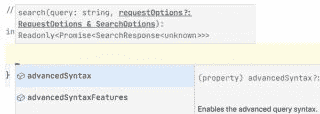

# 如何建立一个 JavaScript API 客户端作为 SaaS 产品

> 原文：<https://www.algolia.com/blog/engineering/how-to-build-a-javascript-api-client-as-a-saas-product/>

一个基于产品的 JavaScript API 客户端应该能够在浏览器中运行，直接前端 DOM 访问，以及在 节点环境 中运行，访问后端服务器和服务。

此外，基于产品的 API 客户端应该提供对其所服务的应用程序的所有特性的详尽且简单的访问。并且它应该与每个新特性保持同步。

最后，API 客户端应该通过添加以下功能为应用程序增加额外的价值:

*   重试逻辑，避开网络或任何其他瞬时故障或超时
*   速率限制和节流策略，以降低服务器负载和使用成本
*   批处理，API 执行一组动作来完成一个普通任务
*   和其他*助手*功能
*   底层 Rest API 的友好视图

## [](#what-is-a-product-based-api-client)什么是*基于产品的* API 客户端？

一个 API(应用编程接口)不仅仅是一个包装器；这是一个独立的轻量级应用程序，使开发人员能够与全功能软件平台进行交互。

A *基于产品的* API 是一个公司作为产品销售的 API。谷歌卖谷歌地图 API，Stripe 卖金融 API，我们卖搜索 API。

基于产品的 API *客户端* 是一种 API，有不同的编程语言、框架和 JavaScript 风格。我们的客户端位于不同的 REST API 端点之上。

通过以开发者自己的语言提供 API 客户端，他们获得了以下好处:

*   更快地实施应用程序的基本和高级功能
*   更简单地集成到他们自己的代码库中
*   已经为他们编写了大量代码，包括重试、节流和批处理

最好的 API 设计也试图限制实例化、使用或参数化 API 方法所需的样板代码的数量。

我们还可以举出一些基于产品的 API 客户端的其他定义特征:

*   小码尺寸
*   低依赖性或无依赖性
*   智能参数灵活定制
*   在请求和响应的命名和使用上的直观 DX(相对于RestAPI)的改进)
*   完整的 API 文档和教程
*   不间断版本控制
*   使用 API 密钥或令牌进行身份验证
*   用 JSON 实现简单通用的数据交换
*   跟上底层编程语言和技术的变化和最佳实践

## [](#how-to-improve-an-api-product-from-version-to-version)如何对一个 API 产品进行版本间的改进

首先说一下流程:我们有超过 10，000 个客户在使用我们的 API 客户端。有了这种用法，我们就可以根据客户支持单、聊天和日志中的使用统计数据来微调我们的 API。

然而，事实的更大来源是我们自己的工程师。我们的 API 不仅仅被我们的客户使用。我们的仪表板使用我们的 JavaScript、PHP、Ruby 和其他 API 客户端；我们有实现 API 客户端的内部用例；我们面向客户的技术支持团队使用我们的 API 客户端创建演示、原型和解决方案。通过所有的 API 测试和内部使用，我们直接了解了 API 客户的痛点和积极方面。

有了这些反馈，每个版本都包括:

*   **重构** 接口和背后的代码(不中断)以跟上底层技术不断变化的标准和演进。例如，我们最新版本的 JavaScript 客户端支持 ES6 和 TypeScript。
*   **改进 DX** 面向各种开发人员——有经验的、初学者、领域专家。
*   **瞄准更多用例** 。新的或现有的方法来更好地解决某些用例，有时甚至采用行业术语。
*   **生成跨所有 API 语言的通用接口** 。许多客户在不同的语言之间切换。拥有一个通用的界面对此有所帮助。使用 JSON 也有帮助。

## [](#some-upgrades-we%e2%80%99ve-made-to-our-javascript-api-client)我们对 JavaScript API 客户端进行了一些升级

对于像我们这样的 SaaS 公司来说，JavaScript API 客户端至关重要，因为它能够直接从我们的云服务器请求服务，而不需要客户通过他们自己的后端服务器。其中，客户端 API 请求改善了新 API 的响应时间，并简化了前端的前端代码。由于这些好处，[我们的 JavaScript API](https://www.algolia.com/doc/api-client/getting-started/install/javascript/?client=javascript) 是我们使用最多的客户端。

考虑到这一点，JavaScript APIs 必须管理客户端应用程序开发的挑战，以及 JavaScript 语言的特殊性及其风格，如 React、Vue 和 Angular。

这是我们最近做的一些改进

### [](#support-for-both-require-and-import-and-default-and-lite-versions)同时支持 require 和 import，以及 default 和 lite 版本

```
// For the default version
const algoliasearch = require('algoliasearch');

// For the default version
import algoliasearch from 'algoliasearch';

// For the search only version
import algoliasearch from 'algoliasearch/lite';

```

### [](#parameterized-instantiation)参数化实例化

我们从一个简单的实例化开始——客户端应用程序 id 和 API 键:

```
const algoliasearch = algoliasearch('YourApplicationID', 'YourAdminAPIKey');

```

然后我们添加了第三个参数，允许开发者定制一些额外的特性:

```
const algoliasearch = algoliasearch(
   'YourApplicationID',
   'YourSearchOnlyAPIKey',
{
   timeouts: {
       connect: 1,
       read: 2,
       write: 30,
   },
   requester: createBrowserXhrRequester(),
   logger: createConsoleLogger(LogLevelEnum.Error),
   responsesCache: createInMemoryCache(),
   requestsCache: createInMemoryCache({ serializable: false }),
   hostsCache: createFallbackableCache({
       caches: [
           createBrowserLocalStorageCache({ key: `${version}-${appId}` }),
           createInMemoryCache(),
       ],
   }),
});

```

可以看到，第三个参数允许开发者定义:

*   唯一超时
*   请求者的行为
*   定制节点请求或浏览器环境
*   日志回调
    *   日志记录使我们能够跟踪客户端的生命周期，记录并分析 API 活动。
    *   记录 API 活动有助于我们改进 API 在未来版本中的使用。它还使我们能够通过从成本中去除某些常见用途来降低定价。
    *   此外，通过允许开发人员向我们发送他们自己的日志记录方法，我们可以存储他们认为重要的信息，从而提高我们自己日志的质量。
*   响应缓存
    *   例如，开发人员可以管理他们自己的节流。
    *   他们也可以禁用我们的响应缓存。
    *   他们可以管理本地存储，即使在浏览器刷新后也能保持搜索状态。
*   请求缓存
    *   允许承诺共享，例如。

### [](#reduced-size-of-the-javascript)缩小了 JavaScript 的大小

使客户端树可摇动:

```
// Tree shakable ( 1 kb, dead code elimination )
// list the methods you use and don’t include the code of any other method  
const client = createSearchClient({
   // ..
   methods: { search }
}); 

```

### [](#customized-requests%c2%a0)定制请求

专家有时需要一个非固执己见的、开放的请求来处理意想不到的用例。例如，开发人员可以传递读/写请求来覆盖 API 中没有的内容:

```
client.transporter.read ({
   path: '',
   verb: 'GET'
});

```

关于日志记录的注意事项:当我们记录这些定制的请求时，我们可以利用这些信息在将来创建新的方法。

### [](#reducing-dependencies-to-zero)将依赖性减少到零

只要遵循 JavaScript 标准并使用 Typescript，就可以实现零依赖。

### [](#batching-common-multi-tasked-operations)配料常见，多任务操作

代替单一的`Save()`方法，我们增加了更多健壮的方法，如`replaceAllObjects()`、`reindex()`、`copyIndex()`。这有助于确保此类数据敏感方法的最佳实践。此外，我们已经编写了管理重试和零停机逻辑的所有代码。

### [](#typescript-support)打字支持



## [](#managing-the-release-schedule)管理发布日程

最后但同样重要的是，基于产品的 API 客户端必须遵循测试和发布实践的最佳策略。我们将把测试留给另一个博客，但这里是我们发布周期使用的总体策略:

*   为内部用例、应用和演示发布测试版
*   与文档团队合作，标准化并记录 DX
*   帮助升级依赖我们 API 客户端的产品
*   向少数客户发布最终测试版
*   发布稳定版，同时发布更新文档
*   通过支持电话、博客帖子和社交媒体促进和鼓励移民