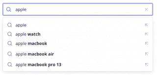
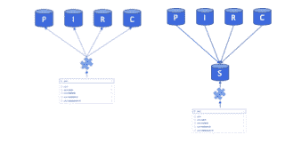
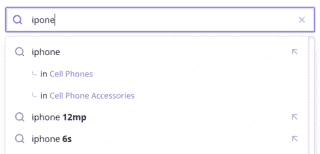

# 如何在你的网站上用 JavaScript 实现自动完成

> 原文：<https://www.algolia.com/blog/engineering/how-to-implement-autocomplete-with-javascript-on-your-website/>

你以前可能见过自动完成搜索，用户在键入时会得到建议的搜索。它不仅为你的用户节省了击键和时间，还可以发现他们可能没有发现的潜在结果。



例如，如果有人在你的产品目录搜索中输入“苹果”,他们会在输入时得到各种建议。为了提供匹配，您需要从某个地方获取这些潜在的结果——数据库、API 或已知术语列表。

在深入构建您自己的自动完成功能之前，让我们来看看一个健壮的产品级解决方案:


我们已经写了这个[自动完成解决方案](https://www.algolia.com/blog/ux/replicating-the-algolia-documentation-search-with-autocomplete/)，它可以将简单的下拉转换成[丰富和多面的交互式用户体验。](https://www.algolia.com/blog/ux/taking-documentation-search-to-new-heights-with-algolia-and-autocomplete/)当今天的用户开始输入查询时，他们希望看到的不仅仅是建议的查询，他们希望访问各种数据源和结果、多种过滤器、类别以及带有有用和高亮文本的图像。

这个[自动完成库是开源的](https://github.com/algolia/autocomplete)，完全可以为任何行业和 UI/UX 设计定制。

在本文中，我们后退一步，向您展示如何用 Javascript 构建一个简单的自动完成功能，以帮助您理解我们更具产品级版本的原理。我们还将展示，为了正确地调优您的自动完成搜索，您将需要使用额外的前端和后端代码来完成繁重的工作。

> 相关链接–
> 
> 1.  查看所有[可能的自动完成体验](https://www.algolia.com/developers/implement-search-autocomplete/)。
> 2.  自动完成的全面的[“入门”指南](https://www.algolia.com/doc/ui-libraries/autocomplete/introduction/getting-started/)。
> 3.  解释如何将自动完成与即时搜索 JS 集成的指南。

## [](#basic-implementation-using-static-data)基本实现使用静态数据

首先，让我们创建一个概念验证自动完成示例。我们的目标是允许用户开始在搜索框中键入内容，并在搜索表单下方看到匹配的术语— *在用户输入到搜索栏时自动完成*用户的输入。

任何 JavaScript 自动完成搜索都需要以下内容:

*   搜索表单的 HTML
*   CSS 显示结果
*   结果的数据来源
*   当然是 JavaScript

由于我们从一个基本的实现开始，我们将从一组预先确定的搜索词中返回精确的匹配结果。我们将使用一个在线商店作为我们的例子，其中用户正在搜索一个特定的项目。如果他们在搜索框中输入的内容可以与某个项目匹配，网站会推荐该项目。

让我们看看这个搜索框在一些简单的 HTML 中是什么样子的

```
<form autocomplete="off"><input type="text" name="q" id="q" onKeyUp="showResults(this.value)" />
<div id="result"></div>
</form>

```

禁用 autocomplete ( `autocomplete = off`)可能看起来有点奇怪，但这是为了禁用浏览器的自动建议，它会妨碍我们自己。

其他一些需要注意的事情是`onKeyUp`属性，它调用我们的 JavaScript 函数，并使用一个空的`div`作为结果。

接下来，这里是接收搜索值的 JavaScript，将它与已知的术语进行匹配，并显示建议:

```
var search_terms = ['apple', 'apple watch', 'apple macbook', 'apple macbook pro', 'iphone', 'iphone 12'];

function autocompleteMatch(input) {
  if (input == '') {
    return [];
  }
  var reg = new RegExp(input)
  return search_terms.filter(function(term) {
	  if (term.match(reg)) {
  	  return term;
	  }
  });
}

function showResults(val) {
  res = document.getElementById("result");
  res.innerHTML = '';
  let list = '';
  let terms = autocompleteMatch(val);
  for (i=0; i<terms.length; i++) {
    list += '<li>' + terms[i] + '</li>';
  }
  res.innerHTML = '<ul>' + list + '</ul>';
}

```

这些术语作为一个简单的 JavaScript 数组存储在顶部。每次按键后，浏览器都会调用`showResults`函数。然后，它将当前搜索传递给一个`autocompleteMatch`函数，以获取匹配项的列表。最后，结果作为无序列表添加到`div`中。

当您运行这段代码时，您会注意到匹配的术语作为项目符号出现在搜索框下方。这并不是一次很好的经历。我们更希望看到这样的东西:


一个小小的 CSS 就可以完成这个风格，你可以定制它来匹配你的站点:

```
#result {
  border: 1px dotted #ccc;
  padding: 3px;
}
#result ul {
  list-style-type: none;
  padding: 0;
  margin: 0;
}
#result ul li {
  padding: 5px 0;
}
#result ul li:hover {
  background: #eee;
}

```

虽然我们现在已经有了一个 JavaScript 实现的基本自动完成功能，但它还远远不能用于生产。首先，数据来自单个静态数组，硬编码在我们的 JavaScript 中。让我们通过合并一个后端搜索请求向一个更现实的例子迈进一步。

## [](#back-end-driven-autocomplete-with-an-internal-api)后端驱动:用内部 API 自动完成

JavaScript 的基本自动完成示例显示了用户期望的大多数交互模式。总有一些设计和交互方面的改进需要考虑，但概念依然存在:当用户在搜索栏中键入几个键时，他们会在下面看到相关的潜在搜索或结果。不同之处——也是这篇文章剩余部分的主题——是我们在哪里检索这些结果的*。*

在大多数足够复杂的例子中，你不会有一个有限的潜在查询列表。第一部分中的静态实现是一个概念验证，不会在生产中应用。您需要将您的搜索发送到后端以返回潜在的匹配，这意味着需要一个内部 API 来处理查询。

我们可以更新上一节中的`showResults`函数，如下所示:

```
function showResults(val) {
  res = document.getElementById("result");
  res.innerHTML = '';
  if (val == '') {
    return;
  }
  let list = '';
  fetch('/suggest?q=' + val).then(
   function (response) {
     return response.json();
   }).then(function (data) {
     for (i=0; i<data.length; i++) {
       list += '<li>' + data[i] + '</li>';
     }
     res.innerHTML = '<ul>' + list + '</ul>';
     return true;
   }).catch(function (err) {
     console.warn('Something went wrong.', err);
     return false;
   });
}

```

我们在`/suggest`调用本地 API 端点，而不是用`autocompleteMatch`函数将当前搜索与潜在查询进行比较。这将返回一个潜在匹配的 JSON 数组。

为了测试这一点，你可以用 Node 或任何其他后端语言建立自己的本地 API。例如，下面的`Express`路由将为传递给`q`查询字符串的任何内容提供建议:

```
var express = require('express');
var router = express.Router();

const data = ["apple","apple watch","iphone","iphone x","apple macbook","apple macbook air","apple macbook air pro 13"];

router.get('/suggest', function(req, res, next) {
  console.log(req.query)
  res.setHeader('Content-Type', 'application/json');
  res.end(JSON.stringify(data.filter(value => value.includes(req.query.q))));
});

module.exports = router;

```

注意，如果我们将它部署到服务器上，我们可能会看到性能影响。每次查找都发生在一次按键之后，这在用户输入多次按键时可能没有意义。在通过互联网连接到后端之前，您需要在前端加入一个延迟，比如网络节流。

## [](#adding-a-query-suggestions-database)添加查询建议数据库

该代码具有我们之前使用的相同的有限术语数据集。我们还在做原型。您需要将后端 API 连接到数据库。当每个调用都包含一个往返 HTTP 调用时，查询延迟会变得更加重要，HTTP 调用本身会调用数据库。

好处是显而易见的:通过访问数据库，你可以在用户输入时提出一组与他们的字符相匹配的查询建议。 [查询建议](https://www.algolia.com/doc/guides/building-search-ui/ui-and-ux-patterns/query-suggestions/how-to/creating-a-query-suggestions-index/js/) 数据库包含搜索引擎在处理每个查询时保存的先前查询。这些查询通常按受欢迎程度排序。谷歌提供了一个例子:


你的数据库需要考虑很多因素。是专门为搜索词打造的吗？或者您是否需要连接到一个现有的源，比如一个产品或内容数据库？您将如何针对这些频繁、简短的查询进行调整？

这些都是大问题，很可能指向从多个来源获取结果的需求，一个叫做 *联合搜索* 的概念。

## [](#federated-search-query-multiple-dynamic-data-sources)联合搜索:查询多个动态数据源

你用过的大多数搜索引擎很可能来自不止一个数据库。与基本的 autocomplete 示例不同，它们不具备小型静态潜在搜索集的优势。如果您担心对单个数据库的性能影响，那么使用[联合搜索会更加困难。](https://www.algolia.com/blog/ux/what-is-federated-search/)

你不仅有多个来源，而且每个来源都是动态的。产品数据库可能每晚更新，而库存管理系统旨在实时更新。你的评论可能存储在其他地方，每天发布几次。您可能希望更快地获得评论以引发讨论。


这些数据库中的每一个都有你可能想要搜索的字段，而其他的则不需要。显然需要包括产品名称、描述和元数据。但是内部标识符或产品代码可能不是必需的。类似地，用户生成的内容可以提供丰富的搜索词，但您需要确保个人信息，如电子邮件或 IP 地址，不会出现在搜索建议中。

一旦您决定了在您的联邦搜索中使用哪些[数据源，您需要确保它可以通过一次调用从前端到达，如后端驱动的自动完成部分所示。换句话说，您可能不希望前端在每次击键后直接调用多个数据源——这不仅效率低下，而且可能会暴露过多的内部数据模型。相反，您可能会使用两种架构中的一种:](https://www.algolia.com/blog/product/make-disorganized-content-discoverable/)



左图显示了您的前端如何调用一个后端 API，该 API 本身向您的数据库发出多个请求。它需要将这些响应合并和过滤成一组搜索建议或结果，供前端显示。

或者，右边显示一个专用的搜索数据库，供单个地方查询。您需要根据其他来源定期更新这个数据库。与其他架构的不同之处在于，结果的合并和过滤是提前进行的。在许多情况下，搜索不需要像直接查找那样实时。例如，用户可能希望一条评论立即出现在页面上，但不会注意到它是否需要一个小时或更长时间才能出现在搜索中。

对于如何合并和过滤联合搜索结果，有许多不同的方法。为了给搜索者提供最好的用户体验，你可能需要考虑一些额外的方法来调整你的搜索结果。

## [](#beyond-autocomplete-what-robust-search-requires)超越自动完成:健壮搜索需要什么

实现伟大的自动完成功能不仅仅是知道 JavaScript、HTML 和 CSS 的正确组合。您需要访问正确的数据源，并从后端提供结果，以便您的前端能够轻松地将结果显示给用户。此外，你会发现，你越是考虑什么是可能的，潜在的改进就会越多。



例如，在上面的搜索建议中有一些需要注意的事情:

1.  虽然“iphone”被拼错了，但结果会灵活地假设用户的意思
2.  对于某些术语，用户可以按类别进行更具体的搜索

这两个特性都需要一些额外的工程来实现。您的数据库可能支持针对拼写错误的模糊搜索，尽管您需要确保模糊搜索的实现不会降低性能。考虑到这一点，我们实现了一个不会降低查询速度的 [错别字容差](https://www.algolia.com/doc/guides/managing-results/optimize-search-results/typo-tolerance/) 特性。

类别搜索更高级，需要搜索数据库中的额外结构。我们已经写了一个关于带有 JSON 属性 的[刻面搜索的指南，讨论了如何为这种类型的过滤搜索组织数据。](https://www.algolia.com/blog/engineering/facets-and-faceted-search-making-every-attribute-count/)

如果你想构建健壮的搜索，Algolia 可以支持你。[搜索建议和方面](https://www.algolia.com/products/search-and-discovery/search-autocomplete/)内置于我们的 [API 驱动平台](https://www.algolia.com/products/search-and-discovery/hosted-search-api/) 。

> 相关链接–
> 
> 1.  查看所有[可能的自动完成体验](https://www.algolia.com/developers/implement-search-autocomplete/)。
> 2.  自动完成的综合[“入门”指南](https://www.algolia.com/doc/ui-libraries/autocomplete/introduction/getting-started/)。
> 3.  解释如何将自动完成与即时搜索集成的指南。