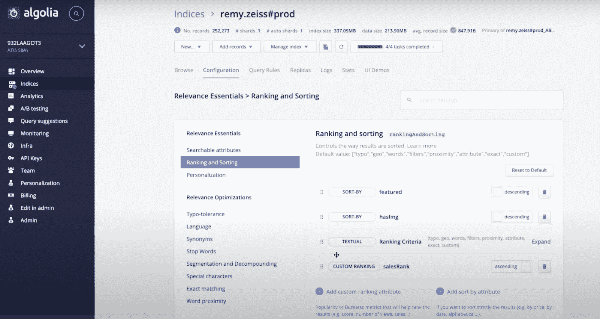
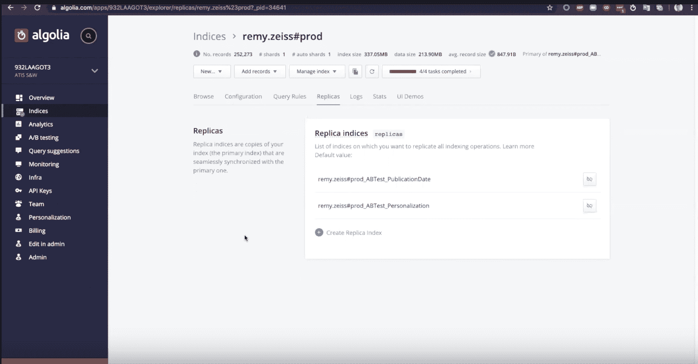
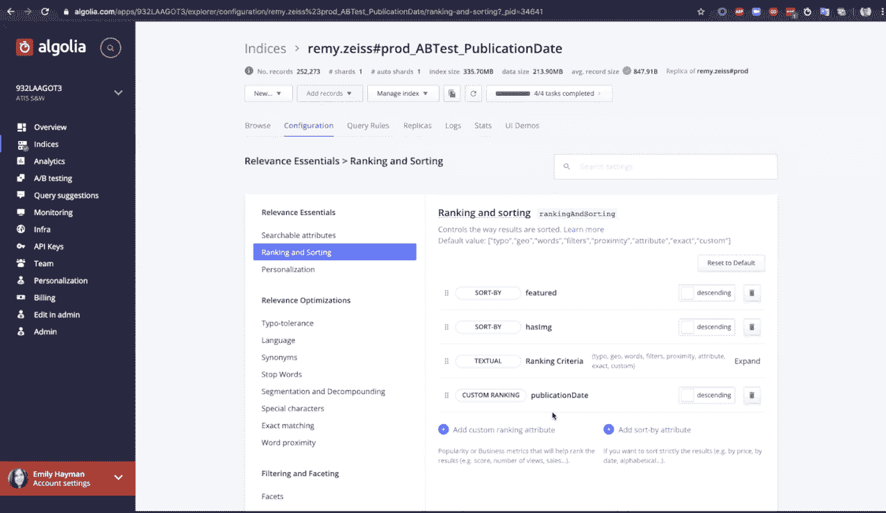
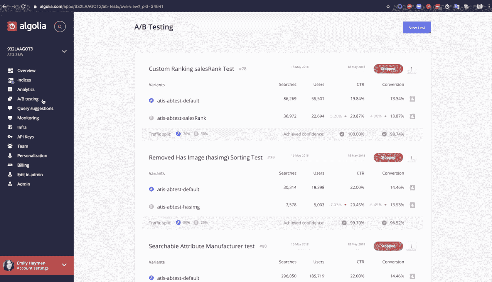
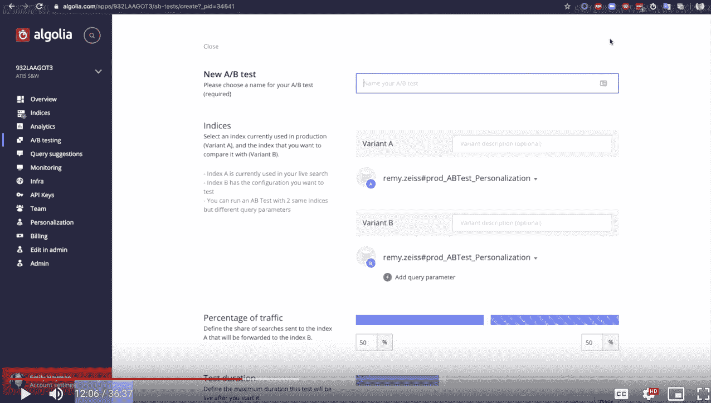
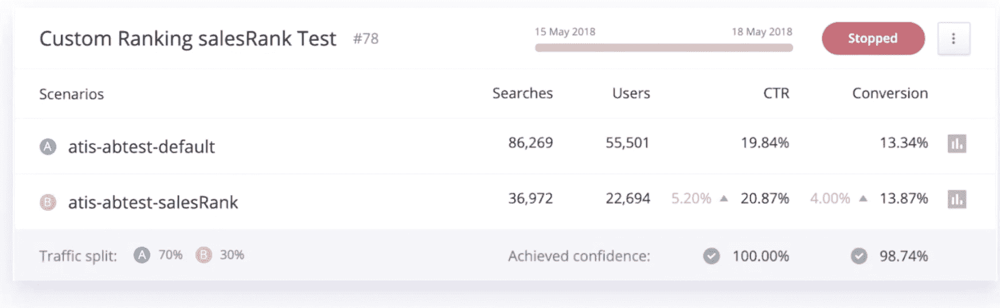

# 如何用 Algolia A/B 测试改进网站搜索

> 原文：<https://www.algolia.com/blog/ecommerce/how-to-improve-site-search-with-ab-testing/>

相关性是好的网站搜索最重要的属性之一。但这不是你能随便打开开关就能打开的。提高搜索结果的相关性是一个反复试验的过程，因为你需要调整后端搜索参数来满足用户的需求并优化转化率。

我们都很熟悉 [A/B 测试你的网站](https://neilpatel.com/blog/19-obvious-ab-tests/),这是一种测试特定变量对你的受众反应和转化指标有多大影响的方法。在之前的博客文章中，我们写了如何 [A/B 测试你的站点搜索](https://blog.algolia.com/5-ways-to-ab-test-your-search-for-relevance/)的相关性。

今天，我们将深入探讨如何将 Algolia 的高级 A/B 测试功能应用到您的站点搜索中。

## 为什么要用 A/B 测试来改善站点搜索

正如你已经知道的，A/B 测试通过向你展示一个特定的设置或变量是如何影响你预定的转换目标的，从而消除了你的相关性迭代中的猜测。

例如，您可能想要测试您对返回给用户的搜索结果进行排序的方式。之前，您已经在排名策略中添加了业务指标“出版日期”，但是您想知道使用业务指标销售排名是否会更有效。你认为这可能会推动更多的转换，但你需要更多的数据，然后再提交到整个网站的变化。

在 A/B 测试中，你的网站上一半的用户会接触到原始的(或控制的)搜索体验——你的网站按发布日期排列结果的体验。你的另一半观众会接触到销售排名系统。然后，您可以收集两组用户的行为数据，并确定哪种设置会带来更多的转换。

使用 Algolia A/B 测试的一个优点是，您团队中的任何人都可以完全从我们的仪表板上创建 A/B 测试，**没有一行代码**(但是如果您愿意的话，当然可以从 API 中获得)，并且在任何设备上使用**。**

### 4 大 A/B 测试示例场景

用站点搜索 A/B 测试可以测试什么？以下是一些想法:

*   **调整您的自定义排名。**假设你有一个电子商务网站，你的商品目前按受欢迎程度排序，但你实际上并不确定这是展示结果的最佳方式。测试按出版日期排序的有效性。A/B 测试将让你测试这两个不同的自定义排名选项，看看哪一个推动更多的销售。
*   **测试个性化的影响。**一旦你开始使用[个性化](https://blog.algolia.com/personalization-announcement/)，你可能想要评估它对你的转化率和点击率的影响。A/B 测试是一个很好的方法。
*   **A/B 测试同义词的影响。**测试两组不同的[同义词](https://www.algolia.com/doc/guides/managing-results/optimize-search-results/adding-synonyms/)对同一组记录的影响，看看哪一组在相关性方面表现得更好。
*   **A/B 测试两套查询规则。**测试两组不同的[查询规则](https://www.algolia.com/products/search-and-discovery/search-relevance-rules/)——例如两种销售策略——的影响，看看哪一种实际上表现更好。

## A/B 测试实际上是如何工作的？

让我们看看 Algolia 的 A/B 测试的一个实际应用:一个简单的六步过程。(**注意**:您需要首先设置点击分析，以便捕获点击&转换事件)。

### 1。创建副本

让我们转到您的搜索仪表板。您可以看到已经创建了一个索引，定义了每件商品的[自定义排名](https://www.algolia.com/doc/guides/managing-results/must-do/custom-ranking/)–#销售额(也称为销售额排名)

但是，您不确定这是否是最佳的排名策略，所以您希望根据出版日期来检查它。

当你进行 A/B 测试时，你是在测试两个搜索索引，所以你需要做的第一件事是创建一个副本——也就是你的搜索索引的拷贝。要创建副本，请转到左侧工具栏的索引部分，然后单击“副本”选项。在那里，您可以选择“创建副本索引”选项

副本将与主索引同步，因此对主索引的任何更改都将转发到副本。除了您手动对副本进行的更改之外，它们是相同的。

### 2。配置您的副本

一旦创建了复本，就该用您正在测试的因子对其进行配置了。在这种情况下，我们根据出版日期而不是销售排名定义了不同的自定义排名。

### 3。创建新的 A/B 测试

配置完副本后，转到左侧工具栏上的 A/B 测试选项卡。单击“新建测试”创建新的 A/B 测试。

### 4。选择您的变体

一旦您创建了一个新的测试，您将可以选择您计划测试的两个变体。第一个变量应该是你的主索引或者你的控件。第二个将是您刚刚创建的副本。为每个变体提供一个描述供以后参考是一个好主意，比如“基于销售排名的自定义排名”和“基于出版日期的自定义排名”

### 5。定义您的流量分配

在变量下面，定义两个变量之间的百分比流量分配。理想的分割是 50/50，但是如果你有一个高流量的网站(一个月超过 100，000 次页面访问)，你可以定义一个不平等的流量分割，并且仍然可以看到有统计学意义的结果。

### 6。定义测试持续时间

理想情况下，我们希望 A/B 测试在我们所谓的两个商业周期中运行，这考虑了短期的季节性影响。对于一个电子商务网站来说，一个商业周期意味着一周。因此，在这种情况下，我希望我的测试运行 14 天。

一旦你定义了这些参数，只需点击“创建”

## 如何解读结果

A/B 测试最重要的部分是分析结果，以确定哪个变体最成功。Algolia 的结果面板旨在帮助您做出决定:

在 results 面板中，您将看到关于测试的识别信息:名称、场景(您测试的两个索引)以及状态。测试可以是“正在运行”、“已停止”、“已完成”或“失败”您可以单击每个场景旁边的分析栏，查看每个场景的单独指标。

以下是测试面板的其他重要组件:

*   流量分流。这反映了分配给一个索引或另一个索引的用户量。

*   用户数量。这将告诉您每个变量暴露给了多少用户。如果测试了大量的用户，这告诉你结果是显著的。

*   CTR。这是点击率，也就是点击搜索结果的用户数量乘以 100。点击表示用户找到了他们要找的东西。
*   转换。这是转化率——转换事件(如销售或下载)的数量与总搜索次数之比乘以 100。
*   信心得分。这告诉你 Algolia 有多确信结果是配置变化的结果，而不是随机的。在你分析结果之前，置信度分数应该高于 95%。

一旦您的测试达到 95%或更高的置信度，并且您的两个周期时间周期已经过去，您就可以分析结果，以查看哪个索引生成了更多的点击和转换。

在上面的 A/B 测试示例中，您可以看到销售等级自定义设置(场景 B)表现更好，CTR 提高了 5.2%，转化率提高了 4%。两者的置信度得分都很高，这意味着有足够的搜索和事件来得出 B 产生更好结果的结论。一旦测试结束，您就可以将获胜的配置应用于主索引。

在这个测试中，数字表明，按销售排名对搜索结果进行排名比按出版日期进行排名会带来更多的转换。

## A/B 测试站点搜索最佳实践

A/B 测试是一个科学的过程，因此始终遵循一些准则以确保获得最准确的结果非常重要。

### 设置一个合适的用户令牌

用户令牌是连接搜索事件和最终转换的用户标识符。IP 地址本身不足以实现准确跟踪，并可能导致错误的结果。为了获得最准确的结果，我们强烈建议您明确使用用户令牌。如果你还没有使用它们，你可以用 [Algolia 的 insights cookie](https://www.algolia.com/doc/guides/sending-events/guides/queryid/) 生成它们。

### 对搜索和点击事件使用相同的用户令牌

对搜索和点击事件使用相同的用户令牌非常重要，因为这是 A/B 测试将用户与这些用户执行的事件联系起来的方式。如果您使用两个不同的用户令牌，那么 A/B 测试将不起作用。

### 禁用自动搜索代理或机器人的 A/B 测试(和分析)

如果您的网站使用搜索自动机(例如，如果您有一个选项，当用户的搜索返回新结果时，用户可以订阅提醒)，那么从您的 A/B 测试中排除这些搜索代理。如果你不这样做，你将会以一个单一的“用户”结束，他正在执行大量的搜索，但从来没有点击或转换。这可能会严重影响你的测试结果。确保自动化从你的测试和分析设置中被排除。

### 等到你的测试结束后再依靠信心得分

置信度得分是根据搜索次数计算的，因此您可能会在开始测试的几个小时内达到很高的置信度。然而，这并不意味着这些结果是正确的。重要的是让你的测试运行两个完整的商业周期，以考虑所有可能改变你的结果的季节性影响。例如，人们在周末和工作日的搜索是不同的。

### 立刻检验一个假设

一次只改变一个搜索元素，这样你就可以清楚地测试这种改变对用户行为的影响。试图一次运行多个 A/B 测试会导致混乱和不清楚的结果。你怎么知道哪种变化导致了哪种行为？

### 一旦测试开始，不要进行修改

一旦测试运行，不要对测试指数、流量分配或测试目标进行任何更改。在实验过程中改变变量会使结果变得不相关，因为不可能知道哪个修改影响了用户行为。

## 自信地做出搜索决策

提高相关性是提高网站搜索功能的捷径。你可以尝试磨练这些结果，但你不想在这个过程中坦克你的转换或客户满意度。

就像你 A/B 测试你的网站的其他组件一样，你应该 A/B 测试你的网站搜索，以消除猜测，并专注于使你的结果有用和有效的变量。只测试人群中的一部分，以避免代价高昂的错误——这也会让你在做出重大改变时有信心。

要了解更多关于 Algolia 的 A/B 测试，并了解一些大公司如何利用它来提高转化率，请观看我们的 [A/B 测试大师班](https://resources.algolia.com/vidyard-all-players-2/player-a-b-testing-with-algolia-how-to-optimize-search-relevance-2)，或访问我们的 [A/B 测试产品页面](https://www.algolia.com/products/search-and-discovery/ab-testing/)。