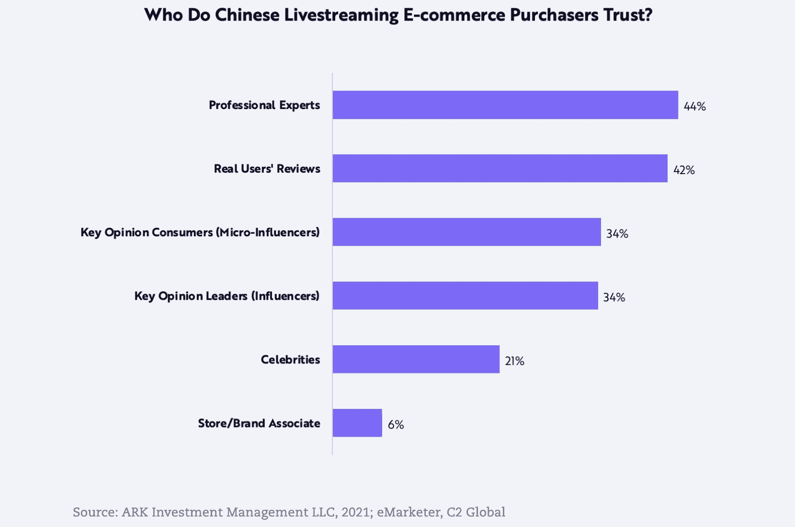
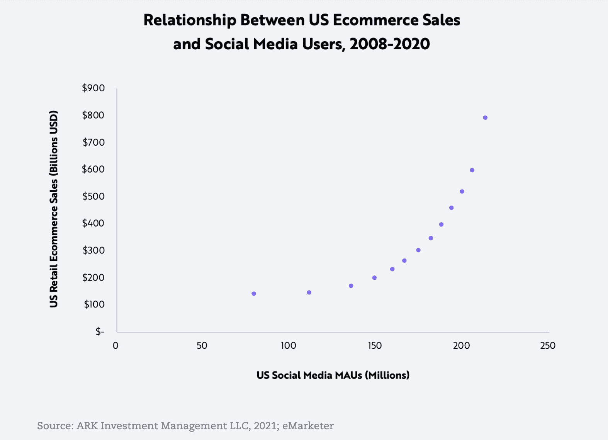
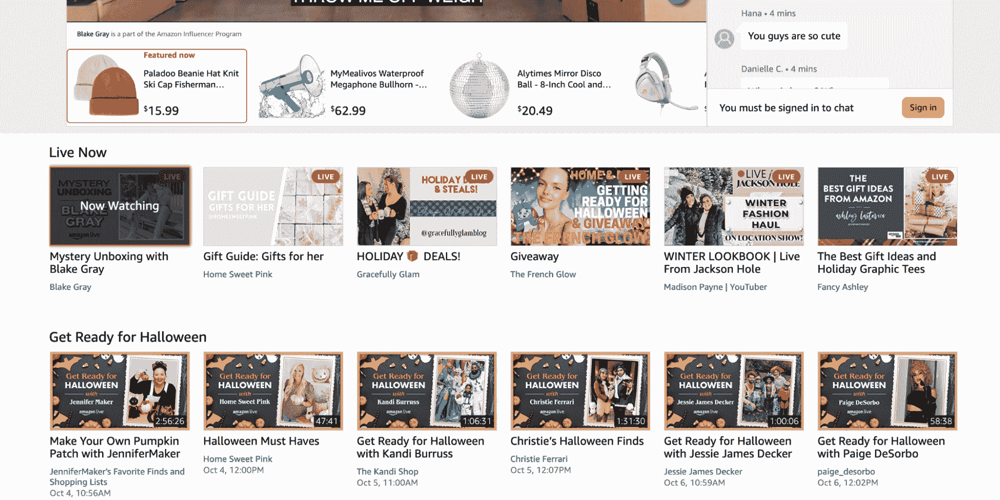
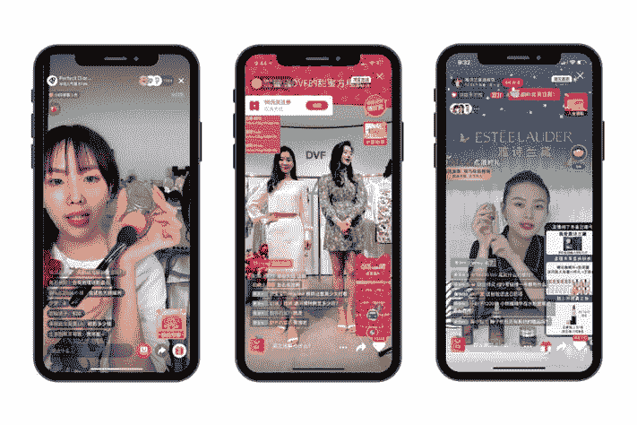
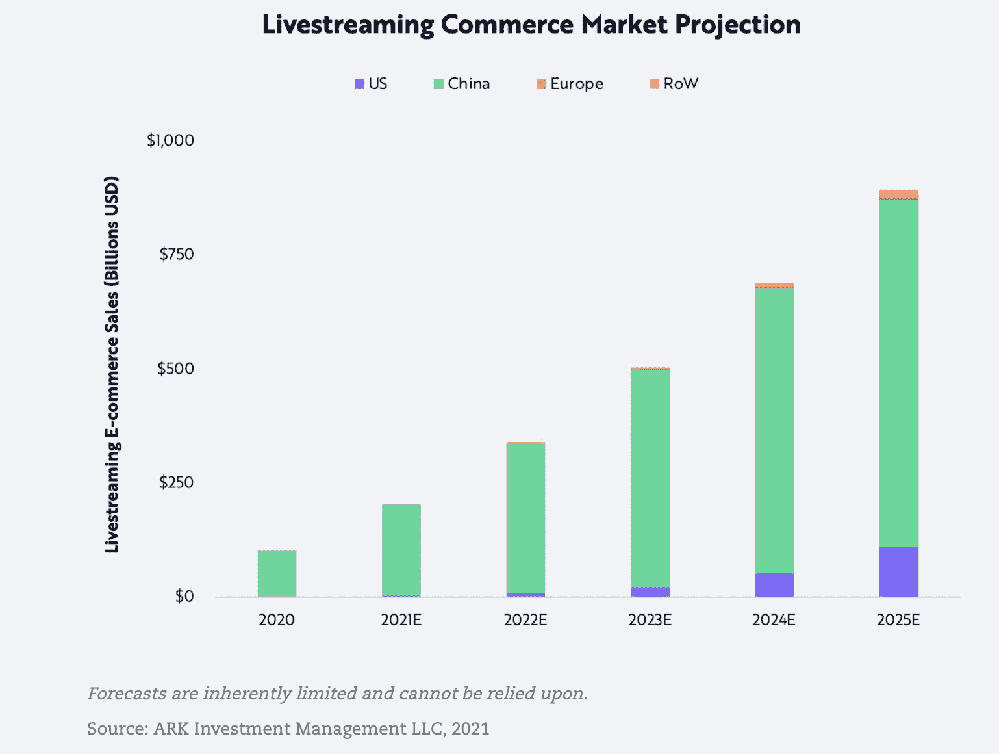
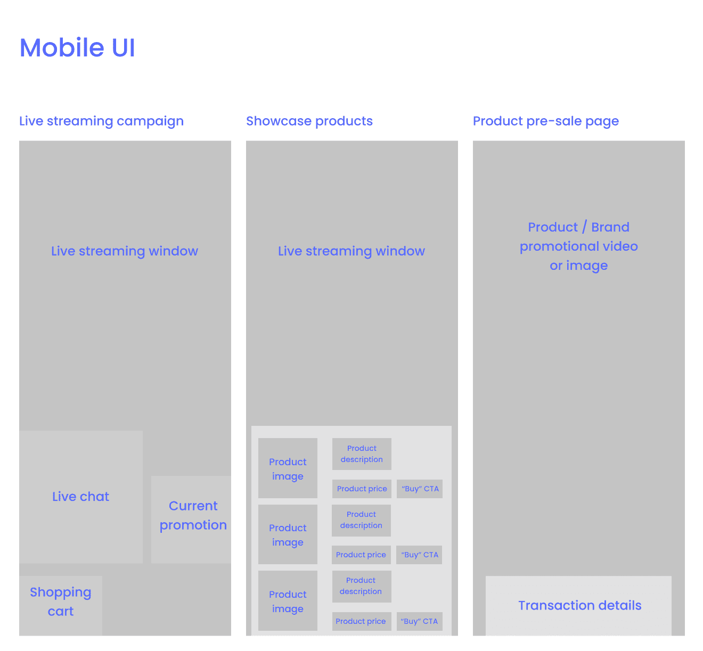

# 如何通过实时流媒体电子商务加速销售

> 原文：<https://www.algolia.com/blog/ecommerce/how-to-increase-and-accelerate-consumer-demand-using-live-streaming/>

在许多电子商务网站和移动应用程序上，经常可以看到用户对这些网站上销售的各种产品的评论。这种用户生成的内容为网站访问者提供了真实的个人意见和之前已经购买和测试过产品的人的反馈。

用户评论在购物者做出购买决定的能力中起着关键作用。用户生成的带有产品图片或视频的评论使这些产品和销售这些产品的网站更值得信赖。然而， [34%的电子商务网站不允许用户上传图片和评论](https://baymard.com/blog/allow-reviewers-to-upload-images) 。

如今，用户生成的评论正从支持商务的广告工具转变为直播电子商务的独立子行业。2016 年，中国电商平台开始尝试直播电商。到 2019 年，**直播电子商务**变得如此竞争激烈，以至于大型参与者开始整合该领域，利用关键意见领袖(kol)来加速销售。 *(来源:* [*方舟投资管理有限责任公司*](https://ark-invest.com/articles/analyst-research/social-commerce-the-next-wave-in-online-shopping/) *，**equal ocean**)。*

我们可以看到，与影响者和真实用户相比，传统广告和营销策略中使用的名人和品牌合作伙伴目前被视为不太可靠的信息来源，例如，[社交媒体](https://www.algolia.com/blog/ecommerce/how-to-boost-ecommerce-with-social-media/)。例如，像 rewardStyle([【LKT】](https://company.shopltk.com/en/company))这样的公司专门将有影响力的人与品牌联系起来。目前，rewardStyle 正在为超过 100 万个品牌和 150，000 名创作者提供服务，他们不断为这些品牌提供原创内容。这只是品牌推广和广告中用户生成内容强劲增长趋势的一个例子。

*(来源:* [*方舟投资管理有限责任公司**)*](https://ark-invest.com/articles/analyst-research/social-commerce-the-next-wave-in-online-shopping/)

2019 年，美国受欢迎的影响者金·卡戴珊(Kim Kardashian)在淘宝直播购物活动的几分钟内售出了 15000 瓶香水。1300 万观众观看了这场视频直播，在活动开始的几秒钟内就售出了 1000 瓶。

*(来源:* [*明星*](https://www.thestar.com.my/tech/tech-news/2019/11/12/kim-kardashian-sells-15000-bottles-of-perfume-within-minutes-on-taobao-livestream)*)*

## 电子商务直播行业的当前趋势

直播电子商务趋势正在向世界其他地方蔓延。在美国，由于电子商务销售额和社交媒体月度活跃用户之间几乎成指数关系，这一趋势正在迅速兴起。

*(来源:* [*方舟投资管理 LLC*](https://ark-invest.com/articles/analyst-research/social-commerce-the-next-wave-in-online-shopping/)*)*

电子商务的社交方面正成为领先电子商务市场(如阿里巴巴和亚马逊)的一个基本特征。例如，亚马逊最近推出了 [亚马逊直播](https://www.amazon.com/live) ，提供直播视频商品评论。推荐的产品直接显示在视频下方或视频框内，在每次活动期间，可通过互动聊天与影响者直接交流。

### 亚马逊直播直播事件:

*(来源:* [*亚马逊直播*](https://www.amazon.com/live)*)*

每个用户生成的直播视频下都有直播视频推荐:

*(来源:* [*亚马逊直播*](https://www.amazon.com/live)*)*

阿里巴巴的淘宝直播在 2020 年光棍节活动期间创造了 60 亿美元的销售额，这是一个堪比美国 *的黑色星期五和网络周活动的购物节(来源:* [*【福布斯*](https://www.forbes.com/sites/laurenhallanan/2020/11/16/live-streaming-drives-6-billion-usd-in-sales-during-the-1111-global-shopping-festival/?sh=2f7eb9b321e5)*)*)。

### 阿里巴巴旗下淘宝直播事件:

(来源: [福布斯](https://www.forbes.com/sites/laurenhallanan/2020/11/16/live-streaming-drives-6-billion-usd-in-sales-during-the-1111-global-shopping-festival/?sh=69bd642221e5) )

## 实现电子商务直播功能

直播电子商务市场预测显示快速增长。从“最好拥有”，它正迅速转变为“必须拥有”的功能。对于电子商务企业，特别是市场，处理非常大的产品目录，直播可以成倍增加产品发现和促进销售。

*(来源:* [*方舟投资管理有限责任公司*](https://ark-invest.com/articles/analyst-research/social-commerce-the-next-wave-in-online-shopping/)*)*

### 用于桌面或移动设备上直播的 UI 元素

*   直播窗口
*   可以发布重定向链接的实时聊天，用户可以与直播主持人交流
*   带有 CTA 按钮的产品建议/横幅，允许用户在活动期间购买产品
*   推荐直播会议传送带，展示用户可能感兴趣的未来活动
*   登录提示

### 实现

*   产品推荐:
    *   除了直播活动期间的静态产品列表，还可以使用产品推荐引擎向观众推荐相关或经常一起购买的产品

*   即将举行的直播会议可以是:
    *   使用人工智能推荐引擎向观众推荐

*   *   根据每个用户的购物偏好和在线行为进行个性化

*   *   使用基于人工智能的流行度自动重新排序和排序

## 结论

直播电子商务在中国呈指数级增长，现在正在席卷世界其他地区。对于电子商务行业来说，购物的社交功能正迅速从“最好拥有”转变为“必须拥有”。直播电子商务市场预测显示了全球范围内的巨大增长，零售商需要利用这一趋势来增加产品发现，促进其平台上的销售，并将他们的在线购物体验提升到一个新的水平——直播购物。