# 如何通过搜索营销增加在线销售

> 原文：<https://www.algolia.com/blog/customers/how-to-increase-online-sales-with-search-merchandising/>

当你为你的用户/顾客设计搜索体验时，你应该对三种类型的相关性感兴趣，这三种相关性需要保持平衡，以实现[有效的营销策略](https://www.algolia.com/industries-and-solutions/ecommerce/digital-merchandising/)。

一方面，是文本相关性，这将拉出匹配用户正在寻找的结果；另一方面，业务相关性允许你推送你希望你的用户看到的结果，因为各种原因，如受欢迎程度，更高的销售利润，促销活动，购买历史。最后一个是上下文相关性，它基于用户的上下文以及与 UI/UX 的交互。

搜索营销确保所有必要的业务逻辑都包含在将呈现给用户的搜索结果中。有多种互补的方式来设计任何电子商务业务的有效战略，如销售热门搜索和季节性促销和项目的趋势内容；营销空查询和无结果统计以及联合搜索；牵制、隐藏、助推、掩埋搜索结果；重定向搜索并在搜索结果中显示促销横幅。

以下是电子商务公司成功实施搜索营销以提高销售收入和转化率的例子:

*   锁定、隐藏、提升和隐藏搜索结果
*   针对空查询和无结果状态的商品联合搜索
*   商品热门搜索:在无结果页面推广热门类别和相关商品
*   在搜索结果中显示促销横幅

## 锁定、隐藏、提升和隐藏搜索结果

### Pin 体育搜索结果&商品零售商:Gymshark

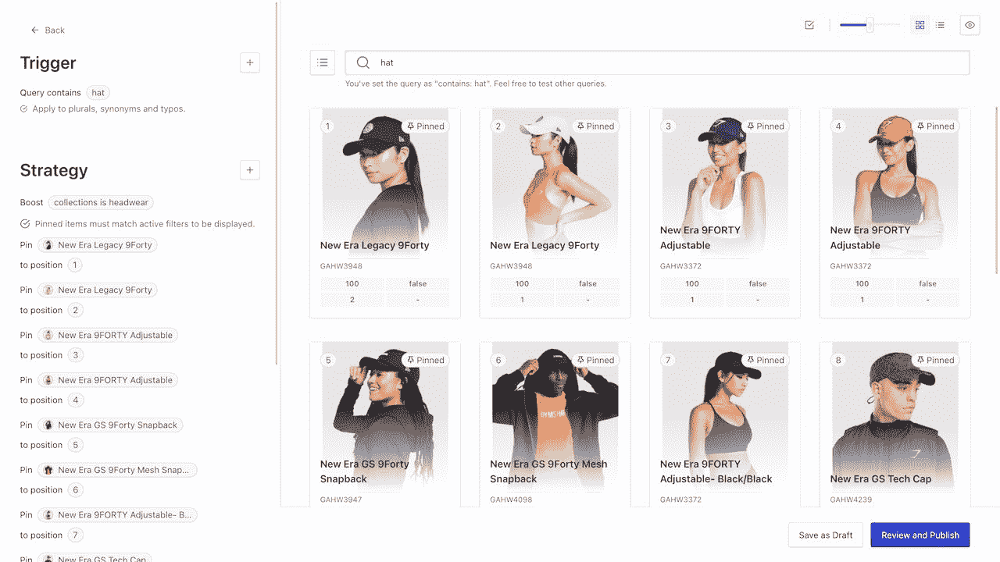

当用户在体育零售商 Gymshark 的网站上搜索“帽子”时，选定的产品会被钉在搜索结果的顶部，以便更有效地进行销售。

成功指标:

*   由于相关性战略的改进，2M 一年的额外销售额增加了
*   由于全尺寸系列产品的优先排序，每年额外增加 300 万英镑的销售额
*   由于隐藏缺货产品，每年额外销售 120 万英镑

搜索相关性的提高使得 Gymshark 能够将最畅销的产品从搜索结果页面的底部移到页面的顶部。同时，卖得不好的脱销产品会从搜索结果页面的顶部移除。在下面的例子中，我们可以看到“camo”查询的变化，它在 2020 年 3 月获得了 11k 次搜索:

之前的指标

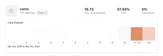

当前指标

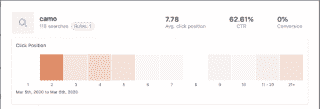

[](https://www.algolia.com/search-inspiration-library/?configure%5BhitsPerPage%5D=9&indices%5BPROD_algolia_com-inspiration-library_query_suggestions%5D%5Bconfigure%5D%5BhitsPerPage%5D=6&indices%5BPROD_algolia_com-inspiration-library_query_suggestions%5D%5BrefinementList%5D%5Bpage%5D=1&indices%5BPROD_algolia_com-inspiration-library_query_suggestions%5D%5Bpage%5D=1&page=1&refinementList%5Bindustry%5D=&refinementList%5BbizDevTools%5D%5B0%5D=Merchandising&refinementList%5BuseCase%5D%5B0%5D=eCommerce&refinementList%5BimpactedPage%5D%5B0%5D=Search%20Result%20Page&query=)

### 奢侈品时尚市场营销搜索页面:真实的真实

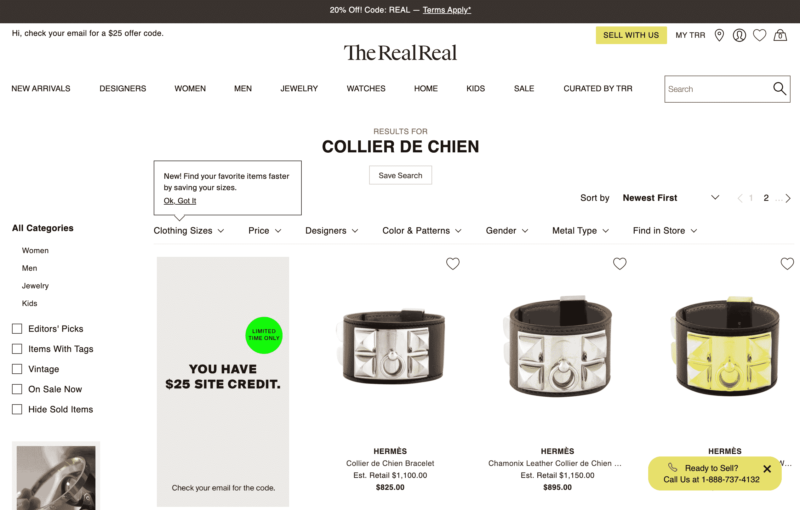

在时尚电子商务市场 The Real Real 的网站上，当购物者输入查询“collier de chien”时，设计师品牌爱马仕会使用 Algolia 相关性规则在搜索结果中得到提升。

【T2

[](https://www.algolia.com/search-inspiration-library/?configure%5BhitsPerPage%5D=9&indices%5BPROD_algolia_com-inspiration-library_query_suggestions%5D%5Bconfigure%5D%5BhitsPerPage%5D=6&indices%5BPROD_algolia_com-inspiration-library_query_suggestions%5D%5BrefinementList%5D%5Bpage%5D=1&indices%5BPROD_algolia_com-inspiration-library_query_suggestions%5D%5Bpage%5D=1&page=1&refinementList%5Bindustry%5D=&refinementList%5BbizDevTools%5D%5B0%5D=Merchandising&refinementList%5BuseCase%5D%5B0%5D=eCommerce&refinementList%5BimpactedPage%5D%5B0%5D=Typeahead%20Menu&query=)

### 零售商促销产品:Rugs.com 和 Blissim

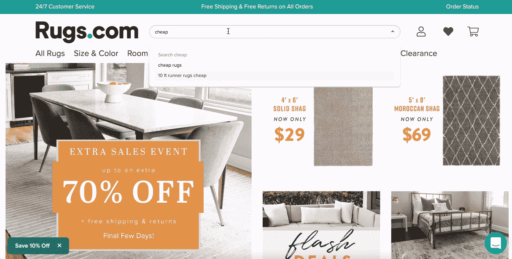

当用户在 Rugs.com 网站的搜索栏上输入“便宜”一词时，价格在 300 美元或以下的产品会在搜索结果页面上按照 Algolia 规则得到提升。

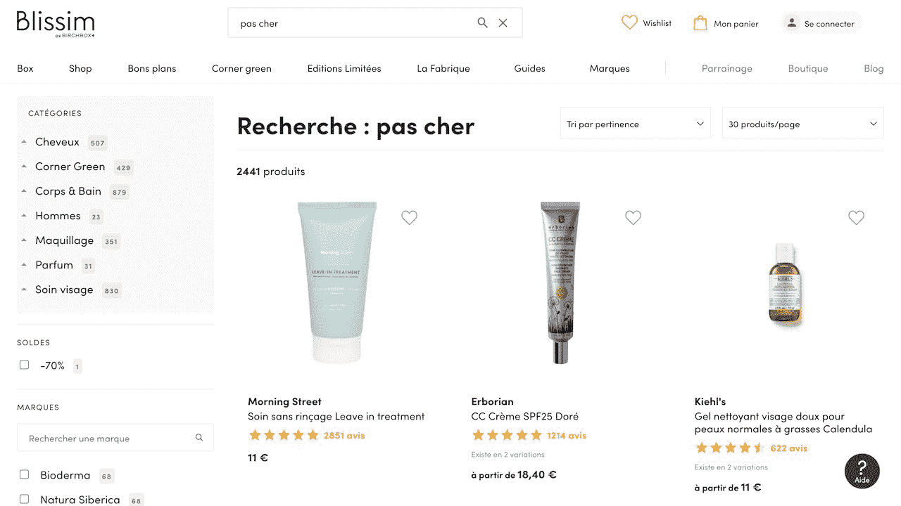

当用户在 Blissim 网站的搜索栏上输入查询“pas cher ”,意思是“便宜”,根据 Algolia 规则，价格在 20€或以下的产品将在搜索结果页面上得到提升。

[](https://www.algolia.com/search-inspiration-library/?configure%5BhitsPerPage%5D=9&indices%5BPROD_algolia_com-inspiration-library_query_suggestions%5D%5Bconfigure%5D%5BhitsPerPage%5D=6&indices%5BPROD_algolia_com-inspiration-library_query_suggestions%5D%5BrefinementList%5D%5Bpage%5D=1&indices%5BPROD_algolia_com-inspiration-library_query_suggestions%5D%5Bpage%5D=1&page=1&refinementList%5Bindustry%5D=&refinementList%5BbizDevTools%5D%5B0%5D=Merchandising&refinementList%5BuseCase%5D%5B0%5D=eCommerce&refinementList%5BimpactedPage%5D=&query=no%20results)

## 商品联邦搜索对空查询和无结果状态

### 针对零售商:栖息地的空查询的联合建议

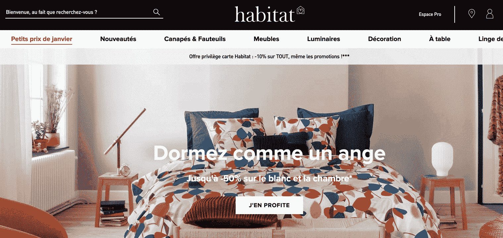

法国家具零售商 Habitat 通过一个空的搜索查询框，鼓励其网站访问者考虑其他创意和装饰技巧，建议补充信息类型，如关于产品的博客和常见问题解答。他们还直接链接到有用的页面，如运输或订单跟踪，以便更好地参与。

[](https://www.algolia.com/search-inspiration-library/?configure%5BhitsPerPage%5D=9&indices%5BPROD_algolia_com-inspiration-library_query_suggestions%5D%5Bconfigure%5D%5BhitsPerPage%5D=6&indices%5BPROD_algolia_com-inspiration-library_query_suggestions%5D%5BrefinementList%5D%5Bpage%5D=1&indices%5BPROD_algolia_com-inspiration-library_query_suggestions%5D%5Bpage%5D=1&page=1&refinementList%5Bindustry%5D=&refinementList%5BbizDevTools%5D%5B0%5D=Merchandising&refinementList%5BuseCase%5D%5B0%5D=eCommerce&refinementList%5BimpactedPage%5D=&query=no%20results)

### 眼镜零售商空查询的联合建议:EyeBuyDirect

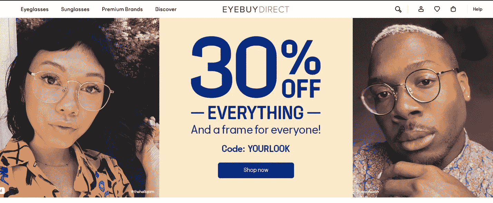

在一个空的搜索框中， [EyeBuyDirect 网站](https://www.eyebuydirect.com/)的访问者可以看到帮助他们缩小购物搜索范围的信息，例如博客和关于眼镜最新款式的常见问题。

成功指标:

*   通过搜索、浏览行为和个性化将收入提高 4%
*   根据产品推荐，转化率提高 1-1.5%

[**为你的店建**](https://www.algolia.com/doc/guides/managing-results/rules/merchandising-and-promoting/how-to/merchandise-on-empty-query/)

### 针对市场的空查询的联合建议——移动:Mercari

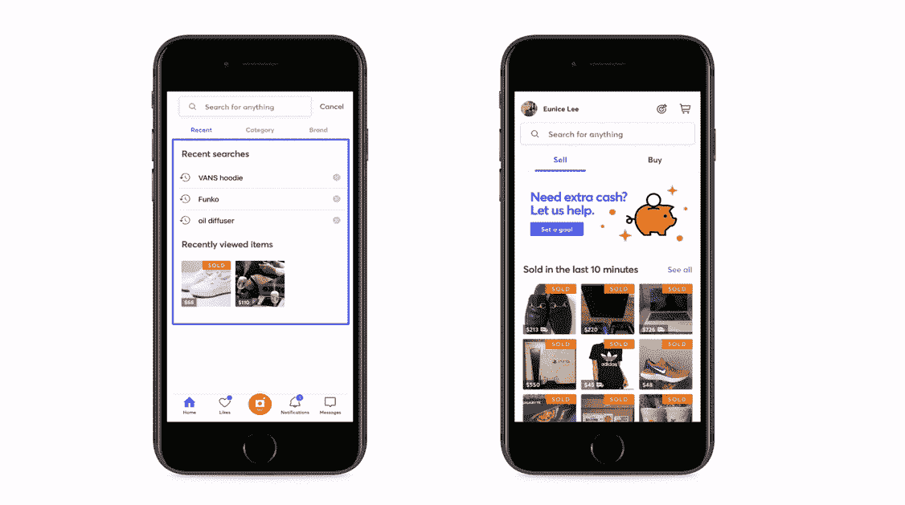

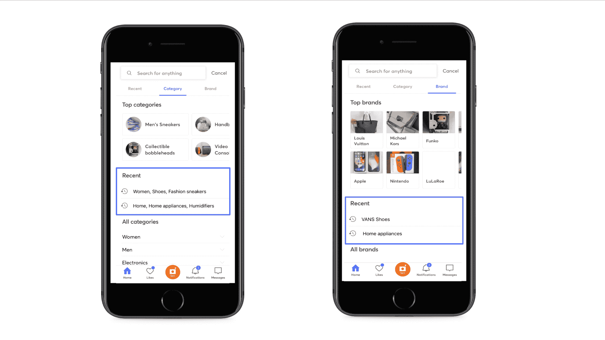

在 Mercari marketplace 网站上，购物者有多种选择:他们可以直接进入主题标签——最近、类别或品牌——并开始导航到他们想要的商品，而不是在空的搜索框中输入查询。

成功指标:

*   提高了每天超过 350，000 个列表的搜索和发现性能

[](https://www.algolia.com/search-inspiration-library/?configure%5BhitsPerPage%5D=9&indices%5BPROD_algolia_com-inspiration-library_query_suggestions%5D%5Bconfigure%5D%5BhitsPerPage%5D=6&indices%5BPROD_algolia_com-inspiration-library_query_suggestions%5D%5BrefinementList%5D%5Bpage%5D=1&indices%5BPROD_algolia_com-inspiration-library_query_suggestions%5D%5Bpage%5D=1&page=1&refinementList%5Bindustry%5D=&refinementList%5BbizDevTools%5D%5B0%5D=Merchandising&refinementList%5BuseCase%5D%5B0%5D=eCommerce&refinementList%5BimpactedPage%5D=&query=no%20results)

### 医药空查询联合建议:Onatera

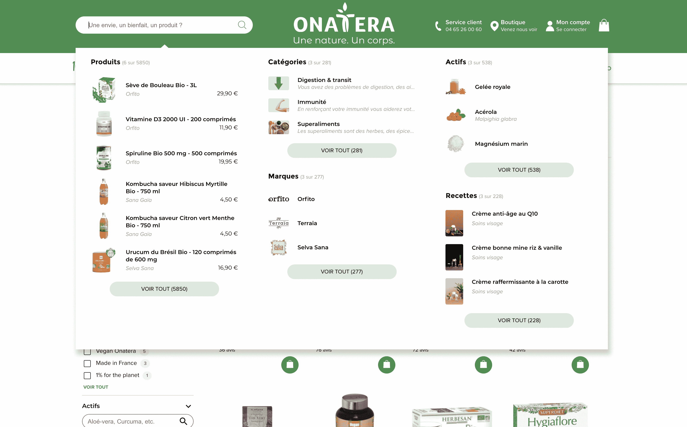

除了等待访问者查询医药产品的搜索框，Onatera 网站还提供补充类型的内容，包括配方、推广品牌等。

[](https://www.algolia.com/search-inspiration-library/?configure%5BhitsPerPage%5D=9&indices%5BPROD_algolia_com-inspiration-library_query_suggestions%5D%5Bconfigure%5D%5BhitsPerPage%5D=6&indices%5BPROD_algolia_com-inspiration-library_query_suggestions%5D%5BrefinementList%5D%5Bpage%5D=1&indices%5BPROD_algolia_com-inspiration-library_query_suggestions%5D%5Bpage%5D=1&page=1&refinementList%5Bindustry%5D=&refinementList%5BbizDevTools%5D%5B0%5D=Merchandising&refinementList%5BuseCase%5D%5B0%5D=eCommerce&refinementList%5BimpactedPage%5D=&query=no%20results)

## 商品热门搜索:在无结果页面推广热门类别及相关商品

### 无结果页面——展示奢侈品时尚市场的热门类别:真实真实

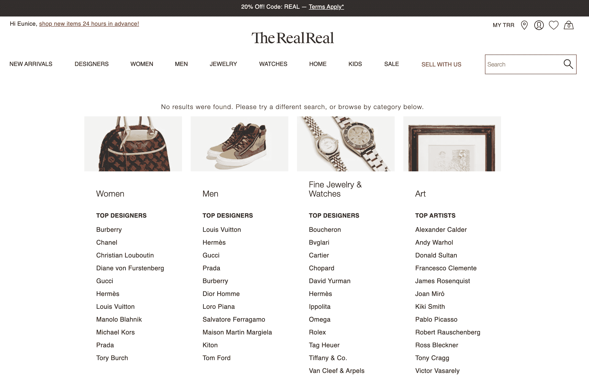

当访问者在经过认证的奢侈品时尚寄售市场 RealReal 上搜索而没有得到任何结果时，该网站会使用相关性规则显示促销商品。业务用户能够使用仪表板上直观的可视化界面更新和推广项目和类别，而无需编码。

 [ ](https://www.algolia.com/search-inspiration-library/?configure%5BhitsPerPage%5D=9&indices%5BPROD_algolia_com-inspiration-library_query_suggestions%5D%5Bconfigure%5D%5BhitsPerPage%5D=6&indices%5BPROD_algolia_com-inspiration-library_query_suggestions%5D%5BrefinementList%5D%5Bpage%5D=1&indices%5BPROD_algolia_com-inspiration-library_query_suggestions%5D%5Bpage%5D=1&page=1&refinementList%5Bindustry%5D=&refinementList%5BbizDevTools%5D%5B0%5D=Merchandising&refinementList%5BuseCase%5D%5B0%5D=eCommerce&refinementList%5BimpactedPage%5D=&query=no%20results)

### 

### 无结果页面-显示时装零售商的相关产品:鳄鱼

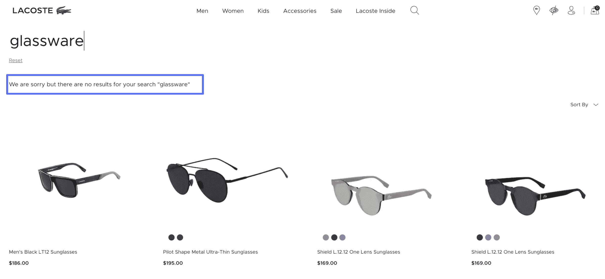

Lacoste 不会显示一个空白的“无结果”页面，而是通过显示相关产品来引导用户。例如，当用户搜索“玻璃器皿”时，他们会看到太阳镜。

[](https://www.algolia.com/search-inspiration-library/?configure%5BhitsPerPage%5D=9&indices%5BPROD_algolia_com-inspiration-library_query_suggestions%5D%5Bconfigure%5D%5BhitsPerPage%5D=6&indices%5BPROD_algolia_com-inspiration-library_query_suggestions%5D%5BrefinementList%5D%5Bpage%5D=1&indices%5BPROD_algolia_com-inspiration-library_query_suggestions%5D%5Bpage%5D=1&page=1&refinementList%5Bindustry%5D=&refinementList%5BbizDevTools%5D%5B0%5D=Merchandising&refinementList%5BuseCase%5D%5B0%5D=eCommerce&refinementList%5BimpactedPage%5D=&query=no%20results)

## 在搜索结果中显示促销横幅

### 搜索体育商品零售商 Lacoste 的促销横幅

Lacoste 利用搜索营销突出产品系列。特定的搜索查询会显示促销季节性商品的促销横幅。

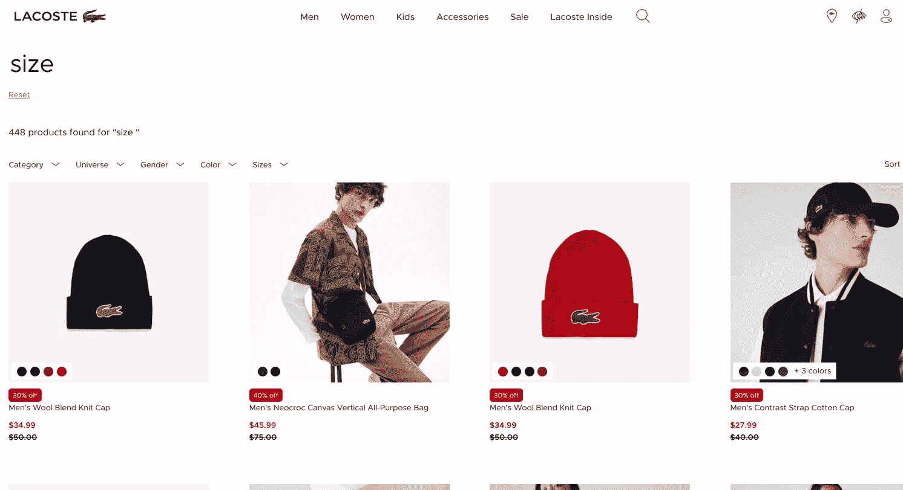

Lacoste 利用商品销售帮助用户找到自己的尺码。当用户搜索“尺码”时，网站会显示一个横幅，上面有一个服装尺码指南的链接。

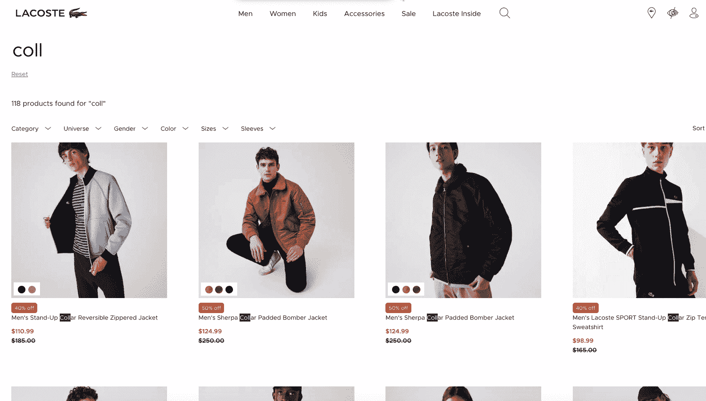

当用户在 Lacoste 的电子商务网站上输入特定的查询时，大型横幅广告会促进合作伙伴的合作，吸引用户进行探索。

成功指标:

*   搜索带来的销售额增长 150%
*   搜索使用率增长 210%
*   转化率提高 37%
*   -跳出率下降 88%

[](https://www.algolia.com/search-inspiration-library/?configure%5BhitsPerPage%5D=9&indices%5BPROD_algolia_com-inspiration-library_query_suggestions%5D%5Bconfigure%5D%5BhitsPerPage%5D=6&indices%5BPROD_algolia_com-inspiration-library_query_suggestions%5D%5BrefinementList%5D%5Bpage%5D=1&indices%5BPROD_algolia_com-inspiration-library_query_suggestions%5D%5Bpage%5D=1&page=1&refinementList%5Bindustry%5D=&refinementList%5BbizDevTools%5D%5B0%5D=Merchandising&refinementList%5BbizDevTools%5D%5B1%5D=Relevance%20Rules&refinementList%5BuseCase%5D%5B0%5D=eCommerce&refinementList%5BimpactedPage%5D=&query=banner)

### 搜索零售商的促销横幅:Plaisio

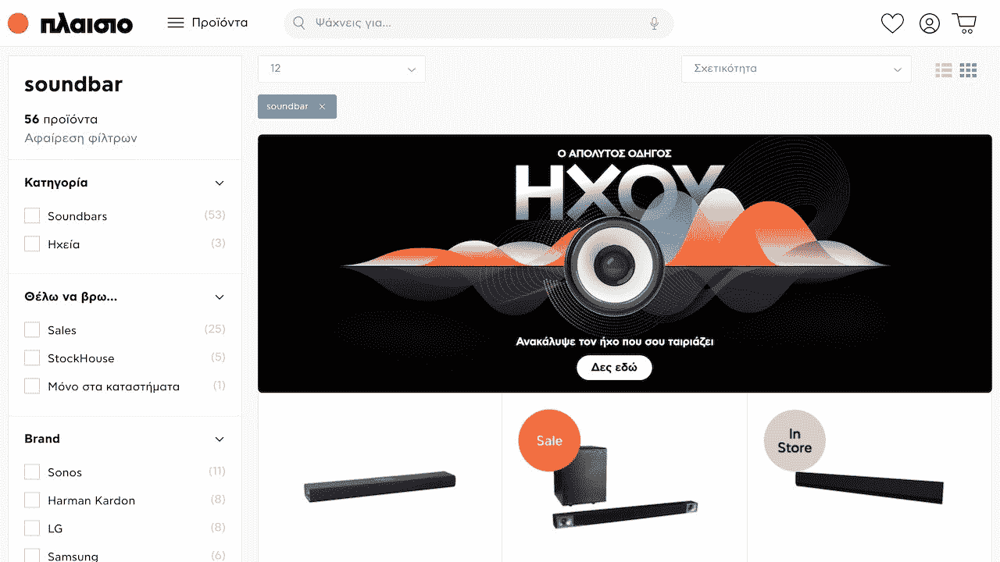

在零售商品牌 Plaisio 的网站上，输入某个搜索查询会出现相关产品系列的横幅广告；例如，搜索“soundbar”会触发一个推广几个相关产品的横幅。

[](https://www.algolia.com/search-inspiration-library/?configure%5BhitsPerPage%5D=9&indices%5BPROD_algolia_com-inspiration-library_query_suggestions%5D%5Bconfigure%5D%5BhitsPerPage%5D=6&indices%5BPROD_algolia_com-inspiration-library_query_suggestions%5D%5BrefinementList%5D%5Bpage%5D=1&indices%5BPROD_algolia_com-inspiration-library_query_suggestions%5D%5Bpage%5D=1&page=1&refinementList%5Bindustry%5D=&refinementList%5BbizDevTools%5D%5B0%5D=Merchandising&refinementList%5BbizDevTools%5D%5B1%5D=Relevance%20Rules&refinementList%5BuseCase%5D%5B0%5D=eCommerce&refinementList%5BimpactedPage%5D=&query=banner)

### 搜索零售商促销横幅:王者荣耀

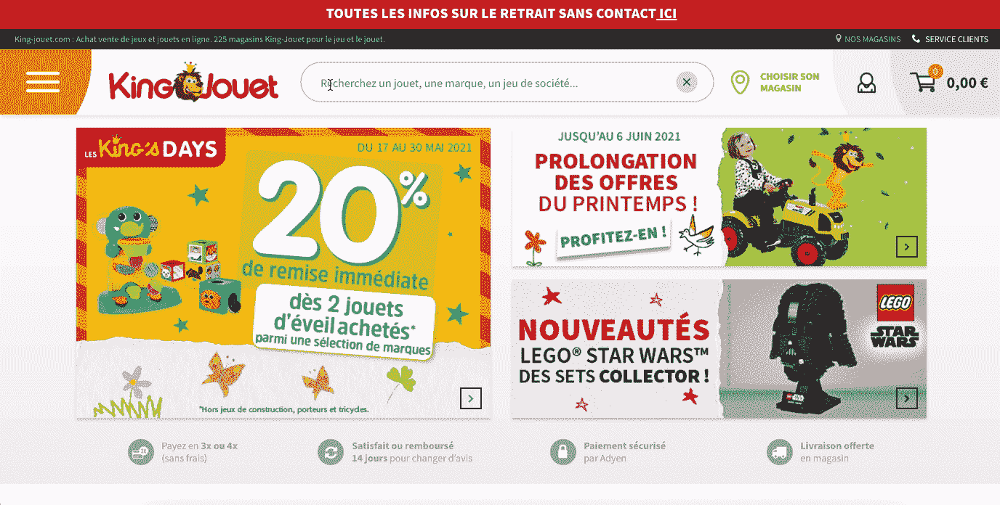

在零售商 King Jouet 的网站上，输入某个搜索查询就会出现相关产品系列的横幅广告；例如，搜索“corolle”会触发一个推广几个相关产品的横幅。

### 动态促销内容——零售商促销品牌页面:Blissim (Birchbox)

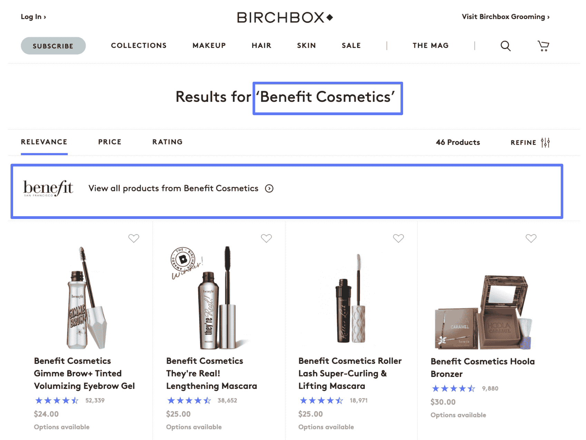

在 Birchbox 美国美容订阅网站上搜索一个品牌化妆品项目，会触发一个促销链接的显著显示(在用户搜索结果上方)，该链接指向该公司在线商店的一个专门品牌页面。

## 结论

销售策略是任何电子商务企业的心脏。制定成功的实施和执行计划对于公司在竞争激烈的零售行业中的生存至关重要。当竞争对手的产品只需点击一下，网站上发生的每一次搜索或浏览事件都很重要。为顾客设计卓越的购物体验可以提升品牌忠诚度，增加销售额和转换率，降低跳出率。改进和优化相关性策略和产品优先排序增加了搜索的使用，结果导致搜索的销售贡献成倍增加。

阅读更多关于[如何通过品类销售](https://www.algolia.com/blog/customers/how-to-boost-online-sales-with-category-merchandising/)促进在线销售的信息。