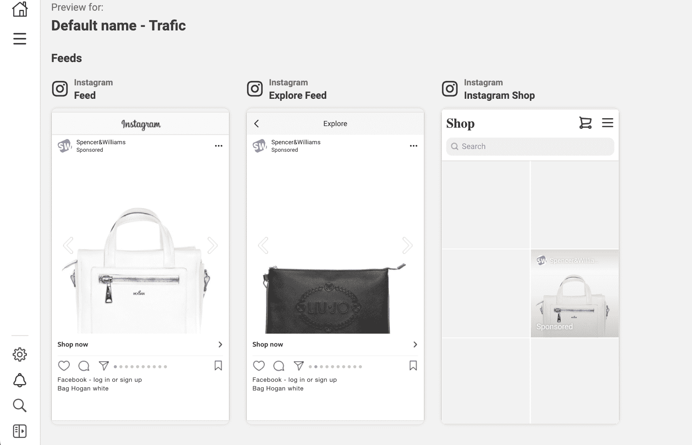
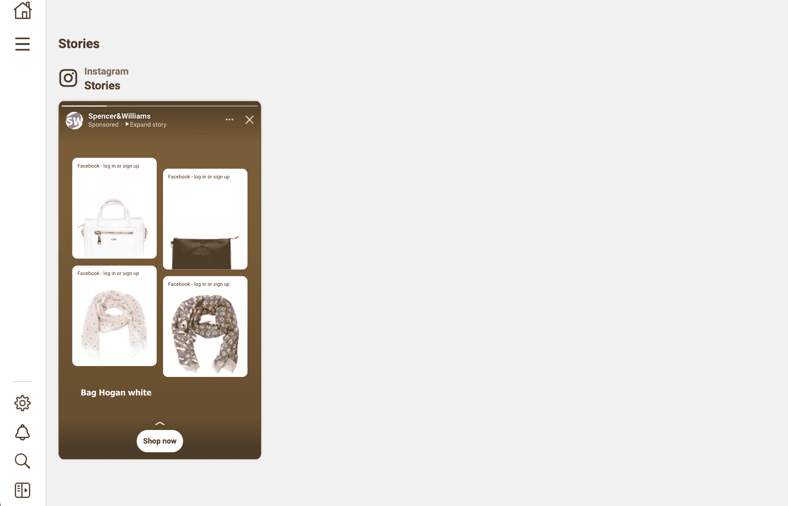

# 如何整合 Algolia 推荐与 Instagram 广告(附代码)

> 原文：<https://www.algolia.com/blog/product/how-to-integrate-algolia-recommend-with-instagram-ads/>

### insta gram 广告

Instagram 广告是许多行业非常常见的促销工具，尤其是电子商务。推广广告在常规提要之间注入，向用户呈现一系列商品供点击和潜在购买。Instagram 为广告商提供了一种基于 Meta 社交媒体平台上用户行为和购物偏好等内部数据的广告定位算法，以及一种包括来自其他来源的外部跟踪信息的选项。

### 潮流款搭配 Algolia 推荐

insta gram 广告的效果可以通过利用人工智能工具进行产品推荐来优化。Trends 是 [Algolia 推荐](https://www.algolia.com/products/recommendations/) 中的一组新模型，使团队能够创建能够动态适应新兴趋势的体验，消除手动编辑管理的需要。

Recommend 为构建者提供了两个关注趋势的新 API:

*   **物品趋势** :构建者将能够显示整个目录中的趋势物品，或者仅仅是给定的类别或品牌(或者任何方面的值)。
*   **方面值的趋势** :构建者将能够立即显示给定类别或品牌的趋势方面值(或者任何方面值)。

这两个模型可以结合起来推荐“每个方面名称的趋势项目”

趋势模型的好处在于发现早期趋势，例如产品需求随着时间的推移而增长，而不是像典型的畅销书那样持续的高需求产品。对于竞争激烈的行业，如零售、时尚和美容，及早发现新趋势是游戏规则的改变者，直接影响收入和品牌信誉。

从客户体验的角度来看，直接的好处是所有渠道的营销和促销资产的一致性。客户在浏览社交媒体时，在网站上看到向他们推荐的相同产品，当他们收到以推荐产品 为特色的 [促销邮件时。一致性是关键。](https://www.algolia.com/blog/engineering/how-to-send-engaging-customer-emails-with-twilio-sendgrid-and-algolia-recommend/)

### 如何用 Instagram 广告实现 Algolia 推荐

Instagram 为广告内容推广提供了几种选择。有了经典的 [Instagram 广告](https://developers.facebook.com/docs/marketing-api/guides/instagramads) ，内容由广告主手动选择，由 Instagram 提供给选定的目标受众。 [动态广告](https://developers.facebook.com/docs/marketing-api/dynamic-ads) 选项让广告主除了内部 Instagram 用户行为数据之外，还可以利用外部跟踪数据。我们将从整合 Algolia 推荐模型与经典 Instagram 广告 *开始，然后讨论动态广告的增强可能性。*

要开始整合 Algolia 推荐和 Instagram 广告，您需要遵循两步流程。

**第一步:Algolia 设置**

1.  [上传你的目录数据](https://www.algolia.com/doc/guides/sending-and-managing-data/send-and-update-your-data/) 到阿果利亚
2.  实现 [见解点击&转换事件](https://www.algolia.com/doc/guides/sending-events/implementing/)
3.  实现推荐(Docs: [趋势推荐](https://deploy-preview-6766--algolia-docs.netlify.app/doc/guides/algolia-recommend/overview/#trending-items-and-trending-facet-) )
4.  确保满足最小交通量要求:至少收集最近 30 天内的 10K 事件

**第二步:Instagram 设置**

1.  设置一个 [业务经理账户](https://www.facebook.com/business/help/530540643805698?id=180505742745347&ref=fbb_dynamicads)–您的账户必须经过 [验证](https://www.facebook.com/business/help/1095661473946872?id=180505742745347) 才能使用目录 API
2.  上传您的 [目录](https://www.facebook.com/business/help/1397294963910848?id=2042840805783715&ref=fbb_dynamicads) 给业务经理
3.  通过使用Algolia 推荐 API 在目录中动态创建一组 [项目，以获取要添加到组中的趋势项目](https://www.facebook.com/business/help/620275848114281?id=725943027795860)
    1.  使用 Python 客户端从 Algolia 获取 [全球趋势产品](https://www.algolia.com/doc/api-reference/api-methods/get-trending-global-items/)
    2.  使用趋势产品 id 列表，创建新的脸书目录产品集:
4.  使用上面创建的产品集作为产品来源，创建您的广告活动，并定义您的目标受众
5.  审核并发布
6.  热门产品每 24 小时更新一次，为了让您的广告中展示的产品始终保持新鲜，您需要更新您的产品集:

[**演示**](https://teal-creponne-6954ac.netlify.app)**[**知识库**](https://github.com/algolia-samples/recommend-trends-instagram-ads)**

 **### 下一步:增强和自动化受众定位

目标营销活动中常用的营销工具是客户数据平台。像 Segment、mParticle 和 Google Tag Manager 这样的 CDP 从多个来源收集并统一第一方客户数据，然后将其用于有针对性的个性化营销活动。当使用 Algolia 推荐趋势产品模型为 Instagram 广告提供支持时，您可以使用您的 CDP 来定义与趋势类别相匹配的动态受众，从而自动化广告受众定位流程。

### 结论

要将 [Algolia 推荐的](https://www.algolia.com/products/recommendations/) 的潮流产品模型与您的 Instagram 广告整合，请前往 [Algolia 代码交换](https://www.algolia.com/developers/code-exchange/showcase/integrate-algolia-recommend-with-instagram-ads/) 获取实现说明、一个代码示例 GitHub 库，以及一个 demo。或者回头参考这篇博文！

[T31](https://www.algolia.com/developers/code-exchange/showcase/integrate-algolia-recommend-with-instagram-ads/)

要实施此解决方案，您需要激活 Algolia 推荐并设置您的 Instagram 产品受众。完成所有配置后，您的社交媒体广告定位应该会变得更加准确和有效。**