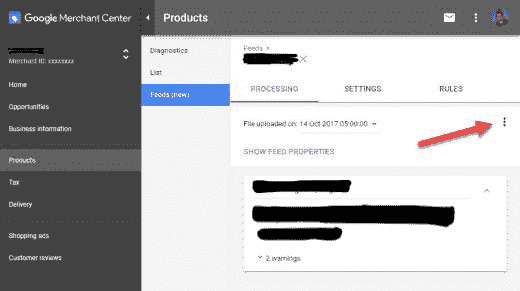
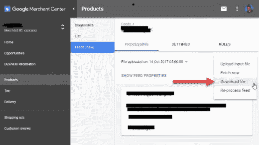
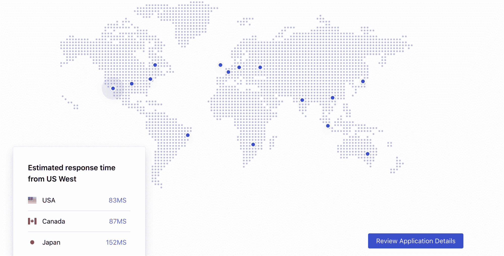
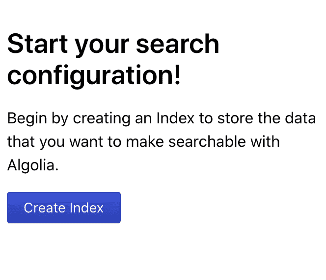
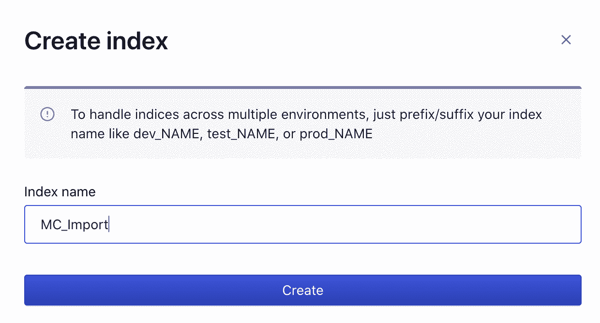
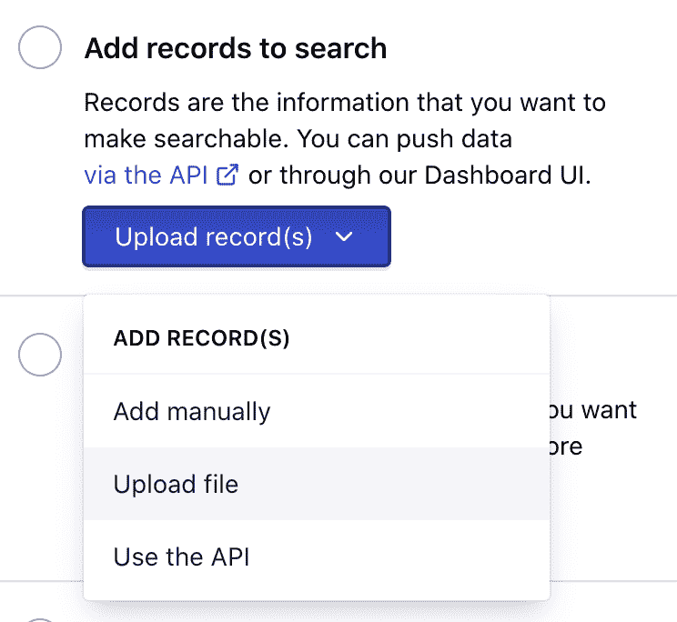
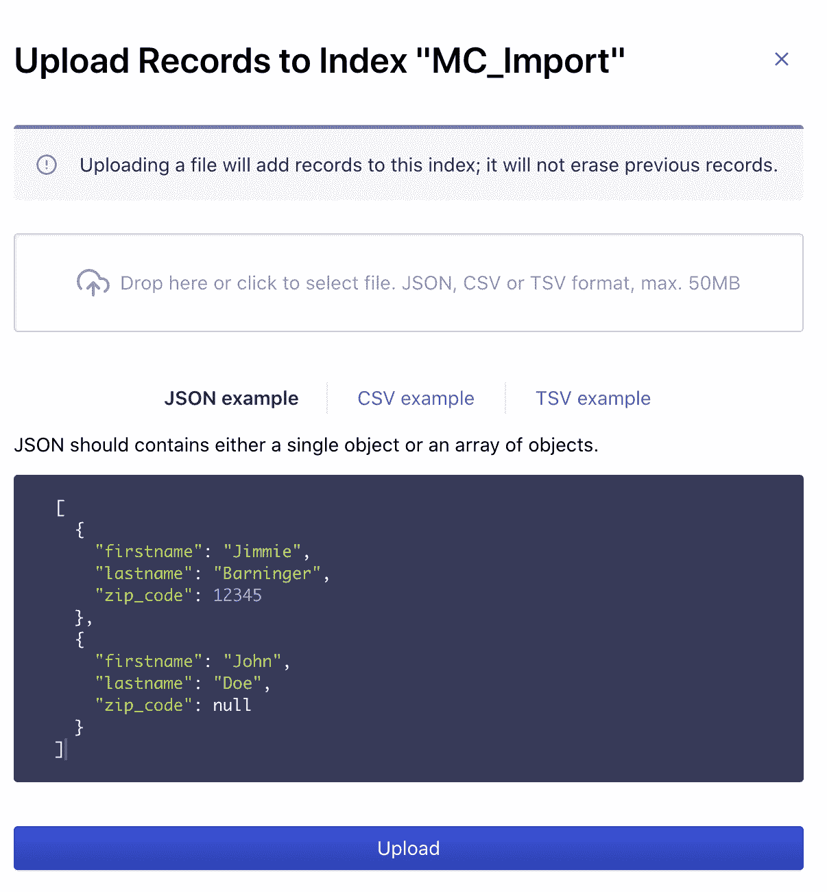

# 如何用你的谷歌商业中心数据快速评估 Algolia

> 原文：<https://www.algolia.com/blog/ecommerce/how-to-quickly-evaluate-algolia-with-your-google-merchant-center-data/>

[Google Merchant Center](https://www.google.com/retail/solutions/merchant-center/) 编辑了您的全球产品目录，这是您的 Google 广告或 Google 购物战略的一部分。既然你已经付出了努力，你知道它可以帮助你评估购物体验的另一个重要方面:网站搜索吗？

评估一个搜索解决方案通常需要前端和后端开发人员，并且在看到实际结果之前需要大量的资源投入。在本帖中，我们将回顾如何使用 Google Merchant Center 和 Algolia dashboard 在几分钟内构建 POC，不需要任何编码技能。

Algolia 为 9，000 多家客户提供搜索和发现服务，从财富 100 强公司到小型企业和初创公司。我们的使命是为每家公司提供卓越的搜索和发现体验。以下是快速入门的方法。

## 结果没来得及

您的 Google Merchant Center 产品目录中的数据可以轻松导出，然后通过用户友好的拖放界面导入到 Algolia，只需几秒钟。一旦数据被加载，Algolia 仪表板将让您在一个实时用户界面中搜索数据。

### 1。从商业中心导出提要

*   登录到商家中心后，选择“产品”->“订阅源”。

*   点击提要窗格(不是右上角)中的溢出菜单(3 个点)->“下载”。

### 2。将数据载入 Algolia

去 https://www.algolia.com/users/sign_up[报名参加完全免费的试用(不需要信用卡)。](https://www.algolia.com/users/sign_up)

*   选择最近的数据中心。

*   按下“创建索引”按钮。你需要将数据发送到我们的服务器，这样我们就可以搜索到它，数据放在一个索引，这是一个超级快速的数据模型优化搜索。你可以给它起任何你想要的名字。

*   输入名称，然后按“创建”按钮

*   选择“添加记录”->“上传文件”

*   拖拽 TSV 文件并按  上传

恭喜，您已经在 Algolia 中索引了您的数据！

从这里，您可以在我们的仪表板中测试基本的搜索查询。

## 接下来是什么？

如果你想更进一步，你可以:

*   [配置搜索引擎](https://www.algolia.com/doc/guides/managing-results/relevance-overview/)提高搜索结果的相关性。
*   添加一个[业务指标](https://www.algolia.com/doc/guides/managing-results/must-do/custom-ranking/)(如转化率、受欢迎程度或利润率)。谷歌产品提要不包括它，但这可以作为一个自定义字段添加，或者 Algolia 可以集成到[谷歌分析](https://www.algolia.com/doc/guides/getting-insights-and-analytics/search-analytics/understand-reports/how-to/connect-search-with-google-analytics/)来获得这些信息。

当然，我们很乐意帮助您！如果您对 Algolia 能够为您的企业带来的价值感兴趣，请[联系我们](https://www.algolia.com/contact/enterprise/)，我们可以帮助您优化您的试验，在实时在线搜索中查看您的数据，或者帮助您解决任何其他问题。寻找快乐！