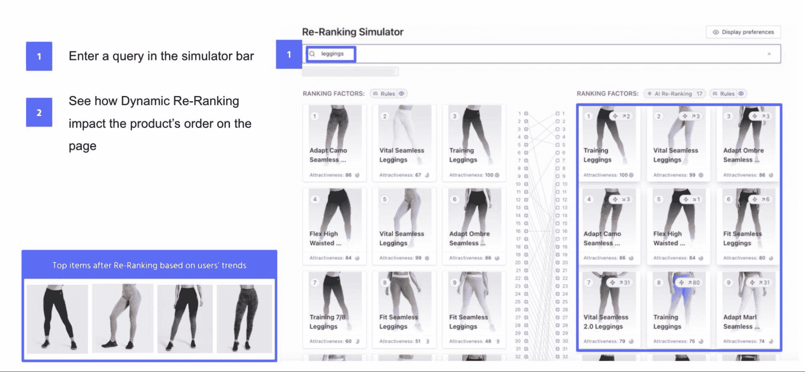
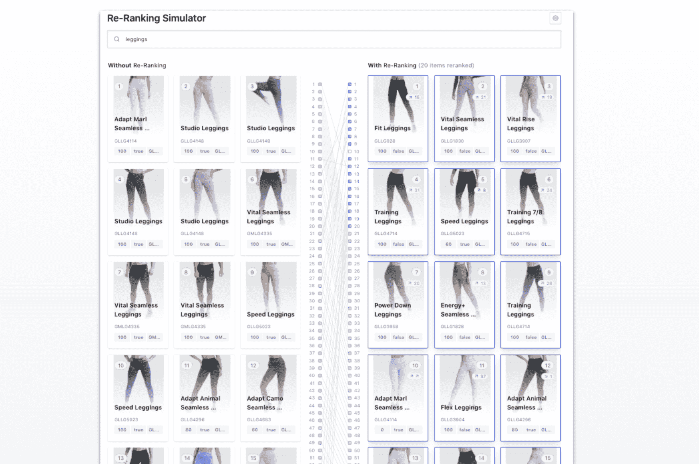
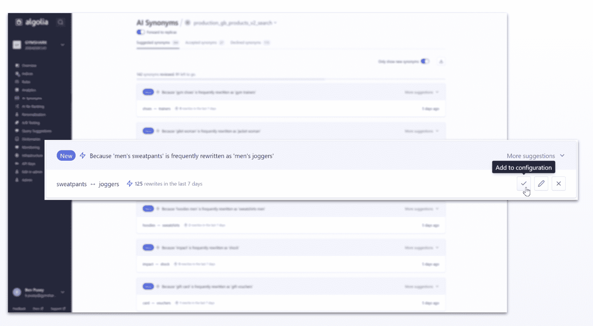
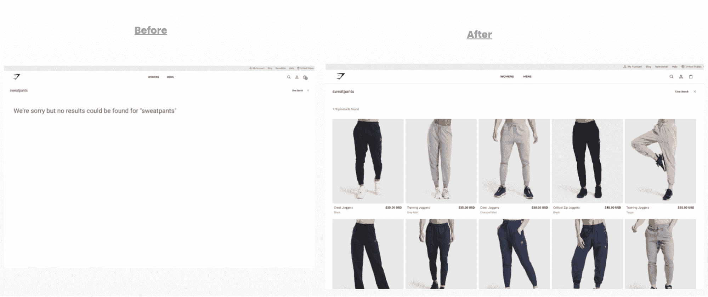
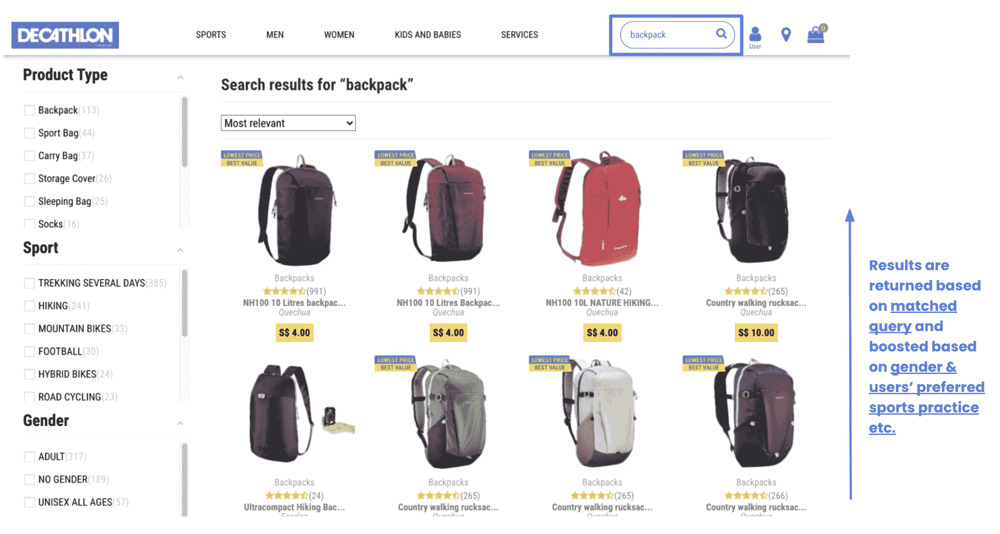
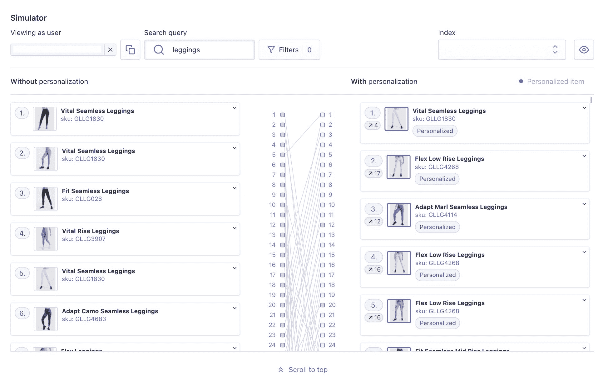

# 如何利用人工智能优化和个性化来提高体育行业的客户忠诚度- Algolia 博客

> 原文：<https://www.algolia.com/blog/ecommerce/how-to-use-ai-optimization-and-personalization-to-improve-customer-loyalty-in-the-sports-industry/>

对于一家经营时装或体育用品行业的公司来说，普通的购物体验代表着高风险。这些都是高度动态和快节奏的环境，没有留下任何营销或销售策略错误的空间。数字购物体验需要对趋势和顾客口味的变化做出反应。它需要分别吸引每个客户。这就是人工智能优化和个性化的切入点:动态和个性化的购物。

## **AI 优化**

应用人工智能优化有助于零售商优化营销工作，并直接影响客户转化和增加销售额。对于像体育用品零售这样竞争激烈的行业，一般的方法不足以“赢得”客户并保持长期竞争力。营销预算中的每一美元都必须以最大的效率使用，每一步都应该进行测试和评估，以优化整体业务战略。

[**阅读更多关于** **利用人工智能优化用户转化的最佳方式**](https://www.algolia.com/blog/customers/best-ways-to-leverage-ai-to-optimize-a-user-conversion/)

### **艾排名:Gymshark**

在 Gymshark 的网站上，用户经常在搜索结果中点击的产品排名较高。在幕后，AI 动态优化排名以提高转化率。

Gymshark 的成功指标:

*   用机器学习的商品销售(AI 重新排名)负责 2M 一年的额外销售

### **艾同义词建议:Gymshark**

体育零售商 Gymshark 使用 Algolia 的人工智能生成的同义词，让用户即使对相同的产品使用不同的单词，也能找到相关的结果。

## **个性化**

个性化使零售商能够向顾客提供卓越的顾客体验，甚至胜过店内与销售人员的直接沟通。个性化应该让电子商务购物者感到轻松和有用，而不是“令人毛骨悚然”，因为个性化策略走得太远可能会发生这种情况。以下是体育用品电子商务零售商成功实施个性化以确保卓越的用户体验和满意度，同时提高销售额、点击率和转化率的例子。

### **个性化搜索:迪卡侬、Gymshark**

迪卡侬新加坡公司分析用户浏览时的偏好。这使得迪卡侬能够个性化用户体验，使搜索结果和整体浏览过程更具相关性和吸引力。

迪卡侬的成功指标:

*   点击率提高 36%
*   转化率提高 50%

[**了解更多迪卡侬个性化体验**](https://resources.algolia.com/merchandising/decathlon-singapore)

Gymshark 通过结合用户资料中的事件和方面值，确保每个购物者都能看到与他们独特偏好最相关的产品。

Gymshark 的成功指标:

*   搜索转化率:从前 Algolia 的 6.2%上升到平均 10%，并且还在上升
*   来自搜索的订单:从不到 10%的前 Algolia 增长到 2020 年黑色星期五的 30%以上
*   来自搜索用户的收入同比增长 400%

[T32](https://www.algolia.com/doc/guides/personalization/what-is-personalization/)

[](https://www.algolia.com/search-inspiration-library/?configure%5BhitsPerPage%5D=9&indices%5BPROD_algolia_com-inspiration-library_query_suggestions%5D%5Bconfigure%5D%5BhitsPerPage%5D=6&indices%5BPROD_algolia_com-inspiration-library_query_suggestions%5D%5BrefinementList%5D%5Bpage%5D=1&indices%5BPROD_algolia_com-inspiration-library_query_suggestions%5D%5Bpage%5D=1&page=1&refinementList%5Bindustry%5D%5B0%5D=Retail&refinementList%5BbizDevTools%5D%5B0%5D=Personalization&refinementList%5BuseCase%5D%5B0%5D=eCommerce&refinementList%5BimpactedPage%5D=&query=sports%20%26%20goods)

[**阅读更多关于电子商务个性化最佳实践的信息**](https://www.algolia.com/blog/customers/best-practices-for-ecommerce-personalization/)

## **结论**

通过自动化和利用机器学习算法，人工智能优化开启了新的机会，并提高了您的电子商务流程的效率。这种创新对于体育&商品电子商务等快节奏行业至关重要。这个市场竞争激烈，发展迅速，并不断受到新趋势的影响。因此，体育用品公司必须快速适应并不断改善客户的在线体验。通过精心选择和配置的工具，体育用品零售商可以提高相关性，改善商品销售和个性化策略，降低跳出率，增加收入、销售额、点击率和转换率。