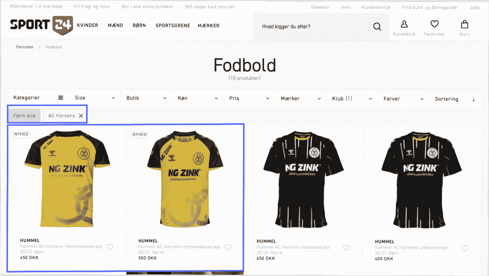

# 如何利用营销能力提高体育行业的客户忠诚度- Algolia 博客

> 原文：<https://www.algolia.com/blog/ecommerce/how-to-use-merchandising-capabilities-to-drive-customer-loyalty-in-the-sports-industry/>

对于零售商来说，电子商务销售是一个机会，可以输入业务逻辑，并管理显示给客户的搜索和浏览结果。这包括管理促销，管理搜索结果，并测试每一个步骤，以确保他们增加销售和转换。对于体育行业来说，季节性对业务有着重大影响。

季节性促销、销售活动、季节性产品以及特定体育赛事或与体育相关的影响者/个性推广产品对于体育用品零售商来说很常见，应该在网站上以闪电般的速度反映和更新。隐藏脱销或过季的产品，或者推广当前的销售活动，是一种需要否决常规搜索相关性的业务逻辑。

### 锁定、隐藏、提升、隐藏搜索结果:Sport24、Gymshark

体育零售商 Sport24 将其搜索结果商业化。当用户搜索“horsens”时，某些产品被钉在搜索结果的顶部，而其他产品则被隐藏。

当用户在体育零售商 Gymshark 的网站上搜索“帽子”时，所选产品会显示在搜索结果的顶部，以便更有效地进行销售。

Gymshark 的成功指标:

*   由于相关性策略的改进，2M 一年的额外销售额增加了
*   由于全尺寸系列产品优先，每年额外增加 300 万英镑的销售额
*   由于隐藏缺货产品，每年额外销售 120 万英镑

[](https://www.algolia.com/search-inspiration-library/?configure%5BhitsPerPage%5D=9&indices%5BPROD_algolia_com-inspiration-library_query_suggestions%5D%5Bconfigure%5D%5BhitsPerPage%5D=6&indices%5BPROD_algolia_com-inspiration-library_query_suggestions%5D%5BrefinementList%5D%5Bpage%5D=1&indices%5BPROD_algolia_com-inspiration-library_query_suggestions%5D%5Bpage%5D=1&page=1&refinementList%5Bindustry%5D%5B0%5D=Retail&refinementList%5BbizDevTools%5D%5B0%5D=Merchandising&refinementList%5BuseCase%5D%5B0%5D=eCommerce&refinementList%5BimpactedPage%5D=&query=sports%20%26%20goods)

### 推广横幅:Lacoste

Lacoste 利用搜索营销突出产品系列。特定的搜索查询会显示促销季节性商品的促销横幅。

### 

### 

### **动态登陆页面:文化君王**

街头服装时尚零售商 Culture King 使用动态类别登录页面来推广他们的产品。当用户点击“老高尔夫球手”推广横幅时，他们会被带到一个单独的登录页面，在那里可以查看新的老高尔夫球手头饰。

阅读更多关于电子商务营销最佳实践的信息:

[**如何通过搜索营销增加网上销售**](https://www.algolia.com/blog/customers/how-to-increase-online-sales-with-search-merchandising/)

[**如何通过品类销售提升在线销售**](https://www.algolia.com/blog/customers/how-to-boost-online-sales-with-category-merchandising/)

## **结论**

[在网站的搜索结果页面和分类页面上配置营销策略](https://www.algolia.com/industries-and-solutions/ecommerce/digital-merchandising/)对于竞争激烈的行业至关重要，例如体育&商品电子商务。公司必须能够快速迭代，即时发布活动，并对业务环境中的任何变化做出快速反应。一个明确的营销策略不仅能让体育用品零售商增加收入和转化率，还能让他们适应未来的新趋势。