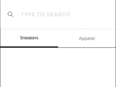
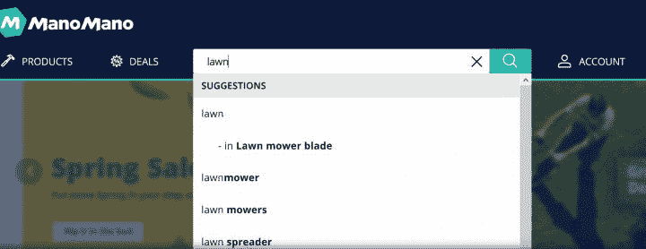
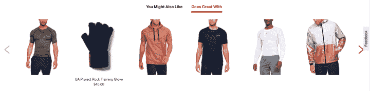

# 如何使用 microcopy 改进搜索 UX 

> 原文：<https://www.algolia.com/blog/ux/how-to-use-microcopy-to-improve-ux/>

用户体验(UX)通常是区分好的搜索体验和真正有用的搜索体验的标准。放置得当的 microcopy 可以引导用户进行搜索和导航，从而提高网站的可用性。 使用 microcopy 是改善网站和搜索界面用户体验的一种简单方法。

## 什么是 microcopy？

Microcopy 是引导用户浏览网站的简短有力的文本的术语。缩微复制通常伴随着提示、指导或教导用户如何做某事的图片或图形。

搜索结果页面上的相关搜索和 [搜索栏](https://blog.algolia.com/3-key-ux-design-elements-of-the-search-bar/) 中的占位符文本都是很多用户熟悉的 microcopy 实例。但是 microcopy 可以在任何地方使用，包括主页、自动完成字段、 [无结果页面、](https://blog.algolia.com/avoid-no-results-pages/) 调查和表单，以及网站上用户需要采取行动的几乎任何地方。

## microcopy 为什么重要？

由于亚马逊、谷歌、 [【网飞】](https://resources.algolia.com/media/building-a-netflix-style-search-discovery-experience) 等领先公司精心打造的流畅、个性化的体验，今天的用户对网站 的体验有着很高的期望。你的网站需要达到很高的标准，像添加 microcopy 这样的可用性改进可以帮助你达到这个标准。

另外， **用户搜索能力较弱。** 搜索技能差往往意味着搜索结果乏善可陈，只有 1%的用户知道如何改变搜索策略以获得更有效的结果。这不一定是用户的错。每个网站都有不同的搜索体验，很难从搜索效果好的网站和不好的网站中获得最好的结果。根据 KISSMetrics 的研究， [一个网站 12%的访问者会在不满意的搜索后离开](https://blog.algolia.com/advanced-search-experience-for-e-commerce/) 并选择竞争对手的网站。你不想失去用户，因为他们不知道如何找到他们想要的东西。像 microcopy 这样简单的附加功能可以帮助用户设计更好的查询。

**战略性地在整个网站使用 microcopy 可以使搜索和导航过程更加清晰，改善** [**整体 UX** 。Microcopy 通过提示用户搜索、点击和浏览网站的某些区域，引导用户了解网站的基本功能。它还可以通知用户后端正在执行的任务，让他们知道他们正在取得进展。这些有用的提示和指南是形象化的路标，指引用户获得流畅、迷人的体验。](https://www.pcmag.com/encyclopedia/term/user-experience)

## 3 个用于搜索和导航的有效缩微副本示例

使用 microcopy，即使是最小的细节也会对整体 UX 产生巨大影响。让我们看看在你的网站上使用 microcopy 的三种方式。

### 1。占位符文本和搜索栏

绝大多数用户看到搜索栏或者放大镜就知道该怎么做了。但是你不应该想当然地认为他们知道如何设计完美的查询。搜索栏中的占位符文本可以为用户提供什么样的查询会成功的第一个提示，甚至可以扩展他们搜索内容的视野。这里有几个例子:

**山羊:** 搜索 栏明确指导用户采取行动，并介绍了网站上的主要产品类别。

Coursera: 通过向用户提出“你想学什么”这样的问题，搜索栏 microcopy 引导用户输入目标查询，同时巧妙地强化了公司的使命。

**Birchbox:** 搜索栏中的占位符文本邀请用户搜索他们的法语网站，而不仅仅是产品，暗示了这种搜索体验配备的 [联合搜索功能](https://blog.algolia.com/federated-search-benefits-and-challenges/) 。

****

### 2。自动建议或查询建议

Autosuggest，也称为[autocomplete](https://blog.algolia.com/search-autocomplete-on-mobile/)，预测性搜索，或查询建议，是一种将搜索从仅仅是网站一角的一个框扩展到成为 [用户真实体验](https://blog.algolia.com/advanced-search-experience-for-e-commerce/) 的能力。设计良好的自动建议就像是与用户的互动对话——每次用户添加另一个字符，搜索就会建立、完善并为用户提供新的建议。

例如，在 **ManoMano** 网站上，查询“lawn”会向用户返回与维护他们的院子相关的各种选项。建议之间的差异被方便地加粗，以便用户可以快速识别哪个查询最符合他们的需求。

通过提供建议，用户可以轻松点击查找结果，这种高级形式的缩微复制:

*   减少搜索时间
*   提供已知可产生结果的查询
*   向用户推广受欢迎的内容和产品

对于有战略目标的结果，查询应基于 [内部分析数据](https://blog.algolia.com/internal-site-search-analysis/) 用于最流行的搜索、业务规则，以及 [外部分析引擎](https://blog.algolia.com/query-suggestion-ux-like-googles/) 如 Google Analytics 用于真正有价值的自动完成功能。

## 3。相关和推荐搜索

相关和推荐搜索是代表 [发现体验](https://blog.algolia.com/site-search-content-discovery/) 的关键部分的缩微副本形式。与自动完成推荐不同，它们引导用户搜索他们最初没有寻找的东西。这些推荐可以放在主页、搜索结果页面、单个产品/内容页面或任何您想抓住机会进行交叉销售、追加销售和帮助用户找到他们不知道自己想要的东西的地方。

**Underarmour** 利用单个产品页面上的推荐搜索，引导用户产生新的兴趣，并有希望购买新的商品。

这种类型的 microcopy 还可以通过利用热门搜索或完全基于业务优先级来预测用户需求。

## 使用 microcopy 的最佳实践

为了在你的网站上获得 microcopy 的好处，这里有几个可以遵循的最佳实践:

### 预见用户的需求

应将 Microcopy 添加到网站上用户可以使用额外指导或不确定下一步导航的地方。例如，如果一个站点包含一个联系表单，考虑一下用户在这个过程中可能会遇到的问题。所有字段都是必填的吗？用户在填写表单后应该期待发生什么？是否有某些字段可供您选择多个选项？仔细思考这些潜在的问题，然后使用 microcopy 帮助引导用户完成表单并提高转化率。

在网站搜索的背景下，思考什么类型的选项可以帮助搜索者。他们会想知道所有可以选择的类别吗，或者仅仅是少数几个？他们可以从同一个搜索框中搜索产品和书面资源吗？之后他们将如何改进他们的搜索？公司可以帮助用户使用搜索推荐、相关搜索和可视化搜索工具来优化搜索，所有这些都有智能 microcopy 的帮助。

### 保持你的缩微拷贝简明扼要

简短、甜蜜、信息丰富应该是创建 microcopy 的座右铭。只要这些简短的短语、建议和通知是有帮助的，缩微副本越短，对用户越好。目的应该是让用户参与进来，并让他们知道自己在做什么，这样他们就能尽快完成。

### A/B 测试用 microcopy 搜索 UX

当你决定在网站上放置 microcopy 的位置和方式时，验证你的选择并确保它们能最有效地改善用户体验是很重要的。 [A/B 测试](https://www.algolia.com/products/search-and-discovery/ab-testing/) 就是一个很好的方法。您可以使用它来测试整个站点中不同的 CTA、横幅和其他缩微副本，并利用用户反馈来开发更友好和个性化的用户体验。

## 用 microcopy 改进你的站点 UX

Microcopy 可以对你的网站和搜索的整体可用性和 UX 产生重大影响。Algolia 提供了一个易于使用的搜索 API，具有设计良好的搜索界面，利用 microcopy 来增强客户体验，并最终增加您的转化率。阅读我们的电子书 [超越框框的搜索](https://resources.algolia.com/ebooks/search-beyond-the-box-ecommerce-version) ，学习如何扩展你网站的搜索功能。