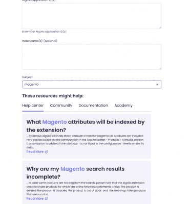
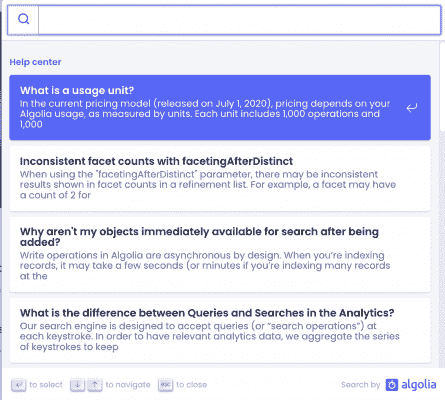
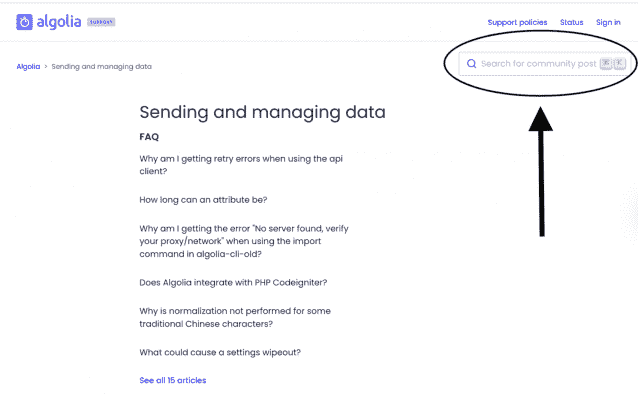
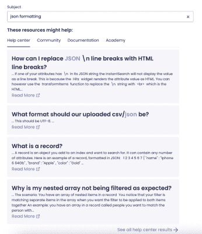
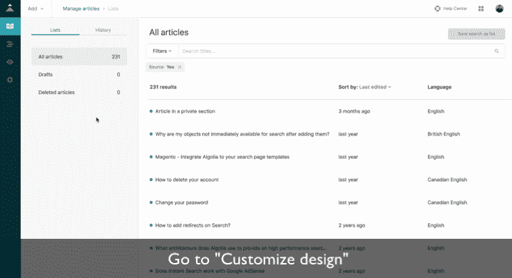
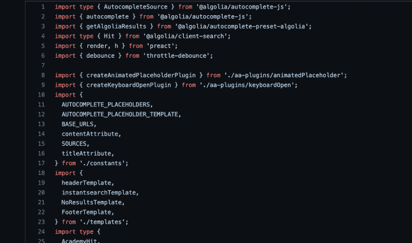
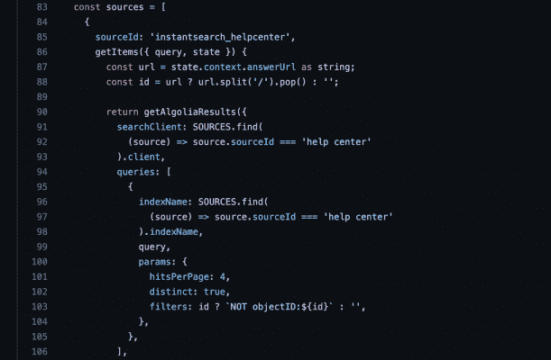

# 我们如何使用 Algolia 改善我们的支持体验- Algolia 博客

> 原文：<https://www.algolia.com/blog/product/how-we-used-algolia-to-make-our-support-experience-better/>

在 Algolia，我们专注于开发人员的体验，并为我们引擎的速度和灵活性感到自豪。建筑是一门手艺，我们的工作就是让这些建设者更容易给生活带来新的体验。然而，有时，使用绘画类比，团队想要一个按数字绘制的解决方案，以及关于如何更有效地使客户体验更好的更规范的指导。今天，我们将在帮助中心分享更多关于改进搜索的内容，以及 Algolia 如何帮助 Zendesk 客户。

当我们将我们的 [支持帮助中心](https://www.zendesk.com/service/help-center/) 迁移到 Zendesk 时，我们渴望为我们的客户构建一个基于 Algolia 的搜索体验，使他们能够尽快找到适合他们请求的解决方案。我们希望让我们的用户能够在一个位置搜索我们的帮助文章、开发人员文档、社区内容和我们的客户端支持网站([academy.algolia.com](https://academy.algolia.com))。这是我们构建的:

## 自动完成体验

## 购票形式体验

**Github**上的公共回购，也就是 我们如何将 Algolia 搜索集成到我们的 Zendesk 前端的公共版本:[https://github.com/algolia/public-custom-zendesk-search](https://github.com/algolia/public-custom-zendesk-search)

以下是我们如何改善搜索体验和提高搜索相关性的。

*   我们使用 Algolia Crawler 对多个来源进行了爬行和索引
*   创建了一个行为工作流，向源添加内容(定期添加文章)
*   即开即用的搜索结果使得找到正确的文章更加容易
*   即使在拼写错误的情况下，错别字容差也能提供相关结果
*   搜索对那些对终端用户更有用的文章给予更高的优先级
*   从一个位置搜索支持文章、文档、社区和 Algolia Academy 可以让用户找到答案，而无需在平台之间来回切换

Algolia 帮助中心搜索体验的前端捆绑包包括:

*   主页上的自动完成搜索 

*   这伴随着每页右上角更小的搜索栏，是借力经典 [即时搜索](https://www.algolia.com/doc/guides/building-search-ui/what-is-instantsearch/js/) 。

*   机票表单请求搜索:当在“主题”字段中输入时，搜索结果将显示在输入内容的正下方。

在当前站点中，搜索发生在 4 个 应用的 4 个索引上:

*   帮助中心文章
*   文档
*   话语帖
*   阿尔戈利亚学院

前端捆绑包可通过 npm 包获得，该包可通过`jsdelivr`获得。  

然后，我们通过主题代码编辑器中简单的`link`和`script`标签将文件添加到我们的 Zendesk 帮助中心主题中。

在 Zendesk 的 HC `document_head.hbs`模板中，我们添加了样式。

在`footer.hbs`模板中，我们添加了 javascript:

在我们的工作流程中，这个包不会在浏览器中暴露任何类型的模块或全局函数。这意味着任何配置更改都必须通过提交软件包的存储库然后发布来进行。

我们组织了以下常量:

*   来源(这是定义指数和应用的地方)
*   CSS 选择器(对于自动完成和票据表单搜索初始化，默认选择器是来自默认帮助中心主题的选择器)
*   自动完成的占位符
*   用于搜索重定向的基本 URL。

我们使用 Algolia 开发了我们的自动完成功能，并利用了 Docsearch 的一些样式。

我的经验是，客户最关心价值实现时间和客户体验，但价格很重要。因此，这里有一些简单的数学方法来帮助您确定使用 Algolia 的帮助中心优化项目是否对您的组织有意义。如果每张票的成本是 10 美元，你需要相信你可以通过优化转移至少 2K 张票，以证明 Algolia 的费用是合理的。

[帮助中心文章](https://www.zendesk.com/blog/5-knowledge-base-design-best-practices/) 是一个相对简单的实现，添加开发人员文档、博客、学习、社区和其他来源会增加一些复杂性，但也会增加影响。更多的记录通常意味着更多的 API 请求，Algolia 的增量成本很低。您可以免费试用，我希望以上内容有助于展示我们如何通过改善您的支持体验来帮助您的团队取得进展。我的经验是，如果你能花时间重视客户体验的提升，人们会很乐意向他人推荐你的服务。

如果您需要帮助实施此解决方案，请查看我们的 [支持中心](https://support.algolia.com/hc/en-us) 或 [联系我们](https://www.algolia.com/contactus/) 。