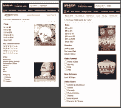

# 用动态分面实现分面搜索(包括代码)-第 3 部分

> 原文：<https://www.algolia.com/blog/engineering/implementing-faceted-search-with-dynamic-faceting-with-code/>

> 这是描述刻面和刻面搜索的技术和数据方面的三篇系列博文的第三篇也是最后一篇。在第 3 部分中，我们看一下搜索过程，从查询到执行再到响应，并展示如何动态生成方面。

这是我们刻面&数据系列的第三篇文章。本系列的重点是技术性的，概述了方面搜索的逻辑和方面数据模型。第一部分和第二部分在我们的科技博客中。在文章[Facets and faceted search，every JSON attribute counts](https://www.google.com/url?q=https://www.algolia.com/developers-tech-blog/code-and-deep-dives/facets-and-faceted-search-making-every-attribute-count&sa=D&source=editors&ust=1677685982116423&usg=AOvVaw05YQkLctaODCh5nGg3Z6O7)中，我们定义了什么是刻面，并解释了刻面在结构化数据中的重要作用。它还说明了 JSON 是表示包括方面在内的索引数据的最灵活的方式。第二篇文章— [一个使用 JSON 的 facets 数据模型](https://www.algolia.com/blog/engineering/facets-data-model-of-json-records/) —介绍了 facets 最常见的数据结构:简单的 facet 值、嵌套 facet、层次类别以及用户和 AI 标记，所有这些都用于 facet 搜索的不同方面。查看我们的文档，了解更多关于索引和刻面的信息。

在本文中——本系列的第三篇也是最后一篇——数据仍然是我们关注的焦点，但我们也讨论流程。这次 **我们深入到查询周期中使用的数据和流程:从请求，到执行，再到响应** ，所有这些都在一个高级刻面用例的上下文中: *动态刻面* 。

在深入研究技术细节之前，让我们看看动态刻面是怎么回事。

## [](#overview-of-dynamic-faceting)动态刻面概述

动态刻面根据用户的意图向用户显示一组不同的刻面。为了理解这一点，考虑一个销售两类商品的电子商务音乐商店:CD 和音频设备。该业务希望显示一组 *相关的* 刻面。当用户的意图是找到自己喜欢的音乐时，提出“品牌”有什么好处？同样，当用户的意图是寻找音频设备时，建议“音乐流派”有什么好处呢？动态刻面确保只显示最合适的刻面。

在我们的 [动态分面沙箱](https://codesandbox.io/s/lryxzp4yvm) 上，观看动态分面的现场演示，并获得完整的代码库。

*   制药公司展示了其医疗和化妆品产品的不同方面。
*   报纸在娱乐版和政治版展现了不同的一面。
*   在线市场，就像下面的亚马逊例子，随着人们浏览他们的大量不同的产品，改变了方面列表。

## [](#example-use-case-ecommerce-marketplaces-dynamic-faceting%c2%a0%c2%a0)示例用例:电子商务市场&动态刻面

亚马逊在其许多类别中使用动态面。在下图中，您会看到两个查询:“音乐”在左边，“电影”在右边。如您所见，两边都包括“价格”方面，但是音乐查询包括“客户评论”、“艺术家”和“音乐格式”，而电影查询包括“导演”、“视频格式”和“电影类型”。



亚马逊使用动态面创建了一个 **增强的搜索体验，根据用户正在搜索的** 产品，以智能和有计划的方式引导用户。

让我们来看看这是怎么做到的。

## [](#the-query-cycle-and-the-logic-behind-facet-search)查询循环和刻面搜索背后的逻辑

首先，一些术语:

*   **刻面** ***按键*** 是类似“颜色”、“价格”、“鞋类”、“袖子”等属性。
*   **刻面** ***值*** 是关键点的值。比如“色”包含“红”和“绿”；“袖”包含“短”和“长”。

### 数据集

我们将使用包含两种产品的数据集:衬衫和鞋子。以下示例包含两个典型项目。这两项都包括“价格”、“颜色”和“服装类型”方面。但是，衬衫包含“袖子”方面，鞋子包含“鞋子类别”方面。

```
{
    "name": "Bold Shirt",
    "desc": “Be bold, wear a t-shirt with only one color”,
    “Image_url”: “images/shirt-123.jpg”
   “Price”: 49.99,
    "color": “white”,
    "gender": “male”,
    “clothing_type”: “shirt”,
    "sleeves": "short"
},
{
    "name": "Blazing Speed Sneakers",
    "desc": “Sneakers to win races!”,
    “Image_url”: “images/sneakers-789.jpg”
    "brand": “nike”,
    “Price”: 189.99,
    "color": "red",
    "clothing_type": "shoe",
    "shoe_category": "sneaker"
} 
```

### [](#the-query-cycle)**查询周期**

搜索查询遵循 4 部分循环。这里有一个概述。我们将在下一节给出更多的细节和代码示例。

1.  将用户的查询发送到搜索引擎。
2.  执行搜索，检索符合查询条件的 [记录](https://www.algolia.com/doc/guides/sending-and-managing-data/prepare-your-data/#algolia-records) 。在这一步中，您将从检索到的记录中派生出方面。
3.  发回结果和刻面。
4.  在屏幕上呈现结果和方面。

正如您将看到的，逻辑在于为每个查询动态生成一个新列表，而不是使用预定义的方面列表。这可以通过执行以下操作来实现:

*   在后端，您将从每组查询结果中提取方面。
*   在前端，你将使用未定义的容器占位符来代替预定义的容器。

## [](#the-query-request-sending-the-query-with-or-without-a-filter)查询请求:发送有无过滤的查询

循环的起点是发送一个查询和用户选择的任何方面值来过滤他们的结果。过滤结果会创建一个内聚的结果集，进而生成一个与结果中出现的所有项目相关的方面列表。另一方面，如果用户不选择一个方面，项目将更加多样化，因此，这些方面可能不适用于所有产品。

然而，这完全没问题。正如您将在下一步中看到的，呈现前 5 个最常见的方面确保了大多数项目将包含这些方面。

现在为代码。下面是 Algolia 的 API 如何实现查询“ *【获取所有短袖夏季 t 恤】* ”。(因为所有的搜索工具都允许过滤，下面的代码只是众多方法中的一种)。

```
results = index.search('summer t-shirt', {
  filters: 'clothing_type:shirt AND sleeve:short'
}); 
```

## [](#the-query-execution-creating-the-list-of-top-5-facets)查询执行:创建前 5 个面的列表

我们在本文中使用的[数据集](#the-dataset)包含两种产品，每种产品都有一组独特的方面属性。执行查询后，搜索引擎提取每个记录中出现的每个方面键，然后选择最常出现的 5 个方面。

为什么是前 5？因为一个屏幕有 5 个面通常就够了。十是一个上限——再多就太多了，会造成无用的混乱。

有两种方法可以创建面列表:

1.  预定义列表:直接在代码中或在单独的数据集或本地存储中保存一个面键列表。
2.  一个动态生成的列表:从查询结果中提取一个不同的面键列表，并将它们作为一个单独的记录放入查询响应中。

我们已经选择使用方法 2，但是有些实现使用方法 1。

### [](#method-1-hardcoding-the-list-of-facet-keys)**方法一——硬编码刻面键列表**

对于这种方法，你根据你对产品的了解创建一组固定的方面。该列表可以是硬编码的，也可以放在数据库中的文件或表格中，只要添加或修改了新产品，就可以手动更新该列表。

无论固定列表的存储方式如何，列表必须包含以下类型的示例:

*   对于每一个“服装 _ 类型=衬衫”，返回以下方面:“颜色、价格、服装 _ 类型、袖子、性别”。
*   对于每一个“服装 _ 类型=鞋子”，返回以下方面:“颜色、价格、服装 _ 类型、鞋子 _ 类别、品牌”。

这不是首选方法，因为和所有硬编码或半硬编码一样，它的可伸缩性有限。如果您想添加更多的关系，例如“shoe _ styles”=“high-top，leisure，and cross-fit”，您需要手动向列表添加一个新行。手动维护是额外的工作，容易出错和延迟。

我们在本文剩余部分提出的方法(方法 2)从过程中去除了人工维护，使得过程是演绎的，因此完全是动态的。

### [](#method-2-dynamically-generate-the-list-of-facets)**方法二——动态生成刻面列表**

在这个方法中，我们将从产品本身提取方面列表。

在某种意义上，手动和动态方法之间的唯一区别在于生成的前 5 个方面的列表是动态的。结果列表本身将以同样的方式格式化。

以下是步骤:

1.  获取查询结果:
    *   执行查询，找到 X 数量的产品。
    *   保存那些记录，作为搜索结果发送回去。
2.  获取前 5 个面键及其所有值:
    *   从结果中，收集所有方面属性(我们将在下面展示如何将属性识别为方面)。
    *   创建一个包含提取的面密钥的完整列表的记录。
    *   确定哪些方面最常出现。按最高记录数对列表进行排序。
    *   从这个列表中只取前 5 名。这些是最常见的方面。
    *   将产品的值添加到各自的关键字中。

搞定。

生成的列表将与方法 1 相同:

*   对于每个“服装 _ 类型=衬衫”，返回以下方面:“颜色、价格、服装 _ 类型、袖子、性别”。
*   对于每一个“服装 _ 类型=鞋子”，返回以下方面:“颜色、价格、服装 _ 类型、鞋子 _ 类别、品牌”。

因此，如果大多数产品是衬衫，我们会将“袖子”和“性别”作为第 4 和第 5 个方面来显示。如果它们是鞋，那么第 4 和第 5 个方面将是“鞋类”和“品牌”。

## [](#the-query-response-sending-back-the-response)查询响应:发回响应

这里我们将简单地发送回搜索结果和生成的 5 个面键的列表，以及它们各自的值。

响应应该包括任何前端需要建立其搜索结果页面。在所有刻面搜索查询周期中，前端需要:

*   包含“名称”、“描述”、“价格”和“图片 _ 网址”的产品列表。(不要发送图像 *文件* ，因为它们的大小会降低搜索的整体响应时间)。
*   刻面键及其值的列表。

响应还将包含显示目的或业务逻辑所需的附加信息。我们不展示这些。[点击此处查看完整的查询响应](https://www.algolia.com/doc/api-reference/api-methods/search/#response)。

**结果:**

下面是我们如何退回这一套衬衫。所有属性都将被用作搜索结果中的信息，除了“objectID”，它将被用于出于技术原因( [点击分析](https://www.algolia.com/doc/guides/getting-analytics/search-analytics/advanced-analytics/) 、详细页面查看或其他原因)来标识产品。

```
"results": [
{
    "objectID": "123",
    "name": "Bold Shirt",
    "desc": “Be bold, wear a t-shirt with only one color”,
    “Image_url”: “images/shirt-123.jpg”
   “Price”: 49.99,
    "color": “white”,
    "sleeves": "short"
}
] 
```

**刻面:**

面响应是面键及其值的组合。这里有一小段摘录。该示例不包括所有方面:

```
"facets": {
    "Clothing Type": {
      "Shirts": 100,
      "Sneakers": 50
    },
    "Sleeves": {
      "Short": 30,
      "Long": 10
    },
} 
```

需要注意的两件事:

*   只显示“袖子”和“性别”，不显示“鞋 _ 品类”和“品牌”。如前所述，这是因为衬衫比鞋子多。
*   每个方面后的数字表示具有该值的记录数。我们将在添加面的部分对此进行更多的讨论。

## [](#the-front-end-display-dynamically-displaying-the-list-of-facets)前端显示:动态显示刻面列表

这里的工作是在屏幕上渲染结果和切面。就 UX 设计而言，行业标准是结果在中间，面在左边。

首先，HTML。为结果和方面添加占位符容器:

```
<div id="wrapper">
    <div id="app-container">
      <div id="left-side">
        <div class="sidebar">
          <div id="facet-lists"></div>
        </div>
      </div>
      <div id="center-side">
        <div id="results-container"></div>
      </div>
    </div>
</div> 
```

有一个容器(" **facet-lists"** )用于 5 个方面。呈现代码生成一个无序列表来显示该容器中的方面。

结果放入 **结果-容器** 。

接下来，渲染数据。由于这可以采取多种形式，并且本文严格来说不是教程，所以请看一下我们的[动态刻面 GitHub repo](https://github.com/algolia/dynamic-faceting-instant-search-guide) 以获得完整的前端实现。

## [](#making-the-solution-more-robust)使解决方案更加强大

### **增加刻面数量**

你需要让你的用户知道有多少记录有给定的方面值。获取方面的数量是有用的，因为它们通知用户搜索结果。比如知道短袖衬衫比长袖衬衫多就很有用。这些方面的数量通常在查询执行期间在后端进行计算。

### [](#adding-facet-metadata)**添加刻面元数据**

每条记录都需要包含有助于流程知道哪些属性是方面的信息。要做到这一点，您需要通过使用一个定义记录方面的附加属性来向每个记录添加方面元数据:

```
“facets”: [“sleeves”, “price”, ..] 
```

更进一步，包含属性的 *类型* 也很有用

```
“facets”: [ 
  [“sleeves”, “string”], 
  [“price”, “numeric”] 
] 
```

有了这些信息，前端代码可以应用价格的范围滑块和袖子的下拉列表。

### [](#grouping-items-using-facets)**分组项使用刻面**

你会希望将颜色与其他刻面属性区别对待。这是因为 *不同的* 颜色出现在 *相同的* 衬衫上。对于这一点，逻辑问题是:你需要每件衬衫 *1 条记录* 包括所有可用颜色的属性吗？还是 *每种颜色 1 条记录* ，每件衬衫需要多条记录？典型的数据库思维会说，当然，只有 1 条记录。然而，正如我们在第一篇文章中详细讨论的那样，[分面搜索不同于](https://www.google.com/url?q=https://www.algolia.com/developers-tech-blog/code-and-deep-dives/facets-and-faceted-search-making-every-attribute-count&sa=D&source=editors&ust=1677685982116423&usg=AOvVaw05YQkLctaODCh5nGg3Z6O7)。

我们将所有可搜索的项目放在单独的记录中。这使得人们可以使用搜索栏找到“红衫军”，而不需要点击颜色方面。为了实现这一点，我们将每个项目设置为一种颜色。但是，在响应中，我们不需要返回 3 条衬衫记录。我们可以将 3 个记录合并成 1 个记录，创建一个新的元属性:“available _ colors”:

```
“available_colors”: “red, green, blue” 
```

## [](#parting-words)离别赠言

我们在本文中的主要目标是在我们的 facets &数据系列中为数据添加流程。我们描述了一种特定的方法来执行搜索并显示一组方面，遵循请求、执行、响应和显示的查询循环。

为了扩展您对方面的理解，我们在一个高级用例的上下文中这样做了:我们使我们的方面搜索是动态的。动态分面创建了更直观和有用的分面搜索体验，特别是对于提供各种产品和服务的企业。

查看特性 live 我们的 [动态刻面沙箱](https://codesandbox.io/s/lryxzp4yvm) ，查看我们在 GitHub 上的动态刻面实现: [前端动态刻面](https://github.com/algolia/dynamic-faceting-instant-search-guide) 和 [动态刻面使用查询规则](https://github.com/algolia/dynamic-faceting-guide) 。你也可以在我们关于刻面 的 [文档中找到更多关于索引和刻面的信息。](https://www.algolia.com/doc/guides/managing-results/refine-results/faceting/)