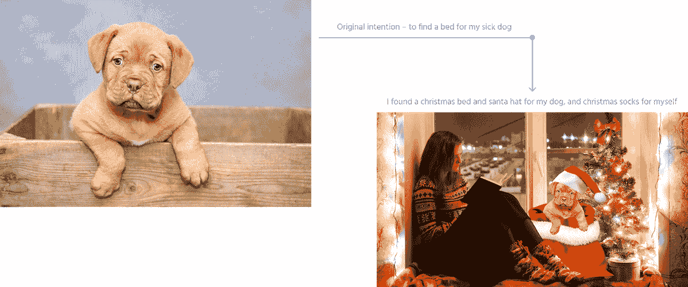
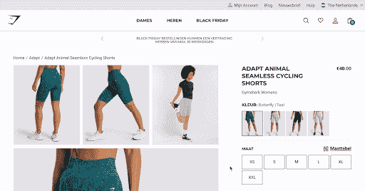

# 增加您的客户群，通过推荐建立他们的忠诚度

> 原文：<https://www.algolia.com/blog/ai/increase-basket-sizes-and-values-and-build-customer-loyalty-with-algolia-recommend-and-analytics/>

你想知道你的用户在搜索和浏览你的在线目录时在做什么吗？你想在他们购物时推荐他们推荐的产品吗？

如果您还没有捕捉到您的客户行为，并且没有使用推荐功能，请立即使用它！

我们都曾在网上购物时看到并点击过推荐。只要我们向购物车中添加一件商品，就会提示我们继续购买经常一起购买的商品*F*。

仔细看看。这些推荐可能是由 Algolia 推荐提供的，而 Algolia 推荐又是由 Algolia 的开箱即用分析提供的。

通过 Algolia Analytics 捕捉用户行为，并将数据输入 Algolia Recommend，您可以开始向客户提供有意义的推荐，从而提高他们的满意度和转化率。

当在线商店以非侵入性和及时的方式建议相关商品时，消费者会很感激。想想詹妮弗，她正在为她生病的狗 [卢娜](https://www.algolia.com/blog/ux/how-can-recommending-frequently-bought-together-products-increase-roi/) 找床。她找到一张完美的床，并把它放入购物车。然后，她注意到一个“经常一起购买”的部分，推荐狗套、枕头和其他可以安慰生病的狗的配件。珍妮弗也可能看到其他狗主人为他们心爱的宠物买的物品。

这就是 [Algolia 推荐](https://www.algolia.com/products/recommendations/) 如何增加客户的购物篮规模和价值，同时提高他们的体验和忠诚度。

但是 Algolia 怎么知道该推荐什么呢？Algolia 知道 Jennifer 是宠物主人还是知道 Luna 生病了？

简单的回答是否定的。阿尔戈利亚对珍妮弗一无所知，只知道她在遵循一种基于相似顾客的相似购买行为的消费模式。许多像 Jennifer 一样的顾客已经搜索、点击和购买了类似的产品。

虽然这听起来很简单，但要混合和匹配客户想要的东西，实际上需要大量的 [分析数据](https://www.algolia.com/products/search-and-discovery/analytics/) 和精心实施的 [人工智能驱动的机器学习](https://www.algolia.com/blog/ai/the-anatomy-of-high-performance-recommender-systems-part-1/) 才能做好。

通过收集用户行为(基于事件的分析)和训练模型来展示作品的特征如: *频繁一起买的* *，Trending I**tems*， *买这个的人也买了* 。这些模型经过精心设计，符合客户最初的购买意图，从而保证客户继续购物的可能性更大。可以想象，只有最相关的推荐才能推动财务增长和客户忠诚度。

## 

在告诉你如何设置它之前，让我们看看正确的推荐如何带来更多的追加销售、交叉销售和整体客户忠诚度(问 [亚马逊](https://www.rejoiner.com/resources/amazon-recommendations-secret-selling-online) ！)

[Gymshark](https://resources.algolia.com/ecommerce/casestudy-gymshark-retail-2?utm_campaign=FY23_%5Bcust%5D&utm_medium=email&utm_source=one_off&utm_content=BlackFriday_Recommend&utm_2nd_camp=B2B_Ecomm)通过将 Algolia 推荐添加到其 Algolia 搜索实现中，提高了其收入。Gymshark 的成功指标:

*   在黑色星期五，新用户的订单率增加了 150%，而“加入购物车”率增加了 32%
*   回头客的订单率和“加入购物车”率分别提高了 13%和 10%
*   每用户 1.4 次点击，而之前的解决方案为 1.1 次

Gymshark 增加了 Algolia 推荐，以应对至关重要的黑色星期五期间。我们发现，在黑色星期五或圣诞假期等大型购物活动期间训练您的推荐模型，将有助于您及时了解购物者的行为，以迎接下一个大型活动。

## 设置推荐–您需要做的就是开始训练模型！

这里推荐四个步骤。

1.  捕捉用户活动(事件)
2.  向 Algolia 发送事件数据
3.  启用仪表盘上的 Algolia 推荐，并让它开始在后台生成推荐
4.  向您的用户显示建议

### **第一步——获取质量数据**

数据质量至关重要。步骤 1 & 2 完全由客户控制。客户通过捕获 *重要的* 用户活动(事件)来建立他们的分析数据集。这意味着您必须小心捕捉对您的业务“重要”的行动。当然，购买历史几乎总是相关的，但是购物车呢？还是分类页面？刻面？

**本质上，你希望跟踪所有你认为很有可能导致转化的用户行为。**

好消息是，Algolia 附带了一个 [分析仪表板](https://www.algolia.com/doc/guides/getting-analytics/search-analytics/understand-reports/#dashboard-metrics) ，你可以用它来测试你的数据质量。

### **步骤 2–向 Algolia 发送事件**

如何发送推荐活动？像大多数分析一样，你的工程师需要[添加一行代码](https://www.algolia.com/doc/guides/sending-events/implementing/how-to/sending-events-backend/#sending-events-in-batches)到你的网站中你想要捕获用户事件的页面。例如，在搜索结果页面上，您将添加一行代码来收集结果的每次点击，并将其发送给 Algolia。在购买页面或查看产品页面上，您将添加一行代码来捕获刚刚购买或查看的产品，然后将其发送给 Algolia。

[https://www.youtube.com/embed/C9AvveQMZkY?feature=oembed](https://www.youtube.com/embed/C9AvveQMZkY?feature=oembed)

视频

总之，无论何时你想捕捉一个事件，你都需要(1)添加一行代码来捕捉你的用户正在做的事情的信息，并且(2)通过 Algolia 的 API 把它发送给 Algolia。 [每事件](https://www.algolia.com/blog/product/5-reasons-to-add-clicks-to-site-search-analytics-and-code-to-do-it/#how-to-code-analytics) 一行代码 。

### **第 3 步&第 4 步——启用推荐，一切就绪**

一旦你发送了重要的用户操作(这里有一个 [大列表](https://www.algolia.com/doc/guides/sending-events/planning/) )，那么你需要做的就是在 Algolia 的仪表板中启用推荐(步骤 3)，让机器开始运转。当你发送事件时，Algolia 会完成剩下的工作——它会将这些事件输入到它的机器学习模型中，并生成一组可靠的建议。

[https://www.youtube.com/embed/0B5Sd3G4NeI?feature=oembed](https://www.youtube.com/embed/0B5Sd3G4NeI?feature=oembed)

视频

根据您网站的活动情况，过一段时间(可能是几周)后，您就可以开始向您的用户显示这些推荐了(步骤 4)。下面是一些强大的 [撬动推荐](https://www.algolia.com/blog/product/6-ways-to-leverage-recommendations-for-ecommerce-retailers/) 的方法，以及一个关于 [如何显示推荐](https://www.algolia.com/blog/product/introducing-algolia-recommend-the-next-best-way-for-developers-to-increase-revenue/) 的概述。

# 底线

如果你能提供很好的建议，确保你的客户之旅是愉快的，没有压力的，你就能建立客户忠诚度，这将改变你的业务底线。

我们强大的[推荐 API](https://www.algolia.com/products/recommendations/) 和人工智能驱动的技术将快速无缝地改善您的用户体验以及您的网站和移动应用程序的转化率。

了解领先的电子商务零售商如何利用人工智能推荐引擎的功能来超越和转变他们的数字销售目标 ，[联系我们](https://www.algolia.com/contactus/)，让我们开始行动吧！